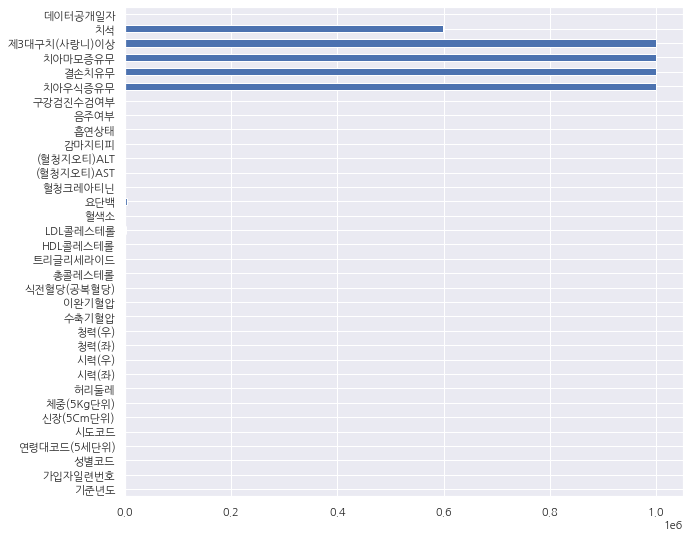
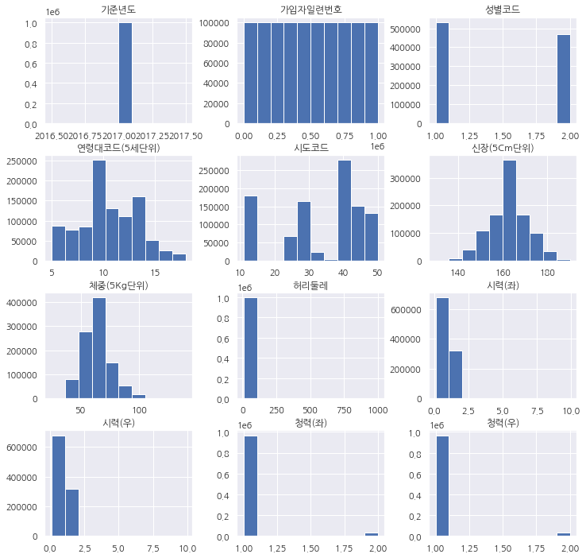
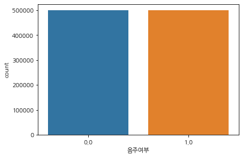
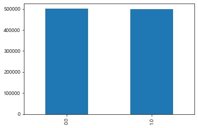
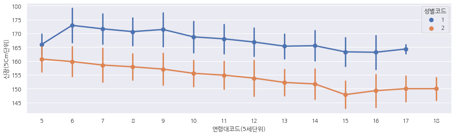

# Health check-up figures for drinking or not.


- 실습일


    210629

## 가설 : 음주여부에 따라 건강검진 수치가 달라진다.
### 가설 2 : 신장과 허리둘레의 크기는 체중과 상관있다.


```python
import pandas as pd
import numpy as np
import seaborn as sns
import matplotlib.pyplot as plt
```


```python
import matplotlib.pyplot as plt
# 한글깨짐방지 두줄.
plt.rc('axes',unicode_minus=False)
plt.rcParams['font.family'] = 'NanumGothic'
```


```python
df=pd.read_csv('NHIS_OPEN_GJ_2017.csv',encoding='cp949')
df
```


<div>
<style scoped>
    .dataframe tbody tr th:only-of-type {
        vertical-align: middle;
    }

    .dataframe tbody tr th {
        vertical-align: top;
    }
    
    .dataframe thead th {
        text-align: right;
    }
</style>
<table border="1" class="dataframe">
  <thead>
    <tr style="text-align: right;">
      <th></th>
      <th>기준년도</th>
      <th>가입자일련번호</th>
      <th>성별코드</th>
      <th>연령대코드(5세단위)</th>
      <th>시도코드</th>
      <th>신장(5Cm단위)</th>
      <th>체중(5Kg단위)</th>
      <th>허리둘레</th>
      <th>시력(좌)</th>
      <th>시력(우)</th>
      <th>...</th>
      <th>감마지티피</th>
      <th>흡연상태</th>
      <th>음주여부</th>
      <th>구강검진수검여부</th>
      <th>치아우식증유무</th>
      <th>결손치유무</th>
      <th>치아마모증유무</th>
      <th>제3대구치(사랑니)이상</th>
      <th>치석</th>
      <th>데이터공개일자</th>
    </tr>
  </thead>
  <tbody>
    <tr>
      <th>0</th>
      <td>2017</td>
      <td>1</td>
      <td>1</td>
      <td>8</td>
      <td>43</td>
      <td>170</td>
      <td>75</td>
      <td>90.0</td>
      <td>1.0</td>
      <td>1.0</td>
      <td>...</td>
      <td>40.0</td>
      <td>1.0</td>
      <td>1.0</td>
      <td>1</td>
      <td>NaN</td>
      <td>NaN</td>
      <td>NaN</td>
      <td>NaN</td>
      <td>1.0</td>
      <td>20181126</td>
    </tr>
    <tr>
      <th>1</th>
      <td>2017</td>
      <td>2</td>
      <td>1</td>
      <td>7</td>
      <td>11</td>
      <td>180</td>
      <td>80</td>
      <td>89.0</td>
      <td>0.9</td>
      <td>1.2</td>
      <td>...</td>
      <td>27.0</td>
      <td>3.0</td>
      <td>0.0</td>
      <td>1</td>
      <td>NaN</td>
      <td>NaN</td>
      <td>NaN</td>
      <td>NaN</td>
      <td>2.0</td>
      <td>20181126</td>
    </tr>
    <tr>
      <th>2</th>
      <td>2017</td>
      <td>3</td>
      <td>1</td>
      <td>9</td>
      <td>41</td>
      <td>165</td>
      <td>75</td>
      <td>91.0</td>
      <td>1.2</td>
      <td>1.5</td>
      <td>...</td>
      <td>68.0</td>
      <td>1.0</td>
      <td>0.0</td>
      <td>0</td>
      <td>NaN</td>
      <td>NaN</td>
      <td>NaN</td>
      <td>NaN</td>
      <td>NaN</td>
      <td>20181126</td>
    </tr>
    <tr>
      <th>3</th>
      <td>2017</td>
      <td>4</td>
      <td>1</td>
      <td>11</td>
      <td>48</td>
      <td>175</td>
      <td>80</td>
      <td>91.0</td>
      <td>1.5</td>
      <td>1.2</td>
      <td>...</td>
      <td>18.0</td>
      <td>1.0</td>
      <td>0.0</td>
      <td>1</td>
      <td>NaN</td>
      <td>NaN</td>
      <td>NaN</td>
      <td>NaN</td>
      <td>0.0</td>
      <td>20181126</td>
    </tr>
    <tr>
      <th>4</th>
      <td>2017</td>
      <td>5</td>
      <td>1</td>
      <td>11</td>
      <td>30</td>
      <td>165</td>
      <td>60</td>
      <td>80.0</td>
      <td>1.0</td>
      <td>1.2</td>
      <td>...</td>
      <td>25.0</td>
      <td>1.0</td>
      <td>0.0</td>
      <td>1</td>
      <td>NaN</td>
      <td>NaN</td>
      <td>NaN</td>
      <td>NaN</td>
      <td>0.0</td>
      <td>20181126</td>
    </tr>
    <tr>
      <th>...</th>
      <td>...</td>
      <td>...</td>
      <td>...</td>
      <td>...</td>
      <td>...</td>
      <td>...</td>
      <td>...</td>
      <td>...</td>
      <td>...</td>
      <td>...</td>
      <td>...</td>
      <td>...</td>
      <td>...</td>
      <td>...</td>
      <td>...</td>
      <td>...</td>
      <td>...</td>
      <td>...</td>
      <td>...</td>
      <td>...</td>
      <td>...</td>
    </tr>
    <tr>
      <th>999995</th>
      <td>2017</td>
      <td>999996</td>
      <td>1</td>
      <td>10</td>
      <td>48</td>
      <td>175</td>
      <td>80</td>
      <td>92.1</td>
      <td>1.5</td>
      <td>1.5</td>
      <td>...</td>
      <td>27.0</td>
      <td>1.0</td>
      <td>0.0</td>
      <td>0</td>
      <td>NaN</td>
      <td>NaN</td>
      <td>NaN</td>
      <td>NaN</td>
      <td>NaN</td>
      <td>20181126</td>
    </tr>
    <tr>
      <th>999996</th>
      <td>2017</td>
      <td>999997</td>
      <td>1</td>
      <td>8</td>
      <td>41</td>
      <td>170</td>
      <td>75</td>
      <td>86.0</td>
      <td>1.0</td>
      <td>1.5</td>
      <td>...</td>
      <td>15.0</td>
      <td>1.0</td>
      <td>0.0</td>
      <td>0</td>
      <td>NaN</td>
      <td>NaN</td>
      <td>NaN</td>
      <td>NaN</td>
      <td>NaN</td>
      <td>20181126</td>
    </tr>
    <tr>
      <th>999997</th>
      <td>2017</td>
      <td>999998</td>
      <td>2</td>
      <td>9</td>
      <td>26</td>
      <td>155</td>
      <td>50</td>
      <td>68.0</td>
      <td>1.0</td>
      <td>0.7</td>
      <td>...</td>
      <td>17.0</td>
      <td>3.0</td>
      <td>1.0</td>
      <td>0</td>
      <td>NaN</td>
      <td>NaN</td>
      <td>NaN</td>
      <td>NaN</td>
      <td>NaN</td>
      <td>20181126</td>
    </tr>
    <tr>
      <th>999998</th>
      <td>2017</td>
      <td>999999</td>
      <td>1</td>
      <td>6</td>
      <td>29</td>
      <td>175</td>
      <td>60</td>
      <td>72.0</td>
      <td>1.5</td>
      <td>1.0</td>
      <td>...</td>
      <td>17.0</td>
      <td>1.0</td>
      <td>0.0</td>
      <td>0</td>
      <td>NaN</td>
      <td>NaN</td>
      <td>NaN</td>
      <td>NaN</td>
      <td>NaN</td>
      <td>20181126</td>
    </tr>
    <tr>
      <th>999999</th>
      <td>2017</td>
      <td>1000000</td>
      <td>1</td>
      <td>11</td>
      <td>41</td>
      <td>160</td>
      <td>70</td>
      <td>90.5</td>
      <td>1.0</td>
      <td>1.5</td>
      <td>...</td>
      <td>36.0</td>
      <td>3.0</td>
      <td>1.0</td>
      <td>0</td>
      <td>NaN</td>
      <td>NaN</td>
      <td>NaN</td>
      <td>NaN</td>
      <td>NaN</td>
      <td>20181126</td>
    </tr>
  </tbody>
</table>
<p>1000000 rows × 34 columns</p>
</div>


```python
df.shape
```


    (1000000, 34)


```python
df.head(10)
```


<div>
<style scoped>
    .dataframe tbody tr th:only-of-type {
        vertical-align: middle;
    }

    .dataframe tbody tr th {
        vertical-align: top;
    }
    
    .dataframe thead th {
        text-align: right;
    }
</style>
<table border="1" class="dataframe">
  <thead>
    <tr style="text-align: right;">
      <th></th>
      <th>기준년도</th>
      <th>가입자일련번호</th>
      <th>성별코드</th>
      <th>연령대코드(5세단위)</th>
      <th>시도코드</th>
      <th>신장(5Cm단위)</th>
      <th>체중(5Kg단위)</th>
      <th>허리둘레</th>
      <th>시력(좌)</th>
      <th>시력(우)</th>
      <th>...</th>
      <th>감마지티피</th>
      <th>흡연상태</th>
      <th>음주여부</th>
      <th>구강검진수검여부</th>
      <th>치아우식증유무</th>
      <th>결손치유무</th>
      <th>치아마모증유무</th>
      <th>제3대구치(사랑니)이상</th>
      <th>치석</th>
      <th>데이터공개일자</th>
    </tr>
  </thead>
  <tbody>
    <tr>
      <th>0</th>
      <td>2017</td>
      <td>1</td>
      <td>1</td>
      <td>8</td>
      <td>43</td>
      <td>170</td>
      <td>75</td>
      <td>90.0</td>
      <td>1.0</td>
      <td>1.0</td>
      <td>...</td>
      <td>40.0</td>
      <td>1.0</td>
      <td>1.0</td>
      <td>1</td>
      <td>NaN</td>
      <td>NaN</td>
      <td>NaN</td>
      <td>NaN</td>
      <td>1.0</td>
      <td>20181126</td>
    </tr>
    <tr>
      <th>1</th>
      <td>2017</td>
      <td>2</td>
      <td>1</td>
      <td>7</td>
      <td>11</td>
      <td>180</td>
      <td>80</td>
      <td>89.0</td>
      <td>0.9</td>
      <td>1.2</td>
      <td>...</td>
      <td>27.0</td>
      <td>3.0</td>
      <td>0.0</td>
      <td>1</td>
      <td>NaN</td>
      <td>NaN</td>
      <td>NaN</td>
      <td>NaN</td>
      <td>2.0</td>
      <td>20181126</td>
    </tr>
    <tr>
      <th>2</th>
      <td>2017</td>
      <td>3</td>
      <td>1</td>
      <td>9</td>
      <td>41</td>
      <td>165</td>
      <td>75</td>
      <td>91.0</td>
      <td>1.2</td>
      <td>1.5</td>
      <td>...</td>
      <td>68.0</td>
      <td>1.0</td>
      <td>0.0</td>
      <td>0</td>
      <td>NaN</td>
      <td>NaN</td>
      <td>NaN</td>
      <td>NaN</td>
      <td>NaN</td>
      <td>20181126</td>
    </tr>
    <tr>
      <th>3</th>
      <td>2017</td>
      <td>4</td>
      <td>1</td>
      <td>11</td>
      <td>48</td>
      <td>175</td>
      <td>80</td>
      <td>91.0</td>
      <td>1.5</td>
      <td>1.2</td>
      <td>...</td>
      <td>18.0</td>
      <td>1.0</td>
      <td>0.0</td>
      <td>1</td>
      <td>NaN</td>
      <td>NaN</td>
      <td>NaN</td>
      <td>NaN</td>
      <td>0.0</td>
      <td>20181126</td>
    </tr>
    <tr>
      <th>4</th>
      <td>2017</td>
      <td>5</td>
      <td>1</td>
      <td>11</td>
      <td>30</td>
      <td>165</td>
      <td>60</td>
      <td>80.0</td>
      <td>1.0</td>
      <td>1.2</td>
      <td>...</td>
      <td>25.0</td>
      <td>1.0</td>
      <td>0.0</td>
      <td>1</td>
      <td>NaN</td>
      <td>NaN</td>
      <td>NaN</td>
      <td>NaN</td>
      <td>0.0</td>
      <td>20181126</td>
    </tr>
    <tr>
      <th>5</th>
      <td>2017</td>
      <td>6</td>
      <td>1</td>
      <td>11</td>
      <td>41</td>
      <td>165</td>
      <td>55</td>
      <td>75.0</td>
      <td>1.2</td>
      <td>1.5</td>
      <td>...</td>
      <td>37.0</td>
      <td>3.0</td>
      <td>1.0</td>
      <td>1</td>
      <td>NaN</td>
      <td>NaN</td>
      <td>NaN</td>
      <td>NaN</td>
      <td>2.0</td>
      <td>20181126</td>
    </tr>
    <tr>
      <th>6</th>
      <td>2017</td>
      <td>7</td>
      <td>2</td>
      <td>10</td>
      <td>27</td>
      <td>150</td>
      <td>55</td>
      <td>69.0</td>
      <td>0.5</td>
      <td>0.4</td>
      <td>...</td>
      <td>12.0</td>
      <td>1.0</td>
      <td>0.0</td>
      <td>0</td>
      <td>NaN</td>
      <td>NaN</td>
      <td>NaN</td>
      <td>NaN</td>
      <td>NaN</td>
      <td>20181126</td>
    </tr>
    <tr>
      <th>7</th>
      <td>2017</td>
      <td>8</td>
      <td>1</td>
      <td>8</td>
      <td>48</td>
      <td>175</td>
      <td>65</td>
      <td>84.2</td>
      <td>1.2</td>
      <td>1.0</td>
      <td>...</td>
      <td>35.0</td>
      <td>3.0</td>
      <td>1.0</td>
      <td>1</td>
      <td>NaN</td>
      <td>NaN</td>
      <td>NaN</td>
      <td>NaN</td>
      <td>0.0</td>
      <td>20181126</td>
    </tr>
    <tr>
      <th>8</th>
      <td>2017</td>
      <td>9</td>
      <td>1</td>
      <td>12</td>
      <td>41</td>
      <td>170</td>
      <td>75</td>
      <td>84.0</td>
      <td>1.2</td>
      <td>0.9</td>
      <td>...</td>
      <td>26.0</td>
      <td>1.0</td>
      <td>1.0</td>
      <td>1</td>
      <td>NaN</td>
      <td>NaN</td>
      <td>NaN</td>
      <td>NaN</td>
      <td>1.0</td>
      <td>20181126</td>
    </tr>
    <tr>
      <th>9</th>
      <td>2017</td>
      <td>10</td>
      <td>1</td>
      <td>9</td>
      <td>41</td>
      <td>175</td>
      <td>75</td>
      <td>82.0</td>
      <td>1.5</td>
      <td>1.5</td>
      <td>...</td>
      <td>16.0</td>
      <td>2.0</td>
      <td>1.0</td>
      <td>0</td>
      <td>NaN</td>
      <td>NaN</td>
      <td>NaN</td>
      <td>NaN</td>
      <td>NaN</td>
      <td>20181126</td>
    </tr>
  </tbody>
</table>
<p>10 rows × 34 columns</p>
</div>


```python
df.sample()
```


<div>
<style scoped>
    .dataframe tbody tr th:only-of-type {
        vertical-align: middle;
    }

    .dataframe tbody tr th {
        vertical-align: top;
    }
    
    .dataframe thead th {
        text-align: right;
    }
</style>
<table border="1" class="dataframe">
  <thead>
    <tr style="text-align: right;">
      <th></th>
      <th>기준년도</th>
      <th>가입자일련번호</th>
      <th>성별코드</th>
      <th>연령대코드(5세단위)</th>
      <th>시도코드</th>
      <th>신장(5Cm단위)</th>
      <th>체중(5Kg단위)</th>
      <th>허리둘레</th>
      <th>시력(좌)</th>
      <th>시력(우)</th>
      <th>...</th>
      <th>감마지티피</th>
      <th>흡연상태</th>
      <th>음주여부</th>
      <th>구강검진수검여부</th>
      <th>치아우식증유무</th>
      <th>결손치유무</th>
      <th>치아마모증유무</th>
      <th>제3대구치(사랑니)이상</th>
      <th>치석</th>
      <th>데이터공개일자</th>
    </tr>
  </thead>
  <tbody>
    <tr>
      <th>24455</th>
      <td>2017</td>
      <td>24456</td>
      <td>1</td>
      <td>8</td>
      <td>31</td>
      <td>175</td>
      <td>75</td>
      <td>83.8</td>
      <td>1.2</td>
      <td>1.2</td>
      <td>...</td>
      <td>40.0</td>
      <td>2.0</td>
      <td>0.0</td>
      <td>1</td>
      <td>NaN</td>
      <td>NaN</td>
      <td>NaN</td>
      <td>NaN</td>
      <td>0.0</td>
      <td>20181126</td>
    </tr>
  </tbody>
</table>
<p>1 rows × 34 columns</p>
</div>


```python
df.info()
```

    <class 'pandas.core.frame.DataFrame'>
    RangeIndex: 1000000 entries, 0 to 999999
    Data columns (total 34 columns):
     #   Column        Non-Null Count    Dtype  
    ---  ------        --------------    -----  
     0   기준년도          1000000 non-null  int64  
     1   가입자일련번호       1000000 non-null  int64  
     2   성별코드          1000000 non-null  int64  
     3   연령대코드(5세단위)   1000000 non-null  int64  
     4   시도코드          1000000 non-null  int64  
     5   신장(5Cm단위)     1000000 non-null  int64  
     6   체중(5Kg단위)     1000000 non-null  int64  
     7   허리둘레          999734 non-null   float64
     8   시력(좌)         999817 non-null   float64
     9   시력(우)         999811 non-null   float64
     10  청력(좌)         999842 non-null   float64
     11  청력(우)         999844 non-null   float64
     12  수축기혈압         999981 non-null   float64
     13  이완기혈압         999982 non-null   float64
     14  식전혈당(공복혈당)    999958 non-null   float64
     15  총콜레스테롤        999957 non-null   float64
     16  트리글리세라이드      999955 non-null   float64
     17  HDL콜레스테롤      999956 non-null   float64
     18  LDL콜레스테롤      997088 non-null   float64
     19  혈색소           999948 non-null   float64
     20  요단백           995408 non-null   float64
     21  혈청크레아티닌       999957 non-null   float64
     22  (혈청지오티)AST    999959 non-null   float64
     23  (혈청지오티)ALT    999958 non-null   float64
     24  감마지티피         999958 non-null   float64
     25  흡연상태          999856 non-null   float64
     26  음주여부          999464 non-null   float64
     27  구강검진수검여부      1000000 non-null  int64  
     28  치아우식증유무       0 non-null        float64
     29  결손치유무         0 non-null        float64
     30  치아마모증유무       0 non-null        float64
     31  제3대구치(사랑니)이상  0 non-null        float64
     32  치석            400523 non-null   float64
     33  데이터공개일자       1000000 non-null  int64  
    dtypes: float64(25), int64(9)
    memory usage: 259.4 MB


## 결측치 제거하기


```python
df.isnull().sum()  #결측치는 true로 표시된다.
```


    기준년도                  0
    가입자일련번호               0
    성별코드                  0
    연령대코드(5세단위)           0
    시도코드                  0
    신장(5Cm단위)             0
    체중(5Kg단위)             0
    허리둘레                266
    시력(좌)               183
    시력(우)               189
    청력(좌)               158
    청력(우)               156
    수축기혈압                19
    이완기혈압                18
    식전혈당(공복혈당)           42
    총콜레스테롤               43
    트리글리세라이드             45
    HDL콜레스테롤             44
    LDL콜레스테롤           2912
    혈색소                  52
    요단백                4592
    혈청크레아티닌              43
    (혈청지오티)AST           41
    (혈청지오티)ALT           42
    감마지티피                42
    흡연상태                144
    음주여부                536
    구강검진수검여부              0
    치아우식증유무         1000000
    결손치유무           1000000
    치아마모증유무         1000000
    제3대구치(사랑니)이상    1000000
    치석               599477
    데이터공개일자               0
    dtype: int64


```python
df.isna()
```


<div>
<style scoped>
    .dataframe tbody tr th:only-of-type {
        vertical-align: middle;
    }

    .dataframe tbody tr th {
        vertical-align: top;
    }
    
    .dataframe thead th {
        text-align: right;
    }
</style>
<table border="1" class="dataframe">
  <thead>
    <tr style="text-align: right;">
      <th></th>
      <th>기준년도</th>
      <th>가입자일련번호</th>
      <th>성별코드</th>
      <th>연령대코드(5세단위)</th>
      <th>시도코드</th>
      <th>신장(5Cm단위)</th>
      <th>체중(5Kg단위)</th>
      <th>허리둘레</th>
      <th>시력(좌)</th>
      <th>시력(우)</th>
      <th>...</th>
      <th>감마지티피</th>
      <th>흡연상태</th>
      <th>음주여부</th>
      <th>구강검진수검여부</th>
      <th>치아우식증유무</th>
      <th>결손치유무</th>
      <th>치아마모증유무</th>
      <th>제3대구치(사랑니)이상</th>
      <th>치석</th>
      <th>데이터공개일자</th>
    </tr>
  </thead>
  <tbody>
    <tr>
      <th>0</th>
      <td>False</td>
      <td>False</td>
      <td>False</td>
      <td>False</td>
      <td>False</td>
      <td>False</td>
      <td>False</td>
      <td>False</td>
      <td>False</td>
      <td>False</td>
      <td>...</td>
      <td>False</td>
      <td>False</td>
      <td>False</td>
      <td>False</td>
      <td>True</td>
      <td>True</td>
      <td>True</td>
      <td>True</td>
      <td>False</td>
      <td>False</td>
    </tr>
    <tr>
      <th>1</th>
      <td>False</td>
      <td>False</td>
      <td>False</td>
      <td>False</td>
      <td>False</td>
      <td>False</td>
      <td>False</td>
      <td>False</td>
      <td>False</td>
      <td>False</td>
      <td>...</td>
      <td>False</td>
      <td>False</td>
      <td>False</td>
      <td>False</td>
      <td>True</td>
      <td>True</td>
      <td>True</td>
      <td>True</td>
      <td>False</td>
      <td>False</td>
    </tr>
    <tr>
      <th>2</th>
      <td>False</td>
      <td>False</td>
      <td>False</td>
      <td>False</td>
      <td>False</td>
      <td>False</td>
      <td>False</td>
      <td>False</td>
      <td>False</td>
      <td>False</td>
      <td>...</td>
      <td>False</td>
      <td>False</td>
      <td>False</td>
      <td>False</td>
      <td>True</td>
      <td>True</td>
      <td>True</td>
      <td>True</td>
      <td>True</td>
      <td>False</td>
    </tr>
    <tr>
      <th>3</th>
      <td>False</td>
      <td>False</td>
      <td>False</td>
      <td>False</td>
      <td>False</td>
      <td>False</td>
      <td>False</td>
      <td>False</td>
      <td>False</td>
      <td>False</td>
      <td>...</td>
      <td>False</td>
      <td>False</td>
      <td>False</td>
      <td>False</td>
      <td>True</td>
      <td>True</td>
      <td>True</td>
      <td>True</td>
      <td>False</td>
      <td>False</td>
    </tr>
    <tr>
      <th>4</th>
      <td>False</td>
      <td>False</td>
      <td>False</td>
      <td>False</td>
      <td>False</td>
      <td>False</td>
      <td>False</td>
      <td>False</td>
      <td>False</td>
      <td>False</td>
      <td>...</td>
      <td>False</td>
      <td>False</td>
      <td>False</td>
      <td>False</td>
      <td>True</td>
      <td>True</td>
      <td>True</td>
      <td>True</td>
      <td>False</td>
      <td>False</td>
    </tr>
    <tr>
      <th>...</th>
      <td>...</td>
      <td>...</td>
      <td>...</td>
      <td>...</td>
      <td>...</td>
      <td>...</td>
      <td>...</td>
      <td>...</td>
      <td>...</td>
      <td>...</td>
      <td>...</td>
      <td>...</td>
      <td>...</td>
      <td>...</td>
      <td>...</td>
      <td>...</td>
      <td>...</td>
      <td>...</td>
      <td>...</td>
      <td>...</td>
      <td>...</td>
    </tr>
    <tr>
      <th>999995</th>
      <td>False</td>
      <td>False</td>
      <td>False</td>
      <td>False</td>
      <td>False</td>
      <td>False</td>
      <td>False</td>
      <td>False</td>
      <td>False</td>
      <td>False</td>
      <td>...</td>
      <td>False</td>
      <td>False</td>
      <td>False</td>
      <td>False</td>
      <td>True</td>
      <td>True</td>
      <td>True</td>
      <td>True</td>
      <td>True</td>
      <td>False</td>
    </tr>
    <tr>
      <th>999996</th>
      <td>False</td>
      <td>False</td>
      <td>False</td>
      <td>False</td>
      <td>False</td>
      <td>False</td>
      <td>False</td>
      <td>False</td>
      <td>False</td>
      <td>False</td>
      <td>...</td>
      <td>False</td>
      <td>False</td>
      <td>False</td>
      <td>False</td>
      <td>True</td>
      <td>True</td>
      <td>True</td>
      <td>True</td>
      <td>True</td>
      <td>False</td>
    </tr>
    <tr>
      <th>999997</th>
      <td>False</td>
      <td>False</td>
      <td>False</td>
      <td>False</td>
      <td>False</td>
      <td>False</td>
      <td>False</td>
      <td>False</td>
      <td>False</td>
      <td>False</td>
      <td>...</td>
      <td>False</td>
      <td>False</td>
      <td>False</td>
      <td>False</td>
      <td>True</td>
      <td>True</td>
      <td>True</td>
      <td>True</td>
      <td>True</td>
      <td>False</td>
    </tr>
    <tr>
      <th>999998</th>
      <td>False</td>
      <td>False</td>
      <td>False</td>
      <td>False</td>
      <td>False</td>
      <td>False</td>
      <td>False</td>
      <td>False</td>
      <td>False</td>
      <td>False</td>
      <td>...</td>
      <td>False</td>
      <td>False</td>
      <td>False</td>
      <td>False</td>
      <td>True</td>
      <td>True</td>
      <td>True</td>
      <td>True</td>
      <td>True</td>
      <td>False</td>
    </tr>
    <tr>
      <th>999999</th>
      <td>False</td>
      <td>False</td>
      <td>False</td>
      <td>False</td>
      <td>False</td>
      <td>False</td>
      <td>False</td>
      <td>False</td>
      <td>False</td>
      <td>False</td>
      <td>...</td>
      <td>False</td>
      <td>False</td>
      <td>False</td>
      <td>False</td>
      <td>True</td>
      <td>True</td>
      <td>True</td>
      <td>True</td>
      <td>True</td>
      <td>False</td>
    </tr>
  </tbody>
</table>
<p>1000000 rows × 34 columns</p>
</div>


```python
df.isnull().sum().plot.barh(figsize=(10,9)) #결측치 시각화
```


    <AxesSubplot:>


​    

​    


```python
df[['(혈청지오티)ALT','(혈청지오티)AST']].info()
```

    <class 'pandas.core.frame.DataFrame'>
    RangeIndex: 1000000 entries, 0 to 999999
    Data columns (total 2 columns):
     #   Column      Non-Null Count   Dtype  
    ---  ------      --------------   -----  
     0   (혈청지오티)ALT  999958 non-null  float64
     1   (혈청지오티)AST  999959 non-null  float64
    dtypes: float64(2)
    memory usage: 15.3 MB


```python
df[['(혈청지오티)ALT','(혈청지오티)AST']].describe() #count는 NAN을 제외한 값
```


<div>
<style scoped>
    .dataframe tbody tr th:only-of-type {
        vertical-align: middle;
    }

    .dataframe tbody tr th {
        vertical-align: top;
    }
    
    .dataframe thead th {
        text-align: right;
    }
</style>
<table border="1" class="dataframe">
  <thead>
    <tr style="text-align: right;">
      <th></th>
      <th>(혈청지오티)ALT</th>
      <th>(혈청지오티)AST</th>
    </tr>
  </thead>
  <tbody>
    <tr>
      <th>count</th>
      <td>999958.000000</td>
      <td>999959.000000</td>
    </tr>
    <tr>
      <th>mean</th>
      <td>25.749509</td>
      <td>25.994671</td>
    </tr>
    <tr>
      <th>std</th>
      <td>26.294770</td>
      <td>23.587469</td>
    </tr>
    <tr>
      <th>min</th>
      <td>1.000000</td>
      <td>1.000000</td>
    </tr>
    <tr>
      <th>25%</th>
      <td>15.000000</td>
      <td>19.000000</td>
    </tr>
    <tr>
      <th>50%</th>
      <td>20.000000</td>
      <td>23.000000</td>
    </tr>
    <tr>
      <th>75%</th>
      <td>29.000000</td>
      <td>28.000000</td>
    </tr>
    <tr>
      <th>max</th>
      <td>7210.000000</td>
      <td>9999.000000</td>
    </tr>
  </tbody>
</table>
</div>


```python
df['성별코드'].value_counts()
```


    1    530410
    2    469590
    Name: 성별코드, dtype: int64


```python
df['흡연상태'].value_counts()
```


    1.0    607942
    3.0    215702
    2.0    176212
    Name: 흡연상태, dtype: int64


```python
df.groupby(['성별코드'])['가입자일련번호'].count()
#성별코드로 그룹화 한 데이터를 세어보자.
```


    성별코드
    1    530410
    2    469590
    Name: 가입자일련번호, dtype: int64


```python
df.groupby(['성별코드','음주여부'])['가입자일련번호'].count()
```


    성별코드  음주여부
    1     0.0     173612
          1.0     356587
    2     0.0     326827
          1.0     142438
    Name: 가입자일련번호, dtype: int64


```python
df.groupby(['성별코드','음주여부'])['감마지티피'].mean()
```


    성별코드  음주여부
    1     0.0     34.739868
          1.0     56.610981
    2     0.0     22.612408
          1.0     25.001018
    Name: 감마지티피, dtype: float64


```python
df.groupby(['성별코드','음주여부'])['감마지티피'].describe()
```


<div>
<style scoped>
    .dataframe tbody tr th:only-of-type {
        vertical-align: middle;
    }

    .dataframe tbody tr th {
        vertical-align: top;
    }
    
    .dataframe thead th {
        text-align: right;
    }
</style>
<table border="1" class="dataframe">
  <thead>
    <tr style="text-align: right;">
      <th></th>
      <th></th>
      <th>count</th>
      <th>mean</th>
      <th>std</th>
      <th>min</th>
      <th>25%</th>
      <th>50%</th>
      <th>75%</th>
      <th>max</th>
    </tr>
    <tr>
      <th>성별코드</th>
      <th>음주여부</th>
      <th></th>
      <th></th>
      <th></th>
      <th></th>
      <th></th>
      <th></th>
      <th></th>
      <th></th>
    </tr>
  </thead>
  <tbody>
    <tr>
      <th rowspan="2" valign="top">1</th>
      <th>0.0</th>
      <td>173604.0</td>
      <td>34.739868</td>
      <td>37.606197</td>
      <td>1.0</td>
      <td>18.0</td>
      <td>25.0</td>
      <td>38.0</td>
      <td>999.0</td>
    </tr>
    <tr>
      <th>1.0</th>
      <td>356576.0</td>
      <td>56.610981</td>
      <td>68.851128</td>
      <td>1.0</td>
      <td>24.0</td>
      <td>37.0</td>
      <td>63.0</td>
      <td>999.0</td>
    </tr>
    <tr>
      <th rowspan="2" valign="top">2</th>
      <th>0.0</th>
      <td>326813.0</td>
      <td>22.612408</td>
      <td>25.203579</td>
      <td>1.0</td>
      <td>13.0</td>
      <td>17.0</td>
      <td>24.0</td>
      <td>999.0</td>
    </tr>
    <tr>
      <th>1.0</th>
      <td>142429.0</td>
      <td>25.001018</td>
      <td>36.725100</td>
      <td>1.0</td>
      <td>13.0</td>
      <td>17.0</td>
      <td>25.0</td>
      <td>999.0</td>
    </tr>
  </tbody>
</table>
</div>


## pivot table


```python
# 음주여부에 따른 그룹화된 수를 피봇테이블로 구함
# 피봇테이블은 데이터프레임으로 출력된다, 피봇테이블이 그룹바이보다 직관적이다.좋다.
df.pivot_table(index='성별코드',values='가입자일련번호',aggfunc='count')
```


<div>
<style scoped>
    .dataframe tbody tr th:only-of-type {
        vertical-align: middle;
    }

    .dataframe tbody tr th {
        vertical-align: top;
    }
    
    .dataframe thead th {
        text-align: right;
    }
</style>
<table border="1" class="dataframe">
  <thead>
    <tr style="text-align: right;">
      <th></th>
      <th>가입자일련번호</th>
    </tr>
    <tr>
      <th>성별코드</th>
      <th></th>
    </tr>
  </thead>
  <tbody>
    <tr>
      <th>1</th>
      <td>530410</td>
    </tr>
    <tr>
      <th>2</th>
      <td>469590</td>
    </tr>
  </tbody>
</table>
</div>


```python
df.pivot_table(index='음주여부',values='감마지티피') #기본적으로 평균값을 가져온다.
```


<div>
<style scoped>
    .dataframe tbody tr th:only-of-type {
        vertical-align: middle;
    }

    .dataframe tbody tr th {
        vertical-align: top;
    }
    
    .dataframe thead th {
        text-align: right;
    }
</style>
<table border="1" class="dataframe">
  <thead>
    <tr style="text-align: right;">
      <th></th>
      <th>감마지티피</th>
    </tr>
    <tr>
      <th>음주여부</th>
      <th></th>
    </tr>
  </thead>
  <tbody>
    <tr>
      <th>0.0</th>
      <td>26.819650</td>
    </tr>
    <tr>
      <th>1.0</th>
      <td>47.588675</td>
    </tr>
  </tbody>
</table>
</div>


```python
df.pivot_table(index=['성별코드','음주여부'],values='감마지티피',
              aggfunc='describe') #인덱스 두개로 해보기
```


<div>
<style scoped>
    .dataframe tbody tr th:only-of-type {
        vertical-align: middle;
    }

    .dataframe tbody tr th {
        vertical-align: top;
    }
    
    .dataframe thead th {
        text-align: right;
    }
</style>
<table border="1" class="dataframe">
  <thead>
    <tr style="text-align: right;">
      <th></th>
      <th></th>
      <th>25%</th>
      <th>50%</th>
      <th>75%</th>
      <th>count</th>
      <th>max</th>
      <th>mean</th>
      <th>min</th>
      <th>std</th>
    </tr>
    <tr>
      <th>성별코드</th>
      <th>음주여부</th>
      <th></th>
      <th></th>
      <th></th>
      <th></th>
      <th></th>
      <th></th>
      <th></th>
      <th></th>
    </tr>
  </thead>
  <tbody>
    <tr>
      <th rowspan="2" valign="top">1</th>
      <th>0.0</th>
      <td>18.0</td>
      <td>25.0</td>
      <td>38.0</td>
      <td>173604.0</td>
      <td>999.0</td>
      <td>34.739868</td>
      <td>1.0</td>
      <td>37.606197</td>
    </tr>
    <tr>
      <th>1.0</th>
      <td>24.0</td>
      <td>37.0</td>
      <td>63.0</td>
      <td>356576.0</td>
      <td>999.0</td>
      <td>56.610981</td>
      <td>1.0</td>
      <td>68.851128</td>
    </tr>
    <tr>
      <th rowspan="2" valign="top">2</th>
      <th>0.0</th>
      <td>13.0</td>
      <td>17.0</td>
      <td>24.0</td>
      <td>326813.0</td>
      <td>999.0</td>
      <td>22.612408</td>
      <td>1.0</td>
      <td>25.203579</td>
    </tr>
    <tr>
      <th>1.0</th>
      <td>13.0</td>
      <td>17.0</td>
      <td>25.0</td>
      <td>142429.0</td>
      <td>999.0</td>
      <td>25.001018</td>
      <td>1.0</td>
      <td>36.725100</td>
    </tr>
  </tbody>
</table>
</div>


전체 데이터 시각화


```python
h=df.hist(figsize=(15,15))
```


​    

​    


```python
df.iloc[:,:12].hist(figsize=(12,12))
#너무 많으니까 12개 컬럼에 대해서만
```


    array([[<AxesSubplot:title={'center':'기준년도'}>,
            <AxesSubplot:title={'center':'가입자일련번호'}>,
            <AxesSubplot:title={'center':'성별코드'}>],
           [<AxesSubplot:title={'center':'연령대코드(5세단위)'}>,
            <AxesSubplot:title={'center':'시도코드'}>,
            <AxesSubplot:title={'center':'신장(5Cm단위)'}>],
           [<AxesSubplot:title={'center':'체중(5Kg단위)'}>,
            <AxesSubplot:title={'center':'허리둘레'}>,
            <AxesSubplot:title={'center':'시력(좌)'}>],
           [<AxesSubplot:title={'center':'시력(우)'}>,
            <AxesSubplot:title={'center':'청력(좌)'}>,
            <AxesSubplot:title={'center':'청력(우)'}>]], dtype=object)


​    

​    


## 샘플데이터 추출하기


```python
df_sample = df.sample(1000,random_state=1)
df_sample.shape # 너무 많으니까 1000개만.
```


    (1000, 34)


```python
df['음주여부'].value_counts().plot.bar()
```


    <AxesSubplot:>


​    

​    


```python
sns.countplot(x='음주여부',data=df)
```


    <AxesSubplot:xlabel='음주여부', ylabel='count'>


​    

​    


```python
sns.set(font_scale=1, font = 'NanumGothic')
sns.countplot(data=df, x='음주여부', hue ='성별코드')
```


    <AxesSubplot:xlabel='음주여부', ylabel='count'>


​    

​    


```python
sns.countplot(data=df, x='연령대코드(5세단위)',hue='음주여부')
```


    <AxesSubplot:xlabel='연령대코드(5세단위)', ylabel='count'>


​    

​    


## 키와 몸무게


```python
plt.figure(figsize=(15,4))
sns.countplot(data=df, x='신장(5Cm단위)')
```


    <AxesSubplot:xlabel='신장(5Cm단위)', ylabel='count'>


​    

​    


```python
plt.figure(figsize=(15,4))
sns.countplot(data=df, x='신장(5Cm단위)',hue='성별코드')
```


    <AxesSubplot:xlabel='신장(5Cm단위)', ylabel='count'>


​    

​    


## 신장과 체중와 연령대 관계


```python
plt.figure(figsize=(15,4))
sns.lineplot(data=df_sample, x='연령대코드(5세단위)', y='체중(5Kg단위)',hue='성별코드',ci='sd')
```


    <AxesSubplot:xlabel='연령대코드(5세단위)', ylabel='체중(5Kg단위)'>


​    

​    


```python
plt.figure(figsize=(15,4))
sns.lineplot(data=df_sample, x='연령대코드(5세단위)', y='신장(5Cm단위)',hue='성별코드',ci='sd')
```


    <AxesSubplot:xlabel='연령대코드(5세단위)', ylabel='신장(5Cm단위)'>


​    

​    


```python
plt.figure(figsize=(15,4))
sns.lineplot(data=df_sample, x='연령대코드(5세단위)', y='신장(5Cm단위)',hue='음주여부',ci='sd')
```


    <AxesSubplot:xlabel='연령대코드(5세단위)', ylabel='신장(5Cm단위)'>


​    

​    


```python
plt.figure(figsize=(15,4))
# 겹쳐서 그릴 수 있다
sns.barplot(data=df_sample, x='연령대코드(5세단위)', y='신장(5Cm단위)',hue='음주여부',ci='sd')
sns.pointplot(data=df_sample, x='연령대코드(5세단위)', y='신장(5Cm단위)',hue='음주여부',ci='sd')
```


    <AxesSubplot:xlabel='연령대코드(5세단위)', ylabel='신장(5Cm단위)'>


​    

​    


```python
plt.figure(figsize=(15,4)) 
#막대로 표준편차 표시
sns.pointplot(data=df_sample, x='연령대코드(5세단위)', y='신장(5Cm단위)',hue='성별코드',ci='sd')
```


    <AxesSubplot:xlabel='연령대코드(5세단위)', ylabel='신장(5Cm단위)'>


​    

​    


```python
plt.figure(figsize=(15,4)) 

sns.lineplot(data=df, x='연령대코드(5세단위)', y= '혈색소',hue='음주여부',ci=None)
```


    <AxesSubplot:xlabel='연령대코드(5세단위)', ylabel='혈색소'>


​    

​    


### scatterplot으로 혈청지오티를 그리고 음주여부에 따라 그려본다


```python
sns.scatterplot(data=df_sample, x='(혈청지오티)AST', y='(혈청지오티)ALT')
```


    <AxesSubplot:xlabel='(혈청지오티)AST', ylabel='(혈청지오티)ALT'>


​    

​    


```python
sns.scatterplot(data=df_sample, x='(혈청지오티)AST', y='(혈청지오티)ALT',hue='음주여부')
```


    <AxesSubplot:xlabel='(혈청지오티)AST', ylabel='(혈청지오티)ALT'>


​    

​    


```python
plt.figure(figsize=(9,8))
sns.scatterplot(data=df_sample, x='(혈청지오티)AST', y='(혈청지오티)ALT',hue='허리둘레',size='체중(5Kg단위)')
```


    <AxesSubplot:xlabel='(혈청지오티)AST', ylabel='(혈청지오티)ALT'>


​    

​    


## lmplot - 상관관계 보기


```python
sns.lmplot(data=df_sample, x='신장(5Cm단위)', y='체중(5Kg단위)',hue='음주여부')
```


    <seaborn.axisgrid.FacetGrid at 0x1f86ae76310>


​    

​    


```python
sns.lmplot(data=df_sample, x='신장(5Cm단위)', y='체중(5Kg단위)',hue='성별코드',col='음주여부')
```


    <seaborn.axisgrid.FacetGrid at 0x1f86b0df0a0>


​    

​    


## distplot


```python
# 수치형 데이터로 된 컬럼을 찾기위해 컬럼명만 따로 출력.
df.columns
```


    Index(['기준년도', '가입자일련번호', '성별코드', '연령대코드(5세단위)', '시도코드', '신장(5Cm단위)',
           '체중(5Kg단위)', '허리둘레', '시력(좌)', '시력(우)', '청력(좌)', '청력(우)', '수축기혈압',
           '이완기혈압', '식전혈당(공복혈당)', '총콜레스테롤', '트리글리세라이드', 'HDL콜레스테롤', 'LDL콜레스테롤',
           '혈색소', '요단백', '혈청크레아티닌', '(혈청지오티)AST', '(혈청지오티)ALT', '감마지티피', '흡연상태',
           '음주여부', '구강검진수검여부', '치아우식증유무', '결손치유무', '치아마모증유무', '제3대구치(사랑니)이상', '치석',
           '데이터공개일자'],
          dtype='object')


```python
df_chol=df[df['총콜레스테롤'].notnull()]
df_chol
```


<div>
<style scoped>
    .dataframe tbody tr th:only-of-type {
        vertical-align: middle;
    }

    .dataframe tbody tr th {
        vertical-align: top;
    }
    
    .dataframe thead th {
        text-align: right;
    }
</style>
<table border="1" class="dataframe">
  <thead>
    <tr style="text-align: right;">
      <th></th>
      <th>기준년도</th>
      <th>가입자일련번호</th>
      <th>성별코드</th>
      <th>연령대코드(5세단위)</th>
      <th>시도코드</th>
      <th>신장(5Cm단위)</th>
      <th>체중(5Kg단위)</th>
      <th>허리둘레</th>
      <th>시력(좌)</th>
      <th>시력(우)</th>
      <th>...</th>
      <th>감마지티피</th>
      <th>흡연상태</th>
      <th>음주여부</th>
      <th>구강검진수검여부</th>
      <th>치아우식증유무</th>
      <th>결손치유무</th>
      <th>치아마모증유무</th>
      <th>제3대구치(사랑니)이상</th>
      <th>치석</th>
      <th>데이터공개일자</th>
    </tr>
  </thead>
  <tbody>
    <tr>
      <th>0</th>
      <td>2017</td>
      <td>1</td>
      <td>1</td>
      <td>8</td>
      <td>43</td>
      <td>170</td>
      <td>75</td>
      <td>90.0</td>
      <td>1.0</td>
      <td>1.0</td>
      <td>...</td>
      <td>40.0</td>
      <td>1.0</td>
      <td>1.0</td>
      <td>1</td>
      <td>NaN</td>
      <td>NaN</td>
      <td>NaN</td>
      <td>NaN</td>
      <td>1.0</td>
      <td>20181126</td>
    </tr>
    <tr>
      <th>1</th>
      <td>2017</td>
      <td>2</td>
      <td>1</td>
      <td>7</td>
      <td>11</td>
      <td>180</td>
      <td>80</td>
      <td>89.0</td>
      <td>0.9</td>
      <td>1.2</td>
      <td>...</td>
      <td>27.0</td>
      <td>3.0</td>
      <td>0.0</td>
      <td>1</td>
      <td>NaN</td>
      <td>NaN</td>
      <td>NaN</td>
      <td>NaN</td>
      <td>2.0</td>
      <td>20181126</td>
    </tr>
    <tr>
      <th>2</th>
      <td>2017</td>
      <td>3</td>
      <td>1</td>
      <td>9</td>
      <td>41</td>
      <td>165</td>
      <td>75</td>
      <td>91.0</td>
      <td>1.2</td>
      <td>1.5</td>
      <td>...</td>
      <td>68.0</td>
      <td>1.0</td>
      <td>0.0</td>
      <td>0</td>
      <td>NaN</td>
      <td>NaN</td>
      <td>NaN</td>
      <td>NaN</td>
      <td>NaN</td>
      <td>20181126</td>
    </tr>
    <tr>
      <th>3</th>
      <td>2017</td>
      <td>4</td>
      <td>1</td>
      <td>11</td>
      <td>48</td>
      <td>175</td>
      <td>80</td>
      <td>91.0</td>
      <td>1.5</td>
      <td>1.2</td>
      <td>...</td>
      <td>18.0</td>
      <td>1.0</td>
      <td>0.0</td>
      <td>1</td>
      <td>NaN</td>
      <td>NaN</td>
      <td>NaN</td>
      <td>NaN</td>
      <td>0.0</td>
      <td>20181126</td>
    </tr>
    <tr>
      <th>4</th>
      <td>2017</td>
      <td>5</td>
      <td>1</td>
      <td>11</td>
      <td>30</td>
      <td>165</td>
      <td>60</td>
      <td>80.0</td>
      <td>1.0</td>
      <td>1.2</td>
      <td>...</td>
      <td>25.0</td>
      <td>1.0</td>
      <td>0.0</td>
      <td>1</td>
      <td>NaN</td>
      <td>NaN</td>
      <td>NaN</td>
      <td>NaN</td>
      <td>0.0</td>
      <td>20181126</td>
    </tr>
    <tr>
      <th>...</th>
      <td>...</td>
      <td>...</td>
      <td>...</td>
      <td>...</td>
      <td>...</td>
      <td>...</td>
      <td>...</td>
      <td>...</td>
      <td>...</td>
      <td>...</td>
      <td>...</td>
      <td>...</td>
      <td>...</td>
      <td>...</td>
      <td>...</td>
      <td>...</td>
      <td>...</td>
      <td>...</td>
      <td>...</td>
      <td>...</td>
      <td>...</td>
    </tr>
    <tr>
      <th>999995</th>
      <td>2017</td>
      <td>999996</td>
      <td>1</td>
      <td>10</td>
      <td>48</td>
      <td>175</td>
      <td>80</td>
      <td>92.1</td>
      <td>1.5</td>
      <td>1.5</td>
      <td>...</td>
      <td>27.0</td>
      <td>1.0</td>
      <td>0.0</td>
      <td>0</td>
      <td>NaN</td>
      <td>NaN</td>
      <td>NaN</td>
      <td>NaN</td>
      <td>NaN</td>
      <td>20181126</td>
    </tr>
    <tr>
      <th>999996</th>
      <td>2017</td>
      <td>999997</td>
      <td>1</td>
      <td>8</td>
      <td>41</td>
      <td>170</td>
      <td>75</td>
      <td>86.0</td>
      <td>1.0</td>
      <td>1.5</td>
      <td>...</td>
      <td>15.0</td>
      <td>1.0</td>
      <td>0.0</td>
      <td>0</td>
      <td>NaN</td>
      <td>NaN</td>
      <td>NaN</td>
      <td>NaN</td>
      <td>NaN</td>
      <td>20181126</td>
    </tr>
    <tr>
      <th>999997</th>
      <td>2017</td>
      <td>999998</td>
      <td>2</td>
      <td>9</td>
      <td>26</td>
      <td>155</td>
      <td>50</td>
      <td>68.0</td>
      <td>1.0</td>
      <td>0.7</td>
      <td>...</td>
      <td>17.0</td>
      <td>3.0</td>
      <td>1.0</td>
      <td>0</td>
      <td>NaN</td>
      <td>NaN</td>
      <td>NaN</td>
      <td>NaN</td>
      <td>NaN</td>
      <td>20181126</td>
    </tr>
    <tr>
      <th>999998</th>
      <td>2017</td>
      <td>999999</td>
      <td>1</td>
      <td>6</td>
      <td>29</td>
      <td>175</td>
      <td>60</td>
      <td>72.0</td>
      <td>1.5</td>
      <td>1.0</td>
      <td>...</td>
      <td>17.0</td>
      <td>1.0</td>
      <td>0.0</td>
      <td>0</td>
      <td>NaN</td>
      <td>NaN</td>
      <td>NaN</td>
      <td>NaN</td>
      <td>NaN</td>
      <td>20181126</td>
    </tr>
    <tr>
      <th>999999</th>
      <td>2017</td>
      <td>1000000</td>
      <td>1</td>
      <td>11</td>
      <td>41</td>
      <td>160</td>
      <td>70</td>
      <td>90.5</td>
      <td>1.0</td>
      <td>1.5</td>
      <td>...</td>
      <td>36.0</td>
      <td>3.0</td>
      <td>1.0</td>
      <td>0</td>
      <td>NaN</td>
      <td>NaN</td>
      <td>NaN</td>
      <td>NaN</td>
      <td>NaN</td>
      <td>20181126</td>
    </tr>
  </tbody>
</table>
<p>999957 rows × 34 columns</p>
</div>


```python
plt.figure(figsize=(9,6))
sns.distplot(df_chol['총콜레스테롤'],bins=100)
```

    C:\Users\cityo\anaconda3\lib\site-packages\seaborn\distributions.py:2557: FutureWarning: `distplot` is a deprecated function and will be removed in a future version. Please adapt your code to use either `displot` (a figure-level function with similar flexibility) or `histplot` (an axes-level function for histograms).
      warnings.warn(msg, FutureWarning)


    <AxesSubplot:xlabel='총콜레스테롤', ylabel='Density'>


​    

​    


```python
# distplot 쓸때는 <시리즈형태> 로 넣어야한다. ex) loc 사용해서
sns.distplot(df.loc[df['총콜레스테롤'].notnull() & (df['음주여부']==1),'총콜레스테롤'])
#  NAN값이 아닌 값에서 음주여부가 1인 콜레스테롤 경우만
# 500을 넘는 값이 거의 없어서 500에 몰린다.
```

    C:\Users\cityo\anaconda3\lib\site-packages\seaborn\distributions.py:2557: FutureWarning: `distplot` is a deprecated function and will be removed in a future version. Please adapt your code to use either `displot` (a figure-level function with similar flexibility) or `histplot` (an axes-level function for histograms).
      warnings.warn(msg, FutureWarning)


    <AxesSubplot:xlabel='총콜레스테롤', ylabel='Density'>


​    

​    


```python
plt.axvline(df_sample['총콜레스테롤'].mean(),linestyle=':')
plt.axvline(df_sample['총콜레스테롤'].median(), linestyle='--')

sns.kdeplot(df_sample.loc[
    df_sample['총콜레스테롤'].notnull() & (df['음주여부']==1),
    '총콜레스테롤'], label='음주 중')
sns.kdeplot(df_sample.loc[
    df_sample['총콜레스테롤'].notnull() & (df['음주여부']==0),
    '총콜레스테롤'], label ='음주 안 함')
```


    <AxesSubplot:xlabel='총콜레스테롤', ylabel='Density'>


​    

​    


```python
s_1 = df_sample.loc[df_sample['음주여부']==1, '감마지티피']
s_0 = df_sample.loc[df_sample['음주여부']==0, '감마지티피']

sns.kdeplot(s_1, label= '음주 중')
sns.kdeplot(s_0, label= '음주 안 함')
```


    <AxesSubplot:xlabel='감마지티피', ylabel='Density'>


​    

​    


# 상관분석하기


```python
df.info()
```

    <class 'pandas.core.frame.DataFrame'>
    RangeIndex: 1000000 entries, 0 to 999999
    Data columns (total 34 columns):
     #   Column        Non-Null Count    Dtype  
    ---  ------        --------------    -----  
     0   기준년도          1000000 non-null  int64  
     1   가입자일련번호       1000000 non-null  int64  
     2   성별코드          1000000 non-null  int64  
     3   연령대코드(5세단위)   1000000 non-null  int64  
     4   시도코드          1000000 non-null  int64  
     5   신장(5Cm단위)     1000000 non-null  int64  
     6   체중(5Kg단위)     1000000 non-null  int64  
     7   허리둘레          999734 non-null   float64
     8   시력(좌)         999817 non-null   float64
     9   시력(우)         999811 non-null   float64
     10  청력(좌)         999842 non-null   float64
     11  청력(우)         999844 non-null   float64
     12  수축기혈압         999981 non-null   float64
     13  이완기혈압         999982 non-null   float64
     14  식전혈당(공복혈당)    999958 non-null   float64
     15  총콜레스테롤        999957 non-null   float64
     16  트리글리세라이드      999955 non-null   float64
     17  HDL콜레스테롤      999956 non-null   float64
     18  LDL콜레스테롤      997088 non-null   float64
     19  혈색소           999948 non-null   float64
     20  요단백           995408 non-null   float64
     21  혈청크레아티닌       999957 non-null   float64
     22  (혈청지오티)AST    999959 non-null   float64
     23  (혈청지오티)ALT    999958 non-null   float64
     24  감마지티피         999958 non-null   float64
     25  흡연상태          999856 non-null   float64
     26  음주여부          999464 non-null   float64
     27  구강검진수검여부      1000000 non-null  int64  
     28  치아우식증유무       0 non-null        float64
     29  결손치유무         0 non-null        float64
     30  치아마모증유무       0 non-null        float64
     31  제3대구치(사랑니)이상  0 non-null        float64
     32  치석            400523 non-null   float64
     33  데이터공개일자       1000000 non-null  int64  
    dtypes: float64(25), int64(9)
    memory usage: 259.4 MB


```python
columns = ['연령대코드(5세단위)', '체중(5Kg단위)','신장(5Cm단위)',
           '허리둘레','시력(좌)','시력(우)','청력(좌)','청력(우)','수축기혈압','이완기혈압',
           '식전혈당(공복혈당)',
           '총콜레스테롤','트리글리세라이드','HDL콜레스테롤',
           'LDL콜레스테롤','혈색소',
           '요단백','혈청크레아티닌','(혈청지오티)AST','(혈청지오티)ALT','감마지티피','흡연상태','음주여부']
columns
```


    ['연령대코드(5세단위)',
     '체중(5Kg단위)',
     '신장(5Cm단위)',
     '허리둘레',
     '시력(좌)',
     '시력(우)',
     '청력(좌)',
     '청력(우)',
     '수축기혈압',
     '이완기혈압',
     '식전혈당(공복혈당)',
     '총콜레스테롤',
     '트리글리세라이드',
     'HDL콜레스테롤',
     'LDL콜레스테롤',
     '혈색소',
     '요단백',
     '혈청크레아티닌',
     '(혈청지오티)AST',
     '(혈청지오티)ALT',
     '감마지티피',
     '흡연상태',
     '음주여부']


```python
df_small = df_sample[columns]
df_corr=df_small.corr() #corr= 상관계수
df_corr
```


<div>
<style scoped>
    .dataframe tbody tr th:only-of-type {
        vertical-align: middle;
    }

    .dataframe tbody tr th {
        vertical-align: top;
    }
    
    .dataframe thead th {
        text-align: right;
    }
</style>
<table border="1" class="dataframe">
  <thead>
    <tr style="text-align: right;">
      <th></th>
      <th>연령대코드(5세단위)</th>
      <th>체중(5Kg단위)</th>
      <th>신장(5Cm단위)</th>
      <th>허리둘레</th>
      <th>시력(좌)</th>
      <th>시력(우)</th>
      <th>청력(좌)</th>
      <th>청력(우)</th>
      <th>수축기혈압</th>
      <th>이완기혈압</th>
      <th>...</th>
      <th>HDL콜레스테롤</th>
      <th>LDL콜레스테롤</th>
      <th>혈색소</th>
      <th>요단백</th>
      <th>혈청크레아티닌</th>
      <th>(혈청지오티)AST</th>
      <th>(혈청지오티)ALT</th>
      <th>감마지티피</th>
      <th>흡연상태</th>
      <th>음주여부</th>
    </tr>
  </thead>
  <tbody>
    <tr>
      <th>연령대코드(5세단위)</th>
      <td>1.000000</td>
      <td>-0.200336</td>
      <td>-0.380239</td>
      <td>0.159797</td>
      <td>-0.217613</td>
      <td>-0.308829</td>
      <td>0.233960</td>
      <td>0.264549</td>
      <td>0.222408</td>
      <td>0.091006</td>
      <td>...</td>
      <td>-0.095972</td>
      <td>0.008560</td>
      <td>-0.178977</td>
      <td>0.058702</td>
      <td>0.044958</td>
      <td>0.129357</td>
      <td>-0.009871</td>
      <td>-0.015357</td>
      <td>-0.121132</td>
      <td>-0.275285</td>
    </tr>
    <tr>
      <th>체중(5Kg단위)</th>
      <td>-0.200336</td>
      <td>1.000000</td>
      <td>0.665067</td>
      <td>0.785950</td>
      <td>0.122194</td>
      <td>0.168929</td>
      <td>-0.043727</td>
      <td>-0.047717</td>
      <td>0.288983</td>
      <td>0.324783</td>
      <td>...</td>
      <td>-0.330577</td>
      <td>0.043839</td>
      <td>0.540191</td>
      <td>0.012154</td>
      <td>0.170468</td>
      <td>0.193976</td>
      <td>0.401756</td>
      <td>0.246924</td>
      <td>0.392874</td>
      <td>0.290207</td>
    </tr>
    <tr>
      <th>신장(5Cm단위)</th>
      <td>-0.380239</td>
      <td>0.665067</td>
      <td>1.000000</td>
      <td>0.312230</td>
      <td>0.202426</td>
      <td>0.236260</td>
      <td>-0.064044</td>
      <td>-0.074738</td>
      <td>0.063929</td>
      <td>0.157810</td>
      <td>...</td>
      <td>-0.207537</td>
      <td>0.008146</td>
      <td>0.541155</td>
      <td>-0.007699</td>
      <td>0.212811</td>
      <td>0.055783</td>
      <td>0.159199</td>
      <td>0.185091</td>
      <td>0.512294</td>
      <td>0.410946</td>
    </tr>
    <tr>
      <th>허리둘레</th>
      <td>0.159797</td>
      <td>0.785950</td>
      <td>0.312230</td>
      <td>1.000000</td>
      <td>0.017355</td>
      <td>0.030809</td>
      <td>0.050644</td>
      <td>0.073086</td>
      <td>0.349219</td>
      <td>0.329256</td>
      <td>...</td>
      <td>-0.311478</td>
      <td>0.017287</td>
      <td>0.377673</td>
      <td>0.045948</td>
      <td>0.131421</td>
      <td>0.253549</td>
      <td>0.407063</td>
      <td>0.234831</td>
      <td>0.246296</td>
      <td>0.134891</td>
    </tr>
    <tr>
      <th>시력(좌)</th>
      <td>-0.217613</td>
      <td>0.122194</td>
      <td>0.202426</td>
      <td>0.017355</td>
      <td>1.000000</td>
      <td>0.346265</td>
      <td>-0.039499</td>
      <td>-0.081000</td>
      <td>-0.012888</td>
      <td>0.027854</td>
      <td>...</td>
      <td>-0.045579</td>
      <td>-0.052768</td>
      <td>0.142582</td>
      <td>-0.024741</td>
      <td>0.022175</td>
      <td>0.011212</td>
      <td>0.080793</td>
      <td>0.111903</td>
      <td>0.141441</td>
      <td>0.081130</td>
    </tr>
    <tr>
      <th>시력(우)</th>
      <td>-0.308829</td>
      <td>0.168929</td>
      <td>0.236260</td>
      <td>0.030809</td>
      <td>0.346265</td>
      <td>1.000000</td>
      <td>-0.072118</td>
      <td>-0.102880</td>
      <td>-0.036395</td>
      <td>0.001282</td>
      <td>...</td>
      <td>-0.068572</td>
      <td>0.003336</td>
      <td>0.190303</td>
      <td>-0.024977</td>
      <td>0.080797</td>
      <td>0.003236</td>
      <td>0.123455</td>
      <td>0.035304</td>
      <td>0.089486</td>
      <td>0.158678</td>
    </tr>
    <tr>
      <th>청력(좌)</th>
      <td>0.233960</td>
      <td>-0.043727</td>
      <td>-0.064044</td>
      <td>0.050644</td>
      <td>-0.039499</td>
      <td>-0.072118</td>
      <td>1.000000</td>
      <td>0.565295</td>
      <td>0.039115</td>
      <td>-0.015526</td>
      <td>...</td>
      <td>-0.047898</td>
      <td>0.006018</td>
      <td>-0.000433</td>
      <td>0.041231</td>
      <td>0.016792</td>
      <td>0.020671</td>
      <td>0.044048</td>
      <td>-0.025004</td>
      <td>0.007413</td>
      <td>-0.053293</td>
    </tr>
    <tr>
      <th>청력(우)</th>
      <td>0.264549</td>
      <td>-0.047717</td>
      <td>-0.074738</td>
      <td>0.073086</td>
      <td>-0.081000</td>
      <td>-0.102880</td>
      <td>0.565295</td>
      <td>1.000000</td>
      <td>0.056661</td>
      <td>-0.005658</td>
      <td>...</td>
      <td>-0.069527</td>
      <td>-0.032362</td>
      <td>-0.050208</td>
      <td>0.081749</td>
      <td>0.017758</td>
      <td>-0.004681</td>
      <td>-0.019893</td>
      <td>-0.024936</td>
      <td>-0.042159</td>
      <td>-0.072404</td>
    </tr>
    <tr>
      <th>수축기혈압</th>
      <td>0.222408</td>
      <td>0.288983</td>
      <td>0.063929</td>
      <td>0.349219</td>
      <td>-0.012888</td>
      <td>-0.036395</td>
      <td>0.039115</td>
      <td>0.056661</td>
      <td>1.000000</td>
      <td>0.751731</td>
      <td>...</td>
      <td>-0.093036</td>
      <td>-0.007070</td>
      <td>0.169241</td>
      <td>0.043110</td>
      <td>0.034018</td>
      <td>0.133472</td>
      <td>0.163762</td>
      <td>0.191333</td>
      <td>0.094145</td>
      <td>0.042372</td>
    </tr>
    <tr>
      <th>이완기혈압</th>
      <td>0.091006</td>
      <td>0.324783</td>
      <td>0.157810</td>
      <td>0.329256</td>
      <td>0.027854</td>
      <td>0.001282</td>
      <td>-0.015526</td>
      <td>-0.005658</td>
      <td>0.751731</td>
      <td>1.000000</td>
      <td>...</td>
      <td>-0.091701</td>
      <td>0.038887</td>
      <td>0.255690</td>
      <td>0.035826</td>
      <td>0.081965</td>
      <td>0.131482</td>
      <td>0.191155</td>
      <td>0.200150</td>
      <td>0.144974</td>
      <td>0.108679</td>
    </tr>
    <tr>
      <th>식전혈당(공복혈당)</th>
      <td>0.215097</td>
      <td>0.164926</td>
      <td>0.005997</td>
      <td>0.235417</td>
      <td>-0.041152</td>
      <td>-0.043653</td>
      <td>0.012104</td>
      <td>0.069277</td>
      <td>0.218697</td>
      <td>0.160601</td>
      <td>...</td>
      <td>-0.132477</td>
      <td>0.043905</td>
      <td>0.124883</td>
      <td>0.138626</td>
      <td>0.030580</td>
      <td>0.177067</td>
      <td>0.193795</td>
      <td>0.115353</td>
      <td>0.074190</td>
      <td>0.022550</td>
    </tr>
    <tr>
      <th>총콜레스테롤</th>
      <td>-0.008847</td>
      <td>0.050713</td>
      <td>-0.004133</td>
      <td>0.036389</td>
      <td>-0.052320</td>
      <td>0.016831</td>
      <td>0.008247</td>
      <td>-0.047907</td>
      <td>0.039290</td>
      <td>0.084102</td>
      <td>...</td>
      <td>0.025190</td>
      <td>0.861641</td>
      <td>0.087261</td>
      <td>0.116156</td>
      <td>-0.031429</td>
      <td>0.013772</td>
      <td>0.065708</td>
      <td>0.053055</td>
      <td>0.001728</td>
      <td>0.002317</td>
    </tr>
    <tr>
      <th>트리글리세라이드</th>
      <td>0.037474</td>
      <td>0.260689</td>
      <td>0.135087</td>
      <td>0.267643</td>
      <td>0.032493</td>
      <td>0.070753</td>
      <td>0.018695</td>
      <td>0.034650</td>
      <td>0.233447</td>
      <td>0.225436</td>
      <td>...</td>
      <td>-0.312560</td>
      <td>0.064503</td>
      <td>0.220292</td>
      <td>0.083164</td>
      <td>0.040199</td>
      <td>0.153717</td>
      <td>0.202813</td>
      <td>0.271554</td>
      <td>0.154560</td>
      <td>0.134188</td>
    </tr>
    <tr>
      <th>HDL콜레스테롤</th>
      <td>-0.095972</td>
      <td>-0.330577</td>
      <td>-0.207537</td>
      <td>-0.311478</td>
      <td>-0.045579</td>
      <td>-0.068572</td>
      <td>-0.047898</td>
      <td>-0.069527</td>
      <td>-0.093036</td>
      <td>-0.091701</td>
      <td>...</td>
      <td>1.000000</td>
      <td>-0.162307</td>
      <td>-0.252492</td>
      <td>-0.058606</td>
      <td>-0.141626</td>
      <td>-0.060252</td>
      <td>-0.169802</td>
      <td>-0.067822</td>
      <td>-0.213555</td>
      <td>-0.016938</td>
    </tr>
    <tr>
      <th>LDL콜레스테롤</th>
      <td>0.008560</td>
      <td>0.043839</td>
      <td>0.008146</td>
      <td>0.017287</td>
      <td>-0.052768</td>
      <td>0.003336</td>
      <td>0.006018</td>
      <td>-0.032362</td>
      <td>-0.007070</td>
      <td>0.038887</td>
      <td>...</td>
      <td>-0.162307</td>
      <td>1.000000</td>
      <td>0.068631</td>
      <td>0.092367</td>
      <td>-0.013668</td>
      <td>-0.011918</td>
      <td>0.022981</td>
      <td>0.007599</td>
      <td>0.025842</td>
      <td>-0.023031</td>
    </tr>
    <tr>
      <th>혈색소</th>
      <td>-0.178977</td>
      <td>0.540191</td>
      <td>0.541155</td>
      <td>0.377673</td>
      <td>0.142582</td>
      <td>0.190303</td>
      <td>-0.000433</td>
      <td>-0.050208</td>
      <td>0.169241</td>
      <td>0.255690</td>
      <td>...</td>
      <td>-0.252492</td>
      <td>0.068631</td>
      <td>1.000000</td>
      <td>0.039249</td>
      <td>0.108274</td>
      <td>0.224768</td>
      <td>0.331891</td>
      <td>0.245109</td>
      <td>0.434467</td>
      <td>0.312005</td>
    </tr>
    <tr>
      <th>요단백</th>
      <td>0.058702</td>
      <td>0.012154</td>
      <td>-0.007699</td>
      <td>0.045948</td>
      <td>-0.024741</td>
      <td>-0.024977</td>
      <td>0.041231</td>
      <td>0.081749</td>
      <td>0.043110</td>
      <td>0.035826</td>
      <td>...</td>
      <td>-0.058606</td>
      <td>0.092367</td>
      <td>0.039249</td>
      <td>1.000000</td>
      <td>0.062413</td>
      <td>0.026967</td>
      <td>0.033513</td>
      <td>0.117621</td>
      <td>0.092105</td>
      <td>-0.018333</td>
    </tr>
    <tr>
      <th>혈청크레아티닌</th>
      <td>0.044958</td>
      <td>0.170468</td>
      <td>0.212811</td>
      <td>0.131421</td>
      <td>0.022175</td>
      <td>0.080797</td>
      <td>0.016792</td>
      <td>0.017758</td>
      <td>0.034018</td>
      <td>0.081965</td>
      <td>...</td>
      <td>-0.141626</td>
      <td>-0.013668</td>
      <td>0.108274</td>
      <td>0.062413</td>
      <td>1.000000</td>
      <td>0.029414</td>
      <td>0.041525</td>
      <td>0.084645</td>
      <td>0.151747</td>
      <td>0.069982</td>
    </tr>
    <tr>
      <th>(혈청지오티)AST</th>
      <td>0.129357</td>
      <td>0.193976</td>
      <td>0.055783</td>
      <td>0.253549</td>
      <td>0.011212</td>
      <td>0.003236</td>
      <td>0.020671</td>
      <td>-0.004681</td>
      <td>0.133472</td>
      <td>0.131482</td>
      <td>...</td>
      <td>-0.060252</td>
      <td>-0.011918</td>
      <td>0.224768</td>
      <td>0.026967</td>
      <td>0.029414</td>
      <td>1.000000</td>
      <td>0.722901</td>
      <td>0.531529</td>
      <td>0.081326</td>
      <td>0.125927</td>
    </tr>
    <tr>
      <th>(혈청지오티)ALT</th>
      <td>-0.009871</td>
      <td>0.401756</td>
      <td>0.159199</td>
      <td>0.407063</td>
      <td>0.080793</td>
      <td>0.123455</td>
      <td>0.044048</td>
      <td>-0.019893</td>
      <td>0.163762</td>
      <td>0.191155</td>
      <td>...</td>
      <td>-0.169802</td>
      <td>0.022981</td>
      <td>0.331891</td>
      <td>0.033513</td>
      <td>0.041525</td>
      <td>0.722901</td>
      <td>1.000000</td>
      <td>0.424481</td>
      <td>0.168947</td>
      <td>0.138756</td>
    </tr>
    <tr>
      <th>감마지티피</th>
      <td>-0.015357</td>
      <td>0.246924</td>
      <td>0.185091</td>
      <td>0.234831</td>
      <td>0.111903</td>
      <td>0.035304</td>
      <td>-0.025004</td>
      <td>-0.024936</td>
      <td>0.191333</td>
      <td>0.200150</td>
      <td>...</td>
      <td>-0.067822</td>
      <td>0.007599</td>
      <td>0.245109</td>
      <td>0.117621</td>
      <td>0.084645</td>
      <td>0.531529</td>
      <td>0.424481</td>
      <td>1.000000</td>
      <td>0.180186</td>
      <td>0.206864</td>
    </tr>
    <tr>
      <th>흡연상태</th>
      <td>-0.121132</td>
      <td>0.392874</td>
      <td>0.512294</td>
      <td>0.246296</td>
      <td>0.141441</td>
      <td>0.089486</td>
      <td>0.007413</td>
      <td>-0.042159</td>
      <td>0.094145</td>
      <td>0.144974</td>
      <td>...</td>
      <td>-0.213555</td>
      <td>0.025842</td>
      <td>0.434467</td>
      <td>0.092105</td>
      <td>0.151747</td>
      <td>0.081326</td>
      <td>0.168947</td>
      <td>0.180186</td>
      <td>1.000000</td>
      <td>0.344286</td>
    </tr>
    <tr>
      <th>음주여부</th>
      <td>-0.275285</td>
      <td>0.290207</td>
      <td>0.410946</td>
      <td>0.134891</td>
      <td>0.081130</td>
      <td>0.158678</td>
      <td>-0.053293</td>
      <td>-0.072404</td>
      <td>0.042372</td>
      <td>0.108679</td>
      <td>...</td>
      <td>-0.016938</td>
      <td>-0.023031</td>
      <td>0.312005</td>
      <td>-0.018333</td>
      <td>0.069982</td>
      <td>0.125927</td>
      <td>0.138756</td>
      <td>0.206864</td>
      <td>0.344286</td>
      <td>1.000000</td>
    </tr>
  </tbody>
</table>
<p>23 rows × 23 columns</p>
</div>


```python
df_corr['신장(5Cm단위)'].sort_values()
```


    연령대코드(5세단위)   -0.380239
    HDL콜레스테롤      -0.207537
    청력(우)         -0.074738
    청력(좌)         -0.064044
    요단백           -0.007699
    총콜레스테롤        -0.004133
    식전혈당(공복혈당)     0.005997
    LDL콜레스테롤       0.008146
    (혈청지오티)AST     0.055783
    수축기혈압          0.063929
    트리글리세라이드       0.135087
    이완기혈압          0.157810
    (혈청지오티)ALT     0.159199
    감마지티피          0.185091
    시력(좌)          0.202426
    혈청크레아티닌        0.212811
    시력(우)          0.236260
    허리둘레           0.312230
    음주여부           0.410946
    흡연상태           0.512294
    혈색소            0.541155
    체중(5Kg단위)      0.665067
    신장(5Cm단위)      1.000000
    Name: 신장(5Cm단위), dtype: float64


```python
df_corr.loc[df_corr['신장(5Cm단위)'] > 0.3, '신장(5Cm단위)'] # 상관계수가 0.3이상만
```


    체중(5Kg단위)    0.665067
    신장(5Cm단위)    1.000000
    허리둘레         0.312230
    혈색소          0.541155
    흡연상태         0.512294
    음주여부         0.410946
    Name: 신장(5Cm단위), dtype: float64


```python
df_corr.loc[df_corr['음주여부'] > 0.1, '음주여부'] # 상관계수가 0.3이상만
```


    체중(5Kg단위)     0.290207
    신장(5Cm단위)     0.410946
    허리둘레          0.134891
    시력(우)         0.158678
    이완기혈압         0.108679
    트리글리세라이드      0.134188
    혈색소           0.312005
    (혈청지오티)AST    0.125927
    (혈청지오티)ALT    0.138756
    감마지티피         0.206864
    흡연상태          0.344286
    음주여부          1.000000
    Name: 음주여부, dtype: float64


```python
df_corr['음주여부'].sort_values()
```


    연령대코드(5세단위)   -0.275285
    청력(우)         -0.072404
    청력(좌)         -0.053293
    LDL콜레스테롤      -0.023031
    요단백           -0.018333
    HDL콜레스테롤      -0.016938
    총콜레스테롤         0.002317
    식전혈당(공복혈당)     0.022550
    수축기혈압          0.042372
    혈청크레아티닌        0.069982
    시력(좌)          0.081130
    이완기혈압          0.108679
    (혈청지오티)AST     0.125927
    트리글리세라이드       0.134188
    허리둘레           0.134891
    (혈청지오티)ALT     0.138756
    시력(우)          0.158678
    감마지티피          0.206864
    체중(5Kg단위)      0.290207
    혈색소            0.312005
    흡연상태           0.344286
    신장(5Cm단위)      0.410946
    음주여부           1.000000
    Name: 음주여부, dtype: float64


```python
df_corr.loc[df_corr['음주여부'] > 0.25, '음주여부'] # 상관계수가 0.25이상만
```


    체중(5Kg단위)    0.290207
    신장(5Cm단위)    0.410946
    혈색소          0.312005
    흡연상태         0.344286
    음주여부         1.000000
    Name: 음주여부, dtype: float64


```python
df_corr['혈색소'].sort_values(ascending=False).head(7)
```


    혈색소           1.000000
    신장(5Cm단위)     0.541155
    체중(5Kg단위)     0.540191
    흡연상태          0.434467
    허리둘레          0.377673
    (혈청지오티)ALT    0.331891
    음주여부          0.312005
    Name: 혈색소, dtype: float64


## heatmap

-------------


```python
plt.figure(figsize=(20,7))
sns.heatmap(df_corr, annot = True,fmt='.2f',cmap='Blues') #fmt=2f : 소수점둘째까지만
```


    <AxesSubplot:>


​    

​    


## mask


```python
mask = np.triu(np.ones_like(df_corr, dtype = np.bool))
mask

plt.figure(figsize=(20,7))
sns.heatmap(df_corr, annot = True,fmt='.2f',cmap='Blues', mask=mask) #fmt=2f : 소수점둘째까지만
```

    <ipython-input-107-94a1640eb397>:1: DeprecationWarning: `np.bool` is a deprecated alias for the builtin `bool`. To silence this warning, use `bool` by itself. Doing this will not modify any behavior and is safe. If you specifically wanted the numpy scalar type, use `np.bool_` here.
    Deprecated in NumPy 1.20; for more details and guidance: https://numpy.org/devdocs/release/1.20.0-notes.html#deprecations
      mask = np.triu(np.ones_like(df_corr, dtype = np.bool))


    <AxesSubplot:>


​    

​    


## 결론: 흡연상태,신장, 체중이 약한 양적 선형관계에 있다.  신장 또한 마찬가지다.
## 일반적 음주여부가 건강에 크게 악영향은 없다고 결론.
### 오히려 체중이 가장 상관계수가 높다.
