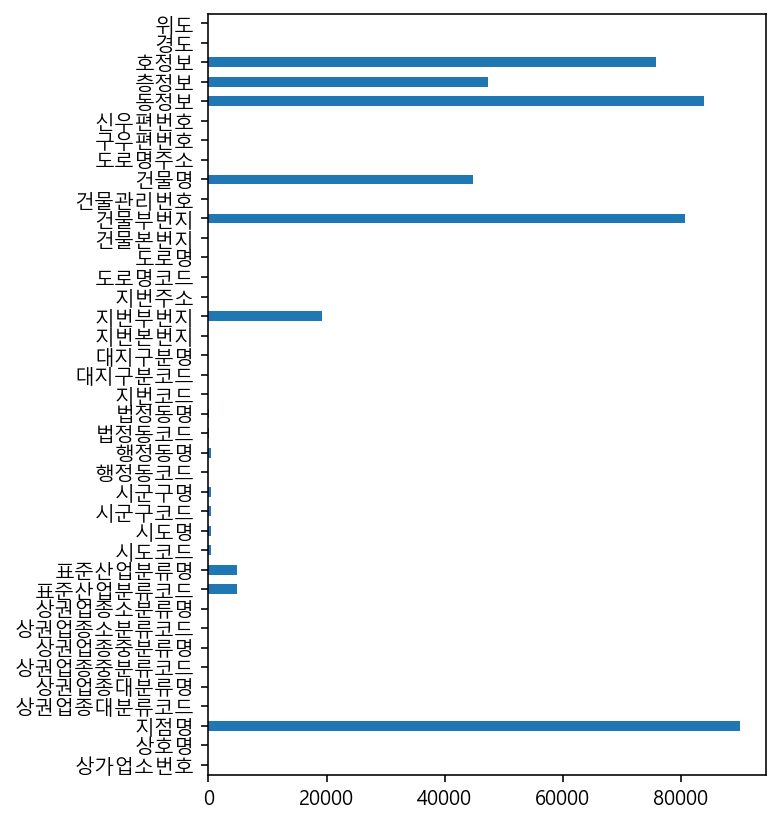

210623


```python
import pandas as pd
import numpy as np
import seaborn as sns
```


```python
import matplotlib.pyplot as plt
plt.rc('font',family= 'Malgun Gothic')  # 한글깨짐방지 두줄.
plt.rc('axes',unicode_minus=False)


# 그래프가 노트북 안에 보이게 하기 위해
%matplotlib inline
```


```python
from IPython.display import set_matplotlib_formats

set_matplotlib_formats('retina')
```


```python
df=pd.read_csv("소상공인시장진흥공단_상가업소정보_의료기관_201909.csv",low_memory=False)
df.shape
# low_memory는 mixed types를 방지하기위해
```


    (91335, 39)


```python
df.head()
```


<div>
<style scoped>
    .dataframe tbody tr th:only-of-type {
        vertical-align: middle;
    }

    .dataframe tbody tr th {
        vertical-align: top;
    }

    .dataframe thead th {
        text-align: right;
    }
</style>
<table border="1" class="dataframe">
  <thead>
    <tr style="text-align: right;">
      <th></th>
      <th>상가업소번호</th>
      <th>상호명</th>
      <th>지점명</th>
      <th>상권업종대분류코드</th>
      <th>상권업종대분류명</th>
      <th>상권업종중분류코드</th>
      <th>상권업종중분류명</th>
      <th>상권업종소분류코드</th>
      <th>상권업종소분류명</th>
      <th>표준산업분류코드</th>
      <th>...</th>
      <th>건물관리번호</th>
      <th>건물명</th>
      <th>도로명주소</th>
      <th>구우편번호</th>
      <th>신우편번호</th>
      <th>동정보</th>
      <th>층정보</th>
      <th>호정보</th>
      <th>경도</th>
      <th>위도</th>
    </tr>
  </thead>
  <tbody>
    <tr>
      <th>0</th>
      <td>19956873</td>
      <td>하나산부인과</td>
      <td>NaN</td>
      <td>S</td>
      <td>의료</td>
      <td>S01</td>
      <td>병원</td>
      <td>S01B10</td>
      <td>산부인과</td>
      <td>Q86201</td>
      <td>...</td>
      <td>4127310900110810000010857</td>
      <td>산호한양아파트</td>
      <td>경기도 안산시 단원구 달미로 10</td>
      <td>425764.0</td>
      <td>15236.0</td>
      <td>NaN</td>
      <td>NaN</td>
      <td>NaN</td>
      <td>126.814295</td>
      <td>37.336344</td>
    </tr>
    <tr>
      <th>1</th>
      <td>20024149</td>
      <td>타워광명내과의원</td>
      <td>NaN</td>
      <td>S</td>
      <td>의료</td>
      <td>S01</td>
      <td>병원</td>
      <td>S01B07</td>
      <td>내과/외과</td>
      <td>Q86201</td>
      <td>...</td>
      <td>1168011800104670014000001</td>
      <td>NaN</td>
      <td>서울특별시 강남구 언주로30길 39</td>
      <td>135270.0</td>
      <td>6292.0</td>
      <td>NaN</td>
      <td>4</td>
      <td>NaN</td>
      <td>127.053198</td>
      <td>37.488742</td>
    </tr>
    <tr>
      <th>2</th>
      <td>20152277</td>
      <td>조정현신경외과의원</td>
      <td>NaN</td>
      <td>S</td>
      <td>의료</td>
      <td>S01</td>
      <td>병원</td>
      <td>S01B15</td>
      <td>신경외과</td>
      <td>Q86201</td>
      <td>...</td>
      <td>4139013200117400001017064</td>
      <td>한라프라자</td>
      <td>경기도 시흥시 중심상가로 178</td>
      <td>429450.0</td>
      <td>15066.0</td>
      <td>NaN</td>
      <td>NaN</td>
      <td>NaN</td>
      <td>126.734841</td>
      <td>37.344955</td>
    </tr>
    <tr>
      <th>3</th>
      <td>20350610</td>
      <td>한귀원정신과의원</td>
      <td>NaN</td>
      <td>S</td>
      <td>의료</td>
      <td>S01</td>
      <td>병원</td>
      <td>S01B99</td>
      <td>기타병원</td>
      <td>NaN</td>
      <td>...</td>
      <td>2650010400100740001009932</td>
      <td>NaN</td>
      <td>부산광역시 수영구 수영로 688</td>
      <td>613100.0</td>
      <td>48266.0</td>
      <td>NaN</td>
      <td>5</td>
      <td>NaN</td>
      <td>129.115438</td>
      <td>35.166872</td>
    </tr>
    <tr>
      <th>4</th>
      <td>20364049</td>
      <td>더블유스토어수지점</td>
      <td>수지점</td>
      <td>S</td>
      <td>의료</td>
      <td>S02</td>
      <td>약국/한약방</td>
      <td>S02A01</td>
      <td>약국</td>
      <td>G47811</td>
      <td>...</td>
      <td>4146510100107120002026238</td>
      <td>NaN</td>
      <td>경기도 용인시 수지구 문정로 32</td>
      <td>448170.0</td>
      <td>16837.0</td>
      <td>NaN</td>
      <td>1</td>
      <td>NaN</td>
      <td>127.095522</td>
      <td>37.323528</td>
    </tr>
  </tbody>
</table>
<p>5 rows × 39 columns</p>
</div>


# 결측치


```python
#결측치 세어주기 #결측치:Null,NaN. 데이터가 없는 것.
df.isnull().sum()
```


    상가업소번호           0
    상호명              0
    지점명          89989
    상권업종대분류코드        0
    상권업종대분류명         0
    상권업종중분류코드        0
    상권업종중분류명         0
    상권업종소분류코드        0
    상권업종소분류명         0
    표준산업분류코드      4922
    표준산업분류명       4922
    시도코드           379
    시도명            379
    시군구코드          379
    시군구명           379
    행정동코드            0
    행정동명           379
    법정동코드           55
    법정동명            55
    지번코드             0
    대지구분코드           0
    대지구분명            0
    지번본번지            0
    지번부번지        19256
    지번주소             0
    도로명코드            0
    도로명              0
    건물본번지            0
    건물부번지        80731
    건물관리번호           0
    건물명          44882
    도로명주소            0
    구우편번호           12
    신우편번호            2
    동정보          83929
    층정보          47291
    호정보          75784
    경도               0
    위도               0
    dtype: int64


```python
null_count=df.isnull().sum()
```


```python
null_count.plot.barh(figsize=(5,7))
# figsize로 그래프크기 조율해주기. 글씨크기 때문에
```


    <AxesSubplot:>


    

    


```python
null_count.reset_index()
#reset_index()는 데이터형태로 변환
df_null_count = null_count.reset_index()
```


```python
df_null_count.head()
```


<div>
<style scoped>
    .dataframe tbody tr th:only-of-type {
        vertical-align: middle;
    }

    .dataframe tbody tr th {
        vertical-align: top;
    }

    .dataframe thead th {
        text-align: right;
    }
</style>
<table border="1" class="dataframe">
  <thead>
    <tr style="text-align: right;">
      <th></th>
      <th>index</th>
      <th>0</th>
    </tr>
  </thead>
  <tbody>
    <tr>
      <th>0</th>
      <td>상가업소번호</td>
      <td>0</td>
    </tr>
    <tr>
      <th>1</th>
      <td>상호명</td>
      <td>0</td>
    </tr>
    <tr>
      <th>2</th>
      <td>지점명</td>
      <td>89989</td>
    </tr>
    <tr>
      <th>3</th>
      <td>상권업종대분류코드</td>
      <td>0</td>
    </tr>
    <tr>
      <th>4</th>
      <td>상권업종대분류명</td>
      <td>0</td>
    </tr>
  </tbody>
</table>
</div>


## 컬럼명 변경하기


```python
df_null_count.columns = ["컬럼명","결측치수"]
df_null_count.head()
```


<div>
<style scoped>
    .dataframe tbody tr th:only-of-type {
        vertical-align: middle;
    }

    .dataframe tbody tr th {
        vertical-align: top;
    }

    .dataframe thead th {
        text-align: right;
    }
</style>
<table border="1" class="dataframe">
  <thead>
    <tr style="text-align: right;">
      <th></th>
      <th>컬럼명</th>
      <th>결측치수</th>
    </tr>
  </thead>
  <tbody>
    <tr>
      <th>0</th>
      <td>상가업소번호</td>
      <td>0</td>
    </tr>
    <tr>
      <th>1</th>
      <td>상호명</td>
      <td>0</td>
    </tr>
    <tr>
      <th>2</th>
      <td>지점명</td>
      <td>89989</td>
    </tr>
    <tr>
      <th>3</th>
      <td>상권업종대분류코드</td>
      <td>0</td>
    </tr>
    <tr>
      <th>4</th>
      <td>상권업종대분류명</td>
      <td>0</td>
    </tr>
  </tbody>
</table>
</div>


## 정렬하기


```python
df_null_count_top=df_null_count.sort_values(by='결측치수', ascending=False).head(10)

#ascending=False 내림차순으로 value정리
```


```python
df["지점명"] #NAN = 결측치
```


    0         NaN
    1         NaN
    2         NaN
    3         NaN
    4         수지점
             ... 
    91330     베스트
    91331    봄산후조
    91332     NaN
    91333     NaN
    91334     NaN
    Name: 지점명, Length: 91335, dtype: object


```python
df_null_count['컬럼명']
```


    0        상가업소번호
    1           상호명
    2           지점명
    3     상권업종대분류코드
    4      상권업종대분류명
    5     상권업종중분류코드
    6      상권업종중분류명
    7     상권업종소분류코드
    8      상권업종소분류명
    9      표준산업분류코드
    10      표준산업분류명
    11         시도코드
    12          시도명
    13        시군구코드
    14         시군구명
    15        행정동코드
    16         행정동명
    17        법정동코드
    18         법정동명
    19         지번코드
    20       대지구분코드
    21        대지구분명
    22        지번본번지
    23        지번부번지
    24         지번주소
    25        도로명코드
    26          도로명
    27        건물본번지
    28        건물부번지
    29       건물관리번호
    30          건물명
    31        도로명주소
    32        구우편번호
    33        신우편번호
    34          동정보
    35          층정보
    36          호정보
    37           경도
    38           위도
    Name: 컬럼명, dtype: object


```python
drop_columns=df_null_count_top['컬럼명'].tolist() #tolist: 리스트로 바꿔주는함수
drop_columns
```


    ['지점명',
     '동정보',
     '건물부번지',
     '호정보',
     '층정보',
     '건물명',
     '지번부번지',
     '표준산업분류코드',
     '표준산업분류명',
     '시도코드']


```python
df[drop_columns].head()
```


<div>
<style scoped>
    .dataframe tbody tr th:only-of-type {
        vertical-align: middle;
    }

    .dataframe tbody tr th {
        vertical-align: top;
    }

    .dataframe thead th {
        text-align: right;
    }
</style>
<table border="1" class="dataframe">
  <thead>
    <tr style="text-align: right;">
      <th></th>
      <th>지점명</th>
      <th>동정보</th>
      <th>건물부번지</th>
      <th>호정보</th>
      <th>층정보</th>
      <th>건물명</th>
      <th>지번부번지</th>
      <th>표준산업분류코드</th>
      <th>표준산업분류명</th>
      <th>시도코드</th>
    </tr>
  </thead>
  <tbody>
    <tr>
      <th>0</th>
      <td>NaN</td>
      <td>NaN</td>
      <td>NaN</td>
      <td>NaN</td>
      <td>NaN</td>
      <td>산호한양아파트</td>
      <td>NaN</td>
      <td>Q86201</td>
      <td>일반 의원</td>
      <td>41.0</td>
    </tr>
    <tr>
      <th>1</th>
      <td>NaN</td>
      <td>NaN</td>
      <td>NaN</td>
      <td>NaN</td>
      <td>4</td>
      <td>NaN</td>
      <td>14.0</td>
      <td>Q86201</td>
      <td>일반 의원</td>
      <td>11.0</td>
    </tr>
    <tr>
      <th>2</th>
      <td>NaN</td>
      <td>NaN</td>
      <td>NaN</td>
      <td>NaN</td>
      <td>NaN</td>
      <td>한라프라자</td>
      <td>1.0</td>
      <td>Q86201</td>
      <td>일반 의원</td>
      <td>41.0</td>
    </tr>
    <tr>
      <th>3</th>
      <td>NaN</td>
      <td>NaN</td>
      <td>NaN</td>
      <td>NaN</td>
      <td>5</td>
      <td>NaN</td>
      <td>1.0</td>
      <td>NaN</td>
      <td>NaN</td>
      <td>26.0</td>
    </tr>
    <tr>
      <th>4</th>
      <td>수지점</td>
      <td>NaN</td>
      <td>NaN</td>
      <td>NaN</td>
      <td>1</td>
      <td>NaN</td>
      <td>2.0</td>
      <td>G47811</td>
      <td>의약품 및 의료용품 소매업</td>
      <td>41.0</td>
    </tr>
  </tbody>
</table>
</div>


## 결측치 제거하기


```python
print(df.shape)
df=df.drop(drop_columns, axis=1) #1은 열, 0은 행. 값은 재할당해야 반영된다.
print(df.shape)
```

    (91335, 39)
    (91335, 29)
    

## 결과보기


```python
df.info()
```

    <class 'pandas.core.frame.DataFrame'>
    RangeIndex: 91335 entries, 0 to 91334
    Data columns (total 29 columns):
     #   Column     Non-Null Count  Dtype  
    ---  ------     --------------  -----  
     0   상가업소번호     91335 non-null  int64  
     1   상호명        91335 non-null  object 
     2   상권업종대분류코드  91335 non-null  object 
     3   상권업종대분류명   91335 non-null  object 
     4   상권업종중분류코드  91335 non-null  object 
     5   상권업종중분류명   91335 non-null  object 
     6   상권업종소분류코드  91335 non-null  object 
     7   상권업종소분류명   91335 non-null  object 
     8   시도명        90956 non-null  object 
     9   시군구코드      90956 non-null  float64
     10  시군구명       90956 non-null  object 
     11  행정동코드      91335 non-null  int64  
     12  행정동명       90956 non-null  object 
     13  법정동코드      91280 non-null  float64
     14  법정동명       91280 non-null  object 
     15  지번코드       91335 non-null  int64  
     16  대지구분코드     91335 non-null  int64  
     17  대지구분명      91335 non-null  object 
     18  지번본번지      91335 non-null  int64  
     19  지번주소       91335 non-null  object 
     20  도로명코드      91335 non-null  int64  
     21  도로명        91335 non-null  object 
     22  건물본번지      91335 non-null  int64  
     23  건물관리번호     91335 non-null  object 
     24  도로명주소      91335 non-null  object 
     25  구우편번호      91323 non-null  float64
     26  신우편번호      91333 non-null  float64
     27  경도         91335 non-null  float64
     28  위도         91335 non-null  float64
    dtypes: float64(6), int64(7), object(16)
    memory usage: 20.2+ MB
    

## 기초통계수치


```python
df.dtypes
```


    상가업소번호         int64
    상호명           object
    지점명           object
    상권업종대분류코드     object
    상권업종대분류명      object
    상권업종중분류코드     object
    상권업종중분류명      object
    상권업종소분류코드     object
    상권업종소분류명      object
    표준산업분류코드      object
    표준산업분류명       object
    시도코드         float64
    시도명           object
    시군구코드        float64
    시군구명          object
    행정동코드          int64
    행정동명          object
    법정동코드        float64
    법정동명          object
    지번코드           int64
    대지구분코드         int64
    대지구분명         object
    지번본번지          int64
    지번부번지        float64
    지번주소          object
    도로명코드          int64
    도로명           object
    건물본번지          int64
    건물부번지        float64
    건물관리번호        object
    건물명           object
    도로명주소         object
    구우편번호        float64
    신우편번호        float64
    동정보           object
    층정보           object
    호정보           object
    경도           float64
    위도           float64
    dtype: object


```python
df['위도'].mean() #mean은 평균
```


    36.62471119236673


```python
df['위도'].median # 중앙값
```


    <bound method NDFrame._add_numeric_operations.<locals>.median of 0        37.336344
    1        37.488742
    2        37.344955
    3        35.166872
    4        37.323528
               ...    
    91330    36.352728
    91331    37.627530
    91332    35.227138
    91333    37.540993
    91334    36.806640
    Name: 위도, Length: 91335, dtype: float64>


```python
df['위도'].max
```


    <bound method NDFrame._add_numeric_operations.<locals>.max of 0        37.336344
    1        37.488742
    2        37.344955
    3        35.166872
    4        37.323528
               ...    
    91330    36.352728
    91331    37.627530
    91332    35.227138
    91333    37.540993
    91334    36.806640
    Name: 위도, Length: 91335, dtype: float64>


```python
df['위도'].min()
```


    33.2192896688307


```python
df['위도'].count()
```


    91335


```python
df['위도'].describe() #통계값 요약
```


    count    91335.000000
    mean        36.624711
    std          1.041361
    min         33.219290
    25%         35.811830
    50%         37.234652
    75%         37.507463
    max         38.499659
    Name: 위도, dtype: float64


```python
df[['위도','경도']].describe() #두개이상은 항상 리스트 한번더
```


<div>
<style scoped>
    .dataframe tbody tr th:only-of-type {
        vertical-align: middle;
    }

    .dataframe tbody tr th {
        vertical-align: top;
    }

    .dataframe thead th {
        text-align: right;
    }
</style>
<table border="1" class="dataframe">
  <thead>
    <tr style="text-align: right;">
      <th></th>
      <th>위도</th>
      <th>경도</th>
    </tr>
  </thead>
  <tbody>
    <tr>
      <th>count</th>
      <td>91335.000000</td>
      <td>91335.000000</td>
    </tr>
    <tr>
      <th>mean</th>
      <td>36.624711</td>
      <td>127.487524</td>
    </tr>
    <tr>
      <th>std</th>
      <td>1.041361</td>
      <td>0.842877</td>
    </tr>
    <tr>
      <th>min</th>
      <td>33.219290</td>
      <td>124.717632</td>
    </tr>
    <tr>
      <th>25%</th>
      <td>35.811830</td>
      <td>126.914297</td>
    </tr>
    <tr>
      <th>50%</th>
      <td>37.234652</td>
      <td>127.084550</td>
    </tr>
    <tr>
      <th>75%</th>
      <td>37.507463</td>
      <td>128.108919</td>
    </tr>
    <tr>
      <th>max</th>
      <td>38.499659</td>
      <td>130.909912</td>
    </tr>
  </tbody>
</table>
</div>


```python
df.describe(include="all") #숫자형으로 출력
```


<div>
<style scoped>
    .dataframe tbody tr th:only-of-type {
        vertical-align: middle;
    }

    .dataframe tbody tr th {
        vertical-align: top;
    }

    .dataframe thead th {
        text-align: right;
    }
</style>
<table border="1" class="dataframe">
  <thead>
    <tr style="text-align: right;">
      <th></th>
      <th>상가업소번호</th>
      <th>시도코드</th>
      <th>시군구코드</th>
      <th>행정동코드</th>
      <th>법정동코드</th>
      <th>지번코드</th>
      <th>대지구분코드</th>
      <th>지번본번지</th>
      <th>지번부번지</th>
      <th>도로명코드</th>
      <th>건물본번지</th>
      <th>건물부번지</th>
      <th>구우편번호</th>
      <th>신우편번호</th>
      <th>경도</th>
      <th>위도</th>
    </tr>
  </thead>
  <tbody>
    <tr>
      <th>count</th>
      <td>9.133500e+04</td>
      <td>90956.000000</td>
      <td>90956.000000</td>
      <td>9.133500e+04</td>
      <td>9.128000e+04</td>
      <td>9.133500e+04</td>
      <td>91335.000000</td>
      <td>91335.000000</td>
      <td>72079.000000</td>
      <td>9.133500e+04</td>
      <td>91335.000000</td>
      <td>10604.000000</td>
      <td>91323.000000</td>
      <td>91333.00000</td>
      <td>91335.000000</td>
      <td>91335.000000</td>
    </tr>
    <tr>
      <th>mean</th>
      <td>2.121818e+07</td>
      <td>32.586712</td>
      <td>32898.381877</td>
      <td>3.293232e+09</td>
      <td>3.293385e+09</td>
      <td>3.293191e+18</td>
      <td>1.001336</td>
      <td>587.534549</td>
      <td>17.005092</td>
      <td>3.293207e+11</td>
      <td>251.200482</td>
      <td>7.241135</td>
      <td>428432.911085</td>
      <td>28085.47698</td>
      <td>127.487524</td>
      <td>36.624711</td>
    </tr>
    <tr>
      <th>std</th>
      <td>5.042828e+06</td>
      <td>13.045138</td>
      <td>12985.393171</td>
      <td>1.297387e+09</td>
      <td>1.297706e+09</td>
      <td>1.297393e+18</td>
      <td>0.036524</td>
      <td>582.519364</td>
      <td>53.451413</td>
      <td>1.297391e+11</td>
      <td>477.456487</td>
      <td>12.426816</td>
      <td>193292.339066</td>
      <td>18909.01455</td>
      <td>0.842877</td>
      <td>1.041361</td>
    </tr>
    <tr>
      <th>min</th>
      <td>2.901108e+06</td>
      <td>11.000000</td>
      <td>11110.000000</td>
      <td>1.111052e+09</td>
      <td>1.111010e+09</td>
      <td>1.111010e+18</td>
      <td>1.000000</td>
      <td>1.000000</td>
      <td>1.000000</td>
      <td>1.111020e+11</td>
      <td>0.000000</td>
      <td>1.000000</td>
      <td>100011.000000</td>
      <td>1000.00000</td>
      <td>124.717632</td>
      <td>33.219290</td>
    </tr>
    <tr>
      <th>25%</th>
      <td>2.001931e+07</td>
      <td>26.000000</td>
      <td>26350.000000</td>
      <td>2.635065e+09</td>
      <td>2.635011e+09</td>
      <td>2.635011e+18</td>
      <td>1.000000</td>
      <td>162.000000</td>
      <td>2.000000</td>
      <td>2.635042e+11</td>
      <td>29.000000</td>
      <td>1.000000</td>
      <td>302120.000000</td>
      <td>11681.00000</td>
      <td>126.914297</td>
      <td>35.811830</td>
    </tr>
    <tr>
      <th>50%</th>
      <td>2.211900e+07</td>
      <td>41.000000</td>
      <td>41117.000000</td>
      <td>4.111758e+09</td>
      <td>4.111710e+09</td>
      <td>4.111711e+18</td>
      <td>1.000000</td>
      <td>462.000000</td>
      <td>5.000000</td>
      <td>4.111743e+11</td>
      <td>92.000000</td>
      <td>2.000000</td>
      <td>440300.000000</td>
      <td>24353.00000</td>
      <td>127.084550</td>
      <td>37.234652</td>
    </tr>
    <tr>
      <th>75%</th>
      <td>2.480984e+07</td>
      <td>43.000000</td>
      <td>43113.000000</td>
      <td>4.311370e+09</td>
      <td>4.311311e+09</td>
      <td>4.311311e+18</td>
      <td>1.000000</td>
      <td>858.000000</td>
      <td>14.000000</td>
      <td>4.311332e+11</td>
      <td>257.000000</td>
      <td>9.000000</td>
      <td>602811.000000</td>
      <td>46044.00000</td>
      <td>128.108919</td>
      <td>37.507463</td>
    </tr>
    <tr>
      <th>max</th>
      <td>2.852470e+07</td>
      <td>50.000000</td>
      <td>50130.000000</td>
      <td>5.013061e+09</td>
      <td>5.013032e+09</td>
      <td>5.013061e+18</td>
      <td>2.000000</td>
      <td>7338.000000</td>
      <td>1428.000000</td>
      <td>5.013049e+11</td>
      <td>8795.000000</td>
      <td>244.000000</td>
      <td>799801.000000</td>
      <td>63643.00000</td>
      <td>130.909912</td>
      <td>38.499659</td>
    </tr>
  </tbody>
</table>
</div>


```python
df.describe(include="object") #문자열로 데이터타입으로 출력
```


<div>
<style scoped>
    .dataframe tbody tr th:only-of-type {
        vertical-align: middle;
    }

    .dataframe tbody tr th {
        vertical-align: top;
    }

    .dataframe thead th {
        text-align: right;
    }
</style>
<table border="1" class="dataframe">
  <thead>
    <tr style="text-align: right;">
      <th></th>
      <th>상호명</th>
      <th>지점명</th>
      <th>상권업종대분류코드</th>
      <th>상권업종대분류명</th>
      <th>상권업종중분류코드</th>
      <th>상권업종중분류명</th>
      <th>상권업종소분류코드</th>
      <th>상권업종소분류명</th>
      <th>표준산업분류코드</th>
      <th>표준산업분류명</th>
      <th>...</th>
      <th>법정동명</th>
      <th>대지구분명</th>
      <th>지번주소</th>
      <th>도로명</th>
      <th>건물관리번호</th>
      <th>건물명</th>
      <th>도로명주소</th>
      <th>동정보</th>
      <th>층정보</th>
      <th>호정보</th>
    </tr>
  </thead>
  <tbody>
    <tr>
      <th>count</th>
      <td>91335</td>
      <td>1346</td>
      <td>91335</td>
      <td>91335</td>
      <td>91335</td>
      <td>91335</td>
      <td>91335</td>
      <td>91335</td>
      <td>86413</td>
      <td>86413</td>
      <td>...</td>
      <td>91280</td>
      <td>91335</td>
      <td>91335</td>
      <td>91335</td>
      <td>91335</td>
      <td>46453</td>
      <td>91335</td>
      <td>7406</td>
      <td>44044</td>
      <td>15551</td>
    </tr>
    <tr>
      <th>unique</th>
      <td>56910</td>
      <td>858</td>
      <td>1</td>
      <td>1</td>
      <td>5</td>
      <td>5</td>
      <td>34</td>
      <td>34</td>
      <td>15</td>
      <td>15</td>
      <td>...</td>
      <td>2822</td>
      <td>2</td>
      <td>53118</td>
      <td>16610</td>
      <td>54142</td>
      <td>17946</td>
      <td>54031</td>
      <td>556</td>
      <td>74</td>
      <td>849</td>
    </tr>
    <tr>
      <th>top</th>
      <td>리원</td>
      <td>장례식장</td>
      <td>S</td>
      <td>의료</td>
      <td>S01</td>
      <td>병원</td>
      <td>S02A01</td>
      <td>약국</td>
      <td>Q86201</td>
      <td>일반 의원</td>
      <td>...</td>
      <td>중동</td>
      <td>대지</td>
      <td>서울특별시 동대문구 제기동 965-1</td>
      <td>서울특별시 강남구 강남대로</td>
      <td>1123010300109650001031604</td>
      <td>현대아파트</td>
      <td>서울특별시 동대문구 약령중앙로8길 10</td>
      <td>1</td>
      <td>1</td>
      <td>1</td>
    </tr>
    <tr>
      <th>freq</th>
      <td>152</td>
      <td>97</td>
      <td>91335</td>
      <td>91335</td>
      <td>60774</td>
      <td>60774</td>
      <td>18964</td>
      <td>18964</td>
      <td>22555</td>
      <td>22555</td>
      <td>...</td>
      <td>874</td>
      <td>91213</td>
      <td>198</td>
      <td>326</td>
      <td>198</td>
      <td>131</td>
      <td>198</td>
      <td>1571</td>
      <td>15994</td>
      <td>1286</td>
    </tr>
  </tbody>
</table>
<p>4 rows × 23 columns</p>
</div>


```python

```
