# practice - 4
### 실습일
- 210624-2
- 210628-1


```python
import pandas as pd
import numpy as np
import seaborn as sns
```


```python
import matplotlib.pyplot as plt
plt.rc('font',family= 'Malgun Gothic')  # 한글깨짐방지 두줄.
plt.rc('axes',unicode_minus=False)


# 그래프가 노트북 안에 보이게 하기 위해
%matplotlib inline
```


```python
from IPython.display import set_matplotlib_formats

set_matplotlib_formats('retina')
```


```python
df=pd.read_csv("소상공인시장진흥공단_상가업소정보_의료기관_201909.csv",low_memory=False)
df.shape
# low_memory는 mixed types를 방지하기위해
```


    (91335, 39)


```python
df.head()
```


<div>
<style scoped>
    .dataframe tbody tr th:only-of-type {
        vertical-align: middle;
    }

    .dataframe tbody tr th {
        vertical-align: top;
    }

    .dataframe thead th {
        text-align: right;
    }
</style>
<table border="1" class="dataframe">
  <thead>
    <tr style="text-align: right;">
      <th></th>
      <th>상가업소번호</th>
      <th>상호명</th>
      <th>지점명</th>
      <th>상권업종대분류코드</th>
      <th>상권업종대분류명</th>
      <th>상권업종중분류코드</th>
      <th>상권업종중분류명</th>
      <th>상권업종소분류코드</th>
      <th>상권업종소분류명</th>
      <th>표준산업분류코드</th>
      <th>...</th>
      <th>건물관리번호</th>
      <th>건물명</th>
      <th>도로명주소</th>
      <th>구우편번호</th>
      <th>신우편번호</th>
      <th>동정보</th>
      <th>층정보</th>
      <th>호정보</th>
      <th>경도</th>
      <th>위도</th>
    </tr>
  </thead>
  <tbody>
    <tr>
      <th>0</th>
      <td>19956873</td>
      <td>하나산부인과</td>
      <td>NaN</td>
      <td>S</td>
      <td>의료</td>
      <td>S01</td>
      <td>병원</td>
      <td>S01B10</td>
      <td>산부인과</td>
      <td>Q86201</td>
      <td>...</td>
      <td>4127310900110810000010857</td>
      <td>산호한양아파트</td>
      <td>경기도 안산시 단원구 달미로 10</td>
      <td>425764.0</td>
      <td>15236.0</td>
      <td>NaN</td>
      <td>NaN</td>
      <td>NaN</td>
      <td>126.814295</td>
      <td>37.336344</td>
    </tr>
    <tr>
      <th>1</th>
      <td>20024149</td>
      <td>타워광명내과의원</td>
      <td>NaN</td>
      <td>S</td>
      <td>의료</td>
      <td>S01</td>
      <td>병원</td>
      <td>S01B07</td>
      <td>내과/외과</td>
      <td>Q86201</td>
      <td>...</td>
      <td>1168011800104670014000001</td>
      <td>NaN</td>
      <td>서울특별시 강남구 언주로30길 39</td>
      <td>135270.0</td>
      <td>6292.0</td>
      <td>NaN</td>
      <td>4</td>
      <td>NaN</td>
      <td>127.053198</td>
      <td>37.488742</td>
    </tr>
    <tr>
      <th>2</th>
      <td>20152277</td>
      <td>조정현신경외과의원</td>
      <td>NaN</td>
      <td>S</td>
      <td>의료</td>
      <td>S01</td>
      <td>병원</td>
      <td>S01B15</td>
      <td>신경외과</td>
      <td>Q86201</td>
      <td>...</td>
      <td>4139013200117400001017064</td>
      <td>한라프라자</td>
      <td>경기도 시흥시 중심상가로 178</td>
      <td>429450.0</td>
      <td>15066.0</td>
      <td>NaN</td>
      <td>NaN</td>
      <td>NaN</td>
      <td>126.734841</td>
      <td>37.344955</td>
    </tr>
    <tr>
      <th>3</th>
      <td>20350610</td>
      <td>한귀원정신과의원</td>
      <td>NaN</td>
      <td>S</td>
      <td>의료</td>
      <td>S01</td>
      <td>병원</td>
      <td>S01B99</td>
      <td>기타병원</td>
      <td>NaN</td>
      <td>...</td>
      <td>2650010400100740001009932</td>
      <td>NaN</td>
      <td>부산광역시 수영구 수영로 688</td>
      <td>613100.0</td>
      <td>48266.0</td>
      <td>NaN</td>
      <td>5</td>
      <td>NaN</td>
      <td>129.115438</td>
      <td>35.166872</td>
    </tr>
    <tr>
      <th>4</th>
      <td>20364049</td>
      <td>더블유스토어수지점</td>
      <td>수지점</td>
      <td>S</td>
      <td>의료</td>
      <td>S02</td>
      <td>약국/한약방</td>
      <td>S02A01</td>
      <td>약국</td>
      <td>G47811</td>
      <td>...</td>
      <td>4146510100107120002026238</td>
      <td>NaN</td>
      <td>경기도 용인시 수지구 문정로 32</td>
      <td>448170.0</td>
      <td>16837.0</td>
      <td>NaN</td>
      <td>1</td>
      <td>NaN</td>
      <td>127.095522</td>
      <td>37.323528</td>
    </tr>
  </tbody>
</table>
<p>5 rows × 39 columns</p>
</div>


# 결측치


```python
#결측치 세어주기 #결측치:Null,NaN. 데이터가 없는 것.
df.isnull().sum()
```


    상가업소번호           0
    상호명              0
    지점명          89989
    상권업종대분류코드        0
    상권업종대분류명         0
    상권업종중분류코드        0
    상권업종중분류명         0
    상권업종소분류코드        0
    상권업종소분류명         0
    표준산업분류코드      4922
    표준산업분류명       4922
    시도코드           379
    시도명            379
    시군구코드          379
    시군구명           379
    행정동코드            0
    행정동명           379
    법정동코드           55
    법정동명            55
    지번코드             0
    대지구분코드           0
    대지구분명            0
    지번본번지            0
    지번부번지        19256
    지번주소             0
    도로명코드            0
    도로명              0
    건물본번지            0
    건물부번지        80731
    건물관리번호           0
    건물명          44882
    도로명주소            0
    구우편번호           12
    신우편번호            2
    동정보          83929
    층정보          47291
    호정보          75784
    경도               0
    위도               0
    dtype: int64


```python
null_count=df.isnull().sum()
```


```python
null_count.plot.barh(figsize=(5,7))
# figsize로 그래프크기 조율해주기. 글씨크기 때문에
```


    <AxesSubplot:>


    

    


```python
null_count.reset_index()
#reset_index()는 데이터프레임 형태로 변환
df_null_count = null_count.reset_index()
```


```python
df_null_count.head()
```


<div>
<style scoped>
    .dataframe tbody tr th:only-of-type {
        vertical-align: middle;
    }

    .dataframe tbody tr th {
        vertical-align: top;
    }

    .dataframe thead th {
        text-align: right;
    }
</style>
<table border="1" class="dataframe">
  <thead>
    <tr style="text-align: right;">
      <th></th>
      <th>index</th>
      <th>0</th>
    </tr>
  </thead>
  <tbody>
    <tr>
      <th>0</th>
      <td>상가업소번호</td>
      <td>0</td>
    </tr>
    <tr>
      <th>1</th>
      <td>상호명</td>
      <td>0</td>
    </tr>
    <tr>
      <th>2</th>
      <td>지점명</td>
      <td>89989</td>
    </tr>
    <tr>
      <th>3</th>
      <td>상권업종대분류코드</td>
      <td>0</td>
    </tr>
    <tr>
      <th>4</th>
      <td>상권업종대분류명</td>
      <td>0</td>
    </tr>
  </tbody>
</table>
</div>


## 컬럼명 변경하기


```python
df_null_count.columns = ["컬럼명","결측치수"]
df_null_count.head()
```


<div>
<style scoped>
    .dataframe tbody tr th:only-of-type {
        vertical-align: middle;
    }

    .dataframe tbody tr th {
        vertical-align: top;
    }

    .dataframe thead th {
        text-align: right;
    }
</style>
<table border="1" class="dataframe">
  <thead>
    <tr style="text-align: right;">
      <th></th>
      <th>컬럼명</th>
      <th>결측치수</th>
    </tr>
  </thead>
  <tbody>
    <tr>
      <th>0</th>
      <td>상가업소번호</td>
      <td>0</td>
    </tr>
    <tr>
      <th>1</th>
      <td>상호명</td>
      <td>0</td>
    </tr>
    <tr>
      <th>2</th>
      <td>지점명</td>
      <td>89989</td>
    </tr>
    <tr>
      <th>3</th>
      <td>상권업종대분류코드</td>
      <td>0</td>
    </tr>
    <tr>
      <th>4</th>
      <td>상권업종대분류명</td>
      <td>0</td>
    </tr>
  </tbody>
</table>
</div>


## 정렬하기


```python
df_null_count_top=df_null_count.sort_values(by='결측치수', ascending=False).head(10)

#ascending=False 내림차순으로 value정리
```


```python
df["지점명"] #NAN = 결측치
```


    0         NaN
    1         NaN
    2         NaN
    3         NaN
    4         수지점
             ... 
    91330     베스트
    91331    봄산후조
    91332     NaN
    91333     NaN
    91334     NaN
    Name: 지점명, Length: 91335, dtype: object


```python
df_null_count['컬럼명']
```


    0        상가업소번호
    1           상호명
    2           지점명
    3     상권업종대분류코드
    4      상권업종대분류명
    5     상권업종중분류코드
    6      상권업종중분류명
    7     상권업종소분류코드
    8      상권업종소분류명
    9      표준산업분류코드
    10      표준산업분류명
    11         시도코드
    12          시도명
    13        시군구코드
    14         시군구명
    15        행정동코드
    16         행정동명
    17        법정동코드
    18         법정동명
    19         지번코드
    20       대지구분코드
    21        대지구분명
    22        지번본번지
    23        지번부번지
    24         지번주소
    25        도로명코드
    26          도로명
    27        건물본번지
    28        건물부번지
    29       건물관리번호
    30          건물명
    31        도로명주소
    32        구우편번호
    33        신우편번호
    34          동정보
    35          층정보
    36          호정보
    37           경도
    38           위도
    Name: 컬럼명, dtype: object


```python
drop_columns=df_null_count_top['컬럼명'].tolist() #tolist: 리스트로 바꿔주는함수
drop_columns
```


    ['지점명',
     '동정보',
     '건물부번지',
     '호정보',
     '층정보',
     '건물명',
     '지번부번지',
     '표준산업분류코드',
     '표준산업분류명',
     '시도코드']


```python
df[drop_columns].head()
```


<div>
<style scoped>
    .dataframe tbody tr th:only-of-type {
        vertical-align: middle;
    }

    .dataframe tbody tr th {
        vertical-align: top;
    }

    .dataframe thead th {
        text-align: right;
    }
</style>
<table border="1" class="dataframe">
  <thead>
    <tr style="text-align: right;">
      <th></th>
      <th>지점명</th>
      <th>동정보</th>
      <th>건물부번지</th>
      <th>호정보</th>
      <th>층정보</th>
      <th>건물명</th>
      <th>지번부번지</th>
      <th>표준산업분류코드</th>
      <th>표준산업분류명</th>
      <th>시도코드</th>
    </tr>
  </thead>
  <tbody>
    <tr>
      <th>0</th>
      <td>NaN</td>
      <td>NaN</td>
      <td>NaN</td>
      <td>NaN</td>
      <td>NaN</td>
      <td>산호한양아파트</td>
      <td>NaN</td>
      <td>Q86201</td>
      <td>일반 의원</td>
      <td>41.0</td>
    </tr>
    <tr>
      <th>1</th>
      <td>NaN</td>
      <td>NaN</td>
      <td>NaN</td>
      <td>NaN</td>
      <td>4</td>
      <td>NaN</td>
      <td>14.0</td>
      <td>Q86201</td>
      <td>일반 의원</td>
      <td>11.0</td>
    </tr>
    <tr>
      <th>2</th>
      <td>NaN</td>
      <td>NaN</td>
      <td>NaN</td>
      <td>NaN</td>
      <td>NaN</td>
      <td>한라프라자</td>
      <td>1.0</td>
      <td>Q86201</td>
      <td>일반 의원</td>
      <td>41.0</td>
    </tr>
    <tr>
      <th>3</th>
      <td>NaN</td>
      <td>NaN</td>
      <td>NaN</td>
      <td>NaN</td>
      <td>5</td>
      <td>NaN</td>
      <td>1.0</td>
      <td>NaN</td>
      <td>NaN</td>
      <td>26.0</td>
    </tr>
    <tr>
      <th>4</th>
      <td>수지점</td>
      <td>NaN</td>
      <td>NaN</td>
      <td>NaN</td>
      <td>1</td>
      <td>NaN</td>
      <td>2.0</td>
      <td>G47811</td>
      <td>의약품 및 의료용품 소매업</td>
      <td>41.0</td>
    </tr>
  </tbody>
</table>
</div>


## 결측치 제거하기


```python
print(df.shape)
df=df.drop(drop_columns, axis=1) #1은 열, 0은 행. 값은 재할당해야 반영된다.
print(df.shape)
```

    (91335, 39)
    (91335, 29)
    

## 결과보기


```python
df.info()
```

    <class 'pandas.core.frame.DataFrame'>
    RangeIndex: 91335 entries, 0 to 91334
    Data columns (total 29 columns):
     #   Column     Non-Null Count  Dtype  
    ---  ------     --------------  -----  
     0   상가업소번호     91335 non-null  int64  
     1   상호명        91335 non-null  object 
     2   상권업종대분류코드  91335 non-null  object 
     3   상권업종대분류명   91335 non-null  object 
     4   상권업종중분류코드  91335 non-null  object 
     5   상권업종중분류명   91335 non-null  object 
     6   상권업종소분류코드  91335 non-null  object 
     7   상권업종소분류명   91335 non-null  object 
     8   시도명        90956 non-null  object 
     9   시군구코드      90956 non-null  float64
     10  시군구명       90956 non-null  object 
     11  행정동코드      91335 non-null  int64  
     12  행정동명       90956 non-null  object 
     13  법정동코드      91280 non-null  float64
     14  법정동명       91280 non-null  object 
     15  지번코드       91335 non-null  int64  
     16  대지구분코드     91335 non-null  int64  
     17  대지구분명      91335 non-null  object 
     18  지번본번지      91335 non-null  int64  
     19  지번주소       91335 non-null  object 
     20  도로명코드      91335 non-null  int64  
     21  도로명        91335 non-null  object 
     22  건물본번지      91335 non-null  int64  
     23  건물관리번호     91335 non-null  object 
     24  도로명주소      91335 non-null  object 
     25  구우편번호      91323 non-null  float64
     26  신우편번호      91333 non-null  float64
     27  경도         91335 non-null  float64
     28  위도         91335 non-null  float64
    dtypes: float64(6), int64(7), object(16)
    memory usage: 20.2+ MB
    

## 기초통계수치


```python
df.dtypes
```


    상가업소번호         int64
    상호명           object
    상권업종대분류코드     object
    상권업종대분류명      object
    상권업종중분류코드     object
    상권업종중분류명      object
    상권업종소분류코드     object
    상권업종소분류명      object
    시도명           object
    시군구코드        float64
    시군구명          object
    행정동코드          int64
    행정동명          object
    법정동코드        float64
    법정동명          object
    지번코드           int64
    대지구분코드         int64
    대지구분명         object
    지번본번지          int64
    지번주소          object
    도로명코드          int64
    도로명           object
    건물본번지          int64
    건물관리번호        object
    도로명주소         object
    구우편번호        float64
    신우편번호        float64
    경도           float64
    위도           float64
    dtype: object


```python
df['위도'].mean() #mean은 평균
```


    36.62471119236673


```python
df['위도'].median # 중앙값
```


    <bound method NDFrame._add_numeric_operations.<locals>.median of 0        37.336344
    1        37.488742
    2        37.344955
    3        35.166872
    4        37.323528
               ...    
    91330    36.352728
    91331    37.627530
    91332    35.227138
    91333    37.540993
    91334    36.806640
    Name: 위도, Length: 91335, dtype: float64>


```python
df['위도'].max
```


    <bound method NDFrame._add_numeric_operations.<locals>.max of 0        37.336344
    1        37.488742
    2        37.344955
    3        35.166872
    4        37.323528
               ...    
    91330    36.352728
    91331    37.627530
    91332    35.227138
    91333    37.540993
    91334    36.806640
    Name: 위도, Length: 91335, dtype: float64>


```python
df['위도'].min()
```


    33.2192896688307


```python
df['위도'].count()
```


    91335


```python
df['위도'].describe() #통계값 요약
```


    count    91335.000000
    mean        36.624711
    std          1.041361
    min         33.219290
    25%         35.811830
    50%         37.234652
    75%         37.507463
    max         38.499659
    Name: 위도, dtype: float64


```python
df[['위도','경도']].describe() #두개이상은 항상 리스트 한번더
```


<div>
<style scoped>
    .dataframe tbody tr th:only-of-type {
        vertical-align: middle;
    }

    .dataframe tbody tr th {
        vertical-align: top;
    }

    .dataframe thead th {
        text-align: right;
    }
</style>
<table border="1" class="dataframe">
  <thead>
    <tr style="text-align: right;">
      <th></th>
      <th>위도</th>
      <th>경도</th>
    </tr>
  </thead>
  <tbody>
    <tr>
      <th>count</th>
      <td>91335.000000</td>
      <td>91335.000000</td>
    </tr>
    <tr>
      <th>mean</th>
      <td>36.624711</td>
      <td>127.487524</td>
    </tr>
    <tr>
      <th>std</th>
      <td>1.041361</td>
      <td>0.842877</td>
    </tr>
    <tr>
      <th>min</th>
      <td>33.219290</td>
      <td>124.717632</td>
    </tr>
    <tr>
      <th>25%</th>
      <td>35.811830</td>
      <td>126.914297</td>
    </tr>
    <tr>
      <th>50%</th>
      <td>37.234652</td>
      <td>127.084550</td>
    </tr>
    <tr>
      <th>75%</th>
      <td>37.507463</td>
      <td>128.108919</td>
    </tr>
    <tr>
      <th>max</th>
      <td>38.499659</td>
      <td>130.909912</td>
    </tr>
  </tbody>
</table>
</div>


```python
df.describe(include="all") #숫자형으로 출력
```


<div>
<style scoped>
    .dataframe tbody tr th:only-of-type {
        vertical-align: middle;
    }

    .dataframe tbody tr th {
        vertical-align: top;
    }

    .dataframe thead th {
        text-align: right;
    }
</style>
<table border="1" class="dataframe">
  <thead>
    <tr style="text-align: right;">
      <th></th>
      <th>상가업소번호</th>
      <th>상호명</th>
      <th>상권업종대분류코드</th>
      <th>상권업종대분류명</th>
      <th>상권업종중분류코드</th>
      <th>상권업종중분류명</th>
      <th>상권업종소분류코드</th>
      <th>상권업종소분류명</th>
      <th>시도명</th>
      <th>시군구코드</th>
      <th>...</th>
      <th>지번주소</th>
      <th>도로명코드</th>
      <th>도로명</th>
      <th>건물본번지</th>
      <th>건물관리번호</th>
      <th>도로명주소</th>
      <th>구우편번호</th>
      <th>신우편번호</th>
      <th>경도</th>
      <th>위도</th>
    </tr>
  </thead>
  <tbody>
    <tr>
      <th>count</th>
      <td>9.133500e+04</td>
      <td>91335</td>
      <td>91335</td>
      <td>91335</td>
      <td>91335</td>
      <td>91335</td>
      <td>91335</td>
      <td>91335</td>
      <td>90956</td>
      <td>90956.000000</td>
      <td>...</td>
      <td>91335</td>
      <td>9.133500e+04</td>
      <td>91335</td>
      <td>91335.000000</td>
      <td>91335</td>
      <td>91335</td>
      <td>91323.000000</td>
      <td>91333.00000</td>
      <td>91335.000000</td>
      <td>91335.000000</td>
    </tr>
    <tr>
      <th>unique</th>
      <td>NaN</td>
      <td>56910</td>
      <td>1</td>
      <td>1</td>
      <td>5</td>
      <td>5</td>
      <td>34</td>
      <td>34</td>
      <td>17</td>
      <td>NaN</td>
      <td>...</td>
      <td>53118</td>
      <td>NaN</td>
      <td>16610</td>
      <td>NaN</td>
      <td>54142</td>
      <td>54031</td>
      <td>NaN</td>
      <td>NaN</td>
      <td>NaN</td>
      <td>NaN</td>
    </tr>
    <tr>
      <th>top</th>
      <td>NaN</td>
      <td>리원</td>
      <td>S</td>
      <td>의료</td>
      <td>S01</td>
      <td>병원</td>
      <td>S02A01</td>
      <td>약국</td>
      <td>경기도</td>
      <td>NaN</td>
      <td>...</td>
      <td>서울특별시 동대문구 제기동 965-1</td>
      <td>NaN</td>
      <td>서울특별시 강남구 강남대로</td>
      <td>NaN</td>
      <td>1123010300109650001031604</td>
      <td>서울특별시 동대문구 약령중앙로8길 10</td>
      <td>NaN</td>
      <td>NaN</td>
      <td>NaN</td>
      <td>NaN</td>
    </tr>
    <tr>
      <th>freq</th>
      <td>NaN</td>
      <td>152</td>
      <td>91335</td>
      <td>91335</td>
      <td>60774</td>
      <td>60774</td>
      <td>18964</td>
      <td>18964</td>
      <td>21374</td>
      <td>NaN</td>
      <td>...</td>
      <td>198</td>
      <td>NaN</td>
      <td>326</td>
      <td>NaN</td>
      <td>198</td>
      <td>198</td>
      <td>NaN</td>
      <td>NaN</td>
      <td>NaN</td>
      <td>NaN</td>
    </tr>
    <tr>
      <th>mean</th>
      <td>2.121818e+07</td>
      <td>NaN</td>
      <td>NaN</td>
      <td>NaN</td>
      <td>NaN</td>
      <td>NaN</td>
      <td>NaN</td>
      <td>NaN</td>
      <td>NaN</td>
      <td>32898.381877</td>
      <td>...</td>
      <td>NaN</td>
      <td>3.293207e+11</td>
      <td>NaN</td>
      <td>251.200482</td>
      <td>NaN</td>
      <td>NaN</td>
      <td>428432.911085</td>
      <td>28085.47698</td>
      <td>127.487524</td>
      <td>36.624711</td>
    </tr>
    <tr>
      <th>std</th>
      <td>5.042828e+06</td>
      <td>NaN</td>
      <td>NaN</td>
      <td>NaN</td>
      <td>NaN</td>
      <td>NaN</td>
      <td>NaN</td>
      <td>NaN</td>
      <td>NaN</td>
      <td>12985.393171</td>
      <td>...</td>
      <td>NaN</td>
      <td>1.297391e+11</td>
      <td>NaN</td>
      <td>477.456487</td>
      <td>NaN</td>
      <td>NaN</td>
      <td>193292.339066</td>
      <td>18909.01455</td>
      <td>0.842877</td>
      <td>1.041361</td>
    </tr>
    <tr>
      <th>min</th>
      <td>2.901108e+06</td>
      <td>NaN</td>
      <td>NaN</td>
      <td>NaN</td>
      <td>NaN</td>
      <td>NaN</td>
      <td>NaN</td>
      <td>NaN</td>
      <td>NaN</td>
      <td>11110.000000</td>
      <td>...</td>
      <td>NaN</td>
      <td>1.111020e+11</td>
      <td>NaN</td>
      <td>0.000000</td>
      <td>NaN</td>
      <td>NaN</td>
      <td>100011.000000</td>
      <td>1000.00000</td>
      <td>124.717632</td>
      <td>33.219290</td>
    </tr>
    <tr>
      <th>25%</th>
      <td>2.001931e+07</td>
      <td>NaN</td>
      <td>NaN</td>
      <td>NaN</td>
      <td>NaN</td>
      <td>NaN</td>
      <td>NaN</td>
      <td>NaN</td>
      <td>NaN</td>
      <td>26350.000000</td>
      <td>...</td>
      <td>NaN</td>
      <td>2.635042e+11</td>
      <td>NaN</td>
      <td>29.000000</td>
      <td>NaN</td>
      <td>NaN</td>
      <td>302120.000000</td>
      <td>11681.00000</td>
      <td>126.914297</td>
      <td>35.811830</td>
    </tr>
    <tr>
      <th>50%</th>
      <td>2.211900e+07</td>
      <td>NaN</td>
      <td>NaN</td>
      <td>NaN</td>
      <td>NaN</td>
      <td>NaN</td>
      <td>NaN</td>
      <td>NaN</td>
      <td>NaN</td>
      <td>41117.000000</td>
      <td>...</td>
      <td>NaN</td>
      <td>4.111743e+11</td>
      <td>NaN</td>
      <td>92.000000</td>
      <td>NaN</td>
      <td>NaN</td>
      <td>440300.000000</td>
      <td>24353.00000</td>
      <td>127.084550</td>
      <td>37.234652</td>
    </tr>
    <tr>
      <th>75%</th>
      <td>2.480984e+07</td>
      <td>NaN</td>
      <td>NaN</td>
      <td>NaN</td>
      <td>NaN</td>
      <td>NaN</td>
      <td>NaN</td>
      <td>NaN</td>
      <td>NaN</td>
      <td>43113.000000</td>
      <td>...</td>
      <td>NaN</td>
      <td>4.311332e+11</td>
      <td>NaN</td>
      <td>257.000000</td>
      <td>NaN</td>
      <td>NaN</td>
      <td>602811.000000</td>
      <td>46044.00000</td>
      <td>128.108919</td>
      <td>37.507463</td>
    </tr>
    <tr>
      <th>max</th>
      <td>2.852470e+07</td>
      <td>NaN</td>
      <td>NaN</td>
      <td>NaN</td>
      <td>NaN</td>
      <td>NaN</td>
      <td>NaN</td>
      <td>NaN</td>
      <td>NaN</td>
      <td>50130.000000</td>
      <td>...</td>
      <td>NaN</td>
      <td>5.013049e+11</td>
      <td>NaN</td>
      <td>8795.000000</td>
      <td>NaN</td>
      <td>NaN</td>
      <td>799801.000000</td>
      <td>63643.00000</td>
      <td>130.909912</td>
      <td>38.499659</td>
    </tr>
  </tbody>
</table>
<p>11 rows × 29 columns</p>
</div>


```python
df.describe(include="object") #문자열로 데이터타입으로 출력
```


<div>
<style scoped>
    .dataframe tbody tr th:only-of-type {
        vertical-align: middle;
    }

    .dataframe tbody tr th {
        vertical-align: top;
    }

    .dataframe thead th {
        text-align: right;
    }
</style>
<table border="1" class="dataframe">
  <thead>
    <tr style="text-align: right;">
      <th></th>
      <th>상호명</th>
      <th>상권업종대분류코드</th>
      <th>상권업종대분류명</th>
      <th>상권업종중분류코드</th>
      <th>상권업종중분류명</th>
      <th>상권업종소분류코드</th>
      <th>상권업종소분류명</th>
      <th>시도명</th>
      <th>시군구명</th>
      <th>행정동명</th>
      <th>법정동명</th>
      <th>대지구분명</th>
      <th>지번주소</th>
      <th>도로명</th>
      <th>건물관리번호</th>
      <th>도로명주소</th>
    </tr>
  </thead>
  <tbody>
    <tr>
      <th>count</th>
      <td>91335</td>
      <td>91335</td>
      <td>91335</td>
      <td>91335</td>
      <td>91335</td>
      <td>91335</td>
      <td>91335</td>
      <td>90956</td>
      <td>90956</td>
      <td>90956</td>
      <td>91280</td>
      <td>91335</td>
      <td>91335</td>
      <td>91335</td>
      <td>91335</td>
      <td>91335</td>
    </tr>
    <tr>
      <th>unique</th>
      <td>56910</td>
      <td>1</td>
      <td>1</td>
      <td>5</td>
      <td>5</td>
      <td>34</td>
      <td>34</td>
      <td>17</td>
      <td>228</td>
      <td>2791</td>
      <td>2822</td>
      <td>2</td>
      <td>53118</td>
      <td>16610</td>
      <td>54142</td>
      <td>54031</td>
    </tr>
    <tr>
      <th>top</th>
      <td>리원</td>
      <td>S</td>
      <td>의료</td>
      <td>S01</td>
      <td>병원</td>
      <td>S02A01</td>
      <td>약국</td>
      <td>경기도</td>
      <td>서구</td>
      <td>중앙동</td>
      <td>중동</td>
      <td>대지</td>
      <td>서울특별시 동대문구 제기동 965-1</td>
      <td>서울특별시 강남구 강남대로</td>
      <td>1123010300109650001031604</td>
      <td>서울특별시 동대문구 약령중앙로8길 10</td>
    </tr>
    <tr>
      <th>freq</th>
      <td>152</td>
      <td>91335</td>
      <td>91335</td>
      <td>60774</td>
      <td>60774</td>
      <td>18964</td>
      <td>18964</td>
      <td>21374</td>
      <td>3165</td>
      <td>1856</td>
      <td>874</td>
      <td>91213</td>
      <td>198</td>
      <td>326</td>
      <td>198</td>
      <td>198</td>
    </tr>
  </tbody>
</table>
</div>


# 중복 제거한 값 보기


```python
df['상권업종대분류명'].unique()
```


    array(['의료'], dtype=object)


```python
df['상권업종대분류명'].nunique() #엔유니크는 갯수를 세어준다.
```


    1


```python
df['상권업종중분류명']
```


    0              병원
    1              병원
    2              병원
    3              병원
    4          약국/한약방
               ...   
    91330      약국/한약방
    91331    의료관련서비스업
    91332          병원
    91333          병원
    91334          병원
    Name: 상권업종중분류명, Length: 91335, dtype: object


```python
df['상권업종중분류명'].unique()
```


    array(['병원', '약국/한약방', '수의업', '유사의료업', '의료관련서비스업'], dtype=object)


```python
df['상권업종중분류명'].nunique()
```


    5


```python
df['상권업종소분류명'].unique()
```


    array(['산부인과', '내과/외과', '신경외과', '기타병원', '약국', '동물병원', '한약방', '탕제원',
           '정형/성형외과', '소아과', '이비인후과의원', '노인/치매병원', '언어치료', '수의업-종합', '한의원',
           '치과의원', '침구원', '일반병원', '안과의원', '조산원', '한방병원', '종합병원', '유사의료업기타',
           '응급구조대', '혈액원', '치과병원', '척추교정치료', '피부과', '비뇨기과', '치과기공소', '산후조리원',
           '접골원', '수의업-기타', '제대혈'], dtype=object)


```python
df['상권업종소분류명'].nunique()
```


    34


```python
df['시도명']
```


    0          경기도
    1        서울특별시
    2          경기도
    3        부산광역시
    4          경기도
             ...  
    91330    대전광역시
    91331      경기도
    91332    부산광역시
    91333    서울특별시
    91334     충청남도
    Name: 시도명, Length: 91335, dtype: object


```python
city= df['시도명'].value_counts() #데이터수 세어보기
```


```python
city_normalize=df['시도명'].value_counts(normalize=True) #비율을 계산해준다.
```


```python
city_normalize.plot()
```


    <AxesSubplot:>


    
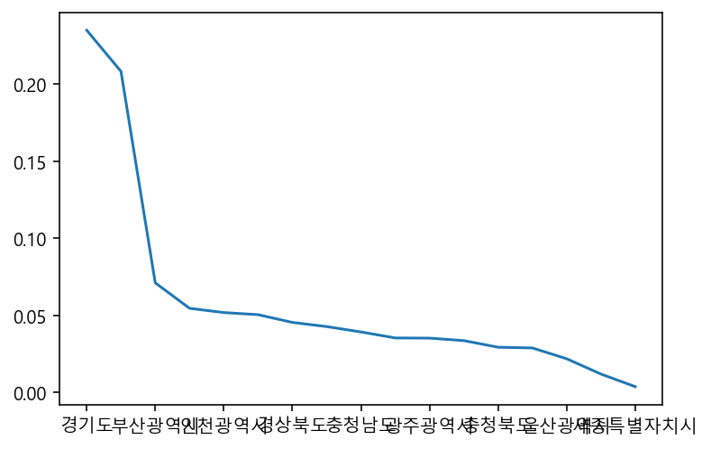
    


```python
city.plot.barh()
```


    <AxesSubplot:>


    
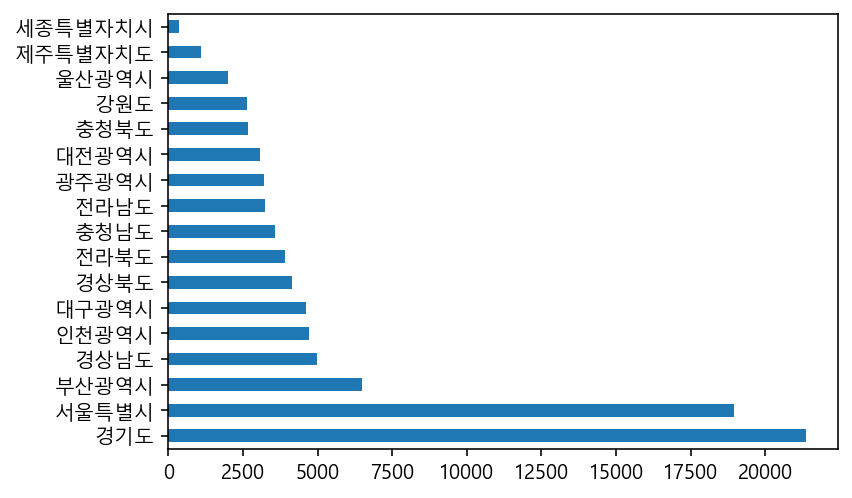
    


```python
city_normalize.plot.pie(figsize=(7,7))
```

    C:\Users\cityo\anaconda3\lib\site-packages\pandas\plotting\_matplotlib\core.py:1583: MatplotlibDeprecationWarning: normalize=None does not normalize if the sum is less than 1 but this behavior is deprecated since 3.3 until two minor releases later. After the deprecation period the default value will be normalize=True. To prevent normalization pass normalize=False 
      results = ax.pie(y, labels=blabels, **kwds)
    


    <AxesSubplot:ylabel='시도명'>


    
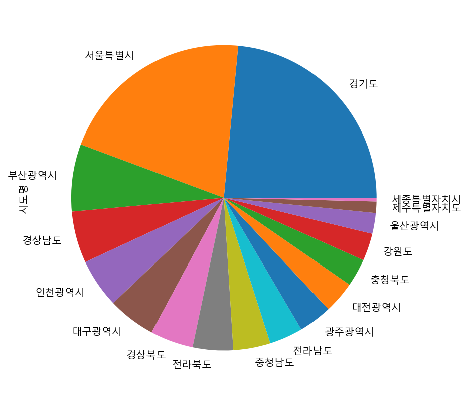
    


```python
#seaborn ,sns
c= sns.countplot(data=df, y='시도명' ) #변수명으로 담아주면 설명이 출력 안됌
```


    
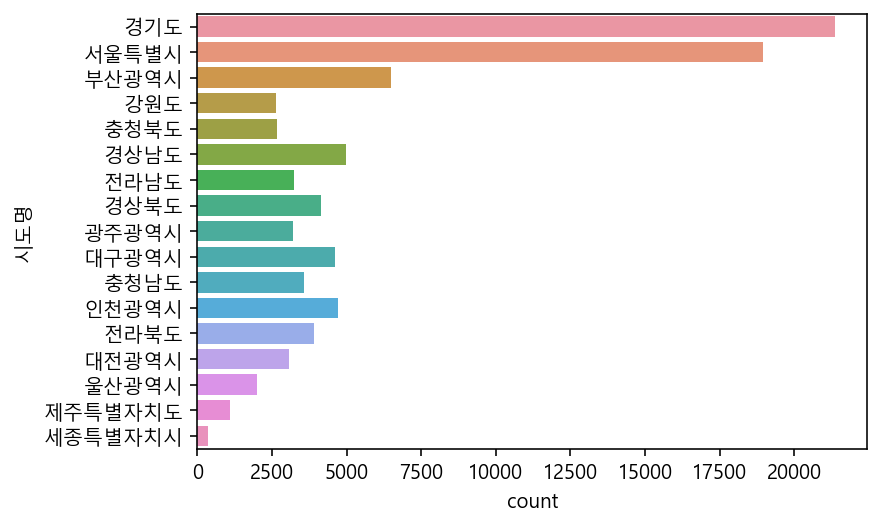
    


```python
df['상권업종대분류명'].value_counts()
```


    의료    91335
    Name: 상권업종대분류명, dtype: int64


```python
n=df['상권업종중분류명'].value_counts(normalize=True)
```


```python
n.plot.bar(rot=0) #rot=0:글자세워주기
```


    <AxesSubplot:>


    
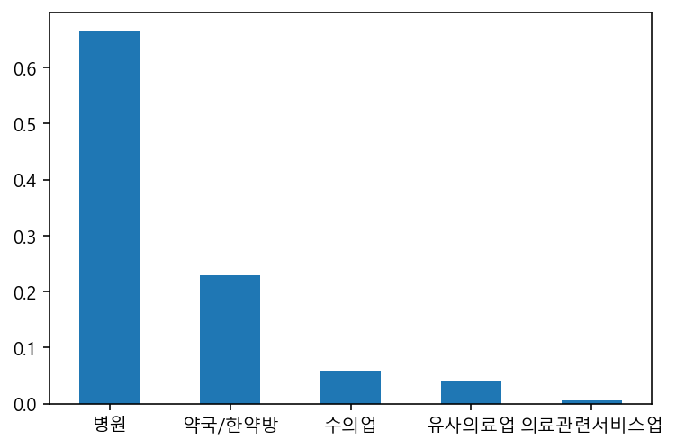
    


```python
n.plot.pie()
```


    <AxesSubplot:ylabel='상권업종중분류명'>


    
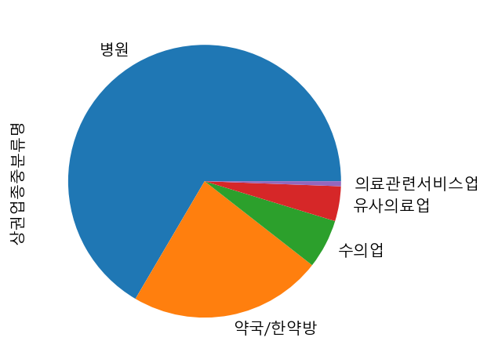
    


```python
df['상권업종소분류명'].value_counts(normalize=True)
```


    약국         0.207631
    치과의원       0.150337
    한의원        0.144643
    내과/외과      0.124531
    기타병원       0.053890
    일반병원       0.037061
    동물병원       0.033919
    정형/성형외과    0.028051
    소아과        0.027065
    수의업-종합     0.024262
    치과기공소      0.018876
    이비인후과의원    0.016270
    한약방        0.015788
    피부과        0.013938
    산부인과       0.012219
    노인/치매병원    0.011551
    안과의원       0.011409
    비뇨기과       0.008858
    종합병원       0.008343
    치과병원       0.008277
    언어치료       0.007270
    유사의료업기타    0.006887
    탕제원        0.005660
    산후조리원      0.005595
    신경외과       0.004609
    한방병원       0.004347
    척추교정치료     0.003701
    침구원        0.001686
    혈액원        0.001423
    응급구조대      0.001369
    조산원        0.000328
    수의업-기타     0.000099
    접골원        0.000099
    제대혈        0.000011
    Name: 상권업종소분류명, dtype: float64


```python
xy=df['상권업종소분류명'].value_counts()
```


```python
xy.plot.barh(figsize=(7,9),grid=True)
```


    <AxesSubplot:>


    
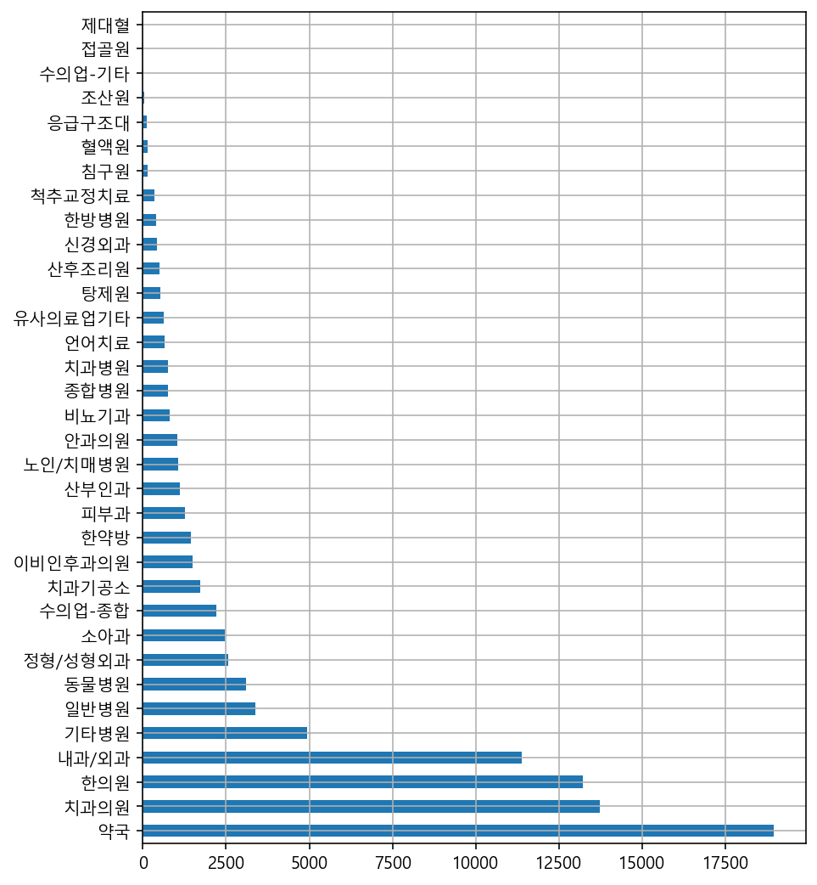
    


## 데이터 색인하기


```python
df_medical=df[df['상권업종중분류명'] == '약국/한약방'].copy()
df_medical
```


<div>
<style scoped>
    .dataframe tbody tr th:only-of-type {
        vertical-align: middle;
    }

    .dataframe tbody tr th {
        vertical-align: top;
    }

    .dataframe thead th {
        text-align: right;
    }
</style>
<table border="1" class="dataframe">
  <thead>
    <tr style="text-align: right;">
      <th></th>
      <th>상가업소번호</th>
      <th>상호명</th>
      <th>상권업종대분류코드</th>
      <th>상권업종대분류명</th>
      <th>상권업종중분류코드</th>
      <th>상권업종중분류명</th>
      <th>상권업종소분류코드</th>
      <th>상권업종소분류명</th>
      <th>시도명</th>
      <th>시군구코드</th>
      <th>...</th>
      <th>지번주소</th>
      <th>도로명코드</th>
      <th>도로명</th>
      <th>건물본번지</th>
      <th>건물관리번호</th>
      <th>도로명주소</th>
      <th>구우편번호</th>
      <th>신우편번호</th>
      <th>경도</th>
      <th>위도</th>
    </tr>
  </thead>
  <tbody>
    <tr>
      <th>4</th>
      <td>20364049</td>
      <td>더블유스토어수지점</td>
      <td>S</td>
      <td>의료</td>
      <td>S02</td>
      <td>약국/한약방</td>
      <td>S02A01</td>
      <td>약국</td>
      <td>경기도</td>
      <td>41465.0</td>
      <td>...</td>
      <td>경기도 용인시 수지구 풍덕천동 712-2</td>
      <td>414653205024</td>
      <td>경기도 용인시 수지구 문정로</td>
      <td>32</td>
      <td>4146510100107120002026238</td>
      <td>경기도 용인시 수지구 문정로 32</td>
      <td>448170.0</td>
      <td>16837.0</td>
      <td>127.095522</td>
      <td>37.323528</td>
    </tr>
    <tr>
      <th>6</th>
      <td>20733252</td>
      <td>춘산한약방</td>
      <td>S</td>
      <td>의료</td>
      <td>S02</td>
      <td>약국/한약방</td>
      <td>S02A02</td>
      <td>한약방</td>
      <td>강원도</td>
      <td>42110.0</td>
      <td>...</td>
      <td>강원도 춘천시 중앙로2가 99</td>
      <td>421104454113</td>
      <td>강원도 춘천시 낙원길</td>
      <td>50</td>
      <td>4211010500101000000023668</td>
      <td>강원도 춘천시 낙원길 50</td>
      <td>200042.0</td>
      <td>24273.0</td>
      <td>127.726905</td>
      <td>37.880504</td>
    </tr>
    <tr>
      <th>7</th>
      <td>20582210</td>
      <td>부부탕제원</td>
      <td>S</td>
      <td>의료</td>
      <td>S02</td>
      <td>약국/한약방</td>
      <td>S02A03</td>
      <td>탕제원</td>
      <td>충청북도</td>
      <td>43111.0</td>
      <td>...</td>
      <td>충청북도 청주시 상당구 금천동 187-17</td>
      <td>431114508623</td>
      <td>충청북도 청주시 상당구 중고개로337번길</td>
      <td>134</td>
      <td>4311112000101870017042942</td>
      <td>충청북도 청주시 상당구 중고개로337번길 134</td>
      <td>360802.0</td>
      <td>28726.0</td>
      <td>127.499206</td>
      <td>36.625355</td>
    </tr>
    <tr>
      <th>10</th>
      <td>21057519</td>
      <td>민생약국</td>
      <td>S</td>
      <td>의료</td>
      <td>S02</td>
      <td>약국/한약방</td>
      <td>S02A01</td>
      <td>약국</td>
      <td>경상남도</td>
      <td>48890.0</td>
      <td>...</td>
      <td>경상남도 합천군 용주면 월평리 78-2</td>
      <td>488904844473</td>
      <td>경상남도 합천군 용주면 월평길</td>
      <td>149</td>
      <td>4889046030200780002048274</td>
      <td>경상남도 합천군 용주면 월평길 149-35</td>
      <td>678912.0</td>
      <td>50212.0</td>
      <td>128.118615</td>
      <td>35.575962</td>
    </tr>
    <tr>
      <th>13</th>
      <td>21217689</td>
      <td>제중당한약방</td>
      <td>S</td>
      <td>의료</td>
      <td>S02</td>
      <td>약국/한약방</td>
      <td>S02A02</td>
      <td>한약방</td>
      <td>전라남도</td>
      <td>46830.0</td>
      <td>...</td>
      <td>전라남도 영암군 도포면 덕화리 296</td>
      <td>468304685396</td>
      <td>전라남도 영암군 도포면 인덕길</td>
      <td>75</td>
      <td>4683035023102960000000001</td>
      <td>전라남도 영암군 도포면 인덕길 75-10</td>
      <td>526832.0</td>
      <td>58429.0</td>
      <td>126.630348</td>
      <td>34.834080</td>
    </tr>
    <tr>
      <th>...</th>
      <td>...</td>
      <td>...</td>
      <td>...</td>
      <td>...</td>
      <td>...</td>
      <td>...</td>
      <td>...</td>
      <td>...</td>
      <td>...</td>
      <td>...</td>
      <td>...</td>
      <td>...</td>
      <td>...</td>
      <td>...</td>
      <td>...</td>
      <td>...</td>
      <td>...</td>
      <td>...</td>
      <td>...</td>
      <td>...</td>
      <td>...</td>
    </tr>
    <tr>
      <th>91312</th>
      <td>16131397</td>
      <td>큰나무약국</td>
      <td>S</td>
      <td>의료</td>
      <td>S02</td>
      <td>약국/한약방</td>
      <td>S02A01</td>
      <td>약국</td>
      <td>경기도</td>
      <td>41281.0</td>
      <td>...</td>
      <td>경기도 고양시 덕양구 성사동 700-11</td>
      <td>412812192001</td>
      <td>경기도 고양시 덕양구 고양대로</td>
      <td>1361</td>
      <td>4128110600107000011013834</td>
      <td>경기도 고양시 덕양구 고양대로 1361</td>
      <td>412807.0</td>
      <td>10464.0</td>
      <td>126.835684</td>
      <td>37.655048</td>
    </tr>
    <tr>
      <th>91321</th>
      <td>16130841</td>
      <td>복음약국</td>
      <td>S</td>
      <td>의료</td>
      <td>S02</td>
      <td>약국/한약방</td>
      <td>S02A01</td>
      <td>약국</td>
      <td>대구광역시</td>
      <td>27290.0</td>
      <td>...</td>
      <td>대구광역시 달서구 본동 276</td>
      <td>272904241030</td>
      <td>대구광역시 달서구 구마로36길</td>
      <td>33</td>
      <td>2729012400102760000029818</td>
      <td>대구광역시 달서구 구마로36길 33</td>
      <td>704752.0</td>
      <td>42735.0</td>
      <td>128.547352</td>
      <td>35.836250</td>
    </tr>
    <tr>
      <th>91322</th>
      <td>16091491</td>
      <td>설연화한복감성약방</td>
      <td>S</td>
      <td>의료</td>
      <td>S02</td>
      <td>약국/한약방</td>
      <td>S02A01</td>
      <td>약국</td>
      <td>서울특별시</td>
      <td>11260.0</td>
      <td>...</td>
      <td>서울특별시 중랑구 묵동 174-1</td>
      <td>112603005050</td>
      <td>서울특별시 중랑구 공릉로</td>
      <td>28</td>
      <td>1126010400101740001009985</td>
      <td>서울특별시 중랑구 공릉로 28</td>
      <td>131848.0</td>
      <td>2034.0</td>
      <td>127.078082</td>
      <td>37.613194</td>
    </tr>
    <tr>
      <th>91324</th>
      <td>16109731</td>
      <td>위례수약국</td>
      <td>S</td>
      <td>의료</td>
      <td>S02</td>
      <td>약국/한약방</td>
      <td>S02A01</td>
      <td>약국</td>
      <td>경기도</td>
      <td>41131.0</td>
      <td>...</td>
      <td>경기도 성남시 수정구 창곡동 559-4</td>
      <td>411313350738</td>
      <td>경기도 성남시 수정구 위례서일로</td>
      <td>18</td>
      <td>4113110800101810002000002</td>
      <td>경기도 성남시 수정구 위례서일로 18</td>
      <td>461210.0</td>
      <td>13647.0</td>
      <td>127.137870</td>
      <td>37.465260</td>
    </tr>
    <tr>
      <th>91330</th>
      <td>16196725</td>
      <td>온누리약국</td>
      <td>S</td>
      <td>의료</td>
      <td>S02</td>
      <td>약국/한약방</td>
      <td>S02A01</td>
      <td>약국</td>
      <td>대전광역시</td>
      <td>30170.0</td>
      <td>...</td>
      <td>대전광역시 서구 둔산동 1507</td>
      <td>301703166026</td>
      <td>대전광역시 서구 문예로</td>
      <td>67</td>
      <td>3017011200115070000021096</td>
      <td>대전광역시 서구 문예로 67</td>
      <td>302831.0</td>
      <td>35240.0</td>
      <td>127.389865</td>
      <td>36.352728</td>
    </tr>
  </tbody>
</table>
<p>20923 rows × 29 columns</p>
</div>


```python
df_medical.head(1)
```


<div>
<style scoped>
    .dataframe tbody tr th:only-of-type {
        vertical-align: middle;
    }

    .dataframe tbody tr th {
        vertical-align: top;
    }

    .dataframe thead th {
        text-align: right;
    }
</style>
<table border="1" class="dataframe">
  <thead>
    <tr style="text-align: right;">
      <th></th>
      <th>상가업소번호</th>
      <th>상호명</th>
      <th>상권업종대분류코드</th>
      <th>상권업종대분류명</th>
      <th>상권업종중분류코드</th>
      <th>상권업종중분류명</th>
      <th>상권업종소분류코드</th>
      <th>상권업종소분류명</th>
      <th>시도명</th>
      <th>시군구코드</th>
      <th>...</th>
      <th>지번주소</th>
      <th>도로명코드</th>
      <th>도로명</th>
      <th>건물본번지</th>
      <th>건물관리번호</th>
      <th>도로명주소</th>
      <th>구우편번호</th>
      <th>신우편번호</th>
      <th>경도</th>
      <th>위도</th>
    </tr>
  </thead>
  <tbody>
    <tr>
      <th>4</th>
      <td>20364049</td>
      <td>더블유스토어수지점</td>
      <td>S</td>
      <td>의료</td>
      <td>S02</td>
      <td>약국/한약방</td>
      <td>S02A01</td>
      <td>약국</td>
      <td>경기도</td>
      <td>41465.0</td>
      <td>...</td>
      <td>경기도 용인시 수지구 풍덕천동 712-2</td>
      <td>414653205024</td>
      <td>경기도 용인시 수지구 문정로</td>
      <td>32</td>
      <td>4146510100107120002026238</td>
      <td>경기도 용인시 수지구 문정로 32</td>
      <td>448170.0</td>
      <td>16837.0</td>
      <td>127.095522</td>
      <td>37.323528</td>
    </tr>
  </tbody>
</table>
<p>1 rows × 29 columns</p>
</div>


```python
m=df['상권업종대분류명'] == '의료'
df.loc[m,'상권업종중분류명'].value_counts()
```


    병원          60774
    약국/한약방      20923
    수의업          5323
    유사의료업        3774
    의료관련서비스업      541
    Name: 상권업종중분류명, dtype: int64


```python
df_medi=df[df['상권업종중분류명']== '유사의료업']#행렬수 보여준다.
df_medi.shape
```


    (3774, 29)


```python
df['상호명'].value_counts().head()
```


    리원       152
    온누리약국    149
    경희한의원    141
    우리약국     119
    중앙약국     111
    Name: 상호명, dtype: int64


```python
df['상호명'].value_counts().tail(10)
```


    장신경.정신과        1
    이정엽성형외과        1
    중산참사랑약국        1
    성모곰돌이소아청소년과    1
    정부권소아청소년과의원    1
    와우성형외과의원       1
    한강약국           1
    태성동물병원         1
    정학송신경정신과의원     1
    해운대동물메디컬센터     1
    Name: 상호명, dtype: int64


```python
df_medi['상호명'].value_counts().head(10) #유사의료업만.
```


    리원          32
    고려수지침       22
    대한적십자사      17
    헌혈의집        12
    고려수지침학회     10
    수치과기공소      10
    제일치과기공소      9
    아트치과기공소      8
    어울림치과기공소     8
    이사랑치과기공소     8
    Name: 상호명, dtype: int64


## 여러 조건으로 색인하기


```python
(df['상권업종소분류명']=='약국') & (df['시도명']=='서울특별시')
```


    0        False
    1        False
    2        False
    3        False
    4        False
             ...  
    91330    False
    91331    False
    91332    False
    91333    False
    91334    False
    Length: 91335, dtype: bool


```python
df_seoul_drug=df[(df['상권업종소분류명']=='약국') & (df['시도명']=='서울특별시')]
print(df_seoul_drug.shape) #print 구문을 사용하면 아래와 함께 두개의 데이터 출력가능
df_seoul_drug.head()
```

    (3579, 29)
    


<div>
<style scoped>
    .dataframe tbody tr th:only-of-type {
        vertical-align: middle;
    }

    .dataframe tbody tr th {
        vertical-align: top;
    }

    .dataframe thead th {
        text-align: right;
    }
</style>
<table border="1" class="dataframe">
  <thead>
    <tr style="text-align: right;">
      <th></th>
      <th>상가업소번호</th>
      <th>상호명</th>
      <th>상권업종대분류코드</th>
      <th>상권업종대분류명</th>
      <th>상권업종중분류코드</th>
      <th>상권업종중분류명</th>
      <th>상권업종소분류코드</th>
      <th>상권업종소분류명</th>
      <th>시도명</th>
      <th>시군구코드</th>
      <th>...</th>
      <th>지번주소</th>
      <th>도로명코드</th>
      <th>도로명</th>
      <th>건물본번지</th>
      <th>건물관리번호</th>
      <th>도로명주소</th>
      <th>구우편번호</th>
      <th>신우편번호</th>
      <th>경도</th>
      <th>위도</th>
    </tr>
  </thead>
  <tbody>
    <tr>
      <th>33</th>
      <td>20816709</td>
      <td>이즈타워약</td>
      <td>S</td>
      <td>의료</td>
      <td>S02</td>
      <td>약국/한약방</td>
      <td>S02A01</td>
      <td>약국</td>
      <td>서울특별시</td>
      <td>11680.0</td>
      <td>...</td>
      <td>서울특별시 강남구 역삼동 821</td>
      <td>116803122010</td>
      <td>서울특별시 강남구 테헤란로</td>
      <td>101</td>
      <td>1168010100108210001000001</td>
      <td>서울특별시 강남구 테헤란로 101</td>
      <td>135080.0</td>
      <td>6134.0</td>
      <td>127.028023</td>
      <td>37.498656</td>
    </tr>
    <tr>
      <th>51</th>
      <td>20855710</td>
      <td>진흥약국</td>
      <td>S</td>
      <td>의료</td>
      <td>S02</td>
      <td>약국/한약방</td>
      <td>S02A01</td>
      <td>약국</td>
      <td>서울특별시</td>
      <td>11740.0</td>
      <td>...</td>
      <td>서울특별시 강동구 둔촌동 630</td>
      <td>117403124002</td>
      <td>서울특별시 강동구 명일로</td>
      <td>172</td>
      <td>1174010600106090000000001</td>
      <td>서울특별시 강동구 명일로 172</td>
      <td>134767.0</td>
      <td>5360.0</td>
      <td>127.145055</td>
      <td>37.534135</td>
    </tr>
    <tr>
      <th>130</th>
      <td>21589838</td>
      <td>신세계약국</td>
      <td>S</td>
      <td>의료</td>
      <td>S02</td>
      <td>약국/한약방</td>
      <td>S02A01</td>
      <td>약국</td>
      <td>서울특별시</td>
      <td>11260.0</td>
      <td>...</td>
      <td>서울특별시 중랑구 신내동 646</td>
      <td>112603106007</td>
      <td>서울특별시 중랑구 신내로</td>
      <td>211</td>
      <td>1126010600106460000000300</td>
      <td>서울특별시 중랑구 신내로 211</td>
      <td>131130.0</td>
      <td>2024.0</td>
      <td>127.092597</td>
      <td>37.616424</td>
    </tr>
    <tr>
      <th>136</th>
      <td>22388303</td>
      <td>메디팜한솔약국</td>
      <td>S</td>
      <td>의료</td>
      <td>S02</td>
      <td>약국/한약방</td>
      <td>S02A01</td>
      <td>약국</td>
      <td>서울특별시</td>
      <td>11200.0</td>
      <td>...</td>
      <td>서울특별시 성동구 행당동 346</td>
      <td>112003103006</td>
      <td>서울특별시 성동구 행당로</td>
      <td>82</td>
      <td>1120010700103460012016935</td>
      <td>서울특별시 성동구 행당로 82</td>
      <td>133777.0</td>
      <td>4717.0</td>
      <td>127.027513</td>
      <td>37.556238</td>
    </tr>
    <tr>
      <th>141</th>
      <td>22412563</td>
      <td>명약국</td>
      <td>S</td>
      <td>의료</td>
      <td>S02</td>
      <td>약국/한약방</td>
      <td>S02A01</td>
      <td>약국</td>
      <td>서울특별시</td>
      <td>11230.0</td>
      <td>...</td>
      <td>서울특별시 동대문구 휘경동 286-121</td>
      <td>112304115120</td>
      <td>서울특별시 동대문구 망우로18나길</td>
      <td>3</td>
      <td>1123010900102860121007257</td>
      <td>서울특별시 동대문구 망우로18나길 3</td>
      <td>130090.0</td>
      <td>2498.0</td>
      <td>127.060556</td>
      <td>37.587349</td>
    </tr>
  </tbody>
</table>
<p>5 rows × 29 columns</p>
</div>


```python
c=df_seoul_drug['시군구명'].value_counts()
c.head()
```


    강남구     374
    동대문구    261
    광진구     212
    서초구     191
    송파구     188
    Name: 시군구명, dtype: int64


```python
df_seoul_drug['시군구명'].value_counts(normalize=True)
```


    강남구     0.104498
    동대문구    0.072925
    광진구     0.059234
    서초구     0.053367
    송파구     0.052529
    노원구     0.047220
    성북구     0.044705
    은평구     0.042191
    영등포구    0.040514
    마포구     0.037999
    강서구     0.037999
    중랑구     0.036044
    서대문구    0.033529
    관악구     0.032970
    강동구     0.032691
    종로구     0.031014
    양천구     0.030455
    중구      0.029617
    강북구     0.029058
    구로구     0.028500
    동작구     0.026823
    성동구     0.024588
    용산구     0.024308
    금천구     0.023750
    도봉구     0.023470
    Name: 시군구명, dtype: float64


```python
c.plot.bar(rot=60)
```


    <AxesSubplot:>


    
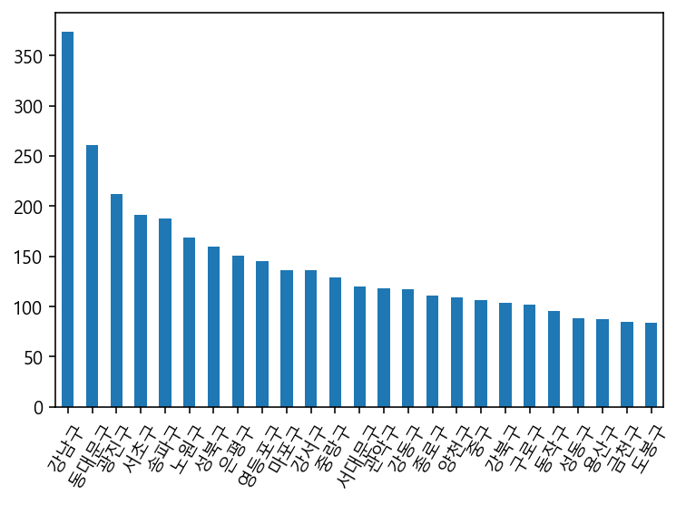
    


```python
df_seoul_hospital=df[(df['상권업종소분류명'] == '종합병원' ) &
                     (df['시도명']=='서울특별시')].copy()
df_seoul_hospital
```


<div>
<style scoped>
    .dataframe tbody tr th:only-of-type {
        vertical-align: middle;
    }

    .dataframe tbody tr th {
        vertical-align: top;
    }

    .dataframe thead th {
        text-align: right;
    }
</style>
<table border="1" class="dataframe">
  <thead>
    <tr style="text-align: right;">
      <th></th>
      <th>상가업소번호</th>
      <th>상호명</th>
      <th>상권업종대분류코드</th>
      <th>상권업종대분류명</th>
      <th>상권업종중분류코드</th>
      <th>상권업종중분류명</th>
      <th>상권업종소분류코드</th>
      <th>상권업종소분류명</th>
      <th>시도명</th>
      <th>시군구코드</th>
      <th>...</th>
      <th>지번주소</th>
      <th>도로명코드</th>
      <th>도로명</th>
      <th>건물본번지</th>
      <th>건물관리번호</th>
      <th>도로명주소</th>
      <th>구우편번호</th>
      <th>신우편번호</th>
      <th>경도</th>
      <th>위도</th>
    </tr>
  </thead>
  <tbody>
    <tr>
      <th>305</th>
      <td>25155642</td>
      <td>대진의료재단</td>
      <td>S</td>
      <td>의료</td>
      <td>S01</td>
      <td>병원</td>
      <td>S01B01</td>
      <td>종합병원</td>
      <td>서울특별시</td>
      <td>11215.0</td>
      <td>...</td>
      <td>서울특별시 광진구 중곡동 58-25</td>
      <td>112153104006</td>
      <td>서울특별시 광진구 긴고랑로</td>
      <td>119</td>
      <td>1121510100100580025000733</td>
      <td>서울특별시 광진구 긴고랑로 119</td>
      <td>143220.0</td>
      <td>4944.0</td>
      <td>127.088279</td>
      <td>37.559048</td>
    </tr>
    <tr>
      <th>353</th>
      <td>20471487</td>
      <td>홍익병원별관</td>
      <td>S</td>
      <td>의료</td>
      <td>S01</td>
      <td>병원</td>
      <td>S01B01</td>
      <td>종합병원</td>
      <td>서울특별시</td>
      <td>11470.0</td>
      <td>...</td>
      <td>서울특별시 양천구 신정동 897-13</td>
      <td>114702005008</td>
      <td>서울특별시 양천구 국회대로</td>
      <td>250</td>
      <td>1147010100108970013001044</td>
      <td>서울특별시 양천구 국회대로 250</td>
      <td>158070.0</td>
      <td>7937.0</td>
      <td>126.862805</td>
      <td>37.529213</td>
    </tr>
    <tr>
      <th>385</th>
      <td>20737057</td>
      <td>SNUH</td>
      <td>S</td>
      <td>의료</td>
      <td>S01</td>
      <td>병원</td>
      <td>S01B01</td>
      <td>종합병원</td>
      <td>서울특별시</td>
      <td>11680.0</td>
      <td>...</td>
      <td>서울특별시 강남구 역삼동 736-55</td>
      <td>116804166727</td>
      <td>서울특별시 강남구 테헤란로26길</td>
      <td>10</td>
      <td>1168010100107360055027688</td>
      <td>서울특별시 강남구 테헤란로26길 10</td>
      <td>135080.0</td>
      <td>6236.0</td>
      <td>127.035825</td>
      <td>37.499630</td>
    </tr>
    <tr>
      <th>1917</th>
      <td>23210677</td>
      <td>평화드림여의도성모병원의료기매장</td>
      <td>S</td>
      <td>의료</td>
      <td>S01</td>
      <td>병원</td>
      <td>S01B01</td>
      <td>종합병원</td>
      <td>서울특별시</td>
      <td>11560.0</td>
      <td>...</td>
      <td>서울특별시 영등포구 여의도동 62</td>
      <td>115603118001</td>
      <td>서울특별시 영등포구 63로</td>
      <td>10</td>
      <td>1156011000100620000031477</td>
      <td>서울특별시 영등포구 63로 10</td>
      <td>150713.0</td>
      <td>7345.0</td>
      <td>126.936693</td>
      <td>37.518296</td>
    </tr>
    <tr>
      <th>2461</th>
      <td>20024045</td>
      <td>한양</td>
      <td>S</td>
      <td>의료</td>
      <td>S01</td>
      <td>병원</td>
      <td>S01B01</td>
      <td>종합병원</td>
      <td>서울특별시</td>
      <td>11200.0</td>
      <td>...</td>
      <td>서울특별시 성동구 행당동 15-1</td>
      <td>112003103002</td>
      <td>서울특별시 성동구 마조로</td>
      <td>22</td>
      <td>1120010700100150001019623</td>
      <td>서울특별시 성동구 마조로 22-2</td>
      <td>133070.0</td>
      <td>4763.0</td>
      <td>127.041325</td>
      <td>37.559469</td>
    </tr>
    <tr>
      <th>...</th>
      <td>...</td>
      <td>...</td>
      <td>...</td>
      <td>...</td>
      <td>...</td>
      <td>...</td>
      <td>...</td>
      <td>...</td>
      <td>...</td>
      <td>...</td>
      <td>...</td>
      <td>...</td>
      <td>...</td>
      <td>...</td>
      <td>...</td>
      <td>...</td>
      <td>...</td>
      <td>...</td>
      <td>...</td>
      <td>...</td>
      <td>...</td>
    </tr>
    <tr>
      <th>71991</th>
      <td>28505952</td>
      <td>서울성모병원응급의료센터</td>
      <td>S</td>
      <td>의료</td>
      <td>S01</td>
      <td>병원</td>
      <td>S01B01</td>
      <td>종합병원</td>
      <td>서울특별시</td>
      <td>11650.0</td>
      <td>...</td>
      <td>서울특별시 서초구 반포동 505</td>
      <td>116502121003</td>
      <td>서울특별시 서초구 반포대로</td>
      <td>222</td>
      <td>1165010700101230000017226</td>
      <td>서울특별시 서초구 반포대로 222</td>
      <td>137701.0</td>
      <td>6591.0</td>
      <td>127.005841</td>
      <td>37.502382</td>
    </tr>
    <tr>
      <th>76508</th>
      <td>12292992</td>
      <td>라마르의원</td>
      <td>S</td>
      <td>의료</td>
      <td>S01</td>
      <td>병원</td>
      <td>S01B01</td>
      <td>종합병원</td>
      <td>서울특별시</td>
      <td>11740.0</td>
      <td>...</td>
      <td>서울특별시 강동구 천호동 453-8</td>
      <td>117404172367</td>
      <td>서울특별시 강동구 천호대로157길</td>
      <td>18</td>
      <td>1174010900104530021010314</td>
      <td>서울특별시 강동구 천호대로157길 18</td>
      <td>134864.0</td>
      <td>5335.0</td>
      <td>127.127466</td>
      <td>37.538485</td>
    </tr>
    <tr>
      <th>90492</th>
      <td>16031909</td>
      <td>가톨릭대학교여의도성모병원</td>
      <td>S</td>
      <td>의료</td>
      <td>S01</td>
      <td>병원</td>
      <td>S01B01</td>
      <td>종합병원</td>
      <td>서울특별시</td>
      <td>11140.0</td>
      <td>...</td>
      <td>서울특별시 중구 명동2가 1-1</td>
      <td>111404103165</td>
      <td>서울특별시 중구 명동길</td>
      <td>74</td>
      <td>1114012700100010001019574</td>
      <td>서울특별시 중구 명동길 74</td>
      <td>100809.0</td>
      <td>4537.0</td>
      <td>126.986758</td>
      <td>37.563662</td>
    </tr>
    <tr>
      <th>90581</th>
      <td>16332576</td>
      <td>씨엠병원</td>
      <td>S</td>
      <td>의료</td>
      <td>S01</td>
      <td>병원</td>
      <td>S01B01</td>
      <td>종합병원</td>
      <td>서울특별시</td>
      <td>11560.0</td>
      <td>...</td>
      <td>서울특별시 영등포구 영등포동4가 90</td>
      <td>115604154717</td>
      <td>서울특별시 영등포구 영등포로36길</td>
      <td>13</td>
      <td>1156010500100900000035097</td>
      <td>서울특별시 영등포구 영등포로36길 13</td>
      <td>150030.0</td>
      <td>7301.0</td>
      <td>126.903857</td>
      <td>37.518807</td>
    </tr>
    <tr>
      <th>90788</th>
      <td>16162338</td>
      <td>성베드로병원</td>
      <td>S</td>
      <td>의료</td>
      <td>S01</td>
      <td>병원</td>
      <td>S01B01</td>
      <td>종합병원</td>
      <td>서울특별시</td>
      <td>11680.0</td>
      <td>...</td>
      <td>서울특별시 강남구 도곡동 910-27</td>
      <td>116802000003</td>
      <td>서울특별시 강남구 남부순환로</td>
      <td>2649</td>
      <td>1168011800109100027000895</td>
      <td>서울특별시 강남구 남부순환로 2649</td>
      <td>135859.0</td>
      <td>6271.0</td>
      <td>127.039567</td>
      <td>37.485604</td>
    </tr>
  </tbody>
</table>
<p>91 rows × 29 columns</p>
</div>


```python
df_seoul_hospital['시군구명'].value_counts()
```


    강남구     15
    영등포구     8
    광진구      6
    서초구      6
    송파구      5
    강동구      5
    중구       5
    서대문구     4
    양천구      4
    강북구      4
    도봉구      4
    성북구      3
    강서구      2
    동대문구     2
    종로구      2
    관악구      2
    구로구      2
    성동구      2
    금천구      2
    중랑구      2
    노원구      2
    마포구      1
    동작구      1
    은평구      1
    용산구      1
    Name: 시군구명, dtype: int64


## 텍스트 데이터 색인하기


```python
#색인하기 전에 상호명 중에 종합병원이 아닌 데이터를 찾아본다.
df_seoul_hospital['상호명'].str.contains('종합병원')
```


    305      False
    353      False
    385      False
    1917     False
    2461     False
             ...  
    71991    False
    76508    False
    90492    False
    90581    False
    90788    False
    Name: 상호명, Length: 91, dtype: bool


```python
~df_seoul_hospital['상호명'].str.contains('종합병원') # ~ 표시는 반대의경우를 가져온다.
```


    305      True
    353      True
    385      True
    1917     True
    2461     True
             ... 
    71991    True
    76508    True
    90492    True
    90581    True
    90788    True
    Name: 상호명, Length: 91, dtype: bool


```python
df_seoul_hospital[~df_seoul_hospital['상호명'].str.contains('종합병원')] # ~ 표시는 반대의경우를 가져온다.
#종합병원이라는 텍스트가 안들어간 데이터경우
```


<div>
<style scoped>
    .dataframe tbody tr th:only-of-type {
        vertical-align: middle;
    }

    .dataframe tbody tr th {
        vertical-align: top;
    }

    .dataframe thead th {
        text-align: right;
    }
</style>
<table border="1" class="dataframe">
  <thead>
    <tr style="text-align: right;">
      <th></th>
      <th>상가업소번호</th>
      <th>상호명</th>
      <th>상권업종대분류코드</th>
      <th>상권업종대분류명</th>
      <th>상권업종중분류코드</th>
      <th>상권업종중분류명</th>
      <th>상권업종소분류코드</th>
      <th>상권업종소분류명</th>
      <th>시도명</th>
      <th>시군구코드</th>
      <th>...</th>
      <th>지번주소</th>
      <th>도로명코드</th>
      <th>도로명</th>
      <th>건물본번지</th>
      <th>건물관리번호</th>
      <th>도로명주소</th>
      <th>구우편번호</th>
      <th>신우편번호</th>
      <th>경도</th>
      <th>위도</th>
    </tr>
  </thead>
  <tbody>
    <tr>
      <th>305</th>
      <td>25155642</td>
      <td>대진의료재단</td>
      <td>S</td>
      <td>의료</td>
      <td>S01</td>
      <td>병원</td>
      <td>S01B01</td>
      <td>종합병원</td>
      <td>서울특별시</td>
      <td>11215.0</td>
      <td>...</td>
      <td>서울특별시 광진구 중곡동 58-25</td>
      <td>112153104006</td>
      <td>서울특별시 광진구 긴고랑로</td>
      <td>119</td>
      <td>1121510100100580025000733</td>
      <td>서울특별시 광진구 긴고랑로 119</td>
      <td>143220.0</td>
      <td>4944.0</td>
      <td>127.088279</td>
      <td>37.559048</td>
    </tr>
    <tr>
      <th>353</th>
      <td>20471487</td>
      <td>홍익병원별관</td>
      <td>S</td>
      <td>의료</td>
      <td>S01</td>
      <td>병원</td>
      <td>S01B01</td>
      <td>종합병원</td>
      <td>서울특별시</td>
      <td>11470.0</td>
      <td>...</td>
      <td>서울특별시 양천구 신정동 897-13</td>
      <td>114702005008</td>
      <td>서울특별시 양천구 국회대로</td>
      <td>250</td>
      <td>1147010100108970013001044</td>
      <td>서울특별시 양천구 국회대로 250</td>
      <td>158070.0</td>
      <td>7937.0</td>
      <td>126.862805</td>
      <td>37.529213</td>
    </tr>
    <tr>
      <th>385</th>
      <td>20737057</td>
      <td>SNUH</td>
      <td>S</td>
      <td>의료</td>
      <td>S01</td>
      <td>병원</td>
      <td>S01B01</td>
      <td>종합병원</td>
      <td>서울특별시</td>
      <td>11680.0</td>
      <td>...</td>
      <td>서울특별시 강남구 역삼동 736-55</td>
      <td>116804166727</td>
      <td>서울특별시 강남구 테헤란로26길</td>
      <td>10</td>
      <td>1168010100107360055027688</td>
      <td>서울특별시 강남구 테헤란로26길 10</td>
      <td>135080.0</td>
      <td>6236.0</td>
      <td>127.035825</td>
      <td>37.499630</td>
    </tr>
    <tr>
      <th>1917</th>
      <td>23210677</td>
      <td>평화드림여의도성모병원의료기매장</td>
      <td>S</td>
      <td>의료</td>
      <td>S01</td>
      <td>병원</td>
      <td>S01B01</td>
      <td>종합병원</td>
      <td>서울특별시</td>
      <td>11560.0</td>
      <td>...</td>
      <td>서울특별시 영등포구 여의도동 62</td>
      <td>115603118001</td>
      <td>서울특별시 영등포구 63로</td>
      <td>10</td>
      <td>1156011000100620000031477</td>
      <td>서울특별시 영등포구 63로 10</td>
      <td>150713.0</td>
      <td>7345.0</td>
      <td>126.936693</td>
      <td>37.518296</td>
    </tr>
    <tr>
      <th>2461</th>
      <td>20024045</td>
      <td>한양</td>
      <td>S</td>
      <td>의료</td>
      <td>S01</td>
      <td>병원</td>
      <td>S01B01</td>
      <td>종합병원</td>
      <td>서울특별시</td>
      <td>11200.0</td>
      <td>...</td>
      <td>서울특별시 성동구 행당동 15-1</td>
      <td>112003103002</td>
      <td>서울특별시 성동구 마조로</td>
      <td>22</td>
      <td>1120010700100150001019623</td>
      <td>서울특별시 성동구 마조로 22-2</td>
      <td>133070.0</td>
      <td>4763.0</td>
      <td>127.041325</td>
      <td>37.559469</td>
    </tr>
    <tr>
      <th>...</th>
      <td>...</td>
      <td>...</td>
      <td>...</td>
      <td>...</td>
      <td>...</td>
      <td>...</td>
      <td>...</td>
      <td>...</td>
      <td>...</td>
      <td>...</td>
      <td>...</td>
      <td>...</td>
      <td>...</td>
      <td>...</td>
      <td>...</td>
      <td>...</td>
      <td>...</td>
      <td>...</td>
      <td>...</td>
      <td>...</td>
      <td>...</td>
    </tr>
    <tr>
      <th>71991</th>
      <td>28505952</td>
      <td>서울성모병원응급의료센터</td>
      <td>S</td>
      <td>의료</td>
      <td>S01</td>
      <td>병원</td>
      <td>S01B01</td>
      <td>종합병원</td>
      <td>서울특별시</td>
      <td>11650.0</td>
      <td>...</td>
      <td>서울특별시 서초구 반포동 505</td>
      <td>116502121003</td>
      <td>서울특별시 서초구 반포대로</td>
      <td>222</td>
      <td>1165010700101230000017226</td>
      <td>서울특별시 서초구 반포대로 222</td>
      <td>137701.0</td>
      <td>6591.0</td>
      <td>127.005841</td>
      <td>37.502382</td>
    </tr>
    <tr>
      <th>76508</th>
      <td>12292992</td>
      <td>라마르의원</td>
      <td>S</td>
      <td>의료</td>
      <td>S01</td>
      <td>병원</td>
      <td>S01B01</td>
      <td>종합병원</td>
      <td>서울특별시</td>
      <td>11740.0</td>
      <td>...</td>
      <td>서울특별시 강동구 천호동 453-8</td>
      <td>117404172367</td>
      <td>서울특별시 강동구 천호대로157길</td>
      <td>18</td>
      <td>1174010900104530021010314</td>
      <td>서울특별시 강동구 천호대로157길 18</td>
      <td>134864.0</td>
      <td>5335.0</td>
      <td>127.127466</td>
      <td>37.538485</td>
    </tr>
    <tr>
      <th>90492</th>
      <td>16031909</td>
      <td>가톨릭대학교여의도성모병원</td>
      <td>S</td>
      <td>의료</td>
      <td>S01</td>
      <td>병원</td>
      <td>S01B01</td>
      <td>종합병원</td>
      <td>서울특별시</td>
      <td>11140.0</td>
      <td>...</td>
      <td>서울특별시 중구 명동2가 1-1</td>
      <td>111404103165</td>
      <td>서울특별시 중구 명동길</td>
      <td>74</td>
      <td>1114012700100010001019574</td>
      <td>서울특별시 중구 명동길 74</td>
      <td>100809.0</td>
      <td>4537.0</td>
      <td>126.986758</td>
      <td>37.563662</td>
    </tr>
    <tr>
      <th>90581</th>
      <td>16332576</td>
      <td>씨엠병원</td>
      <td>S</td>
      <td>의료</td>
      <td>S01</td>
      <td>병원</td>
      <td>S01B01</td>
      <td>종합병원</td>
      <td>서울특별시</td>
      <td>11560.0</td>
      <td>...</td>
      <td>서울특별시 영등포구 영등포동4가 90</td>
      <td>115604154717</td>
      <td>서울특별시 영등포구 영등포로36길</td>
      <td>13</td>
      <td>1156010500100900000035097</td>
      <td>서울특별시 영등포구 영등포로36길 13</td>
      <td>150030.0</td>
      <td>7301.0</td>
      <td>126.903857</td>
      <td>37.518807</td>
    </tr>
    <tr>
      <th>90788</th>
      <td>16162338</td>
      <td>성베드로병원</td>
      <td>S</td>
      <td>의료</td>
      <td>S01</td>
      <td>병원</td>
      <td>S01B01</td>
      <td>종합병원</td>
      <td>서울특별시</td>
      <td>11680.0</td>
      <td>...</td>
      <td>서울특별시 강남구 도곡동 910-27</td>
      <td>116802000003</td>
      <td>서울특별시 강남구 남부순환로</td>
      <td>2649</td>
      <td>1168011800109100027000895</td>
      <td>서울특별시 강남구 남부순환로 2649</td>
      <td>135859.0</td>
      <td>6271.0</td>
      <td>127.039567</td>
      <td>37.485604</td>
    </tr>
  </tbody>
</table>
<p>91 rows × 29 columns</p>
</div>


```python
df_seoul_hospital.loc[~df_seoul_hospital['상호명'].str.contains('종합병원'),'상호명'].unique() # ~ 표시는 반대의경우를 가져온다.

```


    array(['대진의료재단', '홍익병원별관', 'SNUH', '평화드림여의도성모병원의료기매장', '한양', '백산의료재단친구병원',
           '서울보훈병원', '서울성모병원장례식장꽃배달', '서울대학교병원', '알콜중독및정신질환상담소',
           '강남성모병원장례식장꽃배달', '제일병원', '이랜드클리닉', '사랑나눔의료재단', '우울증센터', '성심의료재단',
           '다나의료재단', '서울아산병원신관', '원자력병원장례식장', '국민의원', '고려대학교구로병원', '학교법인일송학원',
           '삼성의료원장례식장', '희명스포츠의학센터인공신장실', '연세대학교의과대학강남세브란스', '국립정신병원',
           '코아클리닉', '수서제일의원', '사랑의의원', '한국전력공사부속한일병원', '신촌연세병원', '창동제일의원',
           '영동세브란스병원', '제일성심의원', '삼성의료재단강북삼성태', '서울시립보라매병원', '서울이의원',
           '서울대학교병원비상계획외래', '평화드림서울성모병원의료', '홍익병원', '사랑나눔의료재단서', '독일의원',
           '서울연합의원', '우신향병원', '동부제일병원', '아산재단금강병원', '명곡안연구소', '아산재단서울중앙병원',
           '메디힐특수여객', '삼성생명공익재단삼성서', '성광의료재단차병원', '한국건강관리협회서울특',
           '정해복지부설한신메디피아', '성베드로병원', '성애의료재단', '실로암의원', 'Y&T성모마취과', '광진성모의원',
           '서울현대의원', '이노신경과의원', '송정훼밀리의원', '서울중앙의원', '영남의료재단', '인제대학교서울백병원',
           '한국필의료재단', '세브란스의원', '가톨릭대학교성바오로병원장례식장', '서울연세의원', '사랑의병원',
           '성삼의료재단미즈메디병원', '씨엠충무병원', '성신의원', '원진재단부설녹색병원', '송파제일의원',
           '카톨릭성모의원', '한양성심의원', '관악성모의원', '강남센트럴병원', '우이한솔의원', '우리들병원',
           '서울성모병원어린이집', '건국대학교병원', '서울적십자병원', '북부성모의원', '한림대학교부속한강성심병원장례식장',
           '서울성모병원응급의료센터', '라마르의원', '가톨릭대학교여의도성모병원', '씨엠병원'], dtype=object)


## 필요없는 데이터 삭제하기


```python
df_seoul_hospital[df_seoul_hospital['상호명'].str.contains('꽃배달')]
# 텍스트 '꽃배달'을 포함하는 경우
```


<div>
<style scoped>
    .dataframe tbody tr th:only-of-type {
        vertical-align: middle;
    }

    .dataframe tbody tr th {
        vertical-align: top;
    }

    .dataframe thead th {
        text-align: right;
    }
</style>
<table border="1" class="dataframe">
  <thead>
    <tr style="text-align: right;">
      <th></th>
      <th>상가업소번호</th>
      <th>상호명</th>
      <th>상권업종대분류코드</th>
      <th>상권업종대분류명</th>
      <th>상권업종중분류코드</th>
      <th>상권업종중분류명</th>
      <th>상권업종소분류코드</th>
      <th>상권업종소분류명</th>
      <th>시도명</th>
      <th>시군구코드</th>
      <th>...</th>
      <th>지번주소</th>
      <th>도로명코드</th>
      <th>도로명</th>
      <th>건물본번지</th>
      <th>건물관리번호</th>
      <th>도로명주소</th>
      <th>구우편번호</th>
      <th>신우편번호</th>
      <th>경도</th>
      <th>위도</th>
    </tr>
  </thead>
  <tbody>
    <tr>
      <th>2803</th>
      <td>20895655</td>
      <td>서울성모병원장례식장꽃배달</td>
      <td>S</td>
      <td>의료</td>
      <td>S01</td>
      <td>병원</td>
      <td>S01B01</td>
      <td>종합병원</td>
      <td>서울특별시</td>
      <td>11650.0</td>
      <td>...</td>
      <td>서울특별시 서초구 반포동 551</td>
      <td>116504163330</td>
      <td>서울특별시 서초구 사평대로28길</td>
      <td>55</td>
      <td>1165010700105510000017194</td>
      <td>서울특별시 서초구 사평대로28길 55</td>
      <td>137040.0</td>
      <td>6578.0</td>
      <td>127.000682</td>
      <td>37.498257</td>
    </tr>
    <tr>
      <th>4644</th>
      <td>22020310</td>
      <td>강남성모병원장례식장꽃배달</td>
      <td>S</td>
      <td>의료</td>
      <td>S01</td>
      <td>병원</td>
      <td>S01B01</td>
      <td>종합병원</td>
      <td>서울특별시</td>
      <td>11650.0</td>
      <td>...</td>
      <td>서울특별시 서초구 반포동 547-6</td>
      <td>116504163242</td>
      <td>서울특별시 서초구 반포대로39길</td>
      <td>56</td>
      <td>1165010700105470006016762</td>
      <td>서울특별시 서초구 반포대로39길 56-24</td>
      <td>137040.0</td>
      <td>6578.0</td>
      <td>127.001756</td>
      <td>37.499095</td>
    </tr>
  </tbody>
</table>
<p>2 rows × 29 columns</p>
</div>


```python
df_seoul_hospital[df_seoul_hospital['상호명'].str.contains('의료기')]
```


<div>
<style scoped>
    .dataframe tbody tr th:only-of-type {
        vertical-align: middle;
    }

    .dataframe tbody tr th {
        vertical-align: top;
    }

    .dataframe thead th {
        text-align: right;
    }
</style>
<table border="1" class="dataframe">
  <thead>
    <tr style="text-align: right;">
      <th></th>
      <th>상가업소번호</th>
      <th>상호명</th>
      <th>상권업종대분류코드</th>
      <th>상권업종대분류명</th>
      <th>상권업종중분류코드</th>
      <th>상권업종중분류명</th>
      <th>상권업종소분류코드</th>
      <th>상권업종소분류명</th>
      <th>시도명</th>
      <th>시군구코드</th>
      <th>...</th>
      <th>지번주소</th>
      <th>도로명코드</th>
      <th>도로명</th>
      <th>건물본번지</th>
      <th>건물관리번호</th>
      <th>도로명주소</th>
      <th>구우편번호</th>
      <th>신우편번호</th>
      <th>경도</th>
      <th>위도</th>
    </tr>
  </thead>
  <tbody>
    <tr>
      <th>1917</th>
      <td>23210677</td>
      <td>평화드림여의도성모병원의료기매장</td>
      <td>S</td>
      <td>의료</td>
      <td>S01</td>
      <td>병원</td>
      <td>S01B01</td>
      <td>종합병원</td>
      <td>서울특별시</td>
      <td>11560.0</td>
      <td>...</td>
      <td>서울특별시 영등포구 여의도동 62</td>
      <td>115603118001</td>
      <td>서울특별시 영등포구 63로</td>
      <td>10</td>
      <td>1156011000100620000031477</td>
      <td>서울특별시 영등포구 63로 10</td>
      <td>150713.0</td>
      <td>7345.0</td>
      <td>126.936693</td>
      <td>37.518296</td>
    </tr>
  </tbody>
</table>
<p>1 rows × 29 columns</p>
</div>


```python
drop_row=df_seoul_hospital[df_seoul_hospital['상호명'].str.contains('꽃배달|의료기|장례식장|상담소|어린이집')].index
drop_row = drop_row.tolist()
drop_row
```


    [1917, 2803, 4431, 4644, 7938, 10283, 47008, 60645, 70177]


```python
drop_row2=df_seoul_hospital[df_seoul_hospital['상호명'].str.endswith('의원')].index
drop_row2=drop_row2.tolist()         #endwith = 특정단어를 찾아낼 수 있다.
drop_row2
```


    [8479,
     12854,
     13715,
     14966,
     16091,
     18047,
     20200,
     20415,
     30706,
     32889,
     34459,
     34720,
     35696,
     37251,
     45120,
     49626,
     51575,
     55133,
     56320,
     56404,
     56688,
     57551,
     62113,
     76508]


```python
drop_row=drop_row+drop_row2
len(drop_row)
```


    33


```python
print(df_seoul_hospital.shape)
df_seoul_hospital=df_seoul_hospital.drop(drop_row,axis=0) #인덱스는 행이라 0으로 삭제
print(df_seoul_hospital.shape)
```

    (91, 29)
    (58, 29)
    


```python
df_seoul_hospital['시군구명'].value_counts().plot.bar()
```


    <AxesSubplot:>


    
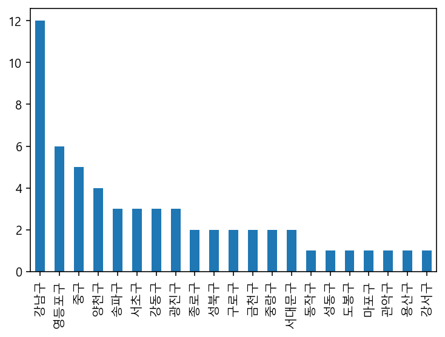
    


```python
plt.figure(figsize=(15,4))
sns.countplot(data=df_seoul_hospital, x='시군구명',order=df_seoul_hospital['시군구명'].value_counts().index)
# order = 큰 순위부터 그래프에 배치
```


    <AxesSubplot:xlabel='시군구명', ylabel='count'>


    
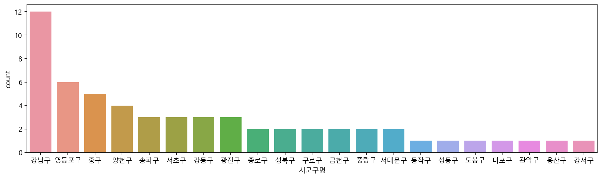
    


```python
df_seoul_hospital['상호명'].unique()
```


    array(['대진의료재단', '홍익병원별관', 'SNUH', '한양', '백산의료재단친구병원', '서울보훈병원',
           '서울대학교병원', '제일병원', '이랜드클리닉', '사랑나눔의료재단', '우울증센터', '성심의료재단',
           '다나의료재단', '서울아산병원신관', '고려대학교구로병원', '학교법인일송학원', '희명스포츠의학센터인공신장실',
           '연세대학교의과대학강남세브란스', '국립정신병원', '코아클리닉', '한국전력공사부속한일병원', '신촌연세병원',
           '영동세브란스병원', '삼성의료재단강북삼성태', '서울시립보라매병원', '서울대학교병원비상계획외래',
           '평화드림서울성모병원의료', '홍익병원', '사랑나눔의료재단서', '우신향병원', '동부제일병원', '아산재단금강병원',
           '명곡안연구소', '아산재단서울중앙병원', '메디힐특수여객', '삼성생명공익재단삼성서', '성광의료재단차병원',
           '한국건강관리협회서울특', '정해복지부설한신메디피아', '성베드로병원', '성애의료재단', 'Y&T성모마취과',
           '영남의료재단', '인제대학교서울백병원', '한국필의료재단', '사랑의병원', '성삼의료재단미즈메디병원',
           '씨엠충무병원', '원진재단부설녹색병원', '강남센트럴병원', '우리들병원', '건국대학교병원', '서울적십자병원',
           '서울성모병원응급의료센터', '가톨릭대학교여의도성모병원', '씨엠병원'], dtype=object)


## 특정 지역만 보기


```python
df_seoul=df[df['시도명'] == '서울특별시'].copy()
df_seoul.shape
```


    (18943, 29)


```python
df_seoul['시군구명'].value_counts().plot.bar(figsize=(10,4),rot=30)
```


    <AxesSubplot:>


    
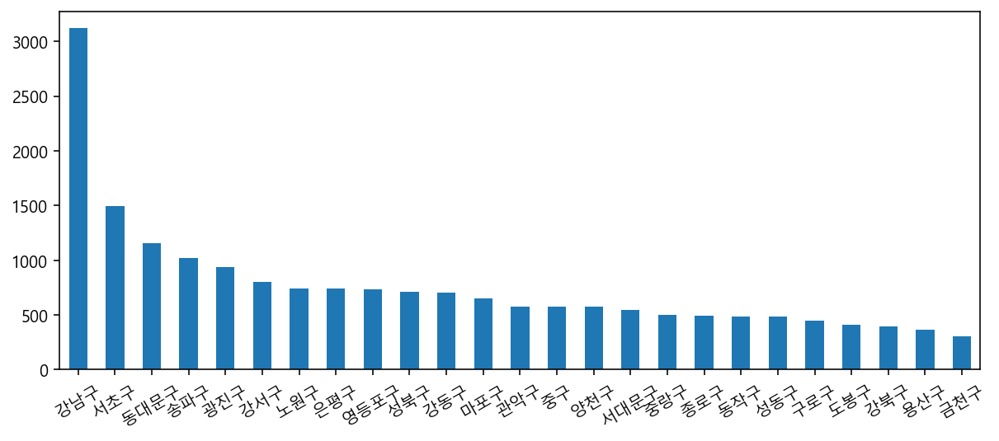
    


```python
plt.figure(figsize=(15,4))
sns.countplot(data=df_seoul, x='시군구명')
```


    <AxesSubplot:xlabel='시군구명', ylabel='count'>


    
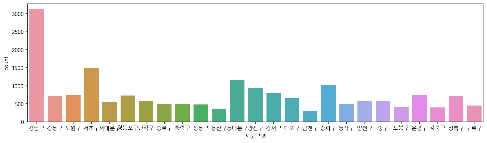
    


```python
# pandas의 plot.scatter를 통해 경도와 위도를 표시
df_seoul[['경도','위도','시군구명']].plot.scatter(x='경도',y='위도',figsize=(8,7),grid=True)
```


    <AxesSubplot:xlabel='경도', ylabel='위도'>


    
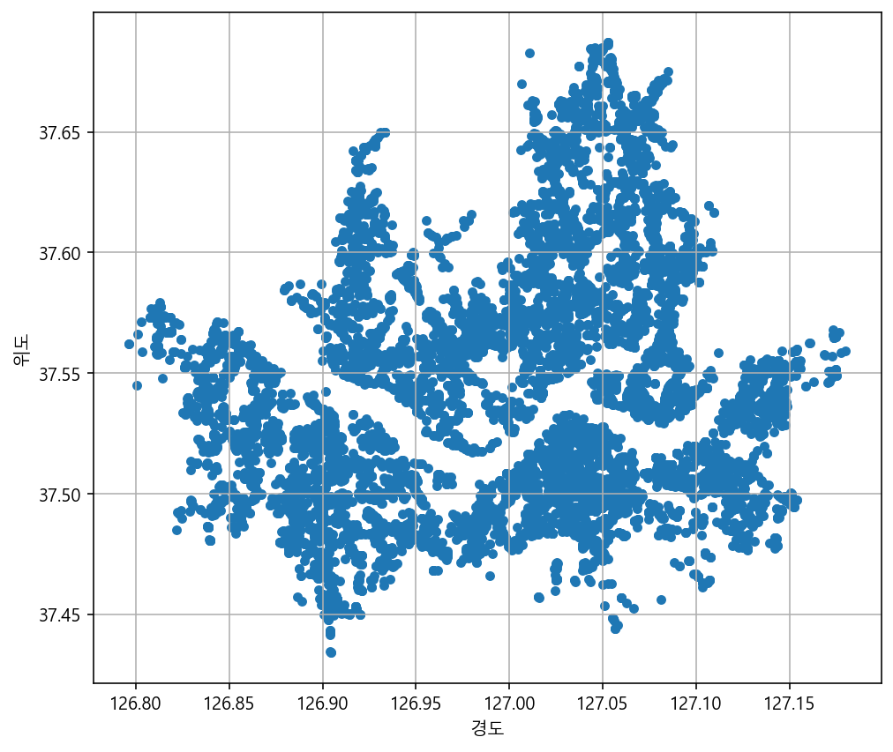
    


```python
plt.figure(figsize=(9,8))
sns.scatterplot(data=df_seoul, x="경도",y='위도',hue='시군구명')# hue는 색상을 의미
```


    <AxesSubplot:xlabel='경도', ylabel='위도'>


    
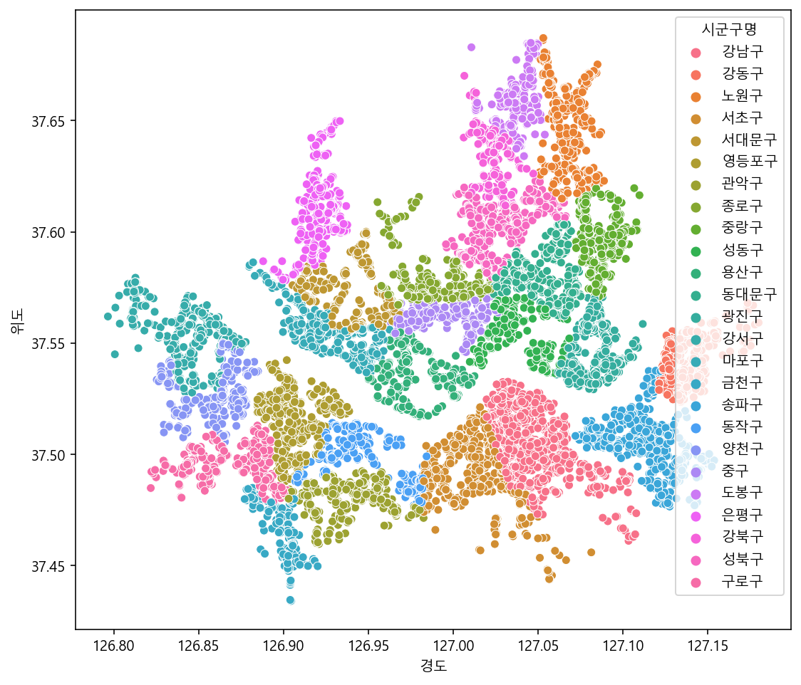
    


```python
plt.figure(figsize=(9,8))
sns.scatterplot(data=df_seoul, x="경도",y='위도',hue='상권업종중분류명')
```


    <AxesSubplot:xlabel='경도', ylabel='위도'>


    
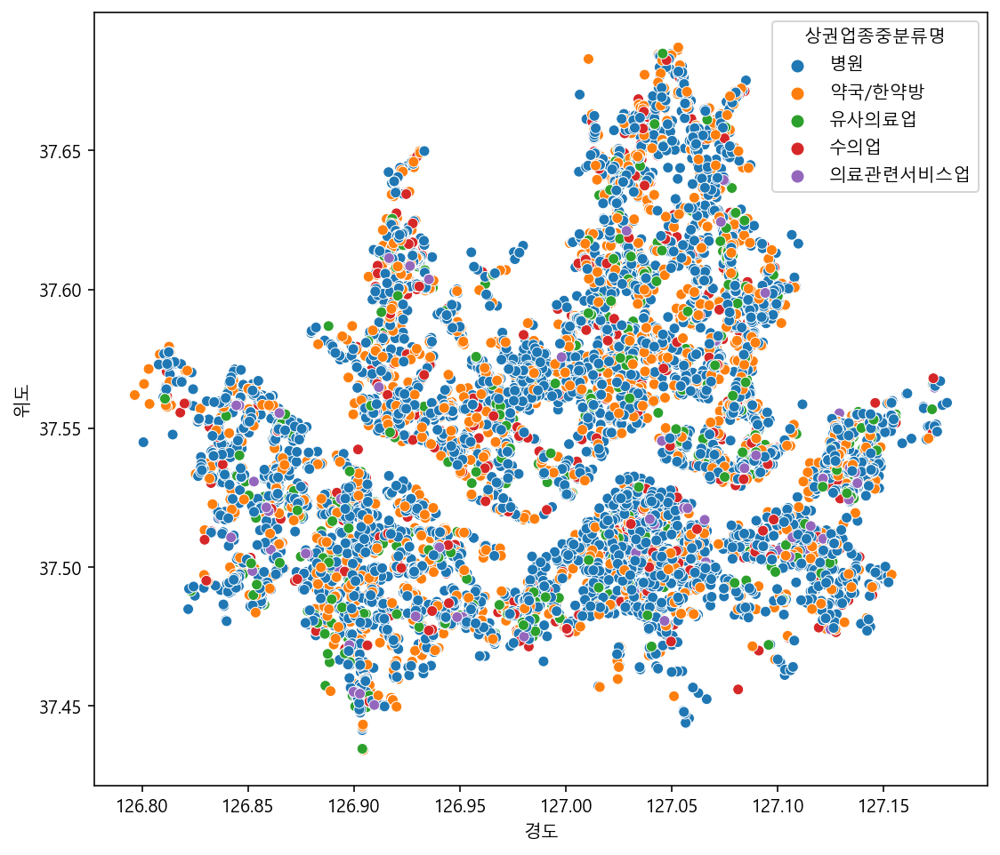
    


```python
plt.figure(figsize=(16,12))
sns.scatterplot(data=df[:], x="경도",y='위도',hue='시도명')
```


    <AxesSubplot:xlabel='경도', ylabel='위도'>


    
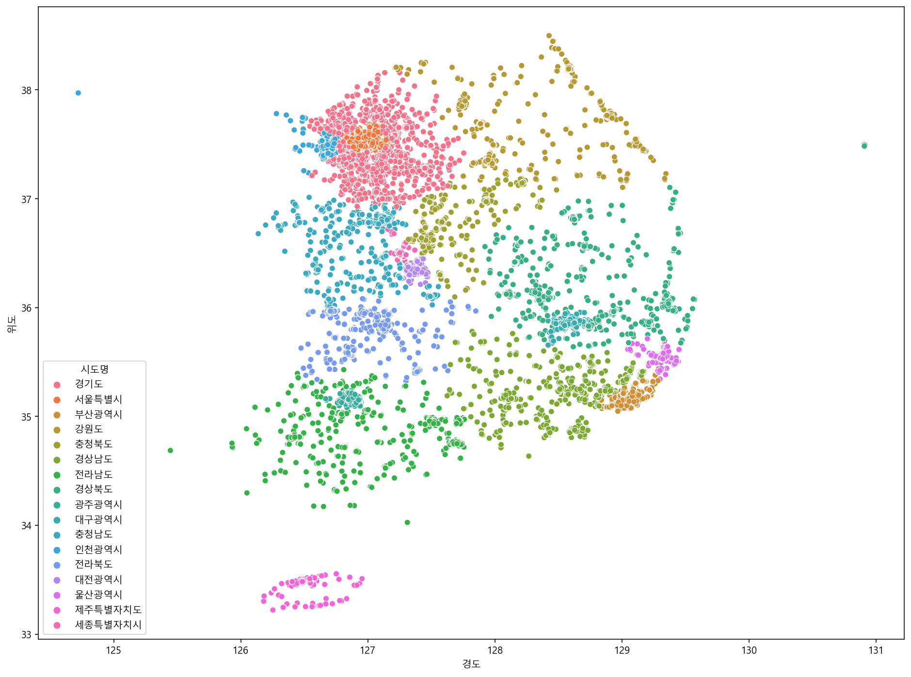
    


```python
import folium
```


```python
df_seoul_hospital['위도'].mean() #위도의 평균값
df_seoul_hospital['경도'].mean() #경도''
```


    126.9963589356625


```python
df_seoul_hospital.head(1)
```


<div>
<style scoped>
    .dataframe tbody tr th:only-of-type {
        vertical-align: middle;
    }

    .dataframe tbody tr th {
        vertical-align: top;
    }

    .dataframe thead th {
        text-align: right;
    }
</style>
<table border="1" class="dataframe">
  <thead>
    <tr style="text-align: right;">
      <th></th>
      <th>상가업소번호</th>
      <th>상호명</th>
      <th>상권업종대분류코드</th>
      <th>상권업종대분류명</th>
      <th>상권업종중분류코드</th>
      <th>상권업종중분류명</th>
      <th>상권업종소분류코드</th>
      <th>상권업종소분류명</th>
      <th>시도명</th>
      <th>시군구코드</th>
      <th>...</th>
      <th>지번주소</th>
      <th>도로명코드</th>
      <th>도로명</th>
      <th>건물본번지</th>
      <th>건물관리번호</th>
      <th>도로명주소</th>
      <th>구우편번호</th>
      <th>신우편번호</th>
      <th>경도</th>
      <th>위도</th>
    </tr>
  </thead>
  <tbody>
    <tr>
      <th>305</th>
      <td>25155642</td>
      <td>대진의료재단</td>
      <td>S</td>
      <td>의료</td>
      <td>S01</td>
      <td>병원</td>
      <td>S01B01</td>
      <td>종합병원</td>
      <td>서울특별시</td>
      <td>11215.0</td>
      <td>...</td>
      <td>서울특별시 광진구 중곡동 58-25</td>
      <td>112153104006</td>
      <td>서울특별시 광진구 긴고랑로</td>
      <td>119</td>
      <td>1121510100100580025000733</td>
      <td>서울특별시 광진구 긴고랑로 119</td>
      <td>143220.0</td>
      <td>4944.0</td>
      <td>127.088279</td>
      <td>37.559048</td>
    </tr>
  </tbody>
</table>
<p>1 rows × 29 columns</p>
</div>


```python
map=folium.Map(location=[df_seoul_hospital['위도'].mean(),df_seoul_hospital['경도'].mean()],zoom_start=12)

#zoomstart는 확대기능

for n in df_seoul_hospital.index:
    name=df_seoul_hospital.loc[n,'상호명']
    
    location=[df_seoul_hospital.loc[n,'위도'], df_seoul_hospital.loc[n,'경도']]
    adress=df_seoul_hospital.loc[n,'도로명주소']
    popup=f'{name}-{adress}'

    folium.Marker(
        location = location,
        popup = popup,
    ).add_to(map)
map
```


<div style="width:100%;"><div style="position:relative;width:100%;height:0;padding-bottom:60%;"><span style="color:#565656">Make this Notebook Trusted to load map: File -> Trust Notebook</span><iframe src="about:blank" style="position:absolute;width:100%;height:100%;left:0;top:0;border:none !important;" data-html=%3C%21DOCTYPE%20html%3E%0A%3Chead%3E%20%20%20%20%0A%20%20%20%20%3Cmeta%20http-equiv%3D%22content-type%22%20content%3D%22text/html%3B%20charset%3DUTF-8%22%20/%3E%0A%20%20%20%20%0A%20%20%20%20%20%20%20%20%3Cscript%3E%0A%20%20%20%20%20%20%20%20%20%20%20%20L_NO_TOUCH%20%3D%20false%3B%0A%20%20%20%20%20%20%20%20%20%20%20%20L_DISABLE_3D%20%3D%20false%3B%0A%20%20%20%20%20%20%20%20%3C/script%3E%0A%20%20%20%20%0A%20%20%20%20%3Cstyle%3Ehtml%2C%20body%20%7Bwidth%3A%20100%25%3Bheight%3A%20100%25%3Bmargin%3A%200%3Bpadding%3A%200%3B%7D%3C/style%3E%0A%20%20%20%20%3Cstyle%3E%23map%20%7Bposition%3Aabsolute%3Btop%3A0%3Bbottom%3A0%3Bright%3A0%3Bleft%3A0%3B%7D%3C/style%3E%0A%20%20%20%20%3Cscript%20src%3D%22https%3A//cdn.jsdelivr.net/npm/leaflet%401.6.0/dist/leaflet.js%22%3E%3C/script%3E%0A%20%20%20%20%3Cscript%20src%3D%22https%3A//code.jquery.com/jquery-1.12.4.min.js%22%3E%3C/script%3E%0A%20%20%20%20%3Cscript%20src%3D%22https%3A//maxcdn.bootstrapcdn.com/bootstrap/3.2.0/js/bootstrap.min.js%22%3E%3C/script%3E%0A%20%20%20%20%3Cscript%20src%3D%22https%3A//cdnjs.cloudflare.com/ajax/libs/Leaflet.awesome-markers/2.0.2/leaflet.awesome-markers.js%22%3E%3C/script%3E%0A%20%20%20%20%3Clink%20rel%3D%22stylesheet%22%20href%3D%22https%3A//cdn.jsdelivr.net/npm/leaflet%401.6.0/dist/leaflet.css%22/%3E%0A%20%20%20%20%3Clink%20rel%3D%22stylesheet%22%20href%3D%22https%3A//maxcdn.bootstrapcdn.com/bootstrap/3.2.0/css/bootstrap.min.css%22/%3E%0A%20%20%20%20%3Clink%20rel%3D%22stylesheet%22%20href%3D%22https%3A//maxcdn.bootstrapcdn.com/bootstrap/3.2.0/css/bootstrap-theme.min.css%22/%3E%0A%20%20%20%20%3Clink%20rel%3D%22stylesheet%22%20href%3D%22https%3A//maxcdn.bootstrapcdn.com/font-awesome/4.6.3/css/font-awesome.min.css%22/%3E%0A%20%20%20%20%3Clink%20rel%3D%22stylesheet%22%20href%3D%22https%3A//cdnjs.cloudflare.com/ajax/libs/Leaflet.awesome-markers/2.0.2/leaflet.awesome-markers.css%22/%3E%0A%20%20%20%20%3Clink%20rel%3D%22stylesheet%22%20href%3D%22https%3A//cdn.jsdelivr.net/gh/python-visualization/folium/folium/templates/leaflet.awesome.rotate.min.css%22/%3E%0A%20%20%20%20%0A%20%20%20%20%20%20%20%20%20%20%20%20%3Cmeta%20name%3D%22viewport%22%20content%3D%22width%3Ddevice-width%2C%0A%20%20%20%20%20%20%20%20%20%20%20%20%20%20%20%20initial-scale%3D1.0%2C%20maximum-scale%3D1.0%2C%20user-scalable%3Dno%22%20/%3E%0A%20%20%20%20%20%20%20%20%20%20%20%20%3Cstyle%3E%0A%20%20%20%20%20%20%20%20%20%20%20%20%20%20%20%20%23map_6acaf666cfbf410198dfd2629c097f62%20%7B%0A%20%20%20%20%20%20%20%20%20%20%20%20%20%20%20%20%20%20%20%20position%3A%20relative%3B%0A%20%20%20%20%20%20%20%20%20%20%20%20%20%20%20%20%20%20%20%20width%3A%20100.0%25%3B%0A%20%20%20%20%20%20%20%20%20%20%20%20%20%20%20%20%20%20%20%20height%3A%20100.0%25%3B%0A%20%20%20%20%20%20%20%20%20%20%20%20%20%20%20%20%20%20%20%20left%3A%200.0%25%3B%0A%20%20%20%20%20%20%20%20%20%20%20%20%20%20%20%20%20%20%20%20top%3A%200.0%25%3B%0A%20%20%20%20%20%20%20%20%20%20%20%20%20%20%20%20%7D%0A%20%20%20%20%20%20%20%20%20%20%20%20%3C/style%3E%0A%20%20%20%20%20%20%20%20%0A%3C/head%3E%0A%3Cbody%3E%20%20%20%20%0A%20%20%20%20%0A%20%20%20%20%20%20%20%20%20%20%20%20%3Cdiv%20class%3D%22folium-map%22%20id%3D%22map_6acaf666cfbf410198dfd2629c097f62%22%20%3E%3C/div%3E%0A%20%20%20%20%20%20%20%20%0A%3C/body%3E%0A%3Cscript%3E%20%20%20%20%0A%20%20%20%20%0A%20%20%20%20%20%20%20%20%20%20%20%20var%20map_6acaf666cfbf410198dfd2629c097f62%20%3D%20L.map%28%0A%20%20%20%20%20%20%20%20%20%20%20%20%20%20%20%20%22map_6acaf666cfbf410198dfd2629c097f62%22%2C%0A%20%20%20%20%20%20%20%20%20%20%20%20%20%20%20%20%7B%0A%20%20%20%20%20%20%20%20%20%20%20%20%20%20%20%20%20%20%20%20center%3A%20%5B37.52972276355594%2C%20126.9963589356625%5D%2C%0A%20%20%20%20%20%20%20%20%20%20%20%20%20%20%20%20%20%20%20%20crs%3A%20L.CRS.EPSG3857%2C%0A%20%20%20%20%20%20%20%20%20%20%20%20%20%20%20%20%20%20%20%20zoom%3A%2012%2C%0A%20%20%20%20%20%20%20%20%20%20%20%20%20%20%20%20%20%20%20%20zoomControl%3A%20true%2C%0A%20%20%20%20%20%20%20%20%20%20%20%20%20%20%20%20%20%20%20%20preferCanvas%3A%20false%2C%0A%20%20%20%20%20%20%20%20%20%20%20%20%20%20%20%20%7D%0A%20%20%20%20%20%20%20%20%20%20%20%20%29%3B%0A%0A%20%20%20%20%20%20%20%20%20%20%20%20%0A%0A%20%20%20%20%20%20%20%20%0A%20%20%20%20%0A%20%20%20%20%20%20%20%20%20%20%20%20var%20tile_layer_ed390b84e789423c806f9ba9a80f35a3%20%3D%20L.tileLayer%28%0A%20%20%20%20%20%20%20%20%20%20%20%20%20%20%20%20%22https%3A//%7Bs%7D.tile.openstreetmap.org/%7Bz%7D/%7Bx%7D/%7By%7D.png%22%2C%0A%20%20%20%20%20%20%20%20%20%20%20%20%20%20%20%20%7B%22attribution%22%3A%20%22Data%20by%20%5Cu0026copy%3B%20%5Cu003ca%20href%3D%5C%22http%3A//openstreetmap.org%5C%22%5Cu003eOpenStreetMap%5Cu003c/a%5Cu003e%2C%20under%20%5Cu003ca%20href%3D%5C%22http%3A//www.openstreetmap.org/copyright%5C%22%5Cu003eODbL%5Cu003c/a%5Cu003e.%22%2C%20%22detectRetina%22%3A%20false%2C%20%22maxNativeZoom%22%3A%2018%2C%20%22maxZoom%22%3A%2018%2C%20%22minZoom%22%3A%200%2C%20%22noWrap%22%3A%20false%2C%20%22opacity%22%3A%201%2C%20%22subdomains%22%3A%20%22abc%22%2C%20%22tms%22%3A%20false%7D%0A%20%20%20%20%20%20%20%20%20%20%20%20%29.addTo%28map_6acaf666cfbf410198dfd2629c097f62%29%3B%0A%20%20%20%20%20%20%20%20%0A%20%20%20%20%0A%20%20%20%20%20%20%20%20%20%20%20%20var%20marker_42dacbe8c7314e2f8c56deb6f3eb06b8%20%3D%20L.marker%28%0A%20%20%20%20%20%20%20%20%20%20%20%20%20%20%20%20%5B37.5590478066919%2C%20127.088279358833%5D%2C%0A%20%20%20%20%20%20%20%20%20%20%20%20%20%20%20%20%7B%7D%0A%20%20%20%20%20%20%20%20%20%20%20%20%29.addTo%28map_6acaf666cfbf410198dfd2629c097f62%29%3B%0A%20%20%20%20%20%20%20%20%0A%20%20%20%20%0A%20%20%20%20%20%20%20%20var%20popup_996c8db7393e402f90a864cf6b7e6b11%20%3D%20L.popup%28%7B%22maxWidth%22%3A%20%22100%25%22%7D%29%3B%0A%0A%20%20%20%20%20%20%20%20%0A%20%20%20%20%20%20%20%20%20%20%20%20var%20html_5fb1050e3bfc42d1a992ce9016c09fed%20%3D%20%24%28%60%3Cdiv%20id%3D%22html_5fb1050e3bfc42d1a992ce9016c09fed%22%20style%3D%22width%3A%20100.0%25%3B%20height%3A%20100.0%25%3B%22%3E%EB%8C%80%EC%A7%84%EC%9D%98%EB%A3%8C%EC%9E%AC%EB%8B%A8-%EC%84%9C%EC%9A%B8%ED%8A%B9%EB%B3%84%EC%8B%9C%20%EA%B4%91%EC%A7%84%EA%B5%AC%20%EA%B8%B4%EA%B3%A0%EB%9E%91%EB%A1%9C%20119%3C/div%3E%60%29%5B0%5D%3B%0A%20%20%20%20%20%20%20%20%20%20%20%20popup_996c8db7393e402f90a864cf6b7e6b11.setContent%28html_5fb1050e3bfc42d1a992ce9016c09fed%29%3B%0A%20%20%20%20%20%20%20%20%0A%0A%20%20%20%20%20%20%20%20marker_42dacbe8c7314e2f8c56deb6f3eb06b8.bindPopup%28popup_996c8db7393e402f90a864cf6b7e6b11%29%0A%20%20%20%20%20%20%20%20%3B%0A%0A%20%20%20%20%20%20%20%20%0A%20%20%20%20%0A%20%20%20%20%0A%20%20%20%20%20%20%20%20%20%20%20%20var%20marker_9d17d99ccf364194884a53c93479c937%20%3D%20L.marker%28%0A%20%20%20%20%20%20%20%20%20%20%20%20%20%20%20%20%5B37.5292132863644%2C%20126.862805128545%5D%2C%0A%20%20%20%20%20%20%20%20%20%20%20%20%20%20%20%20%7B%7D%0A%20%20%20%20%20%20%20%20%20%20%20%20%29.addTo%28map_6acaf666cfbf410198dfd2629c097f62%29%3B%0A%20%20%20%20%20%20%20%20%0A%20%20%20%20%0A%20%20%20%20%20%20%20%20var%20popup_80b49a58f39645d8864a6d6c9b6ba6f6%20%3D%20L.popup%28%7B%22maxWidth%22%3A%20%22100%25%22%7D%29%3B%0A%0A%20%20%20%20%20%20%20%20%0A%20%20%20%20%20%20%20%20%20%20%20%20var%20html_13fdc0225e0345f8a08eecd4120a9ecd%20%3D%20%24%28%60%3Cdiv%20id%3D%22html_13fdc0225e0345f8a08eecd4120a9ecd%22%20style%3D%22width%3A%20100.0%25%3B%20height%3A%20100.0%25%3B%22%3E%ED%99%8D%EC%9D%B5%EB%B3%91%EC%9B%90%EB%B3%84%EA%B4%80-%EC%84%9C%EC%9A%B8%ED%8A%B9%EB%B3%84%EC%8B%9C%20%EC%96%91%EC%B2%9C%EA%B5%AC%20%EA%B5%AD%ED%9A%8C%EB%8C%80%EB%A1%9C%20250%3C/div%3E%60%29%5B0%5D%3B%0A%20%20%20%20%20%20%20%20%20%20%20%20popup_80b49a58f39645d8864a6d6c9b6ba6f6.setContent%28html_13fdc0225e0345f8a08eecd4120a9ecd%29%3B%0A%20%20%20%20%20%20%20%20%0A%0A%20%20%20%20%20%20%20%20marker_9d17d99ccf364194884a53c93479c937.bindPopup%28popup_80b49a58f39645d8864a6d6c9b6ba6f6%29%0A%20%20%20%20%20%20%20%20%3B%0A%0A%20%20%20%20%20%20%20%20%0A%20%20%20%20%0A%20%20%20%20%0A%20%20%20%20%20%20%20%20%20%20%20%20var%20marker_c6e6fdb496b4444d93e2fdc13b25d693%20%3D%20L.marker%28%0A%20%20%20%20%20%20%20%20%20%20%20%20%20%20%20%20%5B37.4996302661116%2C%20127.035824788941%5D%2C%0A%20%20%20%20%20%20%20%20%20%20%20%20%20%20%20%20%7B%7D%0A%20%20%20%20%20%20%20%20%20%20%20%20%29.addTo%28map_6acaf666cfbf410198dfd2629c097f62%29%3B%0A%20%20%20%20%20%20%20%20%0A%20%20%20%20%0A%20%20%20%20%20%20%20%20var%20popup_8698fbf7d402435bb1444855447ecf4c%20%3D%20L.popup%28%7B%22maxWidth%22%3A%20%22100%25%22%7D%29%3B%0A%0A%20%20%20%20%20%20%20%20%0A%20%20%20%20%20%20%20%20%20%20%20%20var%20html_206eb6bbc241499abd411d1db738e474%20%3D%20%24%28%60%3Cdiv%20id%3D%22html_206eb6bbc241499abd411d1db738e474%22%20style%3D%22width%3A%20100.0%25%3B%20height%3A%20100.0%25%3B%22%3ESNUH-%EC%84%9C%EC%9A%B8%ED%8A%B9%EB%B3%84%EC%8B%9C%20%EA%B0%95%EB%82%A8%EA%B5%AC%20%ED%85%8C%ED%97%A4%EB%9E%80%EB%A1%9C26%EA%B8%B8%2010%3C/div%3E%60%29%5B0%5D%3B%0A%20%20%20%20%20%20%20%20%20%20%20%20popup_8698fbf7d402435bb1444855447ecf4c.setContent%28html_206eb6bbc241499abd411d1db738e474%29%3B%0A%20%20%20%20%20%20%20%20%0A%0A%20%20%20%20%20%20%20%20marker_c6e6fdb496b4444d93e2fdc13b25d693.bindPopup%28popup_8698fbf7d402435bb1444855447ecf4c%29%0A%20%20%20%20%20%20%20%20%3B%0A%0A%20%20%20%20%20%20%20%20%0A%20%20%20%20%0A%20%20%20%20%0A%20%20%20%20%20%20%20%20%20%20%20%20var%20marker_d979f3c91a3841a4a6a8f1ec3e1a5461%20%3D%20L.marker%28%0A%20%20%20%20%20%20%20%20%20%20%20%20%20%20%20%20%5B37.5594688006573%2C%20127.041324711886%5D%2C%0A%20%20%20%20%20%20%20%20%20%20%20%20%20%20%20%20%7B%7D%0A%20%20%20%20%20%20%20%20%20%20%20%20%29.addTo%28map_6acaf666cfbf410198dfd2629c097f62%29%3B%0A%20%20%20%20%20%20%20%20%0A%20%20%20%20%0A%20%20%20%20%20%20%20%20var%20popup_a8ff70eabf894509a31ddfb57aeca74a%20%3D%20L.popup%28%7B%22maxWidth%22%3A%20%22100%25%22%7D%29%3B%0A%0A%20%20%20%20%20%20%20%20%0A%20%20%20%20%20%20%20%20%20%20%20%20var%20html_ce6338099b6846bea654fa79040c4afc%20%3D%20%24%28%60%3Cdiv%20id%3D%22html_ce6338099b6846bea654fa79040c4afc%22%20style%3D%22width%3A%20100.0%25%3B%20height%3A%20100.0%25%3B%22%3E%ED%95%9C%EC%96%91-%EC%84%9C%EC%9A%B8%ED%8A%B9%EB%B3%84%EC%8B%9C%20%EC%84%B1%EB%8F%99%EA%B5%AC%20%EB%A7%88%EC%A1%B0%EB%A1%9C%2022-2%3C/div%3E%60%29%5B0%5D%3B%0A%20%20%20%20%20%20%20%20%20%20%20%20popup_a8ff70eabf894509a31ddfb57aeca74a.setContent%28html_ce6338099b6846bea654fa79040c4afc%29%3B%0A%20%20%20%20%20%20%20%20%0A%0A%20%20%20%20%20%20%20%20marker_d979f3c91a3841a4a6a8f1ec3e1a5461.bindPopup%28popup_a8ff70eabf894509a31ddfb57aeca74a%29%0A%20%20%20%20%20%20%20%20%3B%0A%0A%20%20%20%20%20%20%20%20%0A%20%20%20%20%0A%20%20%20%20%0A%20%20%20%20%20%20%20%20%20%20%20%20var%20marker_29402df744094895ba0cd04b7c0d0ed3%20%3D%20L.marker%28%0A%20%20%20%20%20%20%20%20%20%20%20%20%20%20%20%20%5B37.5422708098332%2C%20127.125283411621%5D%2C%0A%20%20%20%20%20%20%20%20%20%20%20%20%20%20%20%20%7B%7D%0A%20%20%20%20%20%20%20%20%20%20%20%20%29.addTo%28map_6acaf666cfbf410198dfd2629c097f62%29%3B%0A%20%20%20%20%20%20%20%20%0A%20%20%20%20%0A%20%20%20%20%20%20%20%20var%20popup_82af76ad306f4724bc4ee173acb7d5f0%20%3D%20L.popup%28%7B%22maxWidth%22%3A%20%22100%25%22%7D%29%3B%0A%0A%20%20%20%20%20%20%20%20%0A%20%20%20%20%20%20%20%20%20%20%20%20var%20html_166e8b43677247e4b2442d217fb19cd5%20%3D%20%24%28%60%3Cdiv%20id%3D%22html_166e8b43677247e4b2442d217fb19cd5%22%20style%3D%22width%3A%20100.0%25%3B%20height%3A%20100.0%25%3B%22%3E%EB%B0%B1%EC%82%B0%EC%9D%98%EB%A3%8C%EC%9E%AC%EB%8B%A8%EC%B9%9C%EA%B5%AC%EB%B3%91%EC%9B%90-%EC%84%9C%EC%9A%B8%ED%8A%B9%EB%B3%84%EC%8B%9C%20%EA%B0%95%EB%8F%99%EA%B5%AC%20%EC%98%AC%EB%A6%BC%ED%94%BD%EB%A1%9C%20684%3C/div%3E%60%29%5B0%5D%3B%0A%20%20%20%20%20%20%20%20%20%20%20%20popup_82af76ad306f4724bc4ee173acb7d5f0.setContent%28html_166e8b43677247e4b2442d217fb19cd5%29%3B%0A%20%20%20%20%20%20%20%20%0A%0A%20%20%20%20%20%20%20%20marker_29402df744094895ba0cd04b7c0d0ed3.bindPopup%28popup_82af76ad306f4724bc4ee173acb7d5f0%29%0A%20%20%20%20%20%20%20%20%3B%0A%0A%20%20%20%20%20%20%20%20%0A%20%20%20%20%0A%20%20%20%20%0A%20%20%20%20%20%20%20%20%20%20%20%20var%20marker_668fb7c7f3c74091909249bfc52d23df%20%3D%20L.marker%28%0A%20%20%20%20%20%20%20%20%20%20%20%20%20%20%20%20%5B37.5284608782587%2C%20127.147914226576%5D%2C%0A%20%20%20%20%20%20%20%20%20%20%20%20%20%20%20%20%7B%7D%0A%20%20%20%20%20%20%20%20%20%20%20%20%29.addTo%28map_6acaf666cfbf410198dfd2629c097f62%29%3B%0A%20%20%20%20%20%20%20%20%0A%20%20%20%20%0A%20%20%20%20%20%20%20%20var%20popup_86f0c6f43bb640aabebfa4bebcec57c2%20%3D%20L.popup%28%7B%22maxWidth%22%3A%20%22100%25%22%7D%29%3B%0A%0A%20%20%20%20%20%20%20%20%0A%20%20%20%20%20%20%20%20%20%20%20%20var%20html_5ad1b9e9c26c47e5bb49be272604e046%20%3D%20%24%28%60%3Cdiv%20id%3D%22html_5ad1b9e9c26c47e5bb49be272604e046%22%20style%3D%22width%3A%20100.0%25%3B%20height%3A%20100.0%25%3B%22%3E%EC%84%9C%EC%9A%B8%EB%B3%B4%ED%9B%88%EB%B3%91%EC%9B%90-%EC%84%9C%EC%9A%B8%ED%8A%B9%EB%B3%84%EC%8B%9C%20%EA%B0%95%EB%8F%99%EA%B5%AC%20%EC%A7%84%ED%99%A9%EB%8F%84%EB%A1%9C61%EA%B8%B8%2053%3C/div%3E%60%29%5B0%5D%3B%0A%20%20%20%20%20%20%20%20%20%20%20%20popup_86f0c6f43bb640aabebfa4bebcec57c2.setContent%28html_5ad1b9e9c26c47e5bb49be272604e046%29%3B%0A%20%20%20%20%20%20%20%20%0A%0A%20%20%20%20%20%20%20%20marker_668fb7c7f3c74091909249bfc52d23df.bindPopup%28popup_86f0c6f43bb640aabebfa4bebcec57c2%29%0A%20%20%20%20%20%20%20%20%3B%0A%0A%20%20%20%20%20%20%20%20%0A%20%20%20%20%0A%20%20%20%20%0A%20%20%20%20%20%20%20%20%20%20%20%20var%20marker_7b97923c357d4d34a7cb56ec7830768c%20%3D%20L.marker%28%0A%20%20%20%20%20%20%20%20%20%20%20%20%20%20%20%20%5B37.5000141135255%2C%20127.036487118737%5D%2C%0A%20%20%20%20%20%20%20%20%20%20%20%20%20%20%20%20%7B%7D%0A%20%20%20%20%20%20%20%20%20%20%20%20%29.addTo%28map_6acaf666cfbf410198dfd2629c097f62%29%3B%0A%20%20%20%20%20%20%20%20%0A%20%20%20%20%0A%20%20%20%20%20%20%20%20var%20popup_324ad06d5a4e4b5eac832180c49186af%20%3D%20L.popup%28%7B%22maxWidth%22%3A%20%22100%25%22%7D%29%3B%0A%0A%20%20%20%20%20%20%20%20%0A%20%20%20%20%20%20%20%20%20%20%20%20var%20html_910f919c114a4701bba2f7dd7d7966ba%20%3D%20%24%28%60%3Cdiv%20id%3D%22html_910f919c114a4701bba2f7dd7d7966ba%22%20style%3D%22width%3A%20100.0%25%3B%20height%3A%20100.0%25%3B%22%3E%EC%84%9C%EC%9A%B8%EB%8C%80%ED%95%99%EA%B5%90%EB%B3%91%EC%9B%90-%EC%84%9C%EC%9A%B8%ED%8A%B9%EB%B3%84%EC%8B%9C%20%EA%B0%95%EB%82%A8%EA%B5%AC%20%ED%85%8C%ED%97%A4%EB%9E%80%EB%A1%9C%20152%3C/div%3E%60%29%5B0%5D%3B%0A%20%20%20%20%20%20%20%20%20%20%20%20popup_324ad06d5a4e4b5eac832180c49186af.setContent%28html_910f919c114a4701bba2f7dd7d7966ba%29%3B%0A%20%20%20%20%20%20%20%20%0A%0A%20%20%20%20%20%20%20%20marker_7b97923c357d4d34a7cb56ec7830768c.bindPopup%28popup_324ad06d5a4e4b5eac832180c49186af%29%0A%20%20%20%20%20%20%20%20%3B%0A%0A%20%20%20%20%20%20%20%20%0A%20%20%20%20%0A%20%20%20%20%0A%20%20%20%20%20%20%20%20%20%20%20%20var%20marker_7e179c452e12444fa9c9d2fcabc1f35b%20%3D%20L.marker%28%0A%20%20%20%20%20%20%20%20%20%20%20%20%20%20%20%20%5B37.5617087895771%2C%20126.999619848188%5D%2C%0A%20%20%20%20%20%20%20%20%20%20%20%20%20%20%20%20%7B%7D%0A%20%20%20%20%20%20%20%20%20%20%20%20%29.addTo%28map_6acaf666cfbf410198dfd2629c097f62%29%3B%0A%20%20%20%20%20%20%20%20%0A%20%20%20%20%0A%20%20%20%20%20%20%20%20var%20popup_9a3dfc802ee84b81a3128c6e8a698c78%20%3D%20L.popup%28%7B%22maxWidth%22%3A%20%22100%25%22%7D%29%3B%0A%0A%20%20%20%20%20%20%20%20%0A%20%20%20%20%20%20%20%20%20%20%20%20var%20html_e7e2de197f54461b8a4ebc2a15c69879%20%3D%20%24%28%60%3Cdiv%20id%3D%22html_e7e2de197f54461b8a4ebc2a15c69879%22%20style%3D%22width%3A%20100.0%25%3B%20height%3A%20100.0%25%3B%22%3E%EC%A0%9C%EC%9D%BC%EB%B3%91%EC%9B%90-%EC%84%9C%EC%9A%B8%ED%8A%B9%EB%B3%84%EC%8B%9C%20%EC%A4%91%EA%B5%AC%20%EC%84%9C%EC%95%A0%EB%A1%9C1%EA%B8%B8%2017%3C/div%3E%60%29%5B0%5D%3B%0A%20%20%20%20%20%20%20%20%20%20%20%20popup_9a3dfc802ee84b81a3128c6e8a698c78.setContent%28html_e7e2de197f54461b8a4ebc2a15c69879%29%3B%0A%20%20%20%20%20%20%20%20%0A%0A%20%20%20%20%20%20%20%20marker_7e179c452e12444fa9c9d2fcabc1f35b.bindPopup%28popup_9a3dfc802ee84b81a3128c6e8a698c78%29%0A%20%20%20%20%20%20%20%20%3B%0A%0A%20%20%20%20%20%20%20%20%0A%20%20%20%20%0A%20%20%20%20%0A%20%20%20%20%20%20%20%20%20%20%20%20var%20marker_1f63b0420a264584bb2c859783e5cf09%20%3D%20L.marker%28%0A%20%20%20%20%20%20%20%20%20%20%20%20%20%20%20%20%5B37.4819075047515%2C%20126.881567999979%5D%2C%0A%20%20%20%20%20%20%20%20%20%20%20%20%20%20%20%20%7B%7D%0A%20%20%20%20%20%20%20%20%20%20%20%20%29.addTo%28map_6acaf666cfbf410198dfd2629c097f62%29%3B%0A%20%20%20%20%20%20%20%20%0A%20%20%20%20%0A%20%20%20%20%20%20%20%20var%20popup_4661886f7523440d81c1f3f147bdbd40%20%3D%20L.popup%28%7B%22maxWidth%22%3A%20%22100%25%22%7D%29%3B%0A%0A%20%20%20%20%20%20%20%20%0A%20%20%20%20%20%20%20%20%20%20%20%20var%20html_f03481669ada46589933dd78d4a2aa5e%20%3D%20%24%28%60%3Cdiv%20id%3D%22html_f03481669ada46589933dd78d4a2aa5e%22%20style%3D%22width%3A%20100.0%25%3B%20height%3A%20100.0%25%3B%22%3E%EC%9D%B4%EB%9E%9C%EB%93%9C%ED%81%B4%EB%A6%AC%EB%8B%89-%EC%84%9C%EC%9A%B8%ED%8A%B9%EB%B3%84%EC%8B%9C%20%EA%B8%88%EC%B2%9C%EA%B5%AC%20%EA%B0%80%EC%82%B0%EB%94%94%EC%A7%80%ED%84%B81%EB%A1%9C%20186%3C/div%3E%60%29%5B0%5D%3B%0A%20%20%20%20%20%20%20%20%20%20%20%20popup_4661886f7523440d81c1f3f147bdbd40.setContent%28html_f03481669ada46589933dd78d4a2aa5e%29%3B%0A%20%20%20%20%20%20%20%20%0A%0A%20%20%20%20%20%20%20%20marker_1f63b0420a264584bb2c859783e5cf09.bindPopup%28popup_4661886f7523440d81c1f3f147bdbd40%29%0A%20%20%20%20%20%20%20%20%3B%0A%0A%20%20%20%20%20%20%20%20%0A%20%20%20%20%0A%20%20%20%20%0A%20%20%20%20%20%20%20%20%20%20%20%20var%20marker_86a01938427f4ed8806052f292f4d2c0%20%3D%20L.marker%28%0A%20%20%20%20%20%20%20%20%20%20%20%20%20%20%20%20%5B37.5598884579046%2C%20126.964069882556%5D%2C%0A%20%20%20%20%20%20%20%20%20%20%20%20%20%20%20%20%7B%7D%0A%20%20%20%20%20%20%20%20%20%20%20%20%29.addTo%28map_6acaf666cfbf410198dfd2629c097f62%29%3B%0A%20%20%20%20%20%20%20%20%0A%20%20%20%20%0A%20%20%20%20%20%20%20%20var%20popup_e3ae65fb307746219cf2a7e99b636b39%20%3D%20L.popup%28%7B%22maxWidth%22%3A%20%22100%25%22%7D%29%3B%0A%0A%20%20%20%20%20%20%20%20%0A%20%20%20%20%20%20%20%20%20%20%20%20var%20html_4dec1cd2501147d0ad09bdf1e16c23e4%20%3D%20%24%28%60%3Cdiv%20id%3D%22html_4dec1cd2501147d0ad09bdf1e16c23e4%22%20style%3D%22width%3A%20100.0%25%3B%20height%3A%20100.0%25%3B%22%3E%EC%82%AC%EB%9E%91%EB%82%98%EB%88%94%EC%9D%98%EB%A3%8C%EC%9E%AC%EB%8B%A8-%EC%84%9C%EC%9A%B8%ED%8A%B9%EB%B3%84%EC%8B%9C%20%EC%84%9C%EB%8C%80%EB%AC%B8%EA%B5%AC%20%EC%84%9C%EC%86%8C%EB%AC%B8%EB%A1%9C%2021%3C/div%3E%60%29%5B0%5D%3B%0A%20%20%20%20%20%20%20%20%20%20%20%20popup_e3ae65fb307746219cf2a7e99b636b39.setContent%28html_4dec1cd2501147d0ad09bdf1e16c23e4%29%3B%0A%20%20%20%20%20%20%20%20%0A%0A%20%20%20%20%20%20%20%20marker_86a01938427f4ed8806052f292f4d2c0.bindPopup%28popup_e3ae65fb307746219cf2a7e99b636b39%29%0A%20%20%20%20%20%20%20%20%3B%0A%0A%20%20%20%20%20%20%20%20%0A%20%20%20%20%0A%20%20%20%20%0A%20%20%20%20%20%20%20%20%20%20%20%20var%20marker_2421c2afbfb34e0eb11d48814aec6260%20%3D%20L.marker%28%0A%20%20%20%20%20%20%20%20%20%20%20%20%20%20%20%20%5B37.5884849860916%2C%20127.031701809695%5D%2C%0A%20%20%20%20%20%20%20%20%20%20%20%20%20%20%20%20%7B%7D%0A%20%20%20%20%20%20%20%20%20%20%20%20%29.addTo%28map_6acaf666cfbf410198dfd2629c097f62%29%3B%0A%20%20%20%20%20%20%20%20%0A%20%20%20%20%0A%20%20%20%20%20%20%20%20var%20popup_ea19743fe0f6409db865d14511b91ea1%20%3D%20L.popup%28%7B%22maxWidth%22%3A%20%22100%25%22%7D%29%3B%0A%0A%20%20%20%20%20%20%20%20%0A%20%20%20%20%20%20%20%20%20%20%20%20var%20html_95a66ded651e419d86cd69fb6058893a%20%3D%20%24%28%60%3Cdiv%20id%3D%22html_95a66ded651e419d86cd69fb6058893a%22%20style%3D%22width%3A%20100.0%25%3B%20height%3A%20100.0%25%3B%22%3E%EC%9A%B0%EC%9A%B8%EC%A6%9D%EC%84%BC%ED%84%B0-%EC%84%9C%EC%9A%B8%ED%8A%B9%EB%B3%84%EC%8B%9C%20%EC%84%B1%EB%B6%81%EA%B5%AC%20%EC%95%88%EC%95%94%EB%A1%9C%20145%3C/div%3E%60%29%5B0%5D%3B%0A%20%20%20%20%20%20%20%20%20%20%20%20popup_ea19743fe0f6409db865d14511b91ea1.setContent%28html_95a66ded651e419d86cd69fb6058893a%29%3B%0A%20%20%20%20%20%20%20%20%0A%0A%20%20%20%20%20%20%20%20marker_2421c2afbfb34e0eb11d48814aec6260.bindPopup%28popup_ea19743fe0f6409db865d14511b91ea1%29%0A%20%20%20%20%20%20%20%20%3B%0A%0A%20%20%20%20%20%20%20%20%0A%20%20%20%20%0A%20%20%20%20%0A%20%20%20%20%20%20%20%20%20%20%20%20var%20marker_dd80f58938f94ac9b5267a8251692754%20%3D%20L.marker%28%0A%20%20%20%20%20%20%20%20%20%20%20%20%20%20%20%20%5B37.5234259336424%2C%20126.910305676076%5D%2C%0A%20%20%20%20%20%20%20%20%20%20%20%20%20%20%20%20%7B%7D%0A%20%20%20%20%20%20%20%20%20%20%20%20%29.addTo%28map_6acaf666cfbf410198dfd2629c097f62%29%3B%0A%20%20%20%20%20%20%20%20%0A%20%20%20%20%0A%20%20%20%20%20%20%20%20var%20popup_70d662a6ca744c8e9ab962500584dcd3%20%3D%20L.popup%28%7B%22maxWidth%22%3A%20%22100%25%22%7D%29%3B%0A%0A%20%20%20%20%20%20%20%20%0A%20%20%20%20%20%20%20%20%20%20%20%20var%20html_3ae23a683f0f4b53800a443cc626350e%20%3D%20%24%28%60%3Cdiv%20id%3D%22html_3ae23a683f0f4b53800a443cc626350e%22%20style%3D%22width%3A%20100.0%25%3B%20height%3A%20100.0%25%3B%22%3E%EC%84%B1%EC%8B%AC%EC%9D%98%EB%A3%8C%EC%9E%AC%EB%8B%A8-%EC%84%9C%EC%9A%B8%ED%8A%B9%EB%B3%84%EC%8B%9C%20%EC%98%81%EB%93%B1%ED%8F%AC%EA%B5%AC%20%EB%B2%84%EB%93%9C%EB%82%98%EB%A3%A8%EB%A1%9C%2055%3C/div%3E%60%29%5B0%5D%3B%0A%20%20%20%20%20%20%20%20%20%20%20%20popup_70d662a6ca744c8e9ab962500584dcd3.setContent%28html_3ae23a683f0f4b53800a443cc626350e%29%3B%0A%20%20%20%20%20%20%20%20%0A%0A%20%20%20%20%20%20%20%20marker_dd80f58938f94ac9b5267a8251692754.bindPopup%28popup_70d662a6ca744c8e9ab962500584dcd3%29%0A%20%20%20%20%20%20%20%20%3B%0A%0A%20%20%20%20%20%20%20%20%0A%20%20%20%20%0A%20%20%20%20%0A%20%20%20%20%20%20%20%20%20%20%20%20var%20marker_905b2fd7ca7a4a47b4368a26a85811c4%20%3D%20L.marker%28%0A%20%20%20%20%20%20%20%20%20%20%20%20%20%20%20%20%5B37.4967193539591%2C%20126.856953766995%5D%2C%0A%20%20%20%20%20%20%20%20%20%20%20%20%20%20%20%20%7B%7D%0A%20%20%20%20%20%20%20%20%20%20%20%20%29.addTo%28map_6acaf666cfbf410198dfd2629c097f62%29%3B%0A%20%20%20%20%20%20%20%20%0A%20%20%20%20%0A%20%20%20%20%20%20%20%20var%20popup_01e4300bf85740f3bf503bb989c24fb9%20%3D%20L.popup%28%7B%22maxWidth%22%3A%20%22100%25%22%7D%29%3B%0A%0A%20%20%20%20%20%20%20%20%0A%20%20%20%20%20%20%20%20%20%20%20%20var%20html_5d2797a967c2440e90288ee4c6fd65d2%20%3D%20%24%28%60%3Cdiv%20id%3D%22html_5d2797a967c2440e90288ee4c6fd65d2%22%20style%3D%22width%3A%20100.0%25%3B%20height%3A%20100.0%25%3B%22%3E%EB%8B%A4%EB%82%98%EC%9D%98%EB%A3%8C%EC%9E%AC%EB%8B%A8-%EC%84%9C%EC%9A%B8%ED%8A%B9%EB%B3%84%EC%8B%9C%20%EA%B5%AC%EB%A1%9C%EA%B5%AC%20%EA%B0%9C%EB%B4%89%EB%A1%9C%20126%3C/div%3E%60%29%5B0%5D%3B%0A%20%20%20%20%20%20%20%20%20%20%20%20popup_01e4300bf85740f3bf503bb989c24fb9.setContent%28html_5d2797a967c2440e90288ee4c6fd65d2%29%3B%0A%20%20%20%20%20%20%20%20%0A%0A%20%20%20%20%20%20%20%20marker_905b2fd7ca7a4a47b4368a26a85811c4.bindPopup%28popup_01e4300bf85740f3bf503bb989c24fb9%29%0A%20%20%20%20%20%20%20%20%3B%0A%0A%20%20%20%20%20%20%20%20%0A%20%20%20%20%0A%20%20%20%20%0A%20%20%20%20%20%20%20%20%20%20%20%20var%20marker_7abe44d13f1e4b92b16038839a0cfe76%20%3D%20L.marker%28%0A%20%20%20%20%20%20%20%20%20%20%20%20%20%20%20%20%5B37.5252476485773%2C%20127.109315275715%5D%2C%0A%20%20%20%20%20%20%20%20%20%20%20%20%20%20%20%20%7B%7D%0A%20%20%20%20%20%20%20%20%20%20%20%20%29.addTo%28map_6acaf666cfbf410198dfd2629c097f62%29%3B%0A%20%20%20%20%20%20%20%20%0A%20%20%20%20%0A%20%20%20%20%20%20%20%20var%20popup_29cd85d8d0074f62aacb76d125b5696c%20%3D%20L.popup%28%7B%22maxWidth%22%3A%20%22100%25%22%7D%29%3B%0A%0A%20%20%20%20%20%20%20%20%0A%20%20%20%20%20%20%20%20%20%20%20%20var%20html_d6badcf7bd174b1098317e0d68b952cd%20%3D%20%24%28%60%3Cdiv%20id%3D%22html_d6badcf7bd174b1098317e0d68b952cd%22%20style%3D%22width%3A%20100.0%25%3B%20height%3A%20100.0%25%3B%22%3E%EC%84%9C%EC%9A%B8%EC%95%84%EC%82%B0%EB%B3%91%EC%9B%90%EC%8B%A0%EA%B4%80-%EC%84%9C%EC%9A%B8%ED%8A%B9%EB%B3%84%EC%8B%9C%20%EC%86%A1%ED%8C%8C%EA%B5%AC%20%EC%98%AC%EB%A6%BC%ED%94%BD%EB%A1%9C43%EA%B8%B8%2088%3C/div%3E%60%29%5B0%5D%3B%0A%20%20%20%20%20%20%20%20%20%20%20%20popup_29cd85d8d0074f62aacb76d125b5696c.setContent%28html_d6badcf7bd174b1098317e0d68b952cd%29%3B%0A%20%20%20%20%20%20%20%20%0A%0A%20%20%20%20%20%20%20%20marker_7abe44d13f1e4b92b16038839a0cfe76.bindPopup%28popup_29cd85d8d0074f62aacb76d125b5696c%29%0A%20%20%20%20%20%20%20%20%3B%0A%0A%20%20%20%20%20%20%20%20%0A%20%20%20%20%0A%20%20%20%20%0A%20%20%20%20%20%20%20%20%20%20%20%20var%20marker_14df9e2648134dc6a91fec5d82c6ea9c%20%3D%20L.marker%28%0A%20%20%20%20%20%20%20%20%20%20%20%20%20%20%20%20%5B37.4912085325475%2C%20126.8846634435%5D%2C%0A%20%20%20%20%20%20%20%20%20%20%20%20%20%20%20%20%7B%7D%0A%20%20%20%20%20%20%20%20%20%20%20%20%29.addTo%28map_6acaf666cfbf410198dfd2629c097f62%29%3B%0A%20%20%20%20%20%20%20%20%0A%20%20%20%20%0A%20%20%20%20%20%20%20%20var%20popup_76dc120ea5c748bfa2d76aa3e1357008%20%3D%20L.popup%28%7B%22maxWidth%22%3A%20%22100%25%22%7D%29%3B%0A%0A%20%20%20%20%20%20%20%20%0A%20%20%20%20%20%20%20%20%20%20%20%20var%20html_a0eee8c79bcb4426b6dce189ae8a81b3%20%3D%20%24%28%60%3Cdiv%20id%3D%22html_a0eee8c79bcb4426b6dce189ae8a81b3%22%20style%3D%22width%3A%20100.0%25%3B%20height%3A%20100.0%25%3B%22%3E%EA%B3%A0%EB%A0%A4%EB%8C%80%ED%95%99%EA%B5%90%EA%B5%AC%EB%A1%9C%EB%B3%91%EC%9B%90-%EC%84%9C%EC%9A%B8%ED%8A%B9%EB%B3%84%EC%8B%9C%20%EA%B5%AC%EB%A1%9C%EA%B5%AC%20%EA%B5%AC%EB%A1%9C%EB%8F%99%EB%A1%9C%20148%3C/div%3E%60%29%5B0%5D%3B%0A%20%20%20%20%20%20%20%20%20%20%20%20popup_76dc120ea5c748bfa2d76aa3e1357008.setContent%28html_a0eee8c79bcb4426b6dce189ae8a81b3%29%3B%0A%20%20%20%20%20%20%20%20%0A%0A%20%20%20%20%20%20%20%20marker_14df9e2648134dc6a91fec5d82c6ea9c.bindPopup%28popup_76dc120ea5c748bfa2d76aa3e1357008%29%0A%20%20%20%20%20%20%20%20%3B%0A%0A%20%20%20%20%20%20%20%20%0A%20%20%20%20%0A%20%20%20%20%0A%20%20%20%20%20%20%20%20%20%20%20%20var%20marker_1d3f2654a72b4147a02120169b380469%20%3D%20L.marker%28%0A%20%20%20%20%20%20%20%20%20%20%20%20%20%20%20%20%5B37.5234259336424%2C%20126.910305676076%5D%2C%0A%20%20%20%20%20%20%20%20%20%20%20%20%20%20%20%20%7B%7D%0A%20%20%20%20%20%20%20%20%20%20%20%20%29.addTo%28map_6acaf666cfbf410198dfd2629c097f62%29%3B%0A%20%20%20%20%20%20%20%20%0A%20%20%20%20%0A%20%20%20%20%20%20%20%20var%20popup_b21039e558f3471695a18559d23058a8%20%3D%20L.popup%28%7B%22maxWidth%22%3A%20%22100%25%22%7D%29%3B%0A%0A%20%20%20%20%20%20%20%20%0A%20%20%20%20%20%20%20%20%20%20%20%20var%20html_b6dc8deb83c041d49fb775ac30303b32%20%3D%20%24%28%60%3Cdiv%20id%3D%22html_b6dc8deb83c041d49fb775ac30303b32%22%20style%3D%22width%3A%20100.0%25%3B%20height%3A%20100.0%25%3B%22%3E%ED%95%99%EA%B5%90%EB%B2%95%EC%9D%B8%EC%9D%BC%EC%86%A1%ED%95%99%EC%9B%90-%EC%84%9C%EC%9A%B8%ED%8A%B9%EB%B3%84%EC%8B%9C%20%EC%98%81%EB%93%B1%ED%8F%AC%EA%B5%AC%20%EB%B2%84%EB%93%9C%EB%82%98%EB%A3%A8%EB%A1%9C%2055%3C/div%3E%60%29%5B0%5D%3B%0A%20%20%20%20%20%20%20%20%20%20%20%20popup_b21039e558f3471695a18559d23058a8.setContent%28html_b6dc8deb83c041d49fb775ac30303b32%29%3B%0A%20%20%20%20%20%20%20%20%0A%0A%20%20%20%20%20%20%20%20marker_1d3f2654a72b4147a02120169b380469.bindPopup%28popup_b21039e558f3471695a18559d23058a8%29%0A%20%20%20%20%20%20%20%20%3B%0A%0A%20%20%20%20%20%20%20%20%0A%20%20%20%20%0A%20%20%20%20%0A%20%20%20%20%20%20%20%20%20%20%20%20var%20marker_2951c6b31e4b416abd2e5d4879d09142%20%3D%20L.marker%28%0A%20%20%20%20%20%20%20%20%20%20%20%20%20%20%20%20%5B37.4544208148109%2C%20126.901237040277%5D%2C%0A%20%20%20%20%20%20%20%20%20%20%20%20%20%20%20%20%7B%7D%0A%20%20%20%20%20%20%20%20%20%20%20%20%29.addTo%28map_6acaf666cfbf410198dfd2629c097f62%29%3B%0A%20%20%20%20%20%20%20%20%0A%20%20%20%20%0A%20%20%20%20%20%20%20%20var%20popup_19278ef4badb47f5bb620b0006c90942%20%3D%20L.popup%28%7B%22maxWidth%22%3A%20%22100%25%22%7D%29%3B%0A%0A%20%20%20%20%20%20%20%20%0A%20%20%20%20%20%20%20%20%20%20%20%20var%20html_10aaf15288ae44f1a6884cf9918c7651%20%3D%20%24%28%60%3Cdiv%20id%3D%22html_10aaf15288ae44f1a6884cf9918c7651%22%20style%3D%22width%3A%20100.0%25%3B%20height%3A%20100.0%25%3B%22%3E%ED%9D%AC%EB%AA%85%EC%8A%A4%ED%8F%AC%EC%B8%A0%EC%9D%98%ED%95%99%EC%84%BC%ED%84%B0%EC%9D%B8%EA%B3%B5%EC%8B%A0%EC%9E%A5%EC%8B%A4-%EC%84%9C%EC%9A%B8%ED%8A%B9%EB%B3%84%EC%8B%9C%20%EA%B8%88%EC%B2%9C%EA%B5%AC%20%EC%8B%9C%ED%9D%A5%EB%8C%80%EB%A1%9C%20230%3C/div%3E%60%29%5B0%5D%3B%0A%20%20%20%20%20%20%20%20%20%20%20%20popup_19278ef4badb47f5bb620b0006c90942.setContent%28html_10aaf15288ae44f1a6884cf9918c7651%29%3B%0A%20%20%20%20%20%20%20%20%0A%0A%20%20%20%20%20%20%20%20marker_2951c6b31e4b416abd2e5d4879d09142.bindPopup%28popup_19278ef4badb47f5bb620b0006c90942%29%0A%20%20%20%20%20%20%20%20%3B%0A%0A%20%20%20%20%20%20%20%20%0A%20%20%20%20%0A%20%20%20%20%0A%20%20%20%20%20%20%20%20%20%20%20%20var%20marker_9c12bf6f326e4c6eac06d363ecd0826d%20%3D%20L.marker%28%0A%20%20%20%20%20%20%20%20%20%20%20%20%20%20%20%20%5B37.4927951351961%2C%20127.046293864724%5D%2C%0A%20%20%20%20%20%20%20%20%20%20%20%20%20%20%20%20%7B%7D%0A%20%20%20%20%20%20%20%20%20%20%20%20%29.addTo%28map_6acaf666cfbf410198dfd2629c097f62%29%3B%0A%20%20%20%20%20%20%20%20%0A%20%20%20%20%0A%20%20%20%20%20%20%20%20var%20popup_673804326bbf4a4da9fcd3e6b610801d%20%3D%20L.popup%28%7B%22maxWidth%22%3A%20%22100%25%22%7D%29%3B%0A%0A%20%20%20%20%20%20%20%20%0A%20%20%20%20%20%20%20%20%20%20%20%20var%20html_f2a0385c833d46f683ca75b6981a8030%20%3D%20%24%28%60%3Cdiv%20id%3D%22html_f2a0385c833d46f683ca75b6981a8030%22%20style%3D%22width%3A%20100.0%25%3B%20height%3A%20100.0%25%3B%22%3E%EC%97%B0%EC%84%B8%EB%8C%80%ED%95%99%EA%B5%90%EC%9D%98%EA%B3%BC%EB%8C%80%ED%95%99%EA%B0%95%EB%82%A8%EC%84%B8%EB%B8%8C%EB%9E%80%EC%8A%A4-%EC%84%9C%EC%9A%B8%ED%8A%B9%EB%B3%84%EC%8B%9C%20%EA%B0%95%EB%82%A8%EA%B5%AC%20%EC%96%B8%EC%A3%BC%EB%A1%9C%20211%3C/div%3E%60%29%5B0%5D%3B%0A%20%20%20%20%20%20%20%20%20%20%20%20popup_673804326bbf4a4da9fcd3e6b610801d.setContent%28html_f2a0385c833d46f683ca75b6981a8030%29%3B%0A%20%20%20%20%20%20%20%20%0A%0A%20%20%20%20%20%20%20%20marker_9c12bf6f326e4c6eac06d363ecd0826d.bindPopup%28popup_673804326bbf4a4da9fcd3e6b610801d%29%0A%20%20%20%20%20%20%20%20%3B%0A%0A%20%20%20%20%20%20%20%20%0A%20%20%20%20%0A%20%20%20%20%0A%20%20%20%20%20%20%20%20%20%20%20%20var%20marker_d0210ffc359245828fc75a78b01db07a%20%3D%20L.marker%28%0A%20%20%20%20%20%20%20%20%20%20%20%20%20%20%20%20%5B37.5653138819736%2C%20127.086437154639%5D%2C%0A%20%20%20%20%20%20%20%20%20%20%20%20%20%20%20%20%7B%7D%0A%20%20%20%20%20%20%20%20%20%20%20%20%29.addTo%28map_6acaf666cfbf410198dfd2629c097f62%29%3B%0A%20%20%20%20%20%20%20%20%0A%20%20%20%20%0A%20%20%20%20%20%20%20%20var%20popup_bb930b069a074ff1a412d9973185d534%20%3D%20L.popup%28%7B%22maxWidth%22%3A%20%22100%25%22%7D%29%3B%0A%0A%20%20%20%20%20%20%20%20%0A%20%20%20%20%20%20%20%20%20%20%20%20var%20html_a5988401b6b544bf8f4e85cf781b3470%20%3D%20%24%28%60%3Cdiv%20id%3D%22html_a5988401b6b544bf8f4e85cf781b3470%22%20style%3D%22width%3A%20100.0%25%3B%20height%3A%20100.0%25%3B%22%3E%EA%B5%AD%EB%A6%BD%EC%A0%95%EC%8B%A0%EB%B3%91%EC%9B%90-%EC%84%9C%EC%9A%B8%ED%8A%B9%EB%B3%84%EC%8B%9C%20%EA%B4%91%EC%A7%84%EA%B5%AC%20%EB%8A%A5%EB%8F%99%EB%A1%9C%20398%3C/div%3E%60%29%5B0%5D%3B%0A%20%20%20%20%20%20%20%20%20%20%20%20popup_bb930b069a074ff1a412d9973185d534.setContent%28html_a5988401b6b544bf8f4e85cf781b3470%29%3B%0A%20%20%20%20%20%20%20%20%0A%0A%20%20%20%20%20%20%20%20marker_d0210ffc359245828fc75a78b01db07a.bindPopup%28popup_bb930b069a074ff1a412d9973185d534%29%0A%20%20%20%20%20%20%20%20%3B%0A%0A%20%20%20%20%20%20%20%20%0A%20%20%20%20%0A%20%20%20%20%0A%20%20%20%20%20%20%20%20%20%20%20%20var%20marker_071ea6a3da0b4faab5405f2cd3d08096%20%3D%20L.marker%28%0A%20%20%20%20%20%20%20%20%20%20%20%20%20%20%20%20%5B37.5041585815151%2C%20127.052030646855%5D%2C%0A%20%20%20%20%20%20%20%20%20%20%20%20%20%20%20%20%7B%7D%0A%20%20%20%20%20%20%20%20%20%20%20%20%29.addTo%28map_6acaf666cfbf410198dfd2629c097f62%29%3B%0A%20%20%20%20%20%20%20%20%0A%20%20%20%20%0A%20%20%20%20%20%20%20%20var%20popup_dee689052d04419aacee43c2ec993d5e%20%3D%20L.popup%28%7B%22maxWidth%22%3A%20%22100%25%22%7D%29%3B%0A%0A%20%20%20%20%20%20%20%20%0A%20%20%20%20%20%20%20%20%20%20%20%20var%20html_f80aae84ee5c4f28a4d15e121badd7f9%20%3D%20%24%28%60%3Cdiv%20id%3D%22html_f80aae84ee5c4f28a4d15e121badd7f9%22%20style%3D%22width%3A%20100.0%25%3B%20height%3A%20100.0%25%3B%22%3E%EC%BD%94%EC%95%84%ED%81%B4%EB%A6%AC%EB%8B%89-%EC%84%9C%EC%9A%B8%ED%8A%B9%EB%B3%84%EC%8B%9C%20%EA%B0%95%EB%82%A8%EA%B5%AC%20%EC%84%A0%EB%A6%89%EB%A1%9C86%EA%B8%B8%2031%3C/div%3E%60%29%5B0%5D%3B%0A%20%20%20%20%20%20%20%20%20%20%20%20popup_dee689052d04419aacee43c2ec993d5e.setContent%28html_f80aae84ee5c4f28a4d15e121badd7f9%29%3B%0A%20%20%20%20%20%20%20%20%0A%0A%20%20%20%20%20%20%20%20marker_071ea6a3da0b4faab5405f2cd3d08096.bindPopup%28popup_dee689052d04419aacee43c2ec993d5e%29%0A%20%20%20%20%20%20%20%20%3B%0A%0A%20%20%20%20%20%20%20%20%0A%20%20%20%20%0A%20%20%20%20%0A%20%20%20%20%20%20%20%20%20%20%20%20var%20marker_74e46366712e496dbf3a23ce9450c8c6%20%3D%20L.marker%28%0A%20%20%20%20%20%20%20%20%20%20%20%20%20%20%20%20%5B37.6466791728505%2C%20127.029043078213%5D%2C%0A%20%20%20%20%20%20%20%20%20%20%20%20%20%20%20%20%7B%7D%0A%20%20%20%20%20%20%20%20%20%20%20%20%29.addTo%28map_6acaf666cfbf410198dfd2629c097f62%29%3B%0A%20%20%20%20%20%20%20%20%0A%20%20%20%20%0A%20%20%20%20%20%20%20%20var%20popup_1d40ecc7425e4cbe8c2c9d9e303e8e29%20%3D%20L.popup%28%7B%22maxWidth%22%3A%20%22100%25%22%7D%29%3B%0A%0A%20%20%20%20%20%20%20%20%0A%20%20%20%20%20%20%20%20%20%20%20%20var%20html_936f6f26e9d34d7d94463e14fcc90967%20%3D%20%24%28%60%3Cdiv%20id%3D%22html_936f6f26e9d34d7d94463e14fcc90967%22%20style%3D%22width%3A%20100.0%25%3B%20height%3A%20100.0%25%3B%22%3E%ED%95%9C%EA%B5%AD%EC%A0%84%EB%A0%A5%EA%B3%B5%EC%82%AC%EB%B6%80%EC%86%8D%ED%95%9C%EC%9D%BC%EB%B3%91%EC%9B%90-%EC%84%9C%EC%9A%B8%ED%8A%B9%EB%B3%84%EC%8B%9C%20%EB%8F%84%EB%B4%89%EA%B5%AC%20%EC%9A%B0%EC%9D%B4%EC%B2%9C%EB%A1%9C%20308%3C/div%3E%60%29%5B0%5D%3B%0A%20%20%20%20%20%20%20%20%20%20%20%20popup_1d40ecc7425e4cbe8c2c9d9e303e8e29.setContent%28html_936f6f26e9d34d7d94463e14fcc90967%29%3B%0A%20%20%20%20%20%20%20%20%0A%0A%20%20%20%20%20%20%20%20marker_74e46366712e496dbf3a23ce9450c8c6.bindPopup%28popup_1d40ecc7425e4cbe8c2c9d9e303e8e29%29%0A%20%20%20%20%20%20%20%20%3B%0A%0A%20%20%20%20%20%20%20%20%0A%20%20%20%20%0A%20%20%20%20%0A%20%20%20%20%20%20%20%20%20%20%20%20var%20marker_0acaa3fdfc314dbcaf3ffee6c88746bc%20%3D%20L.marker%28%0A%20%20%20%20%20%20%20%20%20%20%20%20%20%20%20%20%5B37.552351350337%2C%20126.934217029717%5D%2C%0A%20%20%20%20%20%20%20%20%20%20%20%20%20%20%20%20%7B%7D%0A%20%20%20%20%20%20%20%20%20%20%20%20%29.addTo%28map_6acaf666cfbf410198dfd2629c097f62%29%3B%0A%20%20%20%20%20%20%20%20%0A%20%20%20%20%0A%20%20%20%20%20%20%20%20var%20popup_85f42e9d22b944759010069a65531dd2%20%3D%20L.popup%28%7B%22maxWidth%22%3A%20%22100%25%22%7D%29%3B%0A%0A%20%20%20%20%20%20%20%20%0A%20%20%20%20%20%20%20%20%20%20%20%20var%20html_fcf5d5c7798845bcb0faebb33e23b20a%20%3D%20%24%28%60%3Cdiv%20id%3D%22html_fcf5d5c7798845bcb0faebb33e23b20a%22%20style%3D%22width%3A%20100.0%25%3B%20height%3A%20100.0%25%3B%22%3E%EC%8B%A0%EC%B4%8C%EC%97%B0%EC%84%B8%EB%B3%91%EC%9B%90-%EC%84%9C%EC%9A%B8%ED%8A%B9%EB%B3%84%EC%8B%9C%20%EB%A7%88%ED%8F%AC%EA%B5%AC%20%EC%84%9C%EA%B0%95%EB%A1%9C14%EA%B8%B8%2014%3C/div%3E%60%29%5B0%5D%3B%0A%20%20%20%20%20%20%20%20%20%20%20%20popup_85f42e9d22b944759010069a65531dd2.setContent%28html_fcf5d5c7798845bcb0faebb33e23b20a%29%3B%0A%20%20%20%20%20%20%20%20%0A%0A%20%20%20%20%20%20%20%20marker_0acaa3fdfc314dbcaf3ffee6c88746bc.bindPopup%28popup_85f42e9d22b944759010069a65531dd2%29%0A%20%20%20%20%20%20%20%20%3B%0A%0A%20%20%20%20%20%20%20%20%0A%20%20%20%20%0A%20%20%20%20%0A%20%20%20%20%20%20%20%20%20%20%20%20var%20marker_5094b3fa19804070be5de17f056e0986%20%3D%20L.marker%28%0A%20%20%20%20%20%20%20%20%20%20%20%20%20%20%20%20%5B37.4927951351961%2C%20127.046293864724%5D%2C%0A%20%20%20%20%20%20%20%20%20%20%20%20%20%20%20%20%7B%7D%0A%20%20%20%20%20%20%20%20%20%20%20%20%29.addTo%28map_6acaf666cfbf410198dfd2629c097f62%29%3B%0A%20%20%20%20%20%20%20%20%0A%20%20%20%20%0A%20%20%20%20%20%20%20%20var%20popup_cd381dae9983409bbef1dea5f2ca5d24%20%3D%20L.popup%28%7B%22maxWidth%22%3A%20%22100%25%22%7D%29%3B%0A%0A%20%20%20%20%20%20%20%20%0A%20%20%20%20%20%20%20%20%20%20%20%20var%20html_11f2eb7e2cfd4b5ca3df219e00e6751f%20%3D%20%24%28%60%3Cdiv%20id%3D%22html_11f2eb7e2cfd4b5ca3df219e00e6751f%22%20style%3D%22width%3A%20100.0%25%3B%20height%3A%20100.0%25%3B%22%3E%EC%98%81%EB%8F%99%EC%84%B8%EB%B8%8C%EB%9E%80%EC%8A%A4%EB%B3%91%EC%9B%90-%EC%84%9C%EC%9A%B8%ED%8A%B9%EB%B3%84%EC%8B%9C%20%EA%B0%95%EB%82%A8%EA%B5%AC%20%EC%96%B8%EC%A3%BC%EB%A1%9C%20211%3C/div%3E%60%29%5B0%5D%3B%0A%20%20%20%20%20%20%20%20%20%20%20%20popup_cd381dae9983409bbef1dea5f2ca5d24.setContent%28html_11f2eb7e2cfd4b5ca3df219e00e6751f%29%3B%0A%20%20%20%20%20%20%20%20%0A%0A%20%20%20%20%20%20%20%20marker_5094b3fa19804070be5de17f056e0986.bindPopup%28popup_cd381dae9983409bbef1dea5f2ca5d24%29%0A%20%20%20%20%20%20%20%20%3B%0A%0A%20%20%20%20%20%20%20%20%0A%20%20%20%20%0A%20%20%20%20%0A%20%20%20%20%20%20%20%20%20%20%20%20var%20marker_74839b60b72140c8b6c544b166e6db2b%20%3D%20L.marker%28%0A%20%20%20%20%20%20%20%20%20%20%20%20%20%20%20%20%5B37.5623763649704%2C%20126.975546803857%5D%2C%0A%20%20%20%20%20%20%20%20%20%20%20%20%20%20%20%20%7B%7D%0A%20%20%20%20%20%20%20%20%20%20%20%20%29.addTo%28map_6acaf666cfbf410198dfd2629c097f62%29%3B%0A%20%20%20%20%20%20%20%20%0A%20%20%20%20%0A%20%20%20%20%20%20%20%20var%20popup_893a67da80ec4ba39deececbb7e5c61f%20%3D%20L.popup%28%7B%22maxWidth%22%3A%20%22100%25%22%7D%29%3B%0A%0A%20%20%20%20%20%20%20%20%0A%20%20%20%20%20%20%20%20%20%20%20%20var%20html_570e55ea45d64e03a83c5dc504b6fcf9%20%3D%20%24%28%60%3Cdiv%20id%3D%22html_570e55ea45d64e03a83c5dc504b6fcf9%22%20style%3D%22width%3A%20100.0%25%3B%20height%3A%20100.0%25%3B%22%3E%EC%82%BC%EC%84%B1%EC%9D%98%EB%A3%8C%EC%9E%AC%EB%8B%A8%EA%B0%95%EB%B6%81%EC%82%BC%EC%84%B1%ED%83%9C-%EC%84%9C%EC%9A%B8%ED%8A%B9%EB%B3%84%EC%8B%9C%20%EC%A4%91%EA%B5%AC%20%EC%84%B8%EC%A2%85%EB%8C%80%EB%A1%9C%2067%3C/div%3E%60%29%5B0%5D%3B%0A%20%20%20%20%20%20%20%20%20%20%20%20popup_893a67da80ec4ba39deececbb7e5c61f.setContent%28html_570e55ea45d64e03a83c5dc504b6fcf9%29%3B%0A%20%20%20%20%20%20%20%20%0A%0A%20%20%20%20%20%20%20%20marker_74839b60b72140c8b6c544b166e6db2b.bindPopup%28popup_893a67da80ec4ba39deececbb7e5c61f%29%0A%20%20%20%20%20%20%20%20%3B%0A%0A%20%20%20%20%20%20%20%20%0A%20%20%20%20%0A%20%20%20%20%0A%20%20%20%20%20%20%20%20%20%20%20%20var%20marker_fe0a940c646748b7b9b88fa310e1486f%20%3D%20L.marker%28%0A%20%20%20%20%20%20%20%20%20%20%20%20%20%20%20%20%5B37.4929999195765%2C%20126.924317993184%5D%2C%0A%20%20%20%20%20%20%20%20%20%20%20%20%20%20%20%20%7B%7D%0A%20%20%20%20%20%20%20%20%20%20%20%20%29.addTo%28map_6acaf666cfbf410198dfd2629c097f62%29%3B%0A%20%20%20%20%20%20%20%20%0A%20%20%20%20%0A%20%20%20%20%20%20%20%20var%20popup_dc98a8f011b544ca9b02978a6c571630%20%3D%20L.popup%28%7B%22maxWidth%22%3A%20%22100%25%22%7D%29%3B%0A%0A%20%20%20%20%20%20%20%20%0A%20%20%20%20%20%20%20%20%20%20%20%20var%20html_2895abd3dc564c92a5b31eb5a06883db%20%3D%20%24%28%60%3Cdiv%20id%3D%22html_2895abd3dc564c92a5b31eb5a06883db%22%20style%3D%22width%3A%20100.0%25%3B%20height%3A%20100.0%25%3B%22%3E%EC%84%9C%EC%9A%B8%EC%8B%9C%EB%A6%BD%EB%B3%B4%EB%9D%BC%EB%A7%A4%EB%B3%91%EC%9B%90-%EC%84%9C%EC%9A%B8%ED%8A%B9%EB%B3%84%EC%8B%9C%20%EB%8F%99%EC%9E%91%EA%B5%AC%20%EB%B3%B4%EB%9D%BC%EB%A7%A4%EB%A1%9C5%EA%B8%B8%2020%3C/div%3E%60%29%5B0%5D%3B%0A%20%20%20%20%20%20%20%20%20%20%20%20popup_dc98a8f011b544ca9b02978a6c571630.setContent%28html_2895abd3dc564c92a5b31eb5a06883db%29%3B%0A%20%20%20%20%20%20%20%20%0A%0A%20%20%20%20%20%20%20%20marker_fe0a940c646748b7b9b88fa310e1486f.bindPopup%28popup_dc98a8f011b544ca9b02978a6c571630%29%0A%20%20%20%20%20%20%20%20%3B%0A%0A%20%20%20%20%20%20%20%20%0A%20%20%20%20%0A%20%20%20%20%0A%20%20%20%20%20%20%20%20%20%20%20%20var%20marker_156691eaba434180a54dec4e9354b5f5%20%3D%20L.marker%28%0A%20%20%20%20%20%20%20%20%20%20%20%20%20%20%20%20%5B37.5804478224547%2C%20126.997184076959%5D%2C%0A%20%20%20%20%20%20%20%20%20%20%20%20%20%20%20%20%7B%7D%0A%20%20%20%20%20%20%20%20%20%20%20%20%29.addTo%28map_6acaf666cfbf410198dfd2629c097f62%29%3B%0A%20%20%20%20%20%20%20%20%0A%20%20%20%20%0A%20%20%20%20%20%20%20%20var%20popup_206dab74ae7341b18d885fb370036ce8%20%3D%20L.popup%28%7B%22maxWidth%22%3A%20%22100%25%22%7D%29%3B%0A%0A%20%20%20%20%20%20%20%20%0A%20%20%20%20%20%20%20%20%20%20%20%20var%20html_9c239faf395b46a990d4f86cfdcf3f0e%20%3D%20%24%28%60%3Cdiv%20id%3D%22html_9c239faf395b46a990d4f86cfdcf3f0e%22%20style%3D%22width%3A%20100.0%25%3B%20height%3A%20100.0%25%3B%22%3E%EC%84%9C%EC%9A%B8%EB%8C%80%ED%95%99%EA%B5%90%EB%B3%91%EC%9B%90%EB%B9%84%EC%83%81%EA%B3%84%ED%9A%8D%EC%99%B8%EB%9E%98-%EC%84%9C%EC%9A%B8%ED%8A%B9%EB%B3%84%EC%8B%9C%20%EC%A2%85%EB%A1%9C%EA%B5%AC%20%EB%8C%80%ED%95%99%EB%A1%9C%20101%3C/div%3E%60%29%5B0%5D%3B%0A%20%20%20%20%20%20%20%20%20%20%20%20popup_206dab74ae7341b18d885fb370036ce8.setContent%28html_9c239faf395b46a990d4f86cfdcf3f0e%29%3B%0A%20%20%20%20%20%20%20%20%0A%0A%20%20%20%20%20%20%20%20marker_156691eaba434180a54dec4e9354b5f5.bindPopup%28popup_206dab74ae7341b18d885fb370036ce8%29%0A%20%20%20%20%20%20%20%20%3B%0A%0A%20%20%20%20%20%20%20%20%0A%20%20%20%20%0A%20%20%20%20%0A%20%20%20%20%20%20%20%20%20%20%20%20var%20marker_a8051e7014124c4499d06f1589a60465%20%3D%20L.marker%28%0A%20%20%20%20%20%20%20%20%20%20%20%20%20%20%20%20%5B37.5023822369311%2C%20127.005840711554%5D%2C%0A%20%20%20%20%20%20%20%20%20%20%20%20%20%20%20%20%7B%7D%0A%20%20%20%20%20%20%20%20%20%20%20%20%29.addTo%28map_6acaf666cfbf410198dfd2629c097f62%29%3B%0A%20%20%20%20%20%20%20%20%0A%20%20%20%20%0A%20%20%20%20%20%20%20%20var%20popup_0cd845dafb6245ea8dda172d8b3e12ab%20%3D%20L.popup%28%7B%22maxWidth%22%3A%20%22100%25%22%7D%29%3B%0A%0A%20%20%20%20%20%20%20%20%0A%20%20%20%20%20%20%20%20%20%20%20%20var%20html_d073d9124c8741a796fdd63445c71e9c%20%3D%20%24%28%60%3Cdiv%20id%3D%22html_d073d9124c8741a796fdd63445c71e9c%22%20style%3D%22width%3A%20100.0%25%3B%20height%3A%20100.0%25%3B%22%3E%ED%8F%89%ED%99%94%EB%93%9C%EB%A6%BC%EC%84%9C%EC%9A%B8%EC%84%B1%EB%AA%A8%EB%B3%91%EC%9B%90%EC%9D%98%EB%A3%8C-%EC%84%9C%EC%9A%B8%ED%8A%B9%EB%B3%84%EC%8B%9C%20%EC%84%9C%EC%B4%88%EA%B5%AC%20%EB%B0%98%ED%8F%AC%EB%8C%80%EB%A1%9C%20222%3C/div%3E%60%29%5B0%5D%3B%0A%20%20%20%20%20%20%20%20%20%20%20%20popup_0cd845dafb6245ea8dda172d8b3e12ab.setContent%28html_d073d9124c8741a796fdd63445c71e9c%29%3B%0A%20%20%20%20%20%20%20%20%0A%0A%20%20%20%20%20%20%20%20marker_a8051e7014124c4499d06f1589a60465.bindPopup%28popup_0cd845dafb6245ea8dda172d8b3e12ab%29%0A%20%20%20%20%20%20%20%20%3B%0A%0A%20%20%20%20%20%20%20%20%0A%20%20%20%20%0A%20%20%20%20%0A%20%20%20%20%20%20%20%20%20%20%20%20var%20marker_81b174c65c1d483f83a926a864ca2bed%20%3D%20L.marker%28%0A%20%20%20%20%20%20%20%20%20%20%20%20%20%20%20%20%5B37.5287978094127%2C%20126.863637341439%5D%2C%0A%20%20%20%20%20%20%20%20%20%20%20%20%20%20%20%20%7B%7D%0A%20%20%20%20%20%20%20%20%20%20%20%20%29.addTo%28map_6acaf666cfbf410198dfd2629c097f62%29%3B%0A%20%20%20%20%20%20%20%20%0A%20%20%20%20%0A%20%20%20%20%20%20%20%20var%20popup_ea1721ad593643ecbb17b56a5cdde4b8%20%3D%20L.popup%28%7B%22maxWidth%22%3A%20%22100%25%22%7D%29%3B%0A%0A%20%20%20%20%20%20%20%20%0A%20%20%20%20%20%20%20%20%20%20%20%20var%20html_36d187fdc8de4684a7edb6a844d34d6f%20%3D%20%24%28%60%3Cdiv%20id%3D%22html_36d187fdc8de4684a7edb6a844d34d6f%22%20style%3D%22width%3A%20100.0%25%3B%20height%3A%20100.0%25%3B%22%3E%ED%99%8D%EC%9D%B5%EB%B3%91%EC%9B%90-%EC%84%9C%EC%9A%B8%ED%8A%B9%EB%B3%84%EC%8B%9C%20%EC%96%91%EC%B2%9C%EA%B5%AC%20%EB%AA%A9%EB%8F%99%EB%A1%9C%20227%3C/div%3E%60%29%5B0%5D%3B%0A%20%20%20%20%20%20%20%20%20%20%20%20popup_ea1721ad593643ecbb17b56a5cdde4b8.setContent%28html_36d187fdc8de4684a7edb6a844d34d6f%29%3B%0A%20%20%20%20%20%20%20%20%0A%0A%20%20%20%20%20%20%20%20marker_81b174c65c1d483f83a926a864ca2bed.bindPopup%28popup_ea1721ad593643ecbb17b56a5cdde4b8%29%0A%20%20%20%20%20%20%20%20%3B%0A%0A%20%20%20%20%20%20%20%20%0A%20%20%20%20%0A%20%20%20%20%0A%20%20%20%20%20%20%20%20%20%20%20%20var%20marker_c378b0f6d9e246d3be4361d6bd4075f3%20%3D%20L.marker%28%0A%20%20%20%20%20%20%20%20%20%20%20%20%20%20%20%20%5B37.5598884579046%2C%20126.964069882556%5D%2C%0A%20%20%20%20%20%20%20%20%20%20%20%20%20%20%20%20%7B%7D%0A%20%20%20%20%20%20%20%20%20%20%20%20%29.addTo%28map_6acaf666cfbf410198dfd2629c097f62%29%3B%0A%20%20%20%20%20%20%20%20%0A%20%20%20%20%0A%20%20%20%20%20%20%20%20var%20popup_ba2464a722504a1d8ebfb0e59ac49867%20%3D%20L.popup%28%7B%22maxWidth%22%3A%20%22100%25%22%7D%29%3B%0A%0A%20%20%20%20%20%20%20%20%0A%20%20%20%20%20%20%20%20%20%20%20%20var%20html_cd1a7b0db0b44ae2b71d196710c8fcde%20%3D%20%24%28%60%3Cdiv%20id%3D%22html_cd1a7b0db0b44ae2b71d196710c8fcde%22%20style%3D%22width%3A%20100.0%25%3B%20height%3A%20100.0%25%3B%22%3E%EC%82%AC%EB%9E%91%EB%82%98%EB%88%94%EC%9D%98%EB%A3%8C%EC%9E%AC%EB%8B%A8%EC%84%9C-%EC%84%9C%EC%9A%B8%ED%8A%B9%EB%B3%84%EC%8B%9C%20%EC%84%9C%EB%8C%80%EB%AC%B8%EA%B5%AC%20%EC%84%9C%EC%86%8C%EB%AC%B8%EB%A1%9C%2021%3C/div%3E%60%29%5B0%5D%3B%0A%20%20%20%20%20%20%20%20%20%20%20%20popup_ba2464a722504a1d8ebfb0e59ac49867.setContent%28html_cd1a7b0db0b44ae2b71d196710c8fcde%29%3B%0A%20%20%20%20%20%20%20%20%0A%0A%20%20%20%20%20%20%20%20marker_c378b0f6d9e246d3be4361d6bd4075f3.bindPopup%28popup_ba2464a722504a1d8ebfb0e59ac49867%29%0A%20%20%20%20%20%20%20%20%3B%0A%0A%20%20%20%20%20%20%20%20%0A%20%20%20%20%0A%20%20%20%20%0A%20%20%20%20%20%20%20%20%20%20%20%20var%20marker_d88f60d5fb31403da33ba8f3f6df3e60%20%3D%20L.marker%28%0A%20%20%20%20%20%20%20%20%20%20%20%20%20%20%20%20%5B37.5848678247137%2C%20127.031216512377%5D%2C%0A%20%20%20%20%20%20%20%20%20%20%20%20%20%20%20%20%7B%7D%0A%20%20%20%20%20%20%20%20%20%20%20%20%29.addTo%28map_6acaf666cfbf410198dfd2629c097f62%29%3B%0A%20%20%20%20%20%20%20%20%0A%20%20%20%20%0A%20%20%20%20%20%20%20%20var%20popup_3aec98f7a8d145379542abb51202b52b%20%3D%20L.popup%28%7B%22maxWidth%22%3A%20%22100%25%22%7D%29%3B%0A%0A%20%20%20%20%20%20%20%20%0A%20%20%20%20%20%20%20%20%20%20%20%20var%20html_92548fb9477c471296d9b45a0fe9f681%20%3D%20%24%28%60%3Cdiv%20id%3D%22html_92548fb9477c471296d9b45a0fe9f681%22%20style%3D%22width%3A%20100.0%25%3B%20height%3A%20100.0%25%3B%22%3E%EC%9A%B0%EC%8B%A0%ED%96%A5%EB%B3%91%EC%9B%90-%EC%84%9C%EC%9A%B8%ED%8A%B9%EB%B3%84%EC%8B%9C%20%EC%84%B1%EB%B6%81%EA%B5%AC%20%EC%95%88%EC%95%94%EB%A1%9C%2099%3C/div%3E%60%29%5B0%5D%3B%0A%20%20%20%20%20%20%20%20%20%20%20%20popup_3aec98f7a8d145379542abb51202b52b.setContent%28html_92548fb9477c471296d9b45a0fe9f681%29%3B%0A%20%20%20%20%20%20%20%20%0A%0A%20%20%20%20%20%20%20%20marker_d88f60d5fb31403da33ba8f3f6df3e60.bindPopup%28popup_3aec98f7a8d145379542abb51202b52b%29%0A%20%20%20%20%20%20%20%20%3B%0A%0A%20%20%20%20%20%20%20%20%0A%20%20%20%20%0A%20%20%20%20%0A%20%20%20%20%20%20%20%20%20%20%20%20var%20marker_860fbfba39154202aaf4458babc9a04c%20%3D%20L.marker%28%0A%20%20%20%20%20%20%20%20%20%20%20%20%20%20%20%20%5B37.6008223690353%2C%20127.108596273171%5D%2C%0A%20%20%20%20%20%20%20%20%20%20%20%20%20%20%20%20%7B%7D%0A%20%20%20%20%20%20%20%20%20%20%20%20%29.addTo%28map_6acaf666cfbf410198dfd2629c097f62%29%3B%0A%20%20%20%20%20%20%20%20%0A%20%20%20%20%0A%20%20%20%20%20%20%20%20var%20popup_108e8c705bdb4fd6a4ca1ef928db299d%20%3D%20L.popup%28%7B%22maxWidth%22%3A%20%22100%25%22%7D%29%3B%0A%0A%20%20%20%20%20%20%20%20%0A%20%20%20%20%20%20%20%20%20%20%20%20var%20html_1692b180d6724e6f965a872777c0a6b0%20%3D%20%24%28%60%3Cdiv%20id%3D%22html_1692b180d6724e6f965a872777c0a6b0%22%20style%3D%22width%3A%20100.0%25%3B%20height%3A%20100.0%25%3B%22%3E%EB%8F%99%EB%B6%80%EC%A0%9C%EC%9D%BC%EB%B3%91%EC%9B%90-%EC%84%9C%EC%9A%B8%ED%8A%B9%EB%B3%84%EC%8B%9C%20%EC%A4%91%EB%9E%91%EA%B5%AC%20%EC%96%91%EC%9B%90%EC%97%AD%EB%A1%9C%202%3C/div%3E%60%29%5B0%5D%3B%0A%20%20%20%20%20%20%20%20%20%20%20%20popup_108e8c705bdb4fd6a4ca1ef928db299d.setContent%28html_1692b180d6724e6f965a872777c0a6b0%29%3B%0A%20%20%20%20%20%20%20%20%0A%0A%20%20%20%20%20%20%20%20marker_860fbfba39154202aaf4458babc9a04c.bindPopup%28popup_108e8c705bdb4fd6a4ca1ef928db299d%29%0A%20%20%20%20%20%20%20%20%3B%0A%0A%20%20%20%20%20%20%20%20%0A%20%20%20%20%0A%20%20%20%20%0A%20%20%20%20%20%20%20%20%20%20%20%20var%20marker_981d8a4f7064473b92f3718b4787a2f6%20%3D%20L.marker%28%0A%20%20%20%20%20%20%20%20%20%20%20%20%20%20%20%20%5B37.5176743373002%2C%20126.982708013371%5D%2C%0A%20%20%20%20%20%20%20%20%20%20%20%20%20%20%20%20%7B%7D%0A%20%20%20%20%20%20%20%20%20%20%20%20%29.addTo%28map_6acaf666cfbf410198dfd2629c097f62%29%3B%0A%20%20%20%20%20%20%20%20%0A%20%20%20%20%0A%20%20%20%20%20%20%20%20var%20popup_1174c1e74030419ba0a057c712a25209%20%3D%20L.popup%28%7B%22maxWidth%22%3A%20%22100%25%22%7D%29%3B%0A%0A%20%20%20%20%20%20%20%20%0A%20%20%20%20%20%20%20%20%20%20%20%20var%20html_78e4e01b12374bf4a42bffc48fabc621%20%3D%20%24%28%60%3Cdiv%20id%3D%22html_78e4e01b12374bf4a42bffc48fabc621%22%20style%3D%22width%3A%20100.0%25%3B%20height%3A%20100.0%25%3B%22%3E%EC%95%84%EC%82%B0%EC%9E%AC%EB%8B%A8%EA%B8%88%EA%B0%95%EB%B3%91%EC%9B%90-%EC%84%9C%EC%9A%B8%ED%8A%B9%EB%B3%84%EC%8B%9C%20%EC%9A%A9%EC%82%B0%EA%B5%AC%20%EC%9D%B4%EC%B4%8C%EB%A1%9C%20318%3C/div%3E%60%29%5B0%5D%3B%0A%20%20%20%20%20%20%20%20%20%20%20%20popup_1174c1e74030419ba0a057c712a25209.setContent%28html_78e4e01b12374bf4a42bffc48fabc621%29%3B%0A%20%20%20%20%20%20%20%20%0A%0A%20%20%20%20%20%20%20%20marker_981d8a4f7064473b92f3718b4787a2f6.bindPopup%28popup_1174c1e74030419ba0a057c712a25209%29%0A%20%20%20%20%20%20%20%20%3B%0A%0A%20%20%20%20%20%20%20%20%0A%20%20%20%20%0A%20%20%20%20%0A%20%20%20%20%20%20%20%20%20%20%20%20var%20marker_7194e886955d4539b50a2c31969ccdc0%20%3D%20L.marker%28%0A%20%20%20%20%20%20%20%20%20%20%20%20%20%20%20%20%5B37.5196687602895%2C%20126.901570561173%5D%2C%0A%20%20%20%20%20%20%20%20%20%20%20%20%20%20%20%20%7B%7D%0A%20%20%20%20%20%20%20%20%20%20%20%20%29.addTo%28map_6acaf666cfbf410198dfd2629c097f62%29%3B%0A%20%20%20%20%20%20%20%20%0A%20%20%20%20%0A%20%20%20%20%20%20%20%20var%20popup_9b6baa319b134da6aaa793c5de00881f%20%3D%20L.popup%28%7B%22maxWidth%22%3A%20%22100%25%22%7D%29%3B%0A%0A%20%20%20%20%20%20%20%20%0A%20%20%20%20%20%20%20%20%20%20%20%20var%20html_2b4b6f82912e49cd9a319b415677991d%20%3D%20%24%28%60%3Cdiv%20id%3D%22html_2b4b6f82912e49cd9a319b415677991d%22%20style%3D%22width%3A%20100.0%25%3B%20height%3A%20100.0%25%3B%22%3E%EB%AA%85%EA%B3%A1%EC%95%88%EC%97%B0%EA%B5%AC%EC%86%8C-%EC%84%9C%EC%9A%B8%ED%8A%B9%EB%B3%84%EC%8B%9C%20%EC%98%81%EB%93%B1%ED%8F%AC%EA%B5%AC%20%EC%98%81%EC%8B%A0%EB%A1%9C%20136%3C/div%3E%60%29%5B0%5D%3B%0A%20%20%20%20%20%20%20%20%20%20%20%20popup_9b6baa319b134da6aaa793c5de00881f.setContent%28html_2b4b6f82912e49cd9a319b415677991d%29%3B%0A%20%20%20%20%20%20%20%20%0A%0A%20%20%20%20%20%20%20%20marker_7194e886955d4539b50a2c31969ccdc0.bindPopup%28popup_9b6baa319b134da6aaa793c5de00881f%29%0A%20%20%20%20%20%20%20%20%3B%0A%0A%20%20%20%20%20%20%20%20%0A%20%20%20%20%0A%20%20%20%20%0A%20%20%20%20%20%20%20%20%20%20%20%20var%20marker_7a51380ff33e497db38857759e00379e%20%3D%20L.marker%28%0A%20%20%20%20%20%20%20%20%20%20%20%20%20%20%20%20%5B37.5252476485773%2C%20127.109315275715%5D%2C%0A%20%20%20%20%20%20%20%20%20%20%20%20%20%20%20%20%7B%7D%0A%20%20%20%20%20%20%20%20%20%20%20%20%29.addTo%28map_6acaf666cfbf410198dfd2629c097f62%29%3B%0A%20%20%20%20%20%20%20%20%0A%20%20%20%20%0A%20%20%20%20%20%20%20%20var%20popup_b6c6a4048c974a0782feb7abcc7ec91f%20%3D%20L.popup%28%7B%22maxWidth%22%3A%20%22100%25%22%7D%29%3B%0A%0A%20%20%20%20%20%20%20%20%0A%20%20%20%20%20%20%20%20%20%20%20%20var%20html_31e4b11ffbf748ab8d82aa4148669d65%20%3D%20%24%28%60%3Cdiv%20id%3D%22html_31e4b11ffbf748ab8d82aa4148669d65%22%20style%3D%22width%3A%20100.0%25%3B%20height%3A%20100.0%25%3B%22%3E%EC%95%84%EC%82%B0%EC%9E%AC%EB%8B%A8%EC%84%9C%EC%9A%B8%EC%A4%91%EC%95%99%EB%B3%91%EC%9B%90-%EC%84%9C%EC%9A%B8%ED%8A%B9%EB%B3%84%EC%8B%9C%20%EC%86%A1%ED%8C%8C%EA%B5%AC%20%EC%98%AC%EB%A6%BC%ED%94%BD%EB%A1%9C43%EA%B8%B8%2088%3C/div%3E%60%29%5B0%5D%3B%0A%20%20%20%20%20%20%20%20%20%20%20%20popup_b6c6a4048c974a0782feb7abcc7ec91f.setContent%28html_31e4b11ffbf748ab8d82aa4148669d65%29%3B%0A%20%20%20%20%20%20%20%20%0A%0A%20%20%20%20%20%20%20%20marker_7a51380ff33e497db38857759e00379e.bindPopup%28popup_b6c6a4048c974a0782feb7abcc7ec91f%29%0A%20%20%20%20%20%20%20%20%3B%0A%0A%20%20%20%20%20%20%20%20%0A%20%20%20%20%0A%20%20%20%20%0A%20%20%20%20%20%20%20%20%20%20%20%20var%20marker_326dce6e6fc74701a9224911d255bfe2%20%3D%20L.marker%28%0A%20%20%20%20%20%20%20%20%20%20%20%20%20%20%20%20%5B37.5372508450536%2C%20126.827821479527%5D%2C%0A%20%20%20%20%20%20%20%20%20%20%20%20%20%20%20%20%7B%7D%0A%20%20%20%20%20%20%20%20%20%20%20%20%29.addTo%28map_6acaf666cfbf410198dfd2629c097f62%29%3B%0A%20%20%20%20%20%20%20%20%0A%20%20%20%20%0A%20%20%20%20%20%20%20%20var%20popup_a3de789cca404a1f89afa333d80eaa05%20%3D%20L.popup%28%7B%22maxWidth%22%3A%20%22100%25%22%7D%29%3B%0A%0A%20%20%20%20%20%20%20%20%0A%20%20%20%20%20%20%20%20%20%20%20%20var%20html_3df086f634f8495a85e62a9448297084%20%3D%20%24%28%60%3Cdiv%20id%3D%22html_3df086f634f8495a85e62a9448297084%22%20style%3D%22width%3A%20100.0%25%3B%20height%3A%20100.0%25%3B%22%3E%EB%A9%94%EB%94%94%ED%9E%90%ED%8A%B9%EC%88%98%EC%97%AC%EA%B0%9D-%EC%84%9C%EC%9A%B8%ED%8A%B9%EB%B3%84%EC%8B%9C%20%EC%96%91%EC%B2%9C%EA%B5%AC%20%EB%82%A8%EB%B6%80%EC%88%9C%ED%99%98%EB%A1%9C%20331%3C/div%3E%60%29%5B0%5D%3B%0A%20%20%20%20%20%20%20%20%20%20%20%20popup_a3de789cca404a1f89afa333d80eaa05.setContent%28html_3df086f634f8495a85e62a9448297084%29%3B%0A%20%20%20%20%20%20%20%20%0A%0A%20%20%20%20%20%20%20%20marker_326dce6e6fc74701a9224911d255bfe2.bindPopup%28popup_a3de789cca404a1f89afa333d80eaa05%29%0A%20%20%20%20%20%20%20%20%3B%0A%0A%20%20%20%20%20%20%20%20%0A%20%20%20%20%0A%20%20%20%20%0A%20%20%20%20%20%20%20%20%20%20%20%20var%20marker_5a8ed20f2b12467289c7dd48af130f0b%20%3D%20L.marker%28%0A%20%20%20%20%20%20%20%20%20%20%20%20%20%20%20%20%5B37.4903343408695%2C%20127.089578831632%5D%2C%0A%20%20%20%20%20%20%20%20%20%20%20%20%20%20%20%20%7B%7D%0A%20%20%20%20%20%20%20%20%20%20%20%20%29.addTo%28map_6acaf666cfbf410198dfd2629c097f62%29%3B%0A%20%20%20%20%20%20%20%20%0A%20%20%20%20%0A%20%20%20%20%20%20%20%20var%20popup_04d1c86227064aa5867c0eb2a8ec2a51%20%3D%20L.popup%28%7B%22maxWidth%22%3A%20%22100%25%22%7D%29%3B%0A%0A%20%20%20%20%20%20%20%20%0A%20%20%20%20%20%20%20%20%20%20%20%20var%20html_b9d108de62b54eaa9a4bf7f5d7e819f1%20%3D%20%24%28%60%3Cdiv%20id%3D%22html_b9d108de62b54eaa9a4bf7f5d7e819f1%22%20style%3D%22width%3A%20100.0%25%3B%20height%3A%20100.0%25%3B%22%3E%EC%82%BC%EC%84%B1%EC%83%9D%EB%AA%85%EA%B3%B5%EC%9D%B5%EC%9E%AC%EB%8B%A8%EC%82%BC%EC%84%B1%EC%84%9C-%EC%84%9C%EC%9A%B8%ED%8A%B9%EB%B3%84%EC%8B%9C%20%EA%B0%95%EB%82%A8%EA%B5%AC%20%EC%9D%BC%EC%9B%90%EB%A1%9C%2081%3C/div%3E%60%29%5B0%5D%3B%0A%20%20%20%20%20%20%20%20%20%20%20%20popup_04d1c86227064aa5867c0eb2a8ec2a51.setContent%28html_b9d108de62b54eaa9a4bf7f5d7e819f1%29%3B%0A%20%20%20%20%20%20%20%20%0A%0A%20%20%20%20%20%20%20%20marker_5a8ed20f2b12467289c7dd48af130f0b.bindPopup%28popup_04d1c86227064aa5867c0eb2a8ec2a51%29%0A%20%20%20%20%20%20%20%20%3B%0A%0A%20%20%20%20%20%20%20%20%0A%20%20%20%20%0A%20%20%20%20%0A%20%20%20%20%20%20%20%20%20%20%20%20var%20marker_512843c6af3e4b92b2f3406f0953e9ce%20%3D%20L.marker%28%0A%20%20%20%20%20%20%20%20%20%20%20%20%20%20%20%20%5B37.5068404935954%2C%20127.034940318209%5D%2C%0A%20%20%20%20%20%20%20%20%20%20%20%20%20%20%20%20%7B%7D%0A%20%20%20%20%20%20%20%20%20%20%20%20%29.addTo%28map_6acaf666cfbf410198dfd2629c097f62%29%3B%0A%20%20%20%20%20%20%20%20%0A%20%20%20%20%0A%20%20%20%20%20%20%20%20var%20popup_cd0c9eaae79f41d3b8a415697bcabe55%20%3D%20L.popup%28%7B%22maxWidth%22%3A%20%22100%25%22%7D%29%3B%0A%0A%20%20%20%20%20%20%20%20%0A%20%20%20%20%20%20%20%20%20%20%20%20var%20html_da0732af1bb648aaafd9e42f2fcf8845%20%3D%20%24%28%60%3Cdiv%20id%3D%22html_da0732af1bb648aaafd9e42f2fcf8845%22%20style%3D%22width%3A%20100.0%25%3B%20height%3A%20100.0%25%3B%22%3E%EC%84%B1%EA%B4%91%EC%9D%98%EB%A3%8C%EC%9E%AC%EB%8B%A8%EC%B0%A8%EB%B3%91%EC%9B%90-%EC%84%9C%EC%9A%B8%ED%8A%B9%EB%B3%84%EC%8B%9C%20%EA%B0%95%EB%82%A8%EA%B5%AC%20%EB%85%BC%ED%98%84%EB%A1%9C%20566%3C/div%3E%60%29%5B0%5D%3B%0A%20%20%20%20%20%20%20%20%20%20%20%20popup_cd0c9eaae79f41d3b8a415697bcabe55.setContent%28html_da0732af1bb648aaafd9e42f2fcf8845%29%3B%0A%20%20%20%20%20%20%20%20%0A%0A%20%20%20%20%20%20%20%20marker_512843c6af3e4b92b2f3406f0953e9ce.bindPopup%28popup_cd0c9eaae79f41d3b8a415697bcabe55%29%0A%20%20%20%20%20%20%20%20%3B%0A%0A%20%20%20%20%20%20%20%20%0A%20%20%20%20%0A%20%20%20%20%0A%20%20%20%20%20%20%20%20%20%20%20%20var%20marker_187b5f5629f54bd8a2c9d98ec5e7151b%20%3D%20L.marker%28%0A%20%20%20%20%20%20%20%20%20%20%20%20%20%20%20%20%5B37.5167119999205%2C%20127.105389605001%5D%2C%0A%20%20%20%20%20%20%20%20%20%20%20%20%20%20%20%20%7B%7D%0A%20%20%20%20%20%20%20%20%20%20%20%20%29.addTo%28map_6acaf666cfbf410198dfd2629c097f62%29%3B%0A%20%20%20%20%20%20%20%20%0A%20%20%20%20%0A%20%20%20%20%20%20%20%20var%20popup_f40ee48e37fc4a06b33864a342bbda8a%20%3D%20L.popup%28%7B%22maxWidth%22%3A%20%22100%25%22%7D%29%3B%0A%0A%20%20%20%20%20%20%20%20%0A%20%20%20%20%20%20%20%20%20%20%20%20var%20html_4dcf6e9156c049f5b1d841bbf2c627b6%20%3D%20%24%28%60%3Cdiv%20id%3D%22html_4dcf6e9156c049f5b1d841bbf2c627b6%22%20style%3D%22width%3A%20100.0%25%3B%20height%3A%20100.0%25%3B%22%3E%ED%95%9C%EA%B5%AD%EA%B1%B4%EA%B0%95%EA%B4%80%EB%A6%AC%ED%98%91%ED%9A%8C%EC%84%9C%EC%9A%B8%ED%8A%B9-%EC%84%9C%EC%9A%B8%ED%8A%B9%EB%B3%84%EC%8B%9C%20%EC%86%A1%ED%8C%8C%EA%B5%AC%20%EC%98%A4%EA%B8%88%EB%A1%9C%2058%3C/div%3E%60%29%5B0%5D%3B%0A%20%20%20%20%20%20%20%20%20%20%20%20popup_f40ee48e37fc4a06b33864a342bbda8a.setContent%28html_4dcf6e9156c049f5b1d841bbf2c627b6%29%3B%0A%20%20%20%20%20%20%20%20%0A%0A%20%20%20%20%20%20%20%20marker_187b5f5629f54bd8a2c9d98ec5e7151b.bindPopup%28popup_f40ee48e37fc4a06b33864a342bbda8a%29%0A%20%20%20%20%20%20%20%20%3B%0A%0A%20%20%20%20%20%20%20%20%0A%20%20%20%20%0A%20%20%20%20%0A%20%20%20%20%20%20%20%20%20%20%20%20var%20marker_756771d350334cfa98f68ef352d40d51%20%3D%20L.marker%28%0A%20%20%20%20%20%20%20%20%20%20%20%20%20%20%20%20%5B37.5122416439178%2C%20127.008209768382%5D%2C%0A%20%20%20%20%20%20%20%20%20%20%20%20%20%20%20%20%7B%7D%0A%20%20%20%20%20%20%20%20%20%20%20%20%29.addTo%28map_6acaf666cfbf410198dfd2629c097f62%29%3B%0A%20%20%20%20%20%20%20%20%0A%20%20%20%20%0A%20%20%20%20%20%20%20%20var%20popup_2d977070b4e44dbca3c27c1107108ec7%20%3D%20L.popup%28%7B%22maxWidth%22%3A%20%22100%25%22%7D%29%3B%0A%0A%20%20%20%20%20%20%20%20%0A%20%20%20%20%20%20%20%20%20%20%20%20var%20html_7097a344a1104ad59d1878a2a240b994%20%3D%20%24%28%60%3Cdiv%20id%3D%22html_7097a344a1104ad59d1878a2a240b994%22%20style%3D%22width%3A%20100.0%25%3B%20height%3A%20100.0%25%3B%22%3E%EC%A0%95%ED%95%B4%EB%B3%B5%EC%A7%80%EB%B6%80%EC%84%A4%ED%95%9C%EC%8B%A0%EB%A9%94%EB%94%94%ED%94%BC%EC%95%84-%EC%84%9C%EC%9A%B8%ED%8A%B9%EB%B3%84%EC%8B%9C%20%EC%84%9C%EC%B4%88%EA%B5%AC%20%EC%9E%A0%EC%9B%90%EB%A1%9C%2088%3C/div%3E%60%29%5B0%5D%3B%0A%20%20%20%20%20%20%20%20%20%20%20%20popup_2d977070b4e44dbca3c27c1107108ec7.setContent%28html_7097a344a1104ad59d1878a2a240b994%29%3B%0A%20%20%20%20%20%20%20%20%0A%0A%20%20%20%20%20%20%20%20marker_756771d350334cfa98f68ef352d40d51.bindPopup%28popup_2d977070b4e44dbca3c27c1107108ec7%29%0A%20%20%20%20%20%20%20%20%3B%0A%0A%20%20%20%20%20%20%20%20%0A%20%20%20%20%0A%20%20%20%20%0A%20%20%20%20%20%20%20%20%20%20%20%20var%20marker_ed5b68d76a394afab328aaeef6b738cf%20%3D%20L.marker%28%0A%20%20%20%20%20%20%20%20%20%20%20%20%20%20%20%20%5B37.4853552935161%2C%20127.037760918725%5D%2C%0A%20%20%20%20%20%20%20%20%20%20%20%20%20%20%20%20%7B%7D%0A%20%20%20%20%20%20%20%20%20%20%20%20%29.addTo%28map_6acaf666cfbf410198dfd2629c097f62%29%3B%0A%20%20%20%20%20%20%20%20%0A%20%20%20%20%0A%20%20%20%20%20%20%20%20var%20popup_ca93a1271b204a0799fb7cb471eac4e0%20%3D%20L.popup%28%7B%22maxWidth%22%3A%20%22100%25%22%7D%29%3B%0A%0A%20%20%20%20%20%20%20%20%0A%20%20%20%20%20%20%20%20%20%20%20%20var%20html_6d8c1467f2584d1ca946a5cd91a21407%20%3D%20%24%28%60%3Cdiv%20id%3D%22html_6d8c1467f2584d1ca946a5cd91a21407%22%20style%3D%22width%3A%20100.0%25%3B%20height%3A%20100.0%25%3B%22%3E%EC%84%B1%EB%B2%A0%EB%93%9C%EB%A1%9C%EB%B3%91%EC%9B%90-%EC%84%9C%EC%9A%B8%ED%8A%B9%EB%B3%84%EC%8B%9C%20%EA%B0%95%EB%82%A8%EA%B5%AC%20%EB%82%A8%EB%B6%80%EC%88%9C%ED%99%98%EB%A1%9C%202633%3C/div%3E%60%29%5B0%5D%3B%0A%20%20%20%20%20%20%20%20%20%20%20%20popup_ca93a1271b204a0799fb7cb471eac4e0.setContent%28html_6d8c1467f2584d1ca946a5cd91a21407%29%3B%0A%20%20%20%20%20%20%20%20%0A%0A%20%20%20%20%20%20%20%20marker_ed5b68d76a394afab328aaeef6b738cf.bindPopup%28popup_ca93a1271b204a0799fb7cb471eac4e0%29%0A%20%20%20%20%20%20%20%20%3B%0A%0A%20%20%20%20%20%20%20%20%0A%20%20%20%20%0A%20%20%20%20%0A%20%20%20%20%20%20%20%20%20%20%20%20var%20marker_81f9e310647d4679bedb613dc01027b3%20%3D%20L.marker%28%0A%20%20%20%20%20%20%20%20%20%20%20%20%20%20%20%20%5B37.512039105313%2C%20126.922348105416%5D%2C%0A%20%20%20%20%20%20%20%20%20%20%20%20%20%20%20%20%7B%7D%0A%20%20%20%20%20%20%20%20%20%20%20%20%29.addTo%28map_6acaf666cfbf410198dfd2629c097f62%29%3B%0A%20%20%20%20%20%20%20%20%0A%20%20%20%20%0A%20%20%20%20%20%20%20%20var%20popup_5031306340784c40a943facd5132c7fe%20%3D%20L.popup%28%7B%22maxWidth%22%3A%20%22100%25%22%7D%29%3B%0A%0A%20%20%20%20%20%20%20%20%0A%20%20%20%20%20%20%20%20%20%20%20%20var%20html_da6b3a00ab2e445c92c707772418c57b%20%3D%20%24%28%60%3Cdiv%20id%3D%22html_da6b3a00ab2e445c92c707772418c57b%22%20style%3D%22width%3A%20100.0%25%3B%20height%3A%20100.0%25%3B%22%3E%EC%84%B1%EC%95%A0%EC%9D%98%EB%A3%8C%EC%9E%AC%EB%8B%A8-%EC%84%9C%EC%9A%B8%ED%8A%B9%EB%B3%84%EC%8B%9C%20%EC%98%81%EB%93%B1%ED%8F%AC%EA%B5%AC%20%EC%97%AC%EC%9D%98%EB%8C%80%EB%B0%A9%EB%A1%9C53%EA%B8%B8%2022%3C/div%3E%60%29%5B0%5D%3B%0A%20%20%20%20%20%20%20%20%20%20%20%20popup_5031306340784c40a943facd5132c7fe.setContent%28html_da6b3a00ab2e445c92c707772418c57b%29%3B%0A%20%20%20%20%20%20%20%20%0A%0A%20%20%20%20%20%20%20%20marker_81f9e310647d4679bedb613dc01027b3.bindPopup%28popup_5031306340784c40a943facd5132c7fe%29%0A%20%20%20%20%20%20%20%20%3B%0A%0A%20%20%20%20%20%20%20%20%0A%20%20%20%20%0A%20%20%20%20%0A%20%20%20%20%20%20%20%20%20%20%20%20var%20marker_789f28cee33b43a0815138fa7e247a6e%20%3D%20L.marker%28%0A%20%20%20%20%20%20%20%20%20%20%20%20%20%20%20%20%5B37.5086261318378%2C%20127.058579717648%5D%2C%0A%20%20%20%20%20%20%20%20%20%20%20%20%20%20%20%20%7B%7D%0A%20%20%20%20%20%20%20%20%20%20%20%20%29.addTo%28map_6acaf666cfbf410198dfd2629c097f62%29%3B%0A%20%20%20%20%20%20%20%20%0A%20%20%20%20%0A%20%20%20%20%20%20%20%20var%20popup_e7d7a483f855486893509686dadaf429%20%3D%20L.popup%28%7B%22maxWidth%22%3A%20%22100%25%22%7D%29%3B%0A%0A%20%20%20%20%20%20%20%20%0A%20%20%20%20%20%20%20%20%20%20%20%20var%20html_3cc6fa12c5d74c4e874c53a0537b9114%20%3D%20%24%28%60%3Cdiv%20id%3D%22html_3cc6fa12c5d74c4e874c53a0537b9114%22%20style%3D%22width%3A%20100.0%25%3B%20height%3A%20100.0%25%3B%22%3EY%26T%EC%84%B1%EB%AA%A8%EB%A7%88%EC%B7%A8%EA%B3%BC-%EC%84%9C%EC%9A%B8%ED%8A%B9%EB%B3%84%EC%8B%9C%20%EA%B0%95%EB%82%A8%EA%B5%AC%20%ED%85%8C%ED%97%A4%EB%9E%80%EB%A1%9C87%EA%B8%B8%2013%3C/div%3E%60%29%5B0%5D%3B%0A%20%20%20%20%20%20%20%20%20%20%20%20popup_e7d7a483f855486893509686dadaf429.setContent%28html_3cc6fa12c5d74c4e874c53a0537b9114%29%3B%0A%20%20%20%20%20%20%20%20%0A%0A%20%20%20%20%20%20%20%20marker_789f28cee33b43a0815138fa7e247a6e.bindPopup%28popup_e7d7a483f855486893509686dadaf429%29%0A%20%20%20%20%20%20%20%20%3B%0A%0A%20%20%20%20%20%20%20%20%0A%20%20%20%20%0A%20%20%20%20%0A%20%20%20%20%20%20%20%20%20%20%20%20var%20marker_a45e7cb8da7c485a91a0efd77fd410c2%20%3D%20L.marker%28%0A%20%20%20%20%20%20%20%20%20%20%20%20%20%20%20%20%5B37.5594460483099%2C%20126.968082757311%5D%2C%0A%20%20%20%20%20%20%20%20%20%20%20%20%20%20%20%20%7B%7D%0A%20%20%20%20%20%20%20%20%20%20%20%20%29.addTo%28map_6acaf666cfbf410198dfd2629c097f62%29%3B%0A%20%20%20%20%20%20%20%20%0A%20%20%20%20%0A%20%20%20%20%20%20%20%20var%20popup_84e072966c4545588f41e423f1e073fd%20%3D%20L.popup%28%7B%22maxWidth%22%3A%20%22100%25%22%7D%29%3B%0A%0A%20%20%20%20%20%20%20%20%0A%20%20%20%20%20%20%20%20%20%20%20%20var%20html_449c8e1196114b219515a02e8f8325b3%20%3D%20%24%28%60%3Cdiv%20id%3D%22html_449c8e1196114b219515a02e8f8325b3%22%20style%3D%22width%3A%20100.0%25%3B%20height%3A%20100.0%25%3B%22%3E%EC%98%81%EB%82%A8%EC%9D%98%EB%A3%8C%EC%9E%AC%EB%8B%A8-%EC%84%9C%EC%9A%B8%ED%8A%B9%EB%B3%84%EC%8B%9C%20%EC%A4%91%EA%B5%AC%20%EC%B2%AD%ED%8C%8C%EB%A1%9C%20449-1%3C/div%3E%60%29%5B0%5D%3B%0A%20%20%20%20%20%20%20%20%20%20%20%20popup_84e072966c4545588f41e423f1e073fd.setContent%28html_449c8e1196114b219515a02e8f8325b3%29%3B%0A%20%20%20%20%20%20%20%20%0A%0A%20%20%20%20%20%20%20%20marker_a45e7cb8da7c485a91a0efd77fd410c2.bindPopup%28popup_84e072966c4545588f41e423f1e073fd%29%0A%20%20%20%20%20%20%20%20%3B%0A%0A%20%20%20%20%20%20%20%20%0A%20%20%20%20%0A%20%20%20%20%0A%20%20%20%20%20%20%20%20%20%20%20%20var%20marker_de08686ad35548dc8b5d424576cee0c4%20%3D%20L.marker%28%0A%20%20%20%20%20%20%20%20%20%20%20%20%20%20%20%20%5B37.5648230830575%2C%20126.988655039413%5D%2C%0A%20%20%20%20%20%20%20%20%20%20%20%20%20%20%20%20%7B%7D%0A%20%20%20%20%20%20%20%20%20%20%20%20%29.addTo%28map_6acaf666cfbf410198dfd2629c097f62%29%3B%0A%20%20%20%20%20%20%20%20%0A%20%20%20%20%0A%20%20%20%20%20%20%20%20var%20popup_5384f264fbe04a17b6e6ec0ffdb6c4d8%20%3D%20L.popup%28%7B%22maxWidth%22%3A%20%22100%25%22%7D%29%3B%0A%0A%20%20%20%20%20%20%20%20%0A%20%20%20%20%20%20%20%20%20%20%20%20var%20html_78cda4da91c746fa9387e17db912a244%20%3D%20%24%28%60%3Cdiv%20id%3D%22html_78cda4da91c746fa9387e17db912a244%22%20style%3D%22width%3A%20100.0%25%3B%20height%3A%20100.0%25%3B%22%3E%EC%9D%B8%EC%A0%9C%EB%8C%80%ED%95%99%EA%B5%90%EC%84%9C%EC%9A%B8%EB%B0%B1%EB%B3%91%EC%9B%90-%EC%84%9C%EC%9A%B8%ED%8A%B9%EB%B3%84%EC%8B%9C%20%EC%A4%91%EA%B5%AC%20%EB%A7%88%EB%A5%B8%EB%82%B4%EB%A1%9C%209%3C/div%3E%60%29%5B0%5D%3B%0A%20%20%20%20%20%20%20%20%20%20%20%20popup_5384f264fbe04a17b6e6ec0ffdb6c4d8.setContent%28html_78cda4da91c746fa9387e17db912a244%29%3B%0A%20%20%20%20%20%20%20%20%0A%0A%20%20%20%20%20%20%20%20marker_de08686ad35548dc8b5d424576cee0c4.bindPopup%28popup_5384f264fbe04a17b6e6ec0ffdb6c4d8%29%0A%20%20%20%20%20%20%20%20%3B%0A%0A%20%20%20%20%20%20%20%20%0A%20%20%20%20%0A%20%20%20%20%0A%20%20%20%20%20%20%20%20%20%20%20%20var%20marker_b8442e12c87440d5b76ee0f53f018f83%20%3D%20L.marker%28%0A%20%20%20%20%20%20%20%20%20%20%20%20%20%20%20%20%5B37.5278109120341%2C%20127.127997905164%5D%2C%0A%20%20%20%20%20%20%20%20%20%20%20%20%20%20%20%20%7B%7D%0A%20%20%20%20%20%20%20%20%20%20%20%20%29.addTo%28map_6acaf666cfbf410198dfd2629c097f62%29%3B%0A%20%20%20%20%20%20%20%20%0A%20%20%20%20%0A%20%20%20%20%20%20%20%20var%20popup_7b79165707fa445b8c0fd8b6266b10d9%20%3D%20L.popup%28%7B%22maxWidth%22%3A%20%22100%25%22%7D%29%3B%0A%0A%20%20%20%20%20%20%20%20%0A%20%20%20%20%20%20%20%20%20%20%20%20var%20html_fdc0068216f44bffbcf477a14d9a3415%20%3D%20%24%28%60%3Cdiv%20id%3D%22html_fdc0068216f44bffbcf477a14d9a3415%22%20style%3D%22width%3A%20100.0%25%3B%20height%3A%20100.0%25%3B%22%3E%ED%95%9C%EA%B5%AD%ED%95%84%EC%9D%98%EB%A3%8C%EC%9E%AC%EB%8B%A8-%EC%84%9C%EC%9A%B8%ED%8A%B9%EB%B3%84%EC%8B%9C%20%EA%B0%95%EB%8F%99%EA%B5%AC%20%EC%84%B1%EB%82%B4%EB%A1%9C%2071%3C/div%3E%60%29%5B0%5D%3B%0A%20%20%20%20%20%20%20%20%20%20%20%20popup_7b79165707fa445b8c0fd8b6266b10d9.setContent%28html_fdc0068216f44bffbcf477a14d9a3415%29%3B%0A%20%20%20%20%20%20%20%20%0A%0A%20%20%20%20%20%20%20%20marker_b8442e12c87440d5b76ee0f53f018f83.bindPopup%28popup_7b79165707fa445b8c0fd8b6266b10d9%29%0A%20%20%20%20%20%20%20%20%3B%0A%0A%20%20%20%20%20%20%20%20%0A%20%20%20%20%0A%20%20%20%20%0A%20%20%20%20%20%20%20%20%20%20%20%20var%20marker_f7d53bb7beeb49959690bc927381956a%20%3D%20L.marker%28%0A%20%20%20%20%20%20%20%20%20%20%20%20%20%20%20%20%5B37.4796175819587%2C%20126.956269598806%5D%2C%0A%20%20%20%20%20%20%20%20%20%20%20%20%20%20%20%20%7B%7D%0A%20%20%20%20%20%20%20%20%20%20%20%20%29.addTo%28map_6acaf666cfbf410198dfd2629c097f62%29%3B%0A%20%20%20%20%20%20%20%20%0A%20%20%20%20%0A%20%20%20%20%20%20%20%20var%20popup_54ae594c02f846f1a033bddc4e21d81b%20%3D%20L.popup%28%7B%22maxWidth%22%3A%20%22100%25%22%7D%29%3B%0A%0A%20%20%20%20%20%20%20%20%0A%20%20%20%20%20%20%20%20%20%20%20%20var%20html_5bbb6004eaaf42ebbf2602b0da904577%20%3D%20%24%28%60%3Cdiv%20id%3D%22html_5bbb6004eaaf42ebbf2602b0da904577%22%20style%3D%22width%3A%20100.0%25%3B%20height%3A%20100.0%25%3B%22%3E%EC%82%AC%EB%9E%91%EC%9D%98%EB%B3%91%EC%9B%90-%EC%84%9C%EC%9A%B8%ED%8A%B9%EB%B3%84%EC%8B%9C%20%EA%B4%80%EC%95%85%EA%B5%AC%20%EB%82%A8%EB%B6%80%EC%88%9C%ED%99%98%EB%A1%9C%201860%3C/div%3E%60%29%5B0%5D%3B%0A%20%20%20%20%20%20%20%20%20%20%20%20popup_54ae594c02f846f1a033bddc4e21d81b.setContent%28html_5bbb6004eaaf42ebbf2602b0da904577%29%3B%0A%20%20%20%20%20%20%20%20%0A%0A%20%20%20%20%20%20%20%20marker_f7d53bb7beeb49959690bc927381956a.bindPopup%28popup_54ae594c02f846f1a033bddc4e21d81b%29%0A%20%20%20%20%20%20%20%20%3B%0A%0A%20%20%20%20%20%20%20%20%0A%20%20%20%20%0A%20%20%20%20%0A%20%20%20%20%20%20%20%20%20%20%20%20var%20marker_050b7a29fca5420486930498d5987a78%20%3D%20L.marker%28%0A%20%20%20%20%20%20%20%20%20%20%20%20%20%20%20%20%5B37.5522155545206%2C%20126.835871375905%5D%2C%0A%20%20%20%20%20%20%20%20%20%20%20%20%20%20%20%20%7B%7D%0A%20%20%20%20%20%20%20%20%20%20%20%20%29.addTo%28map_6acaf666cfbf410198dfd2629c097f62%29%3B%0A%20%20%20%20%20%20%20%20%0A%20%20%20%20%0A%20%20%20%20%20%20%20%20var%20popup_0b82b4d3975b46e28c95194d9c16db61%20%3D%20L.popup%28%7B%22maxWidth%22%3A%20%22100%25%22%7D%29%3B%0A%0A%20%20%20%20%20%20%20%20%0A%20%20%20%20%20%20%20%20%20%20%20%20var%20html_788b1fde78a146c89663f93c5b89daa8%20%3D%20%24%28%60%3Cdiv%20id%3D%22html_788b1fde78a146c89663f93c5b89daa8%22%20style%3D%22width%3A%20100.0%25%3B%20height%3A%20100.0%25%3B%22%3E%EC%84%B1%EC%82%BC%EC%9D%98%EB%A3%8C%EC%9E%AC%EB%8B%A8%EB%AF%B8%EC%A6%88%EB%A9%94%EB%94%94%EB%B3%91%EC%9B%90-%EC%84%9C%EC%9A%B8%ED%8A%B9%EB%B3%84%EC%8B%9C%20%EA%B0%95%EC%84%9C%EA%B5%AC%20%EA%B0%95%EC%84%9C%EB%A1%9C%20295%3C/div%3E%60%29%5B0%5D%3B%0A%20%20%20%20%20%20%20%20%20%20%20%20popup_0b82b4d3975b46e28c95194d9c16db61.setContent%28html_788b1fde78a146c89663f93c5b89daa8%29%3B%0A%20%20%20%20%20%20%20%20%0A%0A%20%20%20%20%20%20%20%20marker_050b7a29fca5420486930498d5987a78.bindPopup%28popup_0b82b4d3975b46e28c95194d9c16db61%29%0A%20%20%20%20%20%20%20%20%3B%0A%0A%20%20%20%20%20%20%20%20%0A%20%20%20%20%0A%20%20%20%20%0A%20%20%20%20%20%20%20%20%20%20%20%20var%20marker_0b96bd40971549b9a70884211e330181%20%3D%20L.marker%28%0A%20%20%20%20%20%20%20%20%20%20%20%20%20%20%20%20%5B37.5188069808785%2C%20126.903856966109%5D%2C%0A%20%20%20%20%20%20%20%20%20%20%20%20%20%20%20%20%7B%7D%0A%20%20%20%20%20%20%20%20%20%20%20%20%29.addTo%28map_6acaf666cfbf410198dfd2629c097f62%29%3B%0A%20%20%20%20%20%20%20%20%0A%20%20%20%20%0A%20%20%20%20%20%20%20%20var%20popup_1bcd334e4cbf4480a2f9aa79afad16ac%20%3D%20L.popup%28%7B%22maxWidth%22%3A%20%22100%25%22%7D%29%3B%0A%0A%20%20%20%20%20%20%20%20%0A%20%20%20%20%20%20%20%20%20%20%20%20var%20html_ea1b2acc119f43359c06ea231c560cd7%20%3D%20%24%28%60%3Cdiv%20id%3D%22html_ea1b2acc119f43359c06ea231c560cd7%22%20style%3D%22width%3A%20100.0%25%3B%20height%3A%20100.0%25%3B%22%3E%EC%94%A8%EC%97%A0%EC%B6%A9%EB%AC%B4%EB%B3%91%EC%9B%90-%EC%84%9C%EC%9A%B8%ED%8A%B9%EB%B3%84%EC%8B%9C%20%EC%98%81%EB%93%B1%ED%8F%AC%EA%B5%AC%20%EC%98%81%EB%93%B1%ED%8F%AC%EB%A1%9C36%EA%B8%B8%2013%3C/div%3E%60%29%5B0%5D%3B%0A%20%20%20%20%20%20%20%20%20%20%20%20popup_1bcd334e4cbf4480a2f9aa79afad16ac.setContent%28html_ea1b2acc119f43359c06ea231c560cd7%29%3B%0A%20%20%20%20%20%20%20%20%0A%0A%20%20%20%20%20%20%20%20marker_0b96bd40971549b9a70884211e330181.bindPopup%28popup_1bcd334e4cbf4480a2f9aa79afad16ac%29%0A%20%20%20%20%20%20%20%20%3B%0A%0A%20%20%20%20%20%20%20%20%0A%20%20%20%20%0A%20%20%20%20%0A%20%20%20%20%20%20%20%20%20%20%20%20var%20marker_3f475c3028ad4a1bb00677204f010ed3%20%3D%20L.marker%28%0A%20%20%20%20%20%20%20%20%20%20%20%20%20%20%20%20%5B37.5835570580505%2C%20127.086044429855%5D%2C%0A%20%20%20%20%20%20%20%20%20%20%20%20%20%20%20%20%7B%7D%0A%20%20%20%20%20%20%20%20%20%20%20%20%29.addTo%28map_6acaf666cfbf410198dfd2629c097f62%29%3B%0A%20%20%20%20%20%20%20%20%0A%20%20%20%20%0A%20%20%20%20%20%20%20%20var%20popup_82c19841c22847598c8318686ca7f1c5%20%3D%20L.popup%28%7B%22maxWidth%22%3A%20%22100%25%22%7D%29%3B%0A%0A%20%20%20%20%20%20%20%20%0A%20%20%20%20%20%20%20%20%20%20%20%20var%20html_626573147ccc4651a334cba490883c8e%20%3D%20%24%28%60%3Cdiv%20id%3D%22html_626573147ccc4651a334cba490883c8e%22%20style%3D%22width%3A%20100.0%25%3B%20height%3A%20100.0%25%3B%22%3E%EC%9B%90%EC%A7%84%EC%9E%AC%EB%8B%A8%EB%B6%80%EC%84%A4%EB%85%B9%EC%83%89%EB%B3%91%EC%9B%90-%EC%84%9C%EC%9A%B8%ED%8A%B9%EB%B3%84%EC%8B%9C%20%EC%A4%91%EB%9E%91%EA%B5%AC%20%EC%82%AC%EA%B0%80%EC%A0%95%EB%A1%9C49%EA%B8%B8%2053%3C/div%3E%60%29%5B0%5D%3B%0A%20%20%20%20%20%20%20%20%20%20%20%20popup_82c19841c22847598c8318686ca7f1c5.setContent%28html_626573147ccc4651a334cba490883c8e%29%3B%0A%20%20%20%20%20%20%20%20%0A%0A%20%20%20%20%20%20%20%20marker_3f475c3028ad4a1bb00677204f010ed3.bindPopup%28popup_82c19841c22847598c8318686ca7f1c5%29%0A%20%20%20%20%20%20%20%20%3B%0A%0A%20%20%20%20%20%20%20%20%0A%20%20%20%20%0A%20%20%20%20%0A%20%20%20%20%20%20%20%20%20%20%20%20var%20marker_daa7a234d5a049cb821883b21b4e7ea7%20%3D%20L.marker%28%0A%20%20%20%20%20%20%20%20%20%20%20%20%20%20%20%20%5B37.4884364039536%2C%20127.102967790545%5D%2C%0A%20%20%20%20%20%20%20%20%20%20%20%20%20%20%20%20%7B%7D%0A%20%20%20%20%20%20%20%20%20%20%20%20%29.addTo%28map_6acaf666cfbf410198dfd2629c097f62%29%3B%0A%20%20%20%20%20%20%20%20%0A%20%20%20%20%0A%20%20%20%20%20%20%20%20var%20popup_4c553930c85b48b9b46d821029d9400c%20%3D%20L.popup%28%7B%22maxWidth%22%3A%20%22100%25%22%7D%29%3B%0A%0A%20%20%20%20%20%20%20%20%0A%20%20%20%20%20%20%20%20%20%20%20%20var%20html_ac623a00c1e140a4be57ac7dea9de7f2%20%3D%20%24%28%60%3Cdiv%20id%3D%22html_ac623a00c1e140a4be57ac7dea9de7f2%22%20style%3D%22width%3A%20100.0%25%3B%20height%3A%20100.0%25%3B%22%3E%EA%B0%95%EB%82%A8%EC%84%BC%ED%8A%B8%EB%9F%B4%EB%B3%91%EC%9B%90-%EC%84%9C%EC%9A%B8%ED%8A%B9%EB%B3%84%EC%8B%9C%20%EA%B0%95%EB%82%A8%EA%B5%AC%20%EA%B4%91%ED%8F%89%EB%A1%9C51%EA%B8%B8%206-9%3C/div%3E%60%29%5B0%5D%3B%0A%20%20%20%20%20%20%20%20%20%20%20%20popup_4c553930c85b48b9b46d821029d9400c.setContent%28html_ac623a00c1e140a4be57ac7dea9de7f2%29%3B%0A%20%20%20%20%20%20%20%20%0A%0A%20%20%20%20%20%20%20%20marker_daa7a234d5a049cb821883b21b4e7ea7.bindPopup%28popup_4c553930c85b48b9b46d821029d9400c%29%0A%20%20%20%20%20%20%20%20%3B%0A%0A%20%20%20%20%20%20%20%20%0A%20%20%20%20%0A%20%20%20%20%0A%20%20%20%20%20%20%20%20%20%20%20%20var%20marker_0232fcff1d214f6496212f4c1c6706b0%20%3D%20L.marker%28%0A%20%20%20%20%20%20%20%20%20%20%20%20%20%20%20%20%5B37.5190874717723%2C%20127.049590630364%5D%2C%0A%20%20%20%20%20%20%20%20%20%20%20%20%20%20%20%20%7B%7D%0A%20%20%20%20%20%20%20%20%20%20%20%20%29.addTo%28map_6acaf666cfbf410198dfd2629c097f62%29%3B%0A%20%20%20%20%20%20%20%20%0A%20%20%20%20%0A%20%20%20%20%20%20%20%20var%20popup_3a0d247982df45ff817a0a3488fe0554%20%3D%20L.popup%28%7B%22maxWidth%22%3A%20%22100%25%22%7D%29%3B%0A%0A%20%20%20%20%20%20%20%20%0A%20%20%20%20%20%20%20%20%20%20%20%20var%20html_75ab726c4a7746a6aee4a78a1c759efb%20%3D%20%24%28%60%3Cdiv%20id%3D%22html_75ab726c4a7746a6aee4a78a1c759efb%22%20style%3D%22width%3A%20100.0%25%3B%20height%3A%20100.0%25%3B%22%3E%EC%9A%B0%EB%A6%AC%EB%93%A4%EB%B3%91%EC%9B%90-%EC%84%9C%EC%9A%B8%ED%8A%B9%EB%B3%84%EC%8B%9C%20%EA%B0%95%EB%82%A8%EA%B5%AC%20%ED%95%99%EB%8F%99%EB%A1%9C%20445%3C/div%3E%60%29%5B0%5D%3B%0A%20%20%20%20%20%20%20%20%20%20%20%20popup_3a0d247982df45ff817a0a3488fe0554.setContent%28html_75ab726c4a7746a6aee4a78a1c759efb%29%3B%0A%20%20%20%20%20%20%20%20%0A%0A%20%20%20%20%20%20%20%20marker_0232fcff1d214f6496212f4c1c6706b0.bindPopup%28popup_3a0d247982df45ff817a0a3488fe0554%29%0A%20%20%20%20%20%20%20%20%3B%0A%0A%20%20%20%20%20%20%20%20%0A%20%20%20%20%0A%20%20%20%20%0A%20%20%20%20%20%20%20%20%20%20%20%20var%20marker_9dd01a22137c4e388b9a651ffbc0a0ef%20%3D%20L.marker%28%0A%20%20%20%20%20%20%20%20%20%20%20%20%20%20%20%20%5B37.5412246823097%2C%20127.07204319615%5D%2C%0A%20%20%20%20%20%20%20%20%20%20%20%20%20%20%20%20%7B%7D%0A%20%20%20%20%20%20%20%20%20%20%20%20%29.addTo%28map_6acaf666cfbf410198dfd2629c097f62%29%3B%0A%20%20%20%20%20%20%20%20%0A%20%20%20%20%0A%20%20%20%20%20%20%20%20var%20popup_80860ecccfab40709260df73c8b5752a%20%3D%20L.popup%28%7B%22maxWidth%22%3A%20%22100%25%22%7D%29%3B%0A%0A%20%20%20%20%20%20%20%20%0A%20%20%20%20%20%20%20%20%20%20%20%20var%20html_62a293331a0e4f9c8512721acfb9ab86%20%3D%20%24%28%60%3Cdiv%20id%3D%22html_62a293331a0e4f9c8512721acfb9ab86%22%20style%3D%22width%3A%20100.0%25%3B%20height%3A%20100.0%25%3B%22%3E%EA%B1%B4%EA%B5%AD%EB%8C%80%ED%95%99%EA%B5%90%EB%B3%91%EC%9B%90-%EC%84%9C%EC%9A%B8%ED%8A%B9%EB%B3%84%EC%8B%9C%20%EA%B4%91%EC%A7%84%EA%B5%AC%20%EB%8A%A5%EB%8F%99%EB%A1%9C%20120-1%3C/div%3E%60%29%5B0%5D%3B%0A%20%20%20%20%20%20%20%20%20%20%20%20popup_80860ecccfab40709260df73c8b5752a.setContent%28html_62a293331a0e4f9c8512721acfb9ab86%29%3B%0A%20%20%20%20%20%20%20%20%0A%0A%20%20%20%20%20%20%20%20marker_9dd01a22137c4e388b9a651ffbc0a0ef.bindPopup%28popup_80860ecccfab40709260df73c8b5752a%29%0A%20%20%20%20%20%20%20%20%3B%0A%0A%20%20%20%20%20%20%20%20%0A%20%20%20%20%0A%20%20%20%20%0A%20%20%20%20%20%20%20%20%20%20%20%20var%20marker_40b925897c6642fe99b320b61c0dd470%20%3D%20L.marker%28%0A%20%20%20%20%20%20%20%20%20%20%20%20%20%20%20%20%5B37.5667546922405%2C%20126.96718956735%5D%2C%0A%20%20%20%20%20%20%20%20%20%20%20%20%20%20%20%20%7B%7D%0A%20%20%20%20%20%20%20%20%20%20%20%20%29.addTo%28map_6acaf666cfbf410198dfd2629c097f62%29%3B%0A%20%20%20%20%20%20%20%20%0A%20%20%20%20%0A%20%20%20%20%20%20%20%20var%20popup_0ccadedc68ce44f48b5ca1c1c697b4dc%20%3D%20L.popup%28%7B%22maxWidth%22%3A%20%22100%25%22%7D%29%3B%0A%0A%20%20%20%20%20%20%20%20%0A%20%20%20%20%20%20%20%20%20%20%20%20var%20html_620b354eb05b49fab4cab287db8a0840%20%3D%20%24%28%60%3Cdiv%20id%3D%22html_620b354eb05b49fab4cab287db8a0840%22%20style%3D%22width%3A%20100.0%25%3B%20height%3A%20100.0%25%3B%22%3E%EC%84%9C%EC%9A%B8%EC%A0%81%EC%8B%AD%EC%9E%90%EB%B3%91%EC%9B%90-%EC%84%9C%EC%9A%B8%ED%8A%B9%EB%B3%84%EC%8B%9C%20%EC%A2%85%EB%A1%9C%EA%B5%AC%20%EC%83%88%EB%AC%B8%EC%95%88%EB%A1%9C%209%3C/div%3E%60%29%5B0%5D%3B%0A%20%20%20%20%20%20%20%20%20%20%20%20popup_0ccadedc68ce44f48b5ca1c1c697b4dc.setContent%28html_620b354eb05b49fab4cab287db8a0840%29%3B%0A%20%20%20%20%20%20%20%20%0A%0A%20%20%20%20%20%20%20%20marker_40b925897c6642fe99b320b61c0dd470.bindPopup%28popup_0ccadedc68ce44f48b5ca1c1c697b4dc%29%0A%20%20%20%20%20%20%20%20%3B%0A%0A%20%20%20%20%20%20%20%20%0A%20%20%20%20%0A%20%20%20%20%0A%20%20%20%20%20%20%20%20%20%20%20%20var%20marker_f6e74498ebd944f9ac25839dfb4aa02d%20%3D%20L.marker%28%0A%20%20%20%20%20%20%20%20%20%20%20%20%20%20%20%20%5B37.5284732652867%2C%20126.863619637682%5D%2C%0A%20%20%20%20%20%20%20%20%20%20%20%20%20%20%20%20%7B%7D%0A%20%20%20%20%20%20%20%20%20%20%20%20%29.addTo%28map_6acaf666cfbf410198dfd2629c097f62%29%3B%0A%20%20%20%20%20%20%20%20%0A%20%20%20%20%0A%20%20%20%20%20%20%20%20var%20popup_f0ee59daad4948d899c91e09e5ada912%20%3D%20L.popup%28%7B%22maxWidth%22%3A%20%22100%25%22%7D%29%3B%0A%0A%20%20%20%20%20%20%20%20%0A%20%20%20%20%20%20%20%20%20%20%20%20var%20html_f8c63db0f9514943a7a86dcdbe26739d%20%3D%20%24%28%60%3Cdiv%20id%3D%22html_f8c63db0f9514943a7a86dcdbe26739d%22%20style%3D%22width%3A%20100.0%25%3B%20height%3A%20100.0%25%3B%22%3E%ED%99%8D%EC%9D%B5%EB%B3%91%EC%9B%90-%EC%84%9C%EC%9A%B8%ED%8A%B9%EB%B3%84%EC%8B%9C%20%EC%96%91%EC%B2%9C%EA%B5%AC%20%EB%AA%A9%EB%8F%99%EB%A1%9C%20225%3C/div%3E%60%29%5B0%5D%3B%0A%20%20%20%20%20%20%20%20%20%20%20%20popup_f0ee59daad4948d899c91e09e5ada912.setContent%28html_f8c63db0f9514943a7a86dcdbe26739d%29%3B%0A%20%20%20%20%20%20%20%20%0A%0A%20%20%20%20%20%20%20%20marker_f6e74498ebd944f9ac25839dfb4aa02d.bindPopup%28popup_f0ee59daad4948d899c91e09e5ada912%29%0A%20%20%20%20%20%20%20%20%3B%0A%0A%20%20%20%20%20%20%20%20%0A%20%20%20%20%0A%20%20%20%20%0A%20%20%20%20%20%20%20%20%20%20%20%20var%20marker_5a6b68ee2967460dbca62177e92c9ce4%20%3D%20L.marker%28%0A%20%20%20%20%20%20%20%20%20%20%20%20%20%20%20%20%5B37.5023822369311%2C%20127.005840711554%5D%2C%0A%20%20%20%20%20%20%20%20%20%20%20%20%20%20%20%20%7B%7D%0A%20%20%20%20%20%20%20%20%20%20%20%20%29.addTo%28map_6acaf666cfbf410198dfd2629c097f62%29%3B%0A%20%20%20%20%20%20%20%20%0A%20%20%20%20%0A%20%20%20%20%20%20%20%20var%20popup_0cba72f7facf4b689bfe9284d357192e%20%3D%20L.popup%28%7B%22maxWidth%22%3A%20%22100%25%22%7D%29%3B%0A%0A%20%20%20%20%20%20%20%20%0A%20%20%20%20%20%20%20%20%20%20%20%20var%20html_ae287f5ce09c43abb0b4a2869bc654bb%20%3D%20%24%28%60%3Cdiv%20id%3D%22html_ae287f5ce09c43abb0b4a2869bc654bb%22%20style%3D%22width%3A%20100.0%25%3B%20height%3A%20100.0%25%3B%22%3E%EC%84%9C%EC%9A%B8%EC%84%B1%EB%AA%A8%EB%B3%91%EC%9B%90%EC%9D%91%EA%B8%89%EC%9D%98%EB%A3%8C%EC%84%BC%ED%84%B0-%EC%84%9C%EC%9A%B8%ED%8A%B9%EB%B3%84%EC%8B%9C%20%EC%84%9C%EC%B4%88%EA%B5%AC%20%EB%B0%98%ED%8F%AC%EB%8C%80%EB%A1%9C%20222%3C/div%3E%60%29%5B0%5D%3B%0A%20%20%20%20%20%20%20%20%20%20%20%20popup_0cba72f7facf4b689bfe9284d357192e.setContent%28html_ae287f5ce09c43abb0b4a2869bc654bb%29%3B%0A%20%20%20%20%20%20%20%20%0A%0A%20%20%20%20%20%20%20%20marker_5a6b68ee2967460dbca62177e92c9ce4.bindPopup%28popup_0cba72f7facf4b689bfe9284d357192e%29%0A%20%20%20%20%20%20%20%20%3B%0A%0A%20%20%20%20%20%20%20%20%0A%20%20%20%20%0A%20%20%20%20%0A%20%20%20%20%20%20%20%20%20%20%20%20var%20marker_bdc2b96205d74fe788fb5b1aeb62d242%20%3D%20L.marker%28%0A%20%20%20%20%20%20%20%20%20%20%20%20%20%20%20%20%5B37.5636624910965%2C%20126.986757791586%5D%2C%0A%20%20%20%20%20%20%20%20%20%20%20%20%20%20%20%20%7B%7D%0A%20%20%20%20%20%20%20%20%20%20%20%20%29.addTo%28map_6acaf666cfbf410198dfd2629c097f62%29%3B%0A%20%20%20%20%20%20%20%20%0A%20%20%20%20%0A%20%20%20%20%20%20%20%20var%20popup_66411e21abf548f29f81caf64ec845e9%20%3D%20L.popup%28%7B%22maxWidth%22%3A%20%22100%25%22%7D%29%3B%0A%0A%20%20%20%20%20%20%20%20%0A%20%20%20%20%20%20%20%20%20%20%20%20var%20html_6e021044c2474cf09a01231f9e9e0b7e%20%3D%20%24%28%60%3Cdiv%20id%3D%22html_6e021044c2474cf09a01231f9e9e0b7e%22%20style%3D%22width%3A%20100.0%25%3B%20height%3A%20100.0%25%3B%22%3E%EA%B0%80%ED%86%A8%EB%A6%AD%EB%8C%80%ED%95%99%EA%B5%90%EC%97%AC%EC%9D%98%EB%8F%84%EC%84%B1%EB%AA%A8%EB%B3%91%EC%9B%90-%EC%84%9C%EC%9A%B8%ED%8A%B9%EB%B3%84%EC%8B%9C%20%EC%A4%91%EA%B5%AC%20%EB%AA%85%EB%8F%99%EA%B8%B8%2074%3C/div%3E%60%29%5B0%5D%3B%0A%20%20%20%20%20%20%20%20%20%20%20%20popup_66411e21abf548f29f81caf64ec845e9.setContent%28html_6e021044c2474cf09a01231f9e9e0b7e%29%3B%0A%20%20%20%20%20%20%20%20%0A%0A%20%20%20%20%20%20%20%20marker_bdc2b96205d74fe788fb5b1aeb62d242.bindPopup%28popup_66411e21abf548f29f81caf64ec845e9%29%0A%20%20%20%20%20%20%20%20%3B%0A%0A%20%20%20%20%20%20%20%20%0A%20%20%20%20%0A%20%20%20%20%0A%20%20%20%20%20%20%20%20%20%20%20%20var%20marker_bb68f2035b3344479fe06f558e6d9957%20%3D%20L.marker%28%0A%20%20%20%20%20%20%20%20%20%20%20%20%20%20%20%20%5B37.5188069808785%2C%20126.903856966109%5D%2C%0A%20%20%20%20%20%20%20%20%20%20%20%20%20%20%20%20%7B%7D%0A%20%20%20%20%20%20%20%20%20%20%20%20%29.addTo%28map_6acaf666cfbf410198dfd2629c097f62%29%3B%0A%20%20%20%20%20%20%20%20%0A%20%20%20%20%0A%20%20%20%20%20%20%20%20var%20popup_e762d9ca13f746619b2880120ca488e8%20%3D%20L.popup%28%7B%22maxWidth%22%3A%20%22100%25%22%7D%29%3B%0A%0A%20%20%20%20%20%20%20%20%0A%20%20%20%20%20%20%20%20%20%20%20%20var%20html_7215684bd74c4987b044068883b39d7d%20%3D%20%24%28%60%3Cdiv%20id%3D%22html_7215684bd74c4987b044068883b39d7d%22%20style%3D%22width%3A%20100.0%25%3B%20height%3A%20100.0%25%3B%22%3E%EC%94%A8%EC%97%A0%EB%B3%91%EC%9B%90-%EC%84%9C%EC%9A%B8%ED%8A%B9%EB%B3%84%EC%8B%9C%20%EC%98%81%EB%93%B1%ED%8F%AC%EA%B5%AC%20%EC%98%81%EB%93%B1%ED%8F%AC%EB%A1%9C36%EA%B8%B8%2013%3C/div%3E%60%29%5B0%5D%3B%0A%20%20%20%20%20%20%20%20%20%20%20%20popup_e762d9ca13f746619b2880120ca488e8.setContent%28html_7215684bd74c4987b044068883b39d7d%29%3B%0A%20%20%20%20%20%20%20%20%0A%0A%20%20%20%20%20%20%20%20marker_bb68f2035b3344479fe06f558e6d9957.bindPopup%28popup_e762d9ca13f746619b2880120ca488e8%29%0A%20%20%20%20%20%20%20%20%3B%0A%0A%20%20%20%20%20%20%20%20%0A%20%20%20%20%0A%20%20%20%20%0A%20%20%20%20%20%20%20%20%20%20%20%20var%20marker_485e07dde7e74eaa95f8a75f255ab31c%20%3D%20L.marker%28%0A%20%20%20%20%20%20%20%20%20%20%20%20%20%20%20%20%5B37.4856042637596%2C%20127.039566911558%5D%2C%0A%20%20%20%20%20%20%20%20%20%20%20%20%20%20%20%20%7B%7D%0A%20%20%20%20%20%20%20%20%20%20%20%20%29.addTo%28map_6acaf666cfbf410198dfd2629c097f62%29%3B%0A%20%20%20%20%20%20%20%20%0A%20%20%20%20%0A%20%20%20%20%20%20%20%20var%20popup_8b390451c73a43d4a66494f08f535e96%20%3D%20L.popup%28%7B%22maxWidth%22%3A%20%22100%25%22%7D%29%3B%0A%0A%20%20%20%20%20%20%20%20%0A%20%20%20%20%20%20%20%20%20%20%20%20var%20html_a7e449eb93ab482fbb2ea3f1c89a1998%20%3D%20%24%28%60%3Cdiv%20id%3D%22html_a7e449eb93ab482fbb2ea3f1c89a1998%22%20style%3D%22width%3A%20100.0%25%3B%20height%3A%20100.0%25%3B%22%3E%EC%84%B1%EB%B2%A0%EB%93%9C%EB%A1%9C%EB%B3%91%EC%9B%90-%EC%84%9C%EC%9A%B8%ED%8A%B9%EB%B3%84%EC%8B%9C%20%EA%B0%95%EB%82%A8%EA%B5%AC%20%EB%82%A8%EB%B6%80%EC%88%9C%ED%99%98%EB%A1%9C%202649%3C/div%3E%60%29%5B0%5D%3B%0A%20%20%20%20%20%20%20%20%20%20%20%20popup_8b390451c73a43d4a66494f08f535e96.setContent%28html_a7e449eb93ab482fbb2ea3f1c89a1998%29%3B%0A%20%20%20%20%20%20%20%20%0A%0A%20%20%20%20%20%20%20%20marker_485e07dde7e74eaa95f8a75f255ab31c.bindPopup%28popup_8b390451c73a43d4a66494f08f535e96%29%0A%20%20%20%20%20%20%20%20%3B%0A%0A%20%20%20%20%20%20%20%20%0A%20%20%20%20%0A%3C/script%3E onload="this.contentDocument.open();this.contentDocument.write(    decodeURIComponent(this.getAttribute('data-html')));this.contentDocument.close();" allowfullscreen webkitallowfullscreen mozallowfullscreen></iframe></div></div>


## 서울 안 대형병원 위치시각화 결과물

-----------

# 프로젝트 1 END
