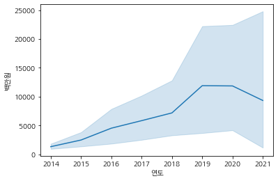
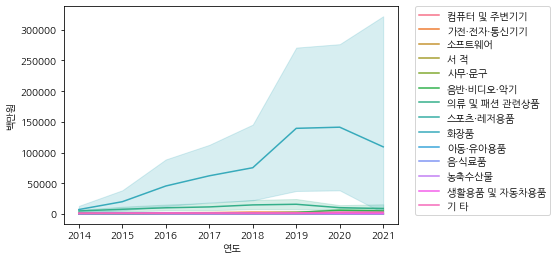
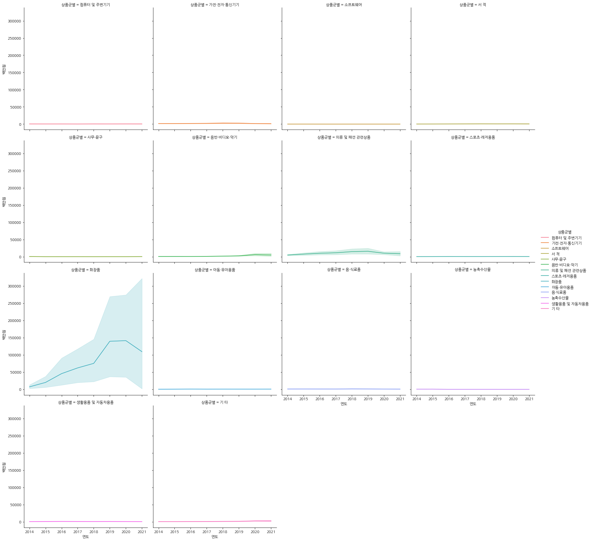
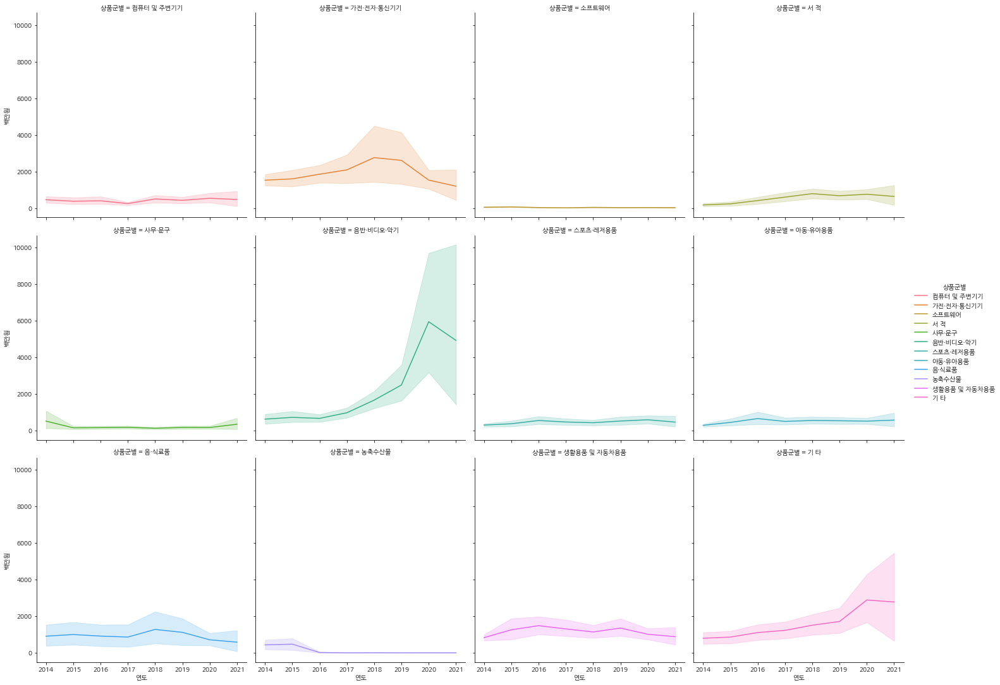
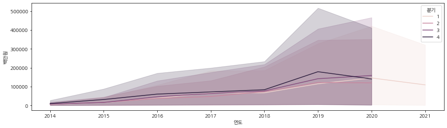
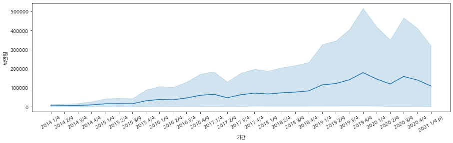
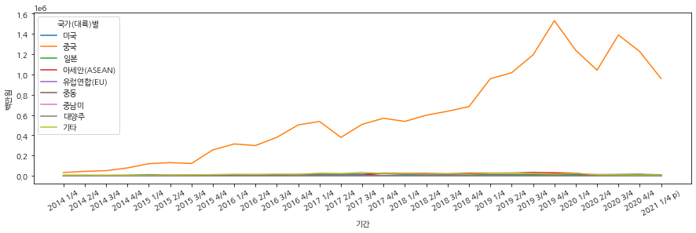
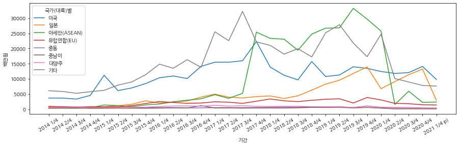
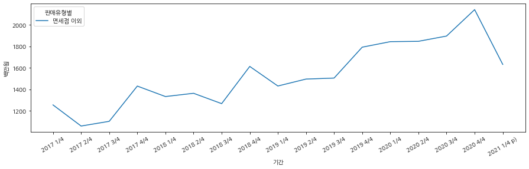

# 가설 :

## K-Beauty는 성장하고 있을까?

- 210630 ~


```python
import pandas as pd
import seaborn as sns
import matplotlib.pyplot as plt
plt.rcParams['font.family'] = 'NanumGothic'
```


```python
df_raw = pd.read_csv("국가_대륙_별_상품군별_온라인쇼핑_해외직접판매액_20210630151743.csv",encoding='cp949')
df_raw.shape
```


    (450, 32)


```python
df_raw['국가(대륙)별'].value_counts()
```


    아세안(ASEAN)    45
    기타            45
    중동            45
    대양주           45
    미국            45
    중국            45
    중남미           45
    일본            45
    합계            45
    유럽연합(EU)      45
    Name: 국가(대륙)별, dtype: int64


```python
df_raw[df_raw['국가(대륙)별']== '미국'] #미국 데이터만
```


<div>
<style scoped>
    .dataframe tbody tr th:only-of-type {
        vertical-align: middle;
    }

    .dataframe tbody tr th {
        vertical-align: top;
    }

    .dataframe thead th {
        text-align: right;
    }
</style>
<table border="1" class="dataframe">
  <thead>
    <tr style="text-align: right;">
      <th></th>
      <th>국가(대륙)별</th>
      <th>상품군별</th>
      <th>판매유형별</th>
      <th>2014 1/4</th>
      <th>2014 2/4</th>
      <th>2014 3/4</th>
      <th>2014 4/4</th>
      <th>2015 1/4</th>
      <th>2015 2/4</th>
      <th>2015 3/4</th>
      <th>...</th>
      <th>2018 4/4</th>
      <th>2019 1/4</th>
      <th>2019 2/4</th>
      <th>2019 3/4</th>
      <th>2019 4/4</th>
      <th>2020 1/4</th>
      <th>2020 2/4</th>
      <th>2020 3/4</th>
      <th>2020 4/4</th>
      <th>2021 1/4 p)</th>
    </tr>
  </thead>
  <tbody>
    <tr>
      <th>45</th>
      <td>미국</td>
      <td>합계</td>
      <td>계</td>
      <td>25773</td>
      <td>22573</td>
      <td>21288</td>
      <td>26729</td>
      <td>39945</td>
      <td>26654</td>
      <td>28647</td>
      <td>...</td>
      <td>48978</td>
      <td>40985</td>
      <td>44973</td>
      <td>55512</td>
      <td>54054</td>
      <td>49155</td>
      <td>66057</td>
      <td>67693</td>
      <td>72531</td>
      <td>60887</td>
    </tr>
    <tr>
      <th>46</th>
      <td>미국</td>
      <td>합계</td>
      <td>면세점</td>
      <td>-</td>
      <td>-</td>
      <td>-</td>
      <td>-</td>
      <td>-</td>
      <td>-</td>
      <td>-</td>
      <td>...</td>
      <td>2079</td>
      <td>2657</td>
      <td>2951</td>
      <td>1818</td>
      <td>1481</td>
      <td>698</td>
      <td>339</td>
      <td>81</td>
      <td>67</td>
      <td>56</td>
    </tr>
    <tr>
      <th>47</th>
      <td>미국</td>
      <td>합계</td>
      <td>면세점 이외</td>
      <td>-</td>
      <td>-</td>
      <td>-</td>
      <td>-</td>
      <td>-</td>
      <td>-</td>
      <td>-</td>
      <td>...</td>
      <td>46899</td>
      <td>38328</td>
      <td>42022</td>
      <td>53694</td>
      <td>52573</td>
      <td>48457</td>
      <td>65718</td>
      <td>67612</td>
      <td>72464</td>
      <td>60831</td>
    </tr>
    <tr>
      <th>48</th>
      <td>미국</td>
      <td>컴퓨터 및 주변기기</td>
      <td>계</td>
      <td>2216</td>
      <td>1666</td>
      <td>1776</td>
      <td>1675</td>
      <td>1469</td>
      <td>1393</td>
      <td>2166</td>
      <td>...</td>
      <td>1774</td>
      <td>1298</td>
      <td>1408</td>
      <td>1653</td>
      <td>1383</td>
      <td>1182</td>
      <td>1631</td>
      <td>1866</td>
      <td>1368</td>
      <td>1636</td>
    </tr>
    <tr>
      <th>49</th>
      <td>미국</td>
      <td>컴퓨터 및 주변기기</td>
      <td>면세점</td>
      <td>-</td>
      <td>-</td>
      <td>-</td>
      <td>-</td>
      <td>-</td>
      <td>-</td>
      <td>-</td>
      <td>...</td>
      <td>1</td>
      <td>0</td>
      <td>0</td>
      <td>0</td>
      <td>0</td>
      <td>0</td>
      <td>0</td>
      <td>0</td>
      <td>0</td>
      <td>0</td>
    </tr>
    <tr>
      <th>50</th>
      <td>미국</td>
      <td>컴퓨터 및 주변기기</td>
      <td>면세점 이외</td>
      <td>-</td>
      <td>-</td>
      <td>-</td>
      <td>-</td>
      <td>-</td>
      <td>-</td>
      <td>-</td>
      <td>...</td>
      <td>1773</td>
      <td>1298</td>
      <td>1408</td>
      <td>1653</td>
      <td>1383</td>
      <td>1182</td>
      <td>1631</td>
      <td>1866</td>
      <td>1368</td>
      <td>1636</td>
    </tr>
    <tr>
      <th>51</th>
      <td>미국</td>
      <td>가전·전자·통신기기</td>
      <td>계</td>
      <td>2875</td>
      <td>2758</td>
      <td>2894</td>
      <td>3527</td>
      <td>4397</td>
      <td>3589</td>
      <td>2982</td>
      <td>...</td>
      <td>1886</td>
      <td>1845</td>
      <td>1837</td>
      <td>3166</td>
      <td>1787</td>
      <td>1830</td>
      <td>2824</td>
      <td>3291</td>
      <td>2177</td>
      <td>1917</td>
    </tr>
    <tr>
      <th>52</th>
      <td>미국</td>
      <td>가전·전자·통신기기</td>
      <td>면세점</td>
      <td>-</td>
      <td>-</td>
      <td>-</td>
      <td>-</td>
      <td>-</td>
      <td>-</td>
      <td>-</td>
      <td>...</td>
      <td>52</td>
      <td>66</td>
      <td>116</td>
      <td>107</td>
      <td>49</td>
      <td>12</td>
      <td>2</td>
      <td>5</td>
      <td>1</td>
      <td>1</td>
    </tr>
    <tr>
      <th>53</th>
      <td>미국</td>
      <td>가전·전자·통신기기</td>
      <td>면세점 이외</td>
      <td>-</td>
      <td>-</td>
      <td>-</td>
      <td>-</td>
      <td>-</td>
      <td>-</td>
      <td>-</td>
      <td>...</td>
      <td>1834</td>
      <td>1779</td>
      <td>1721</td>
      <td>3059</td>
      <td>1738</td>
      <td>1818</td>
      <td>2822</td>
      <td>3286</td>
      <td>2176</td>
      <td>1916</td>
    </tr>
    <tr>
      <th>54</th>
      <td>미국</td>
      <td>소프트웨어</td>
      <td>계</td>
      <td>47</td>
      <td>57</td>
      <td>49</td>
      <td>128</td>
      <td>182</td>
      <td>113</td>
      <td>163</td>
      <td>...</td>
      <td>269</td>
      <td>88</td>
      <td>156</td>
      <td>118</td>
      <td>338</td>
      <td>135</td>
      <td>182</td>
      <td>212</td>
      <td>330</td>
      <td>173</td>
    </tr>
    <tr>
      <th>55</th>
      <td>미국</td>
      <td>소프트웨어</td>
      <td>면세점</td>
      <td>-</td>
      <td>-</td>
      <td>-</td>
      <td>-</td>
      <td>-</td>
      <td>-</td>
      <td>-</td>
      <td>...</td>
      <td>0</td>
      <td>0</td>
      <td>0</td>
      <td>0</td>
      <td>0</td>
      <td>0</td>
      <td>0</td>
      <td>0</td>
      <td>0</td>
      <td>0</td>
    </tr>
    <tr>
      <th>56</th>
      <td>미국</td>
      <td>소프트웨어</td>
      <td>면세점 이외</td>
      <td>-</td>
      <td>-</td>
      <td>-</td>
      <td>-</td>
      <td>-</td>
      <td>-</td>
      <td>-</td>
      <td>...</td>
      <td>269</td>
      <td>88</td>
      <td>156</td>
      <td>118</td>
      <td>338</td>
      <td>135</td>
      <td>182</td>
      <td>212</td>
      <td>330</td>
      <td>173</td>
    </tr>
    <tr>
      <th>57</th>
      <td>미국</td>
      <td>서 적</td>
      <td>계</td>
      <td>962</td>
      <td>720</td>
      <td>934</td>
      <td>1006</td>
      <td>1074</td>
      <td>837</td>
      <td>993</td>
      <td>...</td>
      <td>1977</td>
      <td>2259</td>
      <td>1563</td>
      <td>2596</td>
      <td>1720</td>
      <td>2135</td>
      <td>2404</td>
      <td>2526</td>
      <td>2538</td>
      <td>2512</td>
    </tr>
    <tr>
      <th>58</th>
      <td>미국</td>
      <td>서 적</td>
      <td>면세점</td>
      <td>-</td>
      <td>-</td>
      <td>-</td>
      <td>-</td>
      <td>-</td>
      <td>-</td>
      <td>-</td>
      <td>...</td>
      <td>0</td>
      <td>0</td>
      <td>0</td>
      <td>0</td>
      <td>0</td>
      <td>0</td>
      <td>0</td>
      <td>0</td>
      <td>0</td>
      <td>0</td>
    </tr>
    <tr>
      <th>59</th>
      <td>미국</td>
      <td>서 적</td>
      <td>면세점 이외</td>
      <td>-</td>
      <td>-</td>
      <td>-</td>
      <td>-</td>
      <td>-</td>
      <td>-</td>
      <td>-</td>
      <td>...</td>
      <td>1977</td>
      <td>2259</td>
      <td>1563</td>
      <td>2596</td>
      <td>1720</td>
      <td>2135</td>
      <td>2404</td>
      <td>2526</td>
      <td>2538</td>
      <td>2512</td>
    </tr>
    <tr>
      <th>60</th>
      <td>미국</td>
      <td>사무·문구</td>
      <td>계</td>
      <td>25</td>
      <td>10</td>
      <td>14</td>
      <td>18</td>
      <td>568</td>
      <td>17</td>
      <td>32</td>
      <td>...</td>
      <td>83</td>
      <td>198</td>
      <td>72</td>
      <td>83</td>
      <td>101</td>
      <td>74</td>
      <td>85</td>
      <td>86</td>
      <td>149</td>
      <td>1358</td>
    </tr>
    <tr>
      <th>61</th>
      <td>미국</td>
      <td>사무·문구</td>
      <td>면세점</td>
      <td>-</td>
      <td>-</td>
      <td>-</td>
      <td>-</td>
      <td>-</td>
      <td>-</td>
      <td>-</td>
      <td>...</td>
      <td>0</td>
      <td>0</td>
      <td>0</td>
      <td>0</td>
      <td>0</td>
      <td>0</td>
      <td>0</td>
      <td>0</td>
      <td>0</td>
      <td>0</td>
    </tr>
    <tr>
      <th>62</th>
      <td>미국</td>
      <td>사무·문구</td>
      <td>면세점 이외</td>
      <td>-</td>
      <td>-</td>
      <td>-</td>
      <td>-</td>
      <td>-</td>
      <td>-</td>
      <td>-</td>
      <td>...</td>
      <td>83</td>
      <td>198</td>
      <td>72</td>
      <td>83</td>
      <td>101</td>
      <td>74</td>
      <td>85</td>
      <td>86</td>
      <td>149</td>
      <td>1358</td>
    </tr>
    <tr>
      <th>63</th>
      <td>미국</td>
      <td>음반·비디오·악기</td>
      <td>계</td>
      <td>787</td>
      <td>720</td>
      <td>722</td>
      <td>821</td>
      <td>849</td>
      <td>781</td>
      <td>827</td>
      <td>...</td>
      <td>4550</td>
      <td>3857</td>
      <td>5191</td>
      <td>5762</td>
      <td>4786</td>
      <td>5258</td>
      <td>7516</td>
      <td>9854</td>
      <td>10289</td>
      <td>8102</td>
    </tr>
    <tr>
      <th>64</th>
      <td>미국</td>
      <td>음반·비디오·악기</td>
      <td>면세점</td>
      <td>-</td>
      <td>-</td>
      <td>-</td>
      <td>-</td>
      <td>-</td>
      <td>-</td>
      <td>-</td>
      <td>...</td>
      <td>0</td>
      <td>0</td>
      <td>0</td>
      <td>0</td>
      <td>0</td>
      <td>0</td>
      <td>0</td>
      <td>0</td>
      <td>0</td>
      <td>0</td>
    </tr>
    <tr>
      <th>65</th>
      <td>미국</td>
      <td>음반·비디오·악기</td>
      <td>면세점 이외</td>
      <td>-</td>
      <td>-</td>
      <td>-</td>
      <td>-</td>
      <td>-</td>
      <td>-</td>
      <td>-</td>
      <td>...</td>
      <td>4550</td>
      <td>3857</td>
      <td>5191</td>
      <td>5762</td>
      <td>4786</td>
      <td>5258</td>
      <td>7516</td>
      <td>9854</td>
      <td>10289</td>
      <td>8102</td>
    </tr>
    <tr>
      <th>66</th>
      <td>미국</td>
      <td>의류 및 패션 관련상품</td>
      <td>계</td>
      <td>9810</td>
      <td>7801</td>
      <td>6404</td>
      <td>9208</td>
      <td>8602</td>
      <td>6927</td>
      <td>8055</td>
      <td>...</td>
      <td>13658</td>
      <td>12324</td>
      <td>13683</td>
      <td>13368</td>
      <td>16161</td>
      <td>12773</td>
      <td>23115</td>
      <td>21888</td>
      <td>23521</td>
      <td>18181</td>
    </tr>
    <tr>
      <th>67</th>
      <td>미국</td>
      <td>의류 및 패션 관련상품</td>
      <td>면세점</td>
      <td>-</td>
      <td>-</td>
      <td>-</td>
      <td>-</td>
      <td>-</td>
      <td>-</td>
      <td>-</td>
      <td>...</td>
      <td>118</td>
      <td>110</td>
      <td>115</td>
      <td>95</td>
      <td>91</td>
      <td>36</td>
      <td>-5</td>
      <td>22</td>
      <td>0</td>
      <td>14</td>
    </tr>
    <tr>
      <th>68</th>
      <td>미국</td>
      <td>의류 및 패션 관련상품</td>
      <td>면세점 이외</td>
      <td>-</td>
      <td>-</td>
      <td>-</td>
      <td>-</td>
      <td>-</td>
      <td>-</td>
      <td>-</td>
      <td>...</td>
      <td>13540</td>
      <td>12214</td>
      <td>13568</td>
      <td>13273</td>
      <td>16070</td>
      <td>12737</td>
      <td>23120</td>
      <td>21866</td>
      <td>23521</td>
      <td>18167</td>
    </tr>
    <tr>
      <th>69</th>
      <td>미국</td>
      <td>스포츠·레저용품</td>
      <td>계</td>
      <td>573</td>
      <td>539</td>
      <td>475</td>
      <td>491</td>
      <td>541</td>
      <td>527</td>
      <td>481</td>
      <td>...</td>
      <td>1072</td>
      <td>1152</td>
      <td>1602</td>
      <td>3150</td>
      <td>864</td>
      <td>953</td>
      <td>1641</td>
      <td>1791</td>
      <td>1477</td>
      <td>939</td>
    </tr>
    <tr>
      <th>70</th>
      <td>미국</td>
      <td>스포츠·레저용품</td>
      <td>면세점</td>
      <td>-</td>
      <td>-</td>
      <td>-</td>
      <td>-</td>
      <td>-</td>
      <td>-</td>
      <td>-</td>
      <td>...</td>
      <td>3</td>
      <td>4</td>
      <td>0</td>
      <td>0</td>
      <td>0</td>
      <td>0</td>
      <td>0</td>
      <td>0</td>
      <td>0</td>
      <td>0</td>
    </tr>
    <tr>
      <th>71</th>
      <td>미국</td>
      <td>스포츠·레저용품</td>
      <td>면세점 이외</td>
      <td>-</td>
      <td>-</td>
      <td>-</td>
      <td>-</td>
      <td>-</td>
      <td>-</td>
      <td>-</td>
      <td>...</td>
      <td>1069</td>
      <td>1148</td>
      <td>1602</td>
      <td>3150</td>
      <td>864</td>
      <td>953</td>
      <td>1641</td>
      <td>1791</td>
      <td>1477</td>
      <td>939</td>
    </tr>
    <tr>
      <th>72</th>
      <td>미국</td>
      <td>화장품</td>
      <td>계</td>
      <td>3740</td>
      <td>3713</td>
      <td>3399</td>
      <td>4595</td>
      <td>11223</td>
      <td>6176</td>
      <td>7061</td>
      <td>...</td>
      <td>15738</td>
      <td>10817</td>
      <td>11310</td>
      <td>13999</td>
      <td>13494</td>
      <td>12471</td>
      <td>11819</td>
      <td>12088</td>
      <td>14127</td>
      <td>9849</td>
    </tr>
    <tr>
      <th>73</th>
      <td>미국</td>
      <td>화장품</td>
      <td>면세점</td>
      <td>-</td>
      <td>-</td>
      <td>-</td>
      <td>-</td>
      <td>-</td>
      <td>-</td>
      <td>-</td>
      <td>...</td>
      <td>1780</td>
      <td>2366</td>
      <td>2647</td>
      <td>1550</td>
      <td>1271</td>
      <td>625</td>
      <td>337</td>
      <td>47</td>
      <td>54</td>
      <td>28</td>
    </tr>
    <tr>
      <th>74</th>
      <td>미국</td>
      <td>화장품</td>
      <td>면세점 이외</td>
      <td>-</td>
      <td>-</td>
      <td>-</td>
      <td>-</td>
      <td>-</td>
      <td>-</td>
      <td>-</td>
      <td>...</td>
      <td>13958</td>
      <td>8451</td>
      <td>8663</td>
      <td>12449</td>
      <td>12223</td>
      <td>11846</td>
      <td>11482</td>
      <td>12041</td>
      <td>14073</td>
      <td>9821</td>
    </tr>
    <tr>
      <th>75</th>
      <td>미국</td>
      <td>아동·유아용품</td>
      <td>계</td>
      <td>583</td>
      <td>546</td>
      <td>499</td>
      <td>610</td>
      <td>1099</td>
      <td>603</td>
      <td>619</td>
      <td>...</td>
      <td>1056</td>
      <td>815</td>
      <td>1153</td>
      <td>1702</td>
      <td>1928</td>
      <td>945</td>
      <td>1344</td>
      <td>1231</td>
      <td>1390</td>
      <td>1882</td>
    </tr>
    <tr>
      <th>76</th>
      <td>미국</td>
      <td>아동·유아용품</td>
      <td>면세점</td>
      <td>-</td>
      <td>-</td>
      <td>-</td>
      <td>-</td>
      <td>-</td>
      <td>-</td>
      <td>-</td>
      <td>...</td>
      <td>0</td>
      <td>0</td>
      <td>0</td>
      <td>0</td>
      <td>0</td>
      <td>0</td>
      <td>0</td>
      <td>0</td>
      <td>0</td>
      <td>0</td>
    </tr>
    <tr>
      <th>77</th>
      <td>미국</td>
      <td>아동·유아용품</td>
      <td>면세점 이외</td>
      <td>-</td>
      <td>-</td>
      <td>-</td>
      <td>-</td>
      <td>-</td>
      <td>-</td>
      <td>-</td>
      <td>...</td>
      <td>1056</td>
      <td>815</td>
      <td>1153</td>
      <td>1702</td>
      <td>1928</td>
      <td>945</td>
      <td>1344</td>
      <td>1231</td>
      <td>1390</td>
      <td>1882</td>
    </tr>
    <tr>
      <th>78</th>
      <td>미국</td>
      <td>음·식료품</td>
      <td>계</td>
      <td>381</td>
      <td>415</td>
      <td>405</td>
      <td>673</td>
      <td>577</td>
      <td>628</td>
      <td>631</td>
      <td>...</td>
      <td>278</td>
      <td>336</td>
      <td>313</td>
      <td>602</td>
      <td>424</td>
      <td>1189</td>
      <td>478</td>
      <td>471</td>
      <td>614</td>
      <td>603</td>
    </tr>
    <tr>
      <th>79</th>
      <td>미국</td>
      <td>음·식료품</td>
      <td>면세점</td>
      <td>-</td>
      <td>-</td>
      <td>-</td>
      <td>-</td>
      <td>-</td>
      <td>-</td>
      <td>-</td>
      <td>...</td>
      <td>125</td>
      <td>111</td>
      <td>73</td>
      <td>64</td>
      <td>70</td>
      <td>25</td>
      <td>5</td>
      <td>7</td>
      <td>12</td>
      <td>13</td>
    </tr>
    <tr>
      <th>80</th>
      <td>미국</td>
      <td>음·식료품</td>
      <td>면세점 이외</td>
      <td>-</td>
      <td>-</td>
      <td>-</td>
      <td>-</td>
      <td>-</td>
      <td>-</td>
      <td>-</td>
      <td>...</td>
      <td>153</td>
      <td>225</td>
      <td>240</td>
      <td>538</td>
      <td>354</td>
      <td>1164</td>
      <td>473</td>
      <td>464</td>
      <td>602</td>
      <td>590</td>
    </tr>
    <tr>
      <th>81</th>
      <td>미국</td>
      <td>농축수산물</td>
      <td>계</td>
      <td>94</td>
      <td>98</td>
      <td>111</td>
      <td>160</td>
      <td>189</td>
      <td>192</td>
      <td>193</td>
      <td>...</td>
      <td>33</td>
      <td>2</td>
      <td>2</td>
      <td>7</td>
      <td>2</td>
      <td>2</td>
      <td>12</td>
      <td>8</td>
      <td>11</td>
      <td>10</td>
    </tr>
    <tr>
      <th>82</th>
      <td>미국</td>
      <td>농축수산물</td>
      <td>면세점</td>
      <td>-</td>
      <td>-</td>
      <td>-</td>
      <td>-</td>
      <td>-</td>
      <td>-</td>
      <td>-</td>
      <td>...</td>
      <td>0</td>
      <td>0</td>
      <td>0</td>
      <td>0</td>
      <td>0</td>
      <td>0</td>
      <td>0</td>
      <td>0</td>
      <td>0</td>
      <td>0</td>
    </tr>
    <tr>
      <th>83</th>
      <td>미국</td>
      <td>농축수산물</td>
      <td>면세점 이외</td>
      <td>-</td>
      <td>-</td>
      <td>-</td>
      <td>-</td>
      <td>-</td>
      <td>-</td>
      <td>-</td>
      <td>...</td>
      <td>33</td>
      <td>2</td>
      <td>2</td>
      <td>7</td>
      <td>2</td>
      <td>2</td>
      <td>12</td>
      <td>8</td>
      <td>11</td>
      <td>10</td>
    </tr>
    <tr>
      <th>84</th>
      <td>미국</td>
      <td>생활용품 및 자동차용품</td>
      <td>계</td>
      <td>1931</td>
      <td>1915</td>
      <td>1815</td>
      <td>1871</td>
      <td>6605</td>
      <td>2189</td>
      <td>2207</td>
      <td>...</td>
      <td>2159</td>
      <td>2174</td>
      <td>2410</td>
      <td>3409</td>
      <td>3713</td>
      <td>2255</td>
      <td>3214</td>
      <td>3001</td>
      <td>2941</td>
      <td>2585</td>
    </tr>
    <tr>
      <th>85</th>
      <td>미국</td>
      <td>생활용품 및 자동차용품</td>
      <td>면세점</td>
      <td>-</td>
      <td>-</td>
      <td>-</td>
      <td>-</td>
      <td>-</td>
      <td>-</td>
      <td>-</td>
      <td>...</td>
      <td>0</td>
      <td>0</td>
      <td>0</td>
      <td>2</td>
      <td>0</td>
      <td>0</td>
      <td>0</td>
      <td>0</td>
      <td>0</td>
      <td>0</td>
    </tr>
    <tr>
      <th>86</th>
      <td>미국</td>
      <td>생활용품 및 자동차용품</td>
      <td>면세점 이외</td>
      <td>-</td>
      <td>-</td>
      <td>-</td>
      <td>-</td>
      <td>-</td>
      <td>-</td>
      <td>-</td>
      <td>...</td>
      <td>2159</td>
      <td>2174</td>
      <td>2410</td>
      <td>3407</td>
      <td>3713</td>
      <td>2255</td>
      <td>3214</td>
      <td>3001</td>
      <td>2941</td>
      <td>2585</td>
    </tr>
    <tr>
      <th>87</th>
      <td>미국</td>
      <td>기 타</td>
      <td>계</td>
      <td>1749</td>
      <td>1615</td>
      <td>1791</td>
      <td>1946</td>
      <td>2570</td>
      <td>2682</td>
      <td>2237</td>
      <td>...</td>
      <td>4445</td>
      <td>3820</td>
      <td>4273</td>
      <td>5897</td>
      <td>7353</td>
      <td>7953</td>
      <td>9792</td>
      <td>9380</td>
      <td>11599</td>
      <td>11140</td>
    </tr>
    <tr>
      <th>88</th>
      <td>미국</td>
      <td>기 타</td>
      <td>면세점</td>
      <td>-</td>
      <td>-</td>
      <td>-</td>
      <td>-</td>
      <td>-</td>
      <td>-</td>
      <td>-</td>
      <td>...</td>
      <td>0</td>
      <td>0</td>
      <td>0</td>
      <td>0</td>
      <td>0</td>
      <td>0</td>
      <td>0</td>
      <td>0</td>
      <td>0</td>
      <td>0</td>
    </tr>
    <tr>
      <th>89</th>
      <td>미국</td>
      <td>기 타</td>
      <td>면세점 이외</td>
      <td>-</td>
      <td>-</td>
      <td>-</td>
      <td>-</td>
      <td>-</td>
      <td>-</td>
      <td>-</td>
      <td>...</td>
      <td>4445</td>
      <td>3820</td>
      <td>4273</td>
      <td>5897</td>
      <td>7353</td>
      <td>7953</td>
      <td>9792</td>
      <td>9380</td>
      <td>11599</td>
      <td>11140</td>
    </tr>
  </tbody>
</table>
<p>45 rows × 32 columns</p>
</div>


# Tidy Data : 칼럼을 행으로 삽입


```python
df_raw.columns
```


    Index(['국가(대륙)별', '상품군별', '판매유형별', '2014 1/4', '2014 2/4', '2014 3/4',
           '2014 4/4', '2015 1/4', '2015 2/4', '2015 3/4', '2015 4/4', '2016 1/4',
           '2016 2/4', '2016 3/4', '2016 4/4', '2017 1/4', '2017 2/4', '2017 3/4',
           '2017 4/4', '2018 1/4', '2018 2/4', '2018 3/4', '2018 4/4', '2019 1/4',
           '2019 2/4', '2019 3/4', '2019 4/4', '2020 1/4', '2020 2/4', '2020 3/4',
           '2020 4/4', '2021 1/4 p)'],
          dtype='object')


```python
df=df_raw.melt(id_vars=['국가(대륙)별','상품군별','판매유형별'],
            var_name='기간',value_name='백만원')
df
```


<div>
<style scoped>
    .dataframe tbody tr th:only-of-type {
        vertical-align: middle;
    }

    .dataframe tbody tr th {
        vertical-align: top;
    }

    .dataframe thead th {
        text-align: right;
    }
</style>
<table border="1" class="dataframe">
  <thead>
    <tr style="text-align: right;">
      <th></th>
      <th>국가(대륙)별</th>
      <th>상품군별</th>
      <th>판매유형별</th>
      <th>기간</th>
      <th>백만원</th>
    </tr>
  </thead>
  <tbody>
    <tr>
      <th>0</th>
      <td>합계</td>
      <td>합계</td>
      <td>계</td>
      <td>2014 1/4</td>
      <td>148272</td>
    </tr>
    <tr>
      <th>1</th>
      <td>합계</td>
      <td>합계</td>
      <td>면세점</td>
      <td>2014 1/4</td>
      <td>-</td>
    </tr>
    <tr>
      <th>2</th>
      <td>합계</td>
      <td>합계</td>
      <td>면세점 이외</td>
      <td>2014 1/4</td>
      <td>-</td>
    </tr>
    <tr>
      <th>3</th>
      <td>합계</td>
      <td>컴퓨터 및 주변기기</td>
      <td>계</td>
      <td>2014 1/4</td>
      <td>4915</td>
    </tr>
    <tr>
      <th>4</th>
      <td>합계</td>
      <td>컴퓨터 및 주변기기</td>
      <td>면세점</td>
      <td>2014 1/4</td>
      <td>-</td>
    </tr>
    <tr>
      <th>...</th>
      <td>...</td>
      <td>...</td>
      <td>...</td>
      <td>...</td>
      <td>...</td>
    </tr>
    <tr>
      <th>13045</th>
      <td>기타</td>
      <td>생활용품 및 자동차용품</td>
      <td>면세점</td>
      <td>2021 1/4 p)</td>
      <td>0</td>
    </tr>
    <tr>
      <th>13046</th>
      <td>기타</td>
      <td>생활용품 및 자동차용품</td>
      <td>면세점 이외</td>
      <td>2021 1/4 p)</td>
      <td>338</td>
    </tr>
    <tr>
      <th>13047</th>
      <td>기타</td>
      <td>기 타</td>
      <td>계</td>
      <td>2021 1/4 p)</td>
      <td>823</td>
    </tr>
    <tr>
      <th>13048</th>
      <td>기타</td>
      <td>기 타</td>
      <td>면세점</td>
      <td>2021 1/4 p)</td>
      <td>0</td>
    </tr>
    <tr>
      <th>13049</th>
      <td>기타</td>
      <td>기 타</td>
      <td>면세점 이외</td>
      <td>2021 1/4 p)</td>
      <td>823</td>
    </tr>
  </tbody>
</table>
<p>13050 rows × 5 columns</p>
</div>


```python
df.shape
```


    (13050, 5)


```python
df.head()
```


<div>
<style scoped>
    .dataframe tbody tr th:only-of-type {
        vertical-align: middle;
    }

    .dataframe tbody tr th {
        vertical-align: top;
    }

    .dataframe thead th {
        text-align: right;
    }
</style>
<table border="1" class="dataframe">
  <thead>
    <tr style="text-align: right;">
      <th></th>
      <th>국가(대륙)별</th>
      <th>상품군별</th>
      <th>판매유형별</th>
      <th>기간</th>
      <th>백만원</th>
    </tr>
  </thead>
  <tbody>
    <tr>
      <th>0</th>
      <td>합계</td>
      <td>합계</td>
      <td>계</td>
      <td>2014 1/4</td>
      <td>148272</td>
    </tr>
    <tr>
      <th>1</th>
      <td>합계</td>
      <td>합계</td>
      <td>면세점</td>
      <td>2014 1/4</td>
      <td>-</td>
    </tr>
    <tr>
      <th>2</th>
      <td>합계</td>
      <td>합계</td>
      <td>면세점 이외</td>
      <td>2014 1/4</td>
      <td>-</td>
    </tr>
    <tr>
      <th>3</th>
      <td>합계</td>
      <td>컴퓨터 및 주변기기</td>
      <td>계</td>
      <td>2014 1/4</td>
      <td>4915</td>
    </tr>
    <tr>
      <th>4</th>
      <td>합계</td>
      <td>컴퓨터 및 주변기기</td>
      <td>면세점</td>
      <td>2014 1/4</td>
      <td>-</td>
    </tr>
  </tbody>
</table>
</div>


```python
df.info()
```

    <class 'pandas.core.frame.DataFrame'>
    RangeIndex: 13050 entries, 0 to 13049
    Data columns (total 5 columns):
     #   Column   Non-Null Count  Dtype 
    ---  ------   --------------  ----- 
     0   국가(대륙)별  13050 non-null  object
     1   상품군별     13050 non-null  object
     2   판매유형별    13050 non-null  object
     3   기간       13050 non-null  object
     4   백만원      13050 non-null  object
    dtypes: object(5)
    memory usage: 509.9+ KB
    

## 데이터 전처리
-----------

## 기간에서 연도를 분리


```python
int("2019 4/4 p)".split()[0])
```


    2019


```python
df['연도'] = df['기간'].map(lambda x :int(x.split()[0]))
df.head()
```


<div>
<style scoped>
    .dataframe tbody tr th:only-of-type {
        vertical-align: middle;
    }

    .dataframe tbody tr th {
        vertical-align: top;
    }

    .dataframe thead th {
        text-align: right;
    }
</style>
<table border="1" class="dataframe">
  <thead>
    <tr style="text-align: right;">
      <th></th>
      <th>국가(대륙)별</th>
      <th>상품군별</th>
      <th>판매유형별</th>
      <th>기간</th>
      <th>백만원</th>
      <th>연도</th>
    </tr>
  </thead>
  <tbody>
    <tr>
      <th>0</th>
      <td>합계</td>
      <td>합계</td>
      <td>계</td>
      <td>2014 1/4</td>
      <td>148272</td>
      <td>2014</td>
    </tr>
    <tr>
      <th>1</th>
      <td>합계</td>
      <td>합계</td>
      <td>면세점</td>
      <td>2014 1/4</td>
      <td>-</td>
      <td>2014</td>
    </tr>
    <tr>
      <th>2</th>
      <td>합계</td>
      <td>합계</td>
      <td>면세점 이외</td>
      <td>2014 1/4</td>
      <td>-</td>
      <td>2014</td>
    </tr>
    <tr>
      <th>3</th>
      <td>합계</td>
      <td>컴퓨터 및 주변기기</td>
      <td>계</td>
      <td>2014 1/4</td>
      <td>4915</td>
      <td>2014</td>
    </tr>
    <tr>
      <th>4</th>
      <td>합계</td>
      <td>컴퓨터 및 주변기기</td>
      <td>면세점</td>
      <td>2014 1/4</td>
      <td>-</td>
      <td>2014</td>
    </tr>
  </tbody>
</table>
</div>


```python
"2019 4/4 p)".split()[1].split("/")[0]
df['분기']= df['기간'].map(lambda x: int(x.split()[1].split("/")[0]))
df.head()
```


<div>
<style scoped>
    .dataframe tbody tr th:only-of-type {
        vertical-align: middle;
    }

    .dataframe tbody tr th {
        vertical-align: top;
    }

    .dataframe thead th {
        text-align: right;
    }
</style>
<table border="1" class="dataframe">
  <thead>
    <tr style="text-align: right;">
      <th></th>
      <th>국가(대륙)별</th>
      <th>상품군별</th>
      <th>판매유형별</th>
      <th>기간</th>
      <th>백만원</th>
      <th>연도</th>
      <th>분기</th>
    </tr>
  </thead>
  <tbody>
    <tr>
      <th>0</th>
      <td>합계</td>
      <td>합계</td>
      <td>계</td>
      <td>2014 1/4</td>
      <td>148272</td>
      <td>2014</td>
      <td>1</td>
    </tr>
    <tr>
      <th>1</th>
      <td>합계</td>
      <td>합계</td>
      <td>면세점</td>
      <td>2014 1/4</td>
      <td>-</td>
      <td>2014</td>
      <td>1</td>
    </tr>
    <tr>
      <th>2</th>
      <td>합계</td>
      <td>합계</td>
      <td>면세점 이외</td>
      <td>2014 1/4</td>
      <td>-</td>
      <td>2014</td>
      <td>1</td>
    </tr>
    <tr>
      <th>3</th>
      <td>합계</td>
      <td>컴퓨터 및 주변기기</td>
      <td>계</td>
      <td>2014 1/4</td>
      <td>4915</td>
      <td>2014</td>
      <td>1</td>
    </tr>
    <tr>
      <th>4</th>
      <td>합계</td>
      <td>컴퓨터 및 주변기기</td>
      <td>면세점</td>
      <td>2014 1/4</td>
      <td>-</td>
      <td>2014</td>
      <td>1</td>
    </tr>
  </tbody>
</table>
</div>


```python
df['백만원']=df['백만원'].replace('-', pd.np.nan).astype(float)
df.head()
```

    <ipython-input-69-97a5492c0c1a>:1: FutureWarning: The pandas.np module is deprecated and will be removed from pandas in a future version. Import numpy directly instead
      df['백만원']=df['백만원'].replace('-', pd.np.nan).astype(float)
    


<div>
<style scoped>
    .dataframe tbody tr th:only-of-type {
        vertical-align: middle;
    }

    .dataframe tbody tr th {
        vertical-align: top;
    }

    .dataframe thead th {
        text-align: right;
    }
</style>
<table border="1" class="dataframe">
  <thead>
    <tr style="text-align: right;">
      <th></th>
      <th>국가(대륙)별</th>
      <th>상품군별</th>
      <th>판매유형별</th>
      <th>기간</th>
      <th>백만원</th>
      <th>연도</th>
      <th>분기</th>
    </tr>
  </thead>
  <tbody>
    <tr>
      <th>48</th>
      <td>미국</td>
      <td>컴퓨터 및 주변기기</td>
      <td>계</td>
      <td>2014 1/4</td>
      <td>2216.0</td>
      <td>2014</td>
      <td>1</td>
    </tr>
    <tr>
      <th>49</th>
      <td>미국</td>
      <td>컴퓨터 및 주변기기</td>
      <td>면세점</td>
      <td>2014 1/4</td>
      <td>NaN</td>
      <td>2014</td>
      <td>1</td>
    </tr>
    <tr>
      <th>50</th>
      <td>미국</td>
      <td>컴퓨터 및 주변기기</td>
      <td>면세점 이외</td>
      <td>2014 1/4</td>
      <td>NaN</td>
      <td>2014</td>
      <td>1</td>
    </tr>
    <tr>
      <th>51</th>
      <td>미국</td>
      <td>가전·전자·통신기기</td>
      <td>계</td>
      <td>2014 1/4</td>
      <td>2875.0</td>
      <td>2014</td>
      <td>1</td>
    </tr>
    <tr>
      <th>52</th>
      <td>미국</td>
      <td>가전·전자·통신기기</td>
      <td>면세점</td>
      <td>2014 1/4</td>
      <td>NaN</td>
      <td>2014</td>
      <td>1</td>
    </tr>
  </tbody>
</table>
</div>


```python
df.info()
```

    <class 'pandas.core.frame.DataFrame'>
    RangeIndex: 13050 entries, 0 to 13049
    Data columns (total 7 columns):
     #   Column   Non-Null Count  Dtype  
    ---  ------   --------------  -----  
     0   국가(대륙)별  13050 non-null  object 
     1   상품군별     13050 non-null  object 
     2   판매유형별    13050 non-null  object 
     3   기간       13050 non-null  object 
     4   백만원      9450 non-null   float64
     5   연도       13050 non-null  int64  
     6   분기       13050 non-null  int64  
    dtypes: float64(1), int64(2), object(4)
    memory usage: 713.8+ KB
    

## 필요없는 데이터 제거하기- 합계 데이터


```python
df = df[(df['국가(대륙)별'] != '합계') & (df['상품군별'] != '합계')].copy()
df.info()
```

    <class 'pandas.core.frame.DataFrame'>
    Int64Index: 10962 entries, 48 to 13049
    Data columns (total 7 columns):
     #   Column   Non-Null Count  Dtype  
    ---  ------   --------------  -----  
     0   국가(대륙)별  10962 non-null  object 
     1   상품군별     10962 non-null  object 
     2   판매유형별    10962 non-null  object 
     3   기간       10962 non-null  object 
     4   백만원      7938 non-null   float64
     5   연도       10962 non-null  int64  
     6   분기       10962 non-null  int64  
    dtypes: float64(1), int64(2), object(4)
    memory usage: 685.1+ KB
    

## 결측치


```python
df.isnull().sum()
```


    국가(대륙)별       0
    상품군별          0
    판매유형별         0
    기간            0
    백만원        3024
    연도            0
    분기            0
    dtype: int64


```python
df_total=df[df['판매유형별']=='계']
df_total.head()
```


<div>
<style scoped>
    .dataframe tbody tr th:only-of-type {
        vertical-align: middle;
    }

    .dataframe tbody tr th {
        vertical-align: top;
    }

    .dataframe thead th {
        text-align: right;
    }
</style>
<table border="1" class="dataframe">
  <thead>
    <tr style="text-align: right;">
      <th></th>
      <th>국가(대륙)별</th>
      <th>상품군별</th>
      <th>판매유형별</th>
      <th>기간</th>
      <th>백만원</th>
      <th>연도</th>
      <th>분기</th>
    </tr>
  </thead>
  <tbody>
    <tr>
      <th>48</th>
      <td>미국</td>
      <td>컴퓨터 및 주변기기</td>
      <td>계</td>
      <td>2014 1/4</td>
      <td>2216.0</td>
      <td>2014</td>
      <td>1</td>
    </tr>
    <tr>
      <th>51</th>
      <td>미국</td>
      <td>가전·전자·통신기기</td>
      <td>계</td>
      <td>2014 1/4</td>
      <td>2875.0</td>
      <td>2014</td>
      <td>1</td>
    </tr>
    <tr>
      <th>54</th>
      <td>미국</td>
      <td>소프트웨어</td>
      <td>계</td>
      <td>2014 1/4</td>
      <td>47.0</td>
      <td>2014</td>
      <td>1</td>
    </tr>
    <tr>
      <th>57</th>
      <td>미국</td>
      <td>서 적</td>
      <td>계</td>
      <td>2014 1/4</td>
      <td>962.0</td>
      <td>2014</td>
      <td>1</td>
    </tr>
    <tr>
      <th>60</th>
      <td>미국</td>
      <td>사무·문구</td>
      <td>계</td>
      <td>2014 1/4</td>
      <td>25.0</td>
      <td>2014</td>
      <td>1</td>
    </tr>
  </tbody>
</table>
</div>


```python
sns.lineplot(data=df_total, x='연도',y='백만원')
```


    <AxesSubplot:xlabel='연도', ylabel='백만원'>


    

    


```python
sns.lineplot(data=df_total, x='연도',y='백만원', hue= '상품군별')
plt.legend(bbox_to_anchor=(1.05,1), loc=2, borderaxespad=0.) #그래프 밖에다 그리기.
```


    <matplotlib.legend.Legend at 0x151fd2038e0>


    

    


```python
#자세히 보기위해 서브플롯으로 표시하기
sns.relplot(data=df_total, x='연도', y='백만원', hue='상품군별',kind='line',col='상품군별',col_wrap=4)
```


    <seaborn.axisgrid.FacetGrid at 0x151802f70a0>


    

    


```python
# 화장품값,의료 값이 너무커서 다른 값을 정확히 보기 어렵다.
# isin을 사용해 화장품,의류 및 패션 관련상품을 제외를 하고 df_sub 이라는 변수에 담는다.
df_sub = df_total[~df_total['상품군별'].isin(['화장품',"의류 및 패션 관련상품"])].copy()
```


```python
sns.relplot(data=df_sub, x='연도', y='백만원', hue='상품군별',kind='line',col='상품군별',col_wrap=4)
```


    <seaborn.axisgrid.FacetGrid at 0x15184e8e760>


    

    


## 화장품의 온라인쇼핑 해외직접판매액


```python
df_cosmetic = df_total[df_total['상품군별']=='화장품'].copy()
df_cosmetic['상품군별'].unique()
```


    array(['화장품'], dtype=object)


```python
plt.figure(figsize=(15,4))
sns.lineplot(data=df_cosmetic, x='연도',y='백만원',hue='분기')
```


    <AxesSubplot:xlabel='연도', ylabel='백만원'>


    

    


##  1,2,3 분기에 비해 4분기 그래프가 위에있다 = 성장하고 있다.


```python
plt.figure(figsize=(15,4))
plt.xticks(rotation=30)
sns.lineplot(data=df_cosmetic, x='기간',y='백만원')
```


    <AxesSubplot:xlabel='기간', ylabel='백만원'>


    

    


## 화장품 판매액은 꾸준히 증가해왔다.


```python
#국가(대륙)별로 알아보자.

plt.figure(figsize=(15,4))
plt.xticks(rotation=30)
sns.lineplot(data=df_cosmetic, x='기간',y='백만원',hue='국가(대륙)별')
```


    <AxesSubplot:xlabel='기간', ylabel='백만원'>


    

    


```python
# 중국수치가 높아서 빼고 다시 그렸다.

plt.figure(figsize=(15,4))
plt.xticks(rotation=30)
sns.lineplot(data=df_cosmetic[df_cosmetic['국가(대륙)별']!='중국'], x='기간',y='백만원',hue='국가(대륙)별')
```


    <AxesSubplot:xlabel='기간', ylabel='백만원'>


    

    


```python
# 판매유형별로 알아보자
plt.figure(figsize=(15,4))
plt.xticks(rotation=30)
df_sub=df[(df['판매유형별']!='계') & (df['판매유형별']!='면세점')].copy()
sns.lineplot(data=df_sub,x='기간',y='백만원',hue='판매유형별', ci=None)
```


    <AxesSubplot:xlabel='기간', ylabel='백만원'>


    

    


- 전체적으로 지속적으로 성장하고 있고, 중국,미국,일본 세 국가가 온라인 및 오프라인에서 많이 구매하고 있다.


```python

```


```python

```
