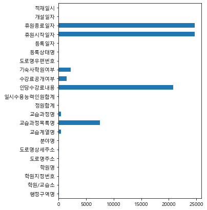
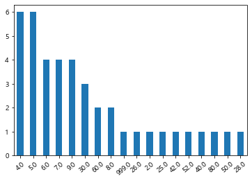
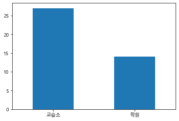

# Music in Hondae - 1

- 실습일

  210628
  
  210629


```python
import pandas as pd
import numpy as np
import seaborn as sns
```


```python
import matplotlib.pyplot as plt
from matplotlib import font_manager,rc

plt.rc('font',family= 'Malgun Gothic')  # 한글깨짐방지 두줄.
plt.rc('axes',unicode_minus=False)


# 그래프가 노트북 안에 보이게 하기 위해
%matplotlib inline
```


```python
df=pd.read_csv("서울특별시_학원_교습소정보.csv",low_memory=False,encoding='cp949')
```


```python
df.head(10)
```


<div>
<style scoped>
    .dataframe tbody tr th:only-of-type {
        vertical-align: middle;
    }

    .dataframe tbody tr th {
        vertical-align: top;
    }
    
    .dataframe thead th {
        text-align: right;
    }
</style>
<table border="1" class="dataframe">
  <thead>
    <tr style="text-align: right;">
      <th></th>
      <th>행정구역명</th>
      <th>학원/교습소</th>
      <th>학원지정번호</th>
      <th>학원명</th>
      <th>도로명주소</th>
      <th>도로명상세주소</th>
      <th>분야명</th>
      <th>교습계열명</th>
      <th>교습과정목록명</th>
      <th>교습과정명</th>
      <th>정원합계</th>
      <th>일시수용능력인원합계</th>
      <th>수강료공개여부</th>
      <th>기숙사학원여부</th>
      <th>도로명우편번호</th>
      <th>등록상태명</th>
      <th>등록일자</th>
      <th>개설일자</th>
      <th>적재일시</th>
    </tr>
  </thead>
  <tbody>
    <tr>
      <th>0</th>
      <td>동대문구</td>
      <td>학원</td>
      <td>1000000043</td>
      <td>도우리이용기술학원</td>
      <td>서울특별시 동대문구 왕산로33길 32</td>
      <td>/ 2층  (제기동)</td>
      <td>직업기술</td>
      <td>산업응용기술</td>
      <td>이?미용/</td>
      <td>이?미용</td>
      <td>40</td>
      <td>20.0</td>
      <td>Y</td>
      <td>N</td>
      <td>130862.0</td>
      <td>개원</td>
      <td>19670209</td>
      <td>19670209</td>
      <td>20210627</td>
    </tr>
    <tr>
      <th>1</th>
      <td>동대문구</td>
      <td>학원</td>
      <td>1000000064</td>
      <td>대성회계실무학원</td>
      <td>서울특별시 동대문구 왕산로 225</td>
      <td>/ 5층2호?5층6호?5층7호 중 일부(B호) (청량리동/ 미주상가)</td>
      <td>종합(대)</td>
      <td>NaN</td>
      <td>전산회계/컴퓨터(정보처리/통신기기/인터넷/소프트웨어)/</td>
      <td>NaN</td>
      <td>404</td>
      <td>129.0</td>
      <td>Y</td>
      <td>N</td>
      <td>2490.0</td>
      <td>개원</td>
      <td>19681227</td>
      <td>19681227</td>
      <td>20210627</td>
    </tr>
    <tr>
      <th>2</th>
      <td>동대문구</td>
      <td>학원</td>
      <td>1000000083</td>
      <td>국제전자과학학원</td>
      <td>서울특별시동대문구  고산자로36길3</td>
      <td>3층일부(제기동)</td>
      <td>직업기술</td>
      <td>산업기반기술</td>
      <td>전자/</td>
      <td>전자</td>
      <td>30</td>
      <td>91.0</td>
      <td>Y</td>
      <td>N</td>
      <td>130865.0</td>
      <td>개원</td>
      <td>19680210</td>
      <td>19680210</td>
      <td>20210627</td>
    </tr>
    <tr>
      <th>3</th>
      <td>동대문구</td>
      <td>학원</td>
      <td>1000000147</td>
      <td>조이앤플레이음악학원</td>
      <td>서울특별시 동대문구 이문로 38</td>
      <td>/ 3층 301호 (휘경동/ 민족통일빌딩)</td>
      <td>예능(대)</td>
      <td>예능(중)</td>
      <td>음악/</td>
      <td>음악</td>
      <td>98</td>
      <td>45.0</td>
      <td>Y</td>
      <td>N</td>
      <td>2445.0</td>
      <td>개원</td>
      <td>19720630</td>
      <td>19720630</td>
      <td>20210627</td>
    </tr>
    <tr>
      <th>4</th>
      <td>동대문구</td>
      <td>학원</td>
      <td>1000000151</td>
      <td>한독자동차정비학원</td>
      <td>서울특별시 동대문구 왕산로 31</td>
      <td>/ 2층/3층 (신설동)</td>
      <td>직업기술</td>
      <td>산업기반기술</td>
      <td>자동차/</td>
      <td>자동차</td>
      <td>300</td>
      <td>177.0</td>
      <td>Y</td>
      <td>N</td>
      <td>130811.0</td>
      <td>개원</td>
      <td>19720501</td>
      <td>19720501</td>
      <td>20210627</td>
    </tr>
    <tr>
      <th>5</th>
      <td>중랑구</td>
      <td>학원</td>
      <td>1000000293</td>
      <td>예맥보습학원</td>
      <td>서울특별시 중랑구 동일로151길 30</td>
      <td>2층3층 (묵동)</td>
      <td>입시.검정 및 보습</td>
      <td>보통교과</td>
      <td>보습/</td>
      <td>보습</td>
      <td>18</td>
      <td>152.0</td>
      <td>N</td>
      <td>NaN</td>
      <td>131852.0</td>
      <td>개원</td>
      <td>19881102</td>
      <td>19881102</td>
      <td>20210627</td>
    </tr>
    <tr>
      <th>6</th>
      <td>중랑구</td>
      <td>학원</td>
      <td>1000000420</td>
      <td>세진보습학원</td>
      <td>서울특별시 중랑구 공릉로 58</td>
      <td>2층4층일부 (묵동)</td>
      <td>입시.검정 및 보습</td>
      <td>보통교과</td>
      <td>보습?논술/</td>
      <td>보습?논술</td>
      <td>675</td>
      <td>110.0</td>
      <td>N</td>
      <td>N</td>
      <td>131848.0</td>
      <td>개원</td>
      <td>19880719</td>
      <td>19880719</td>
      <td>20210627</td>
    </tr>
    <tr>
      <th>7</th>
      <td>중랑구</td>
      <td>학원</td>
      <td>1000000511</td>
      <td>금파음악학원</td>
      <td>서울특별시 중랑구 동일로101길 52</td>
      <td>2층 (면목동)</td>
      <td>예능(대)</td>
      <td>예능(중)</td>
      <td>음악/</td>
      <td>음악</td>
      <td>117</td>
      <td>9.0</td>
      <td>Y</td>
      <td>N</td>
      <td>131823.0</td>
      <td>개원</td>
      <td>19880829</td>
      <td>19880829</td>
      <td>20210627</td>
    </tr>
    <tr>
      <th>8</th>
      <td>동대문구</td>
      <td>학원</td>
      <td>1000000714</td>
      <td>장안로드맵수학학원</td>
      <td>서울특별시 동대문구 한천로 124</td>
      <td>/ 2층 202호 (장안동)</td>
      <td>입시.검정 및 보습</td>
      <td>보통교과</td>
      <td>보습/</td>
      <td>보습</td>
      <td>154</td>
      <td>71.0</td>
      <td>Y</td>
      <td>N</td>
      <td>2623.0</td>
      <td>개원</td>
      <td>19891209</td>
      <td>19891209</td>
      <td>20210627</td>
    </tr>
    <tr>
      <th>9</th>
      <td>동대문구</td>
      <td>학원</td>
      <td>1000000776</td>
      <td>더하이스트수학학원</td>
      <td>서울특별시 동대문구 사가정로 190</td>
      <td>전농우성아파트 상가4층7/8/9호 (전농동)</td>
      <td>입시.검정 및 보습</td>
      <td>보통교과</td>
      <td>NaN</td>
      <td>보습?논술</td>
      <td>180</td>
      <td>68.0</td>
      <td>Y</td>
      <td>N</td>
      <td>130771.0</td>
      <td>개원</td>
      <td>19890619</td>
      <td>19890619</td>
      <td>20210627</td>
    </tr>
  </tbody>
</table>
</div>


```python
df.isnull().sum()
```


    행정구역명            59
    학원/교습소            0
    학원지정번호            0
    학원명               0
    도로명주소            13
    도로명상세주소         107
    분야명               0
    교습계열명           444
    교습과정목록명        7472
    교습과정명           442
    정원합계              0
    일시수용능력인원합계       63
    인당수강료내용       20819
    수강료공개여부        1452
    기숙사학원여부        2222
    도로명우편번호           1
    등록상태명             0
    등록일자              0
    휴원시작일자        24692
    휴원종료일자        24692
    개설일자              0
    적재일시              0
    dtype: int64


```python
null_count=df.isnull().sum()
```


```python
null_count.plot.barh(figsize=(5,7))
```


    <AxesSubplot:>


​    

​    


```python
null_count.reset_index()
#reset_index()는 데이터프레임 형태로 변환
df_null_count = null_count.reset_index()
```


```python
df_null_count.head()
```


<div>
<style scoped>
    .dataframe tbody tr th:only-of-type {
        vertical-align: middle;
    }

    .dataframe tbody tr th {
        vertical-align: top;
    }
    
    .dataframe thead th {
        text-align: right;
    }
</style>
<table border="1" class="dataframe">
  <thead>
    <tr style="text-align: right;">
      <th></th>
      <th>index</th>
      <th>0</th>
    </tr>
  </thead>
  <tbody>
    <tr>
      <th>0</th>
      <td>행정구역명</td>
      <td>59</td>
    </tr>
    <tr>
      <th>1</th>
      <td>학원/교습소</td>
      <td>0</td>
    </tr>
    <tr>
      <th>2</th>
      <td>학원지정번호</td>
      <td>0</td>
    </tr>
    <tr>
      <th>3</th>
      <td>학원명</td>
      <td>0</td>
    </tr>
    <tr>
      <th>4</th>
      <td>도로명주소</td>
      <td>13</td>
    </tr>
  </tbody>
</table>
</div>


```python
df_null_count.columns = ["컬럼명","결측치수"]
df_null_count.head()
```


<div>
<style scoped>
    .dataframe tbody tr th:only-of-type {
        vertical-align: middle;
    }

    .dataframe tbody tr th {
        vertical-align: top;
    }
    
    .dataframe thead th {
        text-align: right;
    }
</style>
<table border="1" class="dataframe">
  <thead>
    <tr style="text-align: right;">
      <th></th>
      <th>컬럼명</th>
      <th>결측치수</th>
    </tr>
  </thead>
  <tbody>
    <tr>
      <th>0</th>
      <td>행정구역명</td>
      <td>59</td>
    </tr>
    <tr>
      <th>1</th>
      <td>학원/교습소</td>
      <td>0</td>
    </tr>
    <tr>
      <th>2</th>
      <td>학원지정번호</td>
      <td>0</td>
    </tr>
    <tr>
      <th>3</th>
      <td>학원명</td>
      <td>0</td>
    </tr>
    <tr>
      <th>4</th>
      <td>도로명주소</td>
      <td>13</td>
    </tr>
  </tbody>
</table>
</div>


```python
df_null_count_top=df_null_count.sort_values(by='결측치수', ascending=False).head(3)
df_null_count_top
```


<div>
<style scoped>
    .dataframe tbody tr th:only-of-type {
        vertical-align: middle;
    }

    .dataframe tbody tr th {
        vertical-align: top;
    }
    
    .dataframe thead th {
        text-align: right;
    }
</style>
<table border="1" class="dataframe">
  <thead>
    <tr style="text-align: right;">
      <th></th>
      <th>컬럼명</th>
      <th>결측치수</th>
    </tr>
  </thead>
  <tbody>
    <tr>
      <th>19</th>
      <td>휴원종료일자</td>
      <td>24692</td>
    </tr>
    <tr>
      <th>18</th>
      <td>휴원시작일자</td>
      <td>24692</td>
    </tr>
    <tr>
      <th>12</th>
      <td>인당수강료내용</td>
      <td>20819</td>
    </tr>
  </tbody>
</table>
</div>


```python
df[["행정구역명",'도로명주소']]
```


<div>
<style scoped>
    .dataframe tbody tr th:only-of-type {
        vertical-align: middle;
    }

    .dataframe tbody tr th {
        vertical-align: top;
    }
    
    .dataframe thead th {
        text-align: right;
    }
</style>
<table border="1" class="dataframe">
  <thead>
    <tr style="text-align: right;">
      <th></th>
      <th>행정구역명</th>
      <th>도로명주소</th>
    </tr>
  </thead>
  <tbody>
    <tr>
      <th>0</th>
      <td>동대문구</td>
      <td>서울특별시 동대문구 왕산로33길 32</td>
    </tr>
    <tr>
      <th>1</th>
      <td>동대문구</td>
      <td>서울특별시 동대문구 왕산로 225</td>
    </tr>
    <tr>
      <th>2</th>
      <td>동대문구</td>
      <td>서울특별시동대문구  고산자로36길3</td>
    </tr>
    <tr>
      <th>3</th>
      <td>동대문구</td>
      <td>서울특별시 동대문구 이문로 38</td>
    </tr>
    <tr>
      <th>4</th>
      <td>동대문구</td>
      <td>서울특별시 동대문구 왕산로 31</td>
    </tr>
    <tr>
      <th>...</th>
      <td>...</td>
      <td>...</td>
    </tr>
    <tr>
      <th>25029</th>
      <td>강서구</td>
      <td>서울특별시 강서구 곰달래로 161</td>
    </tr>
    <tr>
      <th>25030</th>
      <td>강서구</td>
      <td>서울특별시 강서구 화곡로59길 37</td>
    </tr>
    <tr>
      <th>25031</th>
      <td>성북구</td>
      <td>서울특별시 성북구 정릉로 292</td>
    </tr>
    <tr>
      <th>25032</th>
      <td>성북구</td>
      <td>서울특별시 성북구 북악산로 851</td>
    </tr>
    <tr>
      <th>25033</th>
      <td>양천구</td>
      <td>서울특별시 양천구 목동중앙남로9길 7</td>
    </tr>
  </tbody>
</table>
<p>25034 rows × 2 columns</p>
</div>


```python
drop_columns=df_null_count['컬럼명'].tolist() #tolist: 리스트로 바꿔주는함수
drop_columns
```


    ['행정구역명',
     '학원/교습소',
     '학원지정번호',
     '학원명',
     '도로명주소',
     '도로명상세주소',
     '분야명',
     '교습계열명',
     '교습과정목록명',
     '교습과정명',
     '정원합계',
     '일시수용능력인원합계',
     '인당수강료내용',
     '수강료공개여부',
     '기숙사학원여부',
     '도로명우편번호',
     '등록상태명',
     '등록일자',
     '휴원시작일자',
     '휴원종료일자',
     '개설일자',
     '적재일시']


```python
drop_columns=df_null_count_top['컬럼명'].tolist() #tolist: 리스트로 바꿔주는함수
drop_columns
```


    ['휴원종료일자', '휴원시작일자', '인당수강료내용']


```python
print(df.shape)
df=df.drop(drop_columns, axis=1) #1은 열, 0은 행. 값은 재할당해야 반영된다.
print(df.shape)
```

    (25034, 22)
    (25034, 19)


```python

```


```python
df.info()
```

    <class 'pandas.core.frame.DataFrame'>
    RangeIndex: 25034 entries, 0 to 25033
    Data columns (total 19 columns):
     #   Column      Non-Null Count  Dtype  
    ---  ------      --------------  -----  
     0   행정구역명       24975 non-null  object 
     1   학원/교습소      25034 non-null  object 
     2   학원지정번호      25034 non-null  int64  
     3   학원명         25034 non-null  object 
     4   도로명주소       25021 non-null  object 
     5   도로명상세주소     24927 non-null  object 
     6   분야명         25034 non-null  object 
     7   교습계열명       24590 non-null  object 
     8   교습과정목록명     17562 non-null  object 
     9   교습과정명       24592 non-null  object 
     10  정원합계        25034 non-null  int64  
     11  일시수용능력인원합계  24971 non-null  float64
     12  수강료공개여부     23582 non-null  object 
     13  기숙사학원여부     22812 non-null  object 
     14  도로명우편번호     25033 non-null  float64
     15  등록상태명       25034 non-null  object 
     16  등록일자        25034 non-null  int64  
     17  개설일자        25034 non-null  int64  
     18  적재일시        25034 non-null  int64  
    dtypes: float64(2), int64(5), object(12)
    memory usage: 3.6+ MB


```python
df.dtypes
```


    행정구역명          object
    학원/교습소         object
    학원지정번호          int64
    학원명            object
    도로명주소          object
    도로명상세주소        object
    분야명            object
    교습계열명          object
    교습과정목록명        object
    교습과정명          object
    정원합계            int64
    일시수용능력인원합계    float64
    수강료공개여부        object
    기숙사학원여부        object
    도로명우편번호       float64
    등록상태명          object
    등록일자            int64
    개설일자            int64
    적재일시            int64
    dtype: object


```python
df.describe(include="all") 
```


<div>
<style scoped>
    .dataframe tbody tr th:only-of-type {
        vertical-align: middle;
    }

    .dataframe tbody tr th {
        vertical-align: top;
    }
    
    .dataframe thead th {
        text-align: right;
    }
</style>
<table border="1" class="dataframe">
  <thead>
    <tr style="text-align: right;">
      <th></th>
      <th>행정구역명</th>
      <th>학원/교습소</th>
      <th>학원지정번호</th>
      <th>학원명</th>
      <th>도로명주소</th>
      <th>도로명상세주소</th>
      <th>분야명</th>
      <th>교습계열명</th>
      <th>교습과정목록명</th>
      <th>교습과정명</th>
      <th>정원합계</th>
      <th>일시수용능력인원합계</th>
      <th>수강료공개여부</th>
      <th>기숙사학원여부</th>
      <th>도로명우편번호</th>
      <th>등록상태명</th>
      <th>등록일자</th>
      <th>개설일자</th>
      <th>적재일시</th>
    </tr>
  </thead>
  <tbody>
    <tr>
      <th>count</th>
      <td>24975</td>
      <td>25034</td>
      <td>2.503400e+04</td>
      <td>25034</td>
      <td>25021</td>
      <td>24927</td>
      <td>25034</td>
      <td>24590</td>
      <td>17562</td>
      <td>24592</td>
      <td>2.503400e+04</td>
      <td>24971.000000</td>
      <td>23582</td>
      <td>22812</td>
      <td>25033.000000</td>
      <td>25034</td>
      <td>2.503400e+04</td>
      <td>2.503400e+04</td>
      <td>25034.0</td>
    </tr>
    <tr>
      <th>unique</th>
      <td>25</td>
      <td>2</td>
      <td>NaN</td>
      <td>23037</td>
      <td>13172</td>
      <td>19008</td>
      <td>11</td>
      <td>20</td>
      <td>3096</td>
      <td>106</td>
      <td>NaN</td>
      <td>NaN</td>
      <td>2</td>
      <td>2</td>
      <td>NaN</td>
      <td>1</td>
      <td>NaN</td>
      <td>NaN</td>
      <td>NaN</td>
    </tr>
    <tr>
      <th>top</th>
      <td>강남구</td>
      <td>학원</td>
      <td>NaN</td>
      <td>대한폴댄스연맹학원</td>
      <td>서울특별시 양천구 목동서로 77</td>
      <td>/ 2층 (대치동)</td>
      <td>입시.검정 및 보습</td>
      <td>보통교과</td>
      <td>보습/</td>
      <td>보습</td>
      <td>NaN</td>
      <td>NaN</td>
      <td>Y</td>
      <td>N</td>
      <td>NaN</td>
      <td>개원</td>
      <td>NaN</td>
      <td>NaN</td>
      <td>NaN</td>
    </tr>
    <tr>
      <th>freq</th>
      <td>3423</td>
      <td>14765</td>
      <td>NaN</td>
      <td>9</td>
      <td>139</td>
      <td>86</td>
      <td>13177</td>
      <td>13082</td>
      <td>4475</td>
      <td>10955</td>
      <td>NaN</td>
      <td>NaN</td>
      <td>20287</td>
      <td>22754</td>
      <td>NaN</td>
      <td>25034</td>
      <td>NaN</td>
      <td>NaN</td>
      <td>NaN</td>
    </tr>
    <tr>
      <th>mean</th>
      <td>NaN</td>
      <td>NaN</td>
      <td>2.052154e+09</td>
      <td>NaN</td>
      <td>NaN</td>
      <td>NaN</td>
      <td>NaN</td>
      <td>NaN</td>
      <td>NaN</td>
      <td>NaN</td>
      <td>4.092216e+03</td>
      <td>229.854191</td>
      <td>NaN</td>
      <td>NaN</td>
      <td>60946.303400</td>
      <td>NaN</td>
      <td>2.011745e+07</td>
      <td>2.011791e+07</td>
      <td>20210627.0</td>
    </tr>
    <tr>
      <th>std</th>
      <td>NaN</td>
      <td>NaN</td>
      <td>1.321418e+09</td>
      <td>NaN</td>
      <td>NaN</td>
      <td>NaN</td>
      <td>NaN</td>
      <td>NaN</td>
      <td>NaN</td>
      <td>NaN</td>
      <td>3.294373e+05</td>
      <td>12658.681812</td>
      <td>NaN</td>
      <td>NaN</td>
      <td>66950.836113</td>
      <td>NaN</td>
      <td>8.172156e+04</td>
      <td>8.112205e+04</td>
      <td>0.0</td>
    </tr>
    <tr>
      <th>min</th>
      <td>NaN</td>
      <td>NaN</td>
      <td>2.710000e+02</td>
      <td>NaN</td>
      <td>NaN</td>
      <td>NaN</td>
      <td>NaN</td>
      <td>NaN</td>
      <td>NaN</td>
      <td>NaN</td>
      <td>0.000000e+00</td>
      <td>0.000000</td>
      <td>NaN</td>
      <td>NaN</td>
      <td>0.000000</td>
      <td>NaN</td>
      <td>1.953052e+07</td>
      <td>1.953052e+07</td>
      <td>20210627.0</td>
    </tr>
    <tr>
      <th>25%</th>
      <td>NaN</td>
      <td>NaN</td>
      <td>3.041975e+04</td>
      <td>NaN</td>
      <td>NaN</td>
      <td>NaN</td>
      <td>NaN</td>
      <td>NaN</td>
      <td>NaN</td>
      <td>NaN</td>
      <td>1.800000e+01</td>
      <td>6.000000</td>
      <td>NaN</td>
      <td>NaN</td>
      <td>5378.000000</td>
      <td>NaN</td>
      <td>2.008051e+07</td>
      <td>2.008061e+07</td>
      <td>20210627.0</td>
    </tr>
    <tr>
      <th>50%</th>
      <td>NaN</td>
      <td>NaN</td>
      <td>3.000020e+09</td>
      <td>NaN</td>
      <td>NaN</td>
      <td>NaN</td>
      <td>NaN</td>
      <td>NaN</td>
      <td>NaN</td>
      <td>NaN</td>
      <td>4.700000e+01</td>
      <td>45.000000</td>
      <td>NaN</td>
      <td>NaN</td>
      <td>7936.000000</td>
      <td>NaN</td>
      <td>2.014041e+07</td>
      <td>2.014042e+07</td>
      <td>20210627.0</td>
    </tr>
    <tr>
      <th>75%</th>
      <td>NaN</td>
      <td>NaN</td>
      <td>3.000032e+09</td>
      <td>NaN</td>
      <td>NaN</td>
      <td>NaN</td>
      <td>NaN</td>
      <td>NaN</td>
      <td>NaN</td>
      <td>NaN</td>
      <td>1.300000e+02</td>
      <td>80.000000</td>
      <td>NaN</td>
      <td>NaN</td>
      <td>136054.000000</td>
      <td>NaN</td>
      <td>2.018042e+07</td>
      <td>2.018042e+07</td>
      <td>20210627.0</td>
    </tr>
    <tr>
      <th>max</th>
      <td>NaN</td>
      <td>NaN</td>
      <td>3.000039e+09</td>
      <td>NaN</td>
      <td>NaN</td>
      <td>NaN</td>
      <td>NaN</td>
      <td>NaN</td>
      <td>NaN</td>
      <td>NaN</td>
      <td>4.658500e+07</td>
      <td>999999.000000</td>
      <td>NaN</td>
      <td>NaN</td>
      <td>158887.000000</td>
      <td>NaN</td>
      <td>2.106091e+07</td>
      <td>2.021063e+07</td>
      <td>20210627.0</td>
    </tr>
  </tbody>
</table>
</div>


```python
df['행정구역명']
```


    0        동대문구
    1        동대문구
    2        동대문구
    3        동대문구
    4        동대문구
             ... 
    25029     강서구
    25030     강서구
    25031     성북구
    25032     성북구
    25033     양천구
    Name: 행정구역명, Length: 25034, dtype: object


```python
gu=df['행정구역명'].value_counts(normalize=True)
```


```python
music=df[df['교습과정명']=='음악']
music
```


<div>
<style scoped>
    .dataframe tbody tr th:only-of-type {
        vertical-align: middle;
    }

    .dataframe tbody tr th {
        vertical-align: top;
    }
    
    .dataframe thead th {
        text-align: right;
    }
</style>
<table border="1" class="dataframe">
  <thead>
    <tr style="text-align: right;">
      <th></th>
      <th>행정구역명</th>
      <th>학원/교습소</th>
      <th>학원지정번호</th>
      <th>학원명</th>
      <th>도로명주소</th>
      <th>도로명상세주소</th>
      <th>분야명</th>
      <th>교습계열명</th>
      <th>교습과정목록명</th>
      <th>교습과정명</th>
      <th>정원합계</th>
      <th>일시수용능력인원합계</th>
      <th>수강료공개여부</th>
      <th>기숙사학원여부</th>
      <th>도로명우편번호</th>
      <th>등록상태명</th>
      <th>등록일자</th>
      <th>개설일자</th>
      <th>적재일시</th>
    </tr>
  </thead>
  <tbody>
    <tr>
      <th>3</th>
      <td>동대문구</td>
      <td>학원</td>
      <td>1000000147</td>
      <td>조이앤플레이음악학원</td>
      <td>서울특별시 동대문구 이문로 38</td>
      <td>/ 3층 301호 (휘경동/ 민족통일빌딩)</td>
      <td>예능(대)</td>
      <td>예능(중)</td>
      <td>음악/</td>
      <td>음악</td>
      <td>98</td>
      <td>45.0</td>
      <td>Y</td>
      <td>N</td>
      <td>2445.0</td>
      <td>개원</td>
      <td>19720630</td>
      <td>19720630</td>
      <td>20210627</td>
    </tr>
    <tr>
      <th>7</th>
      <td>중랑구</td>
      <td>학원</td>
      <td>1000000511</td>
      <td>금파음악학원</td>
      <td>서울특별시 중랑구 동일로101길 52</td>
      <td>2층 (면목동)</td>
      <td>예능(대)</td>
      <td>예능(중)</td>
      <td>음악/</td>
      <td>음악</td>
      <td>117</td>
      <td>9.0</td>
      <td>Y</td>
      <td>N</td>
      <td>131823.0</td>
      <td>개원</td>
      <td>19880829</td>
      <td>19880829</td>
      <td>20210627</td>
    </tr>
    <tr>
      <th>12</th>
      <td>동대문구</td>
      <td>학원</td>
      <td>1000001047</td>
      <td>주미음악학원</td>
      <td>서울특별시 동대문구 장한로30길 31</td>
      <td>3층 (장안동)</td>
      <td>예능(대)</td>
      <td>예능(중)</td>
      <td>음악/</td>
      <td>음악</td>
      <td>32</td>
      <td>41.0</td>
      <td>Y</td>
      <td>N</td>
      <td>130839.0</td>
      <td>개원</td>
      <td>19890722</td>
      <td>19890722</td>
      <td>20210627</td>
    </tr>
    <tr>
      <th>13</th>
      <td>동대문구</td>
      <td>학원</td>
      <td>1000001068</td>
      <td>새암음악학원</td>
      <td>서울특별시 동대문구 답십리로72길 118</td>
      <td>5층 (장안동)</td>
      <td>예능(대)</td>
      <td>예능(중)</td>
      <td>음악/</td>
      <td>음악</td>
      <td>294</td>
      <td>49.0</td>
      <td>NaN</td>
      <td>N</td>
      <td>130841.0</td>
      <td>개원</td>
      <td>19890911</td>
      <td>19890911</td>
      <td>20210627</td>
    </tr>
    <tr>
      <th>14</th>
      <td>중랑구</td>
      <td>학원</td>
      <td>1000001072</td>
      <td>소울음악학원</td>
      <td>서울특별시 중랑구 겸재로3길 22</td>
      <td>3층 (면목동)</td>
      <td>예능(대)</td>
      <td>예능(중)</td>
      <td>음악/</td>
      <td>음악</td>
      <td>40</td>
      <td>41.0</td>
      <td>N</td>
      <td>NaN</td>
      <td>131820.0</td>
      <td>개원</td>
      <td>19890911</td>
      <td>19890911</td>
      <td>20210627</td>
    </tr>
    <tr>
      <th>...</th>
      <td>...</td>
      <td>...</td>
      <td>...</td>
      <td>...</td>
      <td>...</td>
      <td>...</td>
      <td>...</td>
      <td>...</td>
      <td>...</td>
      <td>...</td>
      <td>...</td>
      <td>...</td>
      <td>...</td>
      <td>...</td>
      <td>...</td>
      <td>...</td>
      <td>...</td>
      <td>...</td>
      <td>...</td>
    </tr>
    <tr>
      <th>25027</th>
      <td>도봉구</td>
      <td>교습소</td>
      <td>9952</td>
      <td>예사랑음악교습소</td>
      <td>서울특별시 도봉구 마들로 650</td>
      <td>도봉월드506호 (방학동)</td>
      <td>예능(대)</td>
      <td>예능(중)</td>
      <td>피아노</td>
      <td>음악</td>
      <td>12</td>
      <td>4.0</td>
      <td>N</td>
      <td>NaN</td>
      <td>132704.0</td>
      <td>개원</td>
      <td>20050526</td>
      <td>20100517</td>
      <td>20210627</td>
    </tr>
    <tr>
      <th>25028</th>
      <td>동대문구</td>
      <td>교습소</td>
      <td>9954</td>
      <td>에벤에셀피아노음악교습소</td>
      <td>서울특별시 동대문구 홍릉로10길 48</td>
      <td>/ 상가동 102호 (청량리동/ 홍릉동부아파트)</td>
      <td>예능(대)</td>
      <td>예능(중)</td>
      <td>베스틴(기초)</td>
      <td>음악</td>
      <td>25</td>
      <td>7.0</td>
      <td>Y</td>
      <td>N</td>
      <td>2485.0</td>
      <td>개원</td>
      <td>20050520</td>
      <td>20050520</td>
      <td>20210627</td>
    </tr>
    <tr>
      <th>25030</th>
      <td>강서구</td>
      <td>학원</td>
      <td>9966</td>
      <td>맑은소리숲음악학원</td>
      <td>서울특별시 강서구 화곡로59길 37</td>
      <td>2층(화곡동)</td>
      <td>예능(대)</td>
      <td>예능(중)</td>
      <td>음악/</td>
      <td>음악</td>
      <td>24</td>
      <td>79.0</td>
      <td>Y</td>
      <td>N</td>
      <td>157916.0</td>
      <td>개원</td>
      <td>20050518</td>
      <td>20050518</td>
      <td>20210627</td>
    </tr>
    <tr>
      <th>25031</th>
      <td>성북구</td>
      <td>교습소</td>
      <td>9973</td>
      <td>카라얀음악교습소</td>
      <td>서울특별시 성북구 정릉로 292</td>
      <td>현대홈타운아파트 상가 203호 (정릉동)</td>
      <td>예능(대)</td>
      <td>예능(중)</td>
      <td>피아노 초급1</td>
      <td>음악</td>
      <td>24</td>
      <td>4.0</td>
      <td>N</td>
      <td>NaN</td>
      <td>136786.0</td>
      <td>개원</td>
      <td>20050524</td>
      <td>20050524</td>
      <td>20210627</td>
    </tr>
    <tr>
      <th>25033</th>
      <td>양천구</td>
      <td>교습소</td>
      <td>9992</td>
      <td>목동쇼팽음악교습소</td>
      <td>서울특별시 양천구 목동중앙남로9길 7</td>
      <td>1층 일부 (목동)</td>
      <td>예능(대)</td>
      <td>예능(중)</td>
      <td>피아노일반1</td>
      <td>음악</td>
      <td>70</td>
      <td>5.0</td>
      <td>Y</td>
      <td>N</td>
      <td>158814.0</td>
      <td>개원</td>
      <td>20050401</td>
      <td>20050401</td>
      <td>20210627</td>
    </tr>
  </tbody>
</table>
<p>3881 rows × 19 columns</p>
</div>


```python
mapo_music=df[(df['교습과정명']=='음악') & (df['행정구역명']=='마포구')]
mapo_music
```


<div>
<style scoped>
    .dataframe tbody tr th:only-of-type {
        vertical-align: middle;
    }

    .dataframe tbody tr th {
        vertical-align: top;
    }
    
    .dataframe thead th {
        text-align: right;
    }
</style>
<table border="1" class="dataframe">
  <thead>
    <tr style="text-align: right;">
      <th></th>
      <th>행정구역명</th>
      <th>학원/교습소</th>
      <th>학원지정번호</th>
      <th>학원명</th>
      <th>도로명주소</th>
      <th>도로명상세주소</th>
      <th>분야명</th>
      <th>교습계열명</th>
      <th>교습과정목록명</th>
      <th>교습과정명</th>
      <th>정원합계</th>
      <th>일시수용능력인원합계</th>
      <th>수강료공개여부</th>
      <th>기숙사학원여부</th>
      <th>도로명우편번호</th>
      <th>등록상태명</th>
      <th>등록일자</th>
      <th>개설일자</th>
      <th>적재일시</th>
    </tr>
  </thead>
  <tbody>
    <tr>
      <th>95</th>
      <td>마포구</td>
      <td>학원</td>
      <td>1000003731</td>
      <td>엠앤엠이화음악학원</td>
      <td>서울특별시 마포구 월드컵로25길 98</td>
      <td>/ 2층 (망원동)</td>
      <td>예능(대)</td>
      <td>예능(중)</td>
      <td>음악/</td>
      <td>음악</td>
      <td>145</td>
      <td>26.0</td>
      <td>Y</td>
      <td>N</td>
      <td>3959.0</td>
      <td>개원</td>
      <td>19710508</td>
      <td>19710508</td>
      <td>20210627</td>
    </tr>
    <tr>
      <th>97</th>
      <td>마포구</td>
      <td>학원</td>
      <td>1000003853</td>
      <td>희문음악학원</td>
      <td>서울특별시 마포구 동교로19길 48</td>
      <td>2층 (서교동)</td>
      <td>예능(대)</td>
      <td>예능(중)</td>
      <td>음악/</td>
      <td>음악</td>
      <td>45</td>
      <td>80.0</td>
      <td>Y</td>
      <td>N</td>
      <td>121841.0</td>
      <td>개원</td>
      <td>19751211</td>
      <td>19751211</td>
      <td>20210627</td>
    </tr>
    <tr>
      <th>118</th>
      <td>마포구</td>
      <td>학원</td>
      <td>1000004896</td>
      <td>벨라뮤직아카데미음악학원</td>
      <td>서울특별시 마포구 망원로 57</td>
      <td>2층 (망원동)</td>
      <td>예능(대)</td>
      <td>예능(중)</td>
      <td>음악/</td>
      <td>음악</td>
      <td>40</td>
      <td>60.0</td>
      <td>N</td>
      <td>N</td>
      <td>121823.0</td>
      <td>개원</td>
      <td>19890722</td>
      <td>19890722</td>
      <td>20210627</td>
    </tr>
    <tr>
      <th>122</th>
      <td>마포구</td>
      <td>학원</td>
      <td>1000005164</td>
      <td>신예일음악학원</td>
      <td>서울특별시 마포구 독막로22길 13</td>
      <td>2층 (창전동)</td>
      <td>예능(대)</td>
      <td>예능(중)</td>
      <td>음악/</td>
      <td>음악</td>
      <td>64</td>
      <td>42.0</td>
      <td>Y</td>
      <td>N</td>
      <td>121882.0</td>
      <td>개원</td>
      <td>19890922</td>
      <td>19890922</td>
      <td>20210627</td>
    </tr>
    <tr>
      <th>152</th>
      <td>마포구</td>
      <td>학원</td>
      <td>1000006810</td>
      <td>새우리피아노학원</td>
      <td>서울특별시 마포구 방울내로 41</td>
      <td>2.3층 (망원동)</td>
      <td>예능(대)</td>
      <td>예능(중)</td>
      <td>음악/</td>
      <td>음악</td>
      <td>100</td>
      <td>52.0</td>
      <td>N</td>
      <td>N</td>
      <td>121824.0</td>
      <td>개원</td>
      <td>19921126</td>
      <td>19921126</td>
      <td>20210627</td>
    </tr>
    <tr>
      <th>...</th>
      <td>...</td>
      <td>...</td>
      <td>...</td>
      <td>...</td>
      <td>...</td>
      <td>...</td>
      <td>...</td>
      <td>...</td>
      <td>...</td>
      <td>...</td>
      <td>...</td>
      <td>...</td>
      <td>...</td>
      <td>...</td>
      <td>...</td>
      <td>...</td>
      <td>...</td>
      <td>...</td>
      <td>...</td>
    </tr>
    <tr>
      <th>24298</th>
      <td>마포구</td>
      <td>학원</td>
      <td>6032</td>
      <td>진진음악학원</td>
      <td>서울특별시 마포구 대흥로 36</td>
      <td>3층 (용강동)</td>
      <td>예능(대)</td>
      <td>예능(중)</td>
      <td>음악/</td>
      <td>음악</td>
      <td>45</td>
      <td>34.0</td>
      <td>N</td>
      <td>N</td>
      <td>121876.0</td>
      <td>개원</td>
      <td>20040813</td>
      <td>20040813</td>
      <td>20210627</td>
    </tr>
    <tr>
      <th>24725</th>
      <td>마포구</td>
      <td>교습소</td>
      <td>8360</td>
      <td>꿈쟁이피아노교습소</td>
      <td>서울특별시 마포구 독막로 266</td>
      <td>태영아파트 남상가103호(대흥동)</td>
      <td>예능(대)</td>
      <td>예능(중)</td>
      <td>피아노 초급</td>
      <td>음악</td>
      <td>12</td>
      <td>4.0</td>
      <td>Y</td>
      <td>N</td>
      <td>4153.0</td>
      <td>개원</td>
      <td>20050217</td>
      <td>20050217</td>
      <td>20210627</td>
    </tr>
    <tr>
      <th>24833</th>
      <td>마포구</td>
      <td>교습소</td>
      <td>8936</td>
      <td>이삭음악교습소</td>
      <td>서울특별시 마포구 독막로 147-10</td>
      <td>3층(창전동)</td>
      <td>예능(대)</td>
      <td>예능(중)</td>
      <td>초급음악</td>
      <td>음악</td>
      <td>11</td>
      <td>4.0</td>
      <td>NaN</td>
      <td>N</td>
      <td>4069.0</td>
      <td>개원</td>
      <td>20050322</td>
      <td>20050322</td>
      <td>20210627</td>
    </tr>
    <tr>
      <th>24904</th>
      <td>마포구</td>
      <td>교습소</td>
      <td>9259</td>
      <td>성아음악교습소</td>
      <td>서울특별시 마포구 마포대로24길 27</td>
      <td>/ 1층 (아현동)</td>
      <td>예능(대)</td>
      <td>예능(중)</td>
      <td>(초급)바이엘</td>
      <td>음악</td>
      <td>44</td>
      <td>8.0</td>
      <td>Y</td>
      <td>N</td>
      <td>4203.0</td>
      <td>개원</td>
      <td>20050407</td>
      <td>20050407</td>
      <td>20210627</td>
    </tr>
    <tr>
      <th>25008</th>
      <td>마포구</td>
      <td>학원</td>
      <td>9854</td>
      <td>소리마을연세음악학원</td>
      <td>서울특별시 마포구 삼개로 38</td>
      <td>도화3지구우성@18동 우성A상가 207/208호(도화동)</td>
      <td>예능(대)</td>
      <td>예능(중)</td>
      <td>음악/</td>
      <td>음악</td>
      <td>20</td>
      <td>30.0</td>
      <td>Y</td>
      <td>NaN</td>
      <td>121774.0</td>
      <td>개원</td>
      <td>20050519</td>
      <td>20050519</td>
      <td>20210627</td>
    </tr>
  </tbody>
</table>
<p>141 rows × 19 columns</p>
</div>


```python
mapo_music['도로명주소']
```


    95       서울특별시 마포구 월드컵로25길 98
    97        서울특별시 마포구 동교로19길 48
    118          서울특별시 마포구 망원로 57
    122       서울특별시 마포구 독막로22길 13
    152         서울특별시 마포구 방울내로 41
                     ...         
    24298        서울특별시 마포구 대흥로 36
    24725       서울특별시 마포구 독막로 266
    24833    서울특별시 마포구 독막로 147-10
    24904    서울특별시 마포구 마포대로24길 27
    25008        서울특별시 마포구 삼개로 38
    Name: 도로명주소, Length: 141, dtype: object


```python
mapo_music_more=mapo_music[mapo_music['도로명상세주소'].str.contains('망원|합정|동교|서교|연희|연남|창전',na=False)]
mapo_music_more.head(10)
```


<div>
<style scoped>
    .dataframe tbody tr th:only-of-type {
        vertical-align: middle;
    }

    .dataframe tbody tr th {
        vertical-align: top;
    }
    
    .dataframe thead th {
        text-align: right;
    }
</style>
<table border="1" class="dataframe">
  <thead>
    <tr style="text-align: right;">
      <th></th>
      <th>행정구역명</th>
      <th>학원/교습소</th>
      <th>학원지정번호</th>
      <th>학원명</th>
      <th>도로명주소</th>
      <th>도로명상세주소</th>
      <th>분야명</th>
      <th>교습계열명</th>
      <th>교습과정목록명</th>
      <th>교습과정명</th>
      <th>정원합계</th>
      <th>일시수용능력인원합계</th>
      <th>수강료공개여부</th>
      <th>기숙사학원여부</th>
      <th>도로명우편번호</th>
      <th>등록상태명</th>
      <th>등록일자</th>
      <th>개설일자</th>
      <th>적재일시</th>
    </tr>
  </thead>
  <tbody>
    <tr>
      <th>95</th>
      <td>마포구</td>
      <td>학원</td>
      <td>1000003731</td>
      <td>엠앤엠이화음악학원</td>
      <td>서울특별시 마포구 월드컵로25길 98</td>
      <td>/ 2층 (망원동)</td>
      <td>예능(대)</td>
      <td>예능(중)</td>
      <td>음악/</td>
      <td>음악</td>
      <td>145</td>
      <td>26.0</td>
      <td>Y</td>
      <td>N</td>
      <td>3959.0</td>
      <td>개원</td>
      <td>19710508</td>
      <td>19710508</td>
      <td>20210627</td>
    </tr>
    <tr>
      <th>97</th>
      <td>마포구</td>
      <td>학원</td>
      <td>1000003853</td>
      <td>희문음악학원</td>
      <td>서울특별시 마포구 동교로19길 48</td>
      <td>2층 (서교동)</td>
      <td>예능(대)</td>
      <td>예능(중)</td>
      <td>음악/</td>
      <td>음악</td>
      <td>45</td>
      <td>80.0</td>
      <td>Y</td>
      <td>N</td>
      <td>121841.0</td>
      <td>개원</td>
      <td>19751211</td>
      <td>19751211</td>
      <td>20210627</td>
    </tr>
    <tr>
      <th>118</th>
      <td>마포구</td>
      <td>학원</td>
      <td>1000004896</td>
      <td>벨라뮤직아카데미음악학원</td>
      <td>서울특별시 마포구 망원로 57</td>
      <td>2층 (망원동)</td>
      <td>예능(대)</td>
      <td>예능(중)</td>
      <td>음악/</td>
      <td>음악</td>
      <td>40</td>
      <td>60.0</td>
      <td>N</td>
      <td>N</td>
      <td>121823.0</td>
      <td>개원</td>
      <td>19890722</td>
      <td>19890722</td>
      <td>20210627</td>
    </tr>
    <tr>
      <th>122</th>
      <td>마포구</td>
      <td>학원</td>
      <td>1000005164</td>
      <td>신예일음악학원</td>
      <td>서울특별시 마포구 독막로22길 13</td>
      <td>2층 (창전동)</td>
      <td>예능(대)</td>
      <td>예능(중)</td>
      <td>음악/</td>
      <td>음악</td>
      <td>64</td>
      <td>42.0</td>
      <td>Y</td>
      <td>N</td>
      <td>121882.0</td>
      <td>개원</td>
      <td>19890922</td>
      <td>19890922</td>
      <td>20210627</td>
    </tr>
    <tr>
      <th>152</th>
      <td>마포구</td>
      <td>학원</td>
      <td>1000006810</td>
      <td>새우리피아노학원</td>
      <td>서울특별시 마포구 방울내로 41</td>
      <td>2.3층 (망원동)</td>
      <td>예능(대)</td>
      <td>예능(중)</td>
      <td>음악/</td>
      <td>음악</td>
      <td>100</td>
      <td>52.0</td>
      <td>N</td>
      <td>N</td>
      <td>121824.0</td>
      <td>개원</td>
      <td>19921126</td>
      <td>19921126</td>
      <td>20210627</td>
    </tr>
    <tr>
      <th>1968</th>
      <td>마포구</td>
      <td>학원</td>
      <td>11860</td>
      <td>이제이음악학원</td>
      <td>서울특별시 마포구 월드컵로25길 99</td>
      <td>2층 (망원동)</td>
      <td>예능(대)</td>
      <td>예능(중)</td>
      <td>음악/</td>
      <td>음악</td>
      <td>125</td>
      <td>30.0</td>
      <td>N</td>
      <td>N</td>
      <td>121823.0</td>
      <td>개원</td>
      <td>20051117</td>
      <td>20051117</td>
      <td>20210627</td>
    </tr>
    <tr>
      <th>2112</th>
      <td>마포구</td>
      <td>교습소</td>
      <td>12663</td>
      <td>수도음악교습소</td>
      <td>서울특별시 마포구 양화로3길 99</td>
      <td>/ 2층 (합정동)</td>
      <td>예능(대)</td>
      <td>예능(중)</td>
      <td>초급</td>
      <td>음악</td>
      <td>28</td>
      <td>5.0</td>
      <td>Y</td>
      <td>N</td>
      <td>4022.0</td>
      <td>개원</td>
      <td>20060202</td>
      <td>20060202</td>
      <td>20210627</td>
    </tr>
    <tr>
      <th>2913</th>
      <td>마포구</td>
      <td>교습소</td>
      <td>16441</td>
      <td>성산수피아노음악교습소</td>
      <td>서울특별시 마포구 포은로 40</td>
      <td>1층-우측 (합정동)</td>
      <td>예능(대)</td>
      <td>예능(중)</td>
      <td>초급</td>
      <td>음악</td>
      <td>16</td>
      <td>5.0</td>
      <td>N</td>
      <td>N</td>
      <td>4021.0</td>
      <td>개원</td>
      <td>20070228</td>
      <td>20070228</td>
      <td>20210627</td>
    </tr>
    <tr>
      <th>2993</th>
      <td>마포구</td>
      <td>학원</td>
      <td>16722</td>
      <td>꾼홍대실용음악학원</td>
      <td>서울특별시 마포구 잔다리로 3</td>
      <td>3층-좌측 (서교동)</td>
      <td>예능(대)</td>
      <td>예능(중)</td>
      <td>음악/</td>
      <td>음악</td>
      <td>67</td>
      <td>40.0</td>
      <td>Y</td>
      <td>N</td>
      <td>121895.0</td>
      <td>개원</td>
      <td>20070323</td>
      <td>20070323</td>
      <td>20210627</td>
    </tr>
    <tr>
      <th>3508</th>
      <td>마포구</td>
      <td>학원</td>
      <td>18903</td>
      <td>로씨니음악학원</td>
      <td>서울특별시 마포구 서강로1길 6</td>
      <td>/ 2층 (창전동)</td>
      <td>예능(대)</td>
      <td>예능(중)</td>
      <td>음악/</td>
      <td>음악</td>
      <td>120</td>
      <td>28.0</td>
      <td>Y</td>
      <td>N</td>
      <td>121881.0</td>
      <td>개원</td>
      <td>20071126</td>
      <td>20071127</td>
      <td>20210627</td>
    </tr>
  </tbody>
</table>
</div>


```python
mapo_music_more.shape # 총 41개
```


    (41, 19)


```python
mapo_music_more['일시수용능력인원합계'].value_counts().plot.bar(rot=40)
```


    <AxesSubplot:>


​    

​    


```python
mapo_music_more['학원/교습소'].value_counts().plot.bar(rot=0)
```


    <AxesSubplot:>


​    

​    


```python
plt.figure(figsize=(15,4))
sns.countplot(data=mapo_music_more, x='정원합계',order=mapo_music_more['정원합계'].value_counts().index)
# order = 큰 순위부터 그래프에 배치
```


    <AxesSubplot:xlabel='정원합계', ylabel='count'>


​    

​    


```python
gu.plot.barh(figsize=(6,7))
```


    <AxesSubplot:>


​    

​    


```python

```


```python

```


```python

```


```python

```


```python

```


```python

```


```python

```


```python

```


```python

```


```python

```


```python

```


```python

```


```python

```


```python

```


```python

```


```python

```


```python

```


```python

```


```python

```


```python

```


```python

```


```python

```


```python

```


```python

```


```python

```


```python

```


```python

```


```python

```


```python

```


```python

```


```python

```


```python

```


```python

```


```python

```


```python

```


```python

```


```python

```


```python

```
